# 邮件客户端流程引擎设计文档

## 目录

1. [概述](#概述)
   - [个人邮件 vs 企业邮件](#个人邮件-vs-企业邮件)
   - [支持的服务商](#支持的服务商)
   - [设计原则](#设计原则)
2. [架构设计](#架构设计)
   - [整体架构图](#整体架构图)
   - [模块职责](#模块职责)
3. [服务商抽象层](#服务商抽象层)
   - [服务商接口定义](#服务商接口定义)
   - [服务商配置表](#服务商配置表)
4. [认证流程](#认证流程)
   - [账号类型识别流程](#账号类型识别流程)
   - [认证方式概览](#认证方式概览)
   - [密码认证流程](#密码认证流程)
   - [OAuth 2.0 认证流程](#oauth-20-认证流程)
   - [Token 生命周期管理](#token-生命周期管理)
5. [邮件操作流设计](#邮件操作流设计)
6. [多客户端同步设计](#多客户端同步设计)
7. [首次同步流程](#首次同步流程)
8. [文件夹匹配与同步](#文件夹匹配与同步)
9. [增量同步机制](#增量同步机制)
10. [新邮件通知机制](#新邮件通知机制)
11. [错误处理与重试策略](#错误处理与重试策略)
12. [邮件搜索功能设计](#邮件搜索功能设计)
13. [邮件发送流程设计](#邮件发送流程设计)
14. [草稿保存机制设计](#草稿保存机制设计)
15. [性能优化策略设计](#性能优化策略设计)
16. [安全性设计](#安全性设计)
17. [日志与监控设计](#日志与监控设计)
18. [Rust 引擎框架代码](#rust-引擎框架代码)
19. [全局数据库 Schema](#全局数据库-schema)

---

## 概述

本文档描述了一个跨平台邮件客户端的流程引擎设计，该引擎负责处理邮件的接收、发送、同步、认证等核心功能。设计目标是创建一个灵活、可扩展、高性能的邮件处理系统，支持多种邮件服务商和认证方式。

### 个人邮件 vs 企业邮件

#### 主要差异对比

| 特性 | 个人邮件 | 企业邮件 |
|------|---------|---------|
| 认证方式 | OAuth 2.0、密码 | OAuth 2.0、域认证、SSO |
| 服务发现 | 固定服务器 | AutoDiscover、SRV 记录 |
| 安全策略 | 基础安全 | 条件访问、MFA、DLP |
| 配置管理 | 简单配置 | 租户配置、策略管理 |
| 协议支持 | 标准 IMAP/SMTP | 可能包含扩展协议 |

#### 设计策略

1. **统一抽象**：通过 `MailProvider` trait 统一不同类型的邮件服务商
2. **配置驱动**：通过配置区分个人和企业特性
3. **动态发现**：企业邮箱支持自动发现配置
4. **安全增强**：企业邮箱支持更复杂的安全策略

### 支持的服务商

#### 个人邮件服务商

| 服务商 | 域名 | 认证方式 | IMAP 服务器 | SMTP 服务器 |
|--------|------|----------|-------------|-------------|
| Gmail | gmail.com | OAuth 2.0 | imap.gmail.com:993 | smtp.gmail.com:587 |
| Outlook | outlook.com, hotmail.com | OAuth 2.0 | outlook.office365.com:993 | smtp.office365.com:587 |
| Yahoo | yahoo.com | OAuth 2.0, 密码 | imap.mail.yahoo.com:993 | smtp.mail.yahoo.com:587 |
| iCloud | icloud.com | 应用专用密码 | imap.mail.me.com:993 | smtp.mail.me.com:587 |
| 163 | 163.com | 授权码 | imap.163.com:993 | smtp.163.com:465 |
| QQ | qq.com | 授权码 | imap.qq.com:993 | smtp.qq.com:465 |

#### 企业邮件服务商

| 服务商 | 域名 | 认证方式 | 特性 |
|--------|------|----------|------|
| Google Workspace | 自定义域名 | OAuth 2.0 | 租户隔离、Admin SDK |
| Microsoft 365 | 自定义域名 | OAuth 2.0 | 条件访问、Microsoft Graph |
| 自定义企业邮箱 | 自定义域名 | 密码、域认证 | 自定义服务器配置 |

### 设计原则

1. **模块化设计**：每个模块职责单一，易于维护和测试
2. **异步优先**：所有 I/O 操作使用 async/await
3. **错误恢复**：完善的错误处理和重试机制
4. **性能优化**：增量同步、缓存、连接池
5. **安全第一**：敏感信息加密存储，安全通信
6. **可扩展性**：易于添加新的邮件服务商
7. **可测试性**：依赖注入，便于单元测试和集成测试

---

## 架构设计

### 整体架构图

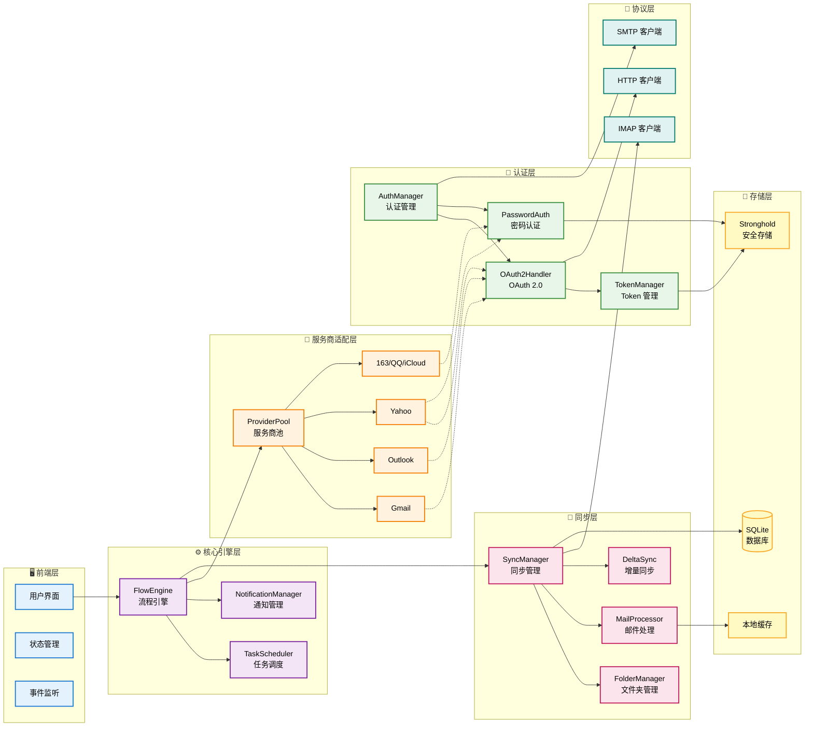
```mermaid
graph LR
    %% 样式定义
    classDef frontend fill:#e3f2fd,stroke:#1976d2,stroke-width:2px,color:#000,rounded
    classDef core fill:#f3e5f5,stroke:#7b1fa2,stroke-width:2px,color:#000,rounded
    classDef provider fill:#fff3e0,stroke:#f57c00,stroke-width:2px,color:#000,rounded
    classDef auth fill:#e8f5e9,stroke:#388e3c,stroke-width:2px,color:#000,rounded
    classDef sync fill:#fce4ec,stroke:#c2185b,stroke-width:2px,color:#000,rounded
    classDef storage fill:#fff9c4,stroke:#f9a825,stroke-width:2px,color:#000,rounded
    classDef protocol fill:#e0f2f1,stroke:#00796b,stroke-width:2px,color:#000,rounded

    %% 前端层
    subgraph Frontend["🖥️ 前端层"]
        direction TB
        UI["用户界面"]:::frontend
        State["状态管理"]:::frontend
        Events["事件监听"]:::frontend
    end

    %% 核心引擎层
    subgraph Core["⚙️ 核心引擎层"]
        direction TB
        Engine["FlowEngine<br/>流程引擎"]:::core
        Scheduler["TaskScheduler<br/>任务调度"]:::core
        Notifier["NotificationManager<br/>通知管理"]:::core
    end

    %% 服务商适配层
    subgraph Providers["🔌 服务商适配层"]
        direction TB
        PP["ProviderPool<br/>服务商池"]:::provider
        GP["Gmail"]:::provider
        OP["Outlook"]:::provider
        YP["Yahoo"]:::provider
        NP["163/QQ/iCloud"]:::provider
    end

    %% 认证层
    subgraph Auth["🔐 认证层"]
        direction TB
        AuthM["AuthManager<br/>认证管理"]:::auth
        OAuth["OAuth2Handler<br/>OAuth 2.0"]:::auth
        Pass["PasswordAuth<br/>密码认证"]:::auth
        TokenM["TokenManager<br/>Token 管理"]:::auth
    end

    %% 同步层
    subgraph Sync["🔄 同步层"]
        direction TB
        SyncM["SyncManager<br/>同步管理"]:::sync
        FolderM["FolderManager<br/>文件夹管理"]:::sync
        MailM["MailProcessor<br/>邮件处理"]:::sync
        Delta["DeltaSync<br/>增量同步"]:::sync
    end

    %% 存储层
    subgraph Storage["💾 存储层"]
        direction TB
        DB[("SQLite<br/>数据库")]:::storage
        Cache["本地缓存"]:::storage
        Stronghold["Stronghold<br/>安全存储"]:::storage
    end

    %% 协议层
    subgraph Protocol["📡 协议层"]
        direction TB
        IMAP["IMAP 客户端"]:::protocol
        SMTP["SMTP 客户端"]:::protocol
        HTTP["HTTP 客户端"]:::protocol
    end

    %% 主要连接关系（简化版）
    UI --> Engine
    Engine --> Scheduler
    Engine --> Notifier
    Engine --> PP
    Engine --> SyncM
    
    PP --> GP
    PP --> OP
    PP --> YP
    PP --> NP
    
    GP -.-> OAuth
    OP -.-> OAuth
    YP -.-> OAuth
    YP -.-> Pass
    NP -.-> Pass
    
    AuthM --> OAuth
    AuthM --> Pass
    OAuth --> TokenM
    
    SyncM --> FolderM
    SyncM --> MailM
    SyncM --> Delta
    
    SyncM --> IMAP
    AuthM --> SMTP
    OAuth --> HTTP
    
    SyncM --> DB
    MailM --> Cache
    TokenM --> Stronghold
    Pass --> Stronghold
```

### 模块职责

#### 前端层
- **用户界面**：提供用户交互界面，显示邮件列表、文件夹、设置等
- **状态管理**：管理应用状态，包括邮件数据、用户配置、UI 状态
- **事件监听**：监听用户操作和系统事件，触发相应的业务逻辑

#### 核心引擎层
- **FlowEngine**：核心流程引擎，协调各个模块的工作，管理整个邮件处理流程
- **TaskScheduler**：任务调度器，负责定时任务、同步任务的调度和执行
- **NotificationManager**：通知管理器，处理新邮件通知、系统通知等

#### 服务商适配层
- **ProviderPool**：服务商池，管理所有支持的邮件服务商实例
- **GmailProvider**：Gmail 服务商实现
- **OutlookProvider**：Outlook 服务商实现
- **YahooProvider**：Yahoo 服务商实现
- **NativeProvider**：国内邮箱服务商实现（163、QQ、iCloud）

#### 认证层
- **AuthManager**：认证管理器，统一管理各种认证方式
- **OAuth2Handler**：OAuth 2.0 认证处理器
- **PasswordAuth**：密码认证处理器
- **TokenManager**：Token 生命周期管理

#### 同步层
- **SyncManager**：同步管理器，管理邮件同步流程
- **FolderManager**：文件夹管理器，处理文件夹同步和映射
- **MailProcessor**：邮件处理器，处理邮件的下载、解析、存储
- **DeltaSync**：增量同步，实现高效的邮件同步

#### 存储层
- **SQLite 数据库**：存储邮件元数据、文件夹结构、同步状态
- **本地缓存**：缓存邮件内容、附件、头像等
- **Stronghold**：安全存储敏感信息，如密码、Token

#### 协议层
- **IMAP 客户端**：实现 IMAP 协议，用于接收邮件
- **SMTP 客户端**：实现 SMTP 协议，用于发送邮件
- **HTTP 客户端**：用于 OAuth 认证、API 调用等

---

## 服务商抽象层

### 服务商接口定义

```rust
use async_trait::async_trait;
use serde::{Deserialize, Serialize};
use std::collections::HashMap;

/// 账号类型
#[derive(Debug, Clone, Serialize, Deserialize, PartialEq)]
pub enum AccountType {
    Personal,
    Enterprise,
}

impl Default for AccountType {
    fn default() -> Self {
        Self::Personal
    }
}

/// 认证类型
#[derive(Debug, Clone, Serialize, Deserialize, PartialEq)]
pub enum AuthType {
    Password,
    OAuth2,
    AppPassword,
    DomainAuth,
    SamlSso,
}

/// SSL 模式
#[derive(Debug, Clone, Serialize, Deserialize, PartialEq)]
pub enum SslMode {
    None,
    StartTls,
    Implicit,
}

/// IMAP 配置
#[derive(Debug, Clone, Serialize, Deserialize)]
pub struct ImapConfig {
    pub host: String,
    pub port: u16,
    pub ssl: SslMode,
}

/// SMTP 配置
#[derive(Debug, Clone, Serialize, Deserialize)]
pub struct SmtpConfig {
    pub host: String,
    pub port: u16,
    pub ssl: SslMode,
}

/// OAuth 配置
#[derive(Debug, Clone, Serialize, Deserialize)]
pub struct OAuthConfig {
    pub client_id: String,
    pub client_secret: String,
    pub auth_url: String,
    pub token_url: String,
    pub redirect_uri: String,
    pub scopes: Vec<String>,
    pub pkce_enabled: bool,
    pub tenant_id: Option<String>,
}

/// 企业配置
#[derive(Debug, Clone, Serialize, Deserialize)]
pub struct EnterpriseConfig {
    pub tenant_id: Option<String>,
    pub domain: String,
    pub conditional_access: bool,
    pub mfa_required: bool,
    pub custom_server: bool,
    pub custom_imap: Option<ImapConfig>,
    pub custom_smtp: Option<SmtpConfig>,
}

/// OAuth Token
#[derive(Debug, Clone, Serialize, Deserialize)]
pub struct OAuthToken {
    pub access_token: String,
    pub refresh_token: Option<String>,
    pub expires_at: i64,
    pub id_token: Option<String>,
    pub tenant_id: Option<String>,
}

/// 服务商能力
#[derive(Debug, Clone, Serialize, Deserialize)]
pub struct ProviderCapabilities {
    pub supports_idle: bool,
    pub supports_condstore: bool,
    pub supports_push: bool,
    pub supports_oauth: bool,
    pub supports_enterprise: bool,
    pub max_message_size: u64,
}

/// 邮件服务商 Trait
#[async_trait]
pub trait MailProvider: Send + Sync {
    /// 服务商标识
    fn provider_id(&self) -> &str;
    
    /// 服务商名称
    fn provider_name(&self) -> &str;
    
    /// 账号类型
    fn account_type(&self) -> AccountType;
    
    /// 支持的认证类型
    fn auth_types(&self) -> Vec<AuthType>;
    
    /// 默认 IMAP 配置
    fn default_imap_config(&self) -> ImapConfig;
    
    /// 默认 SMTP 配置
    fn default_smtp_config(&self) -> SmtpConfig;
    
    /// OAuth 配置（如果支持）
    fn oauth_config(&self) -> Option<OAuthConfig>;
    
    /// 企业配置（如果是企业账号）
    fn enterprise_config(&self) -> Option<EnterpriseConfig> {
        None
    }
    
    /// 服务商能力
    fn capabilities(&self) -> ProviderCapabilities;
    
    /// 检测邮箱是否属于该服务商
    async fn detect(&self, email: &str) -> bool;
    
    /// 支持的域名列表
    fn supported_domains(&self) -> Vec<&str>;
    
    /// 生成 XOAUTH2 字符串
    fn generate_xoauth2(&self, email: &str, access_token: &str) -> String {
        format!("user={}\x01auth=Bearer {}\x01\x01", email, access_token)
    }
    
    /// 克隆
    fn box_clone(&self) -> Box<dyn MailProvider>;
}

impl Clone for Box<dyn MailProvider> {
    fn clone(&self) -> Self {
        self.box_clone()
    }
}

/// 服务商工厂 Trait
#[async_trait]
pub trait ProviderFactory: Send + Sync {
    /// 创建服务商实例
    async fn create_provider(&self, email: &str) -> Option<Box<dyn MailProvider>>;
    
    /// 创建企业服务商实例
    async fn create_enterprise_provider(
        &self,
        domain: &str,
        config: EnterpriseConfig,
    ) -> Option<Box<dyn MailProvider>>;
    
    /// 获取支持的服务商列表
    fn supported_providers(&self) -> Vec<ProviderInfo>;
    
    /// 获取支持的企业服务商列表
    fn supported_enterprise_providers(&self) -> Vec<ProviderInfo>;
}

/// 服务商信息
#[derive(Debug, Clone, Serialize, Deserialize)]
pub struct ProviderInfo {
    pub id: String,
    pub name: String,
    pub account_type: AccountType,
    pub domains: Vec<String>,
    pub auth_types: Vec<AuthType>,
}
```

### 服务商配置表

| 服务商 | IMAP 服务器 | SMTP 服务器 | SSL | 认证方式 | 特殊配置 |
|--------|-------------|-------------|-----|----------|----------|
| Gmail | imap.gmail.com:993 | smtp.gmail.com:587 | Implicit / StartTLS | OAuth 2.0 | 需要 Google Cloud 项目 |
| Outlook | outlook.office365.com:993 | smtp.office365.com:587 | Implicit / StartTLS | OAuth 2.0 | 需要 Azure AD 注册 |
| Yahoo | imap.mail.yahoo.com:993 | smtp.mail.yahoo.com:587 | Implicit / StartTLS | OAuth 2.0, 密码 | 应用密码支持 |
| iCloud | imap.mail.me.com:993 | smtp.mail.me.com:587 | Implicit / StartTLS | 应用专用密码 | 需要生成应用密码 |
| 163 | imap.163.com:993 | smtp.163.com:465 | Implicit | 授权码 | 需要开启 IMAP 并生成授权码 |
| QQ | imap.qq.com:993 | smtp.qq.com:465 | Implicit | 授权码 | 需要开启 IMAP 并生成授权码 |

---

## 认证流程

### 账号类型识别流程

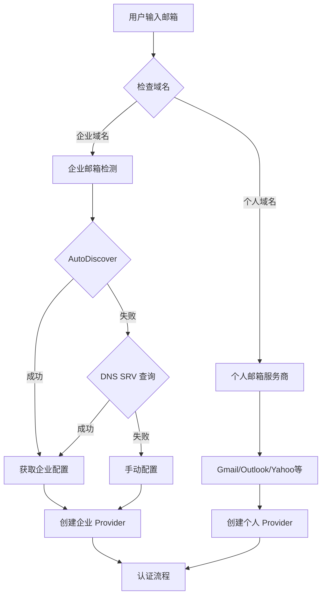
```mermaid
graph TD
    A[用户输入邮箱] --> B{检查域名}
    B -->|个人域名| C[个人邮箱服务商]
    B -->|企业域名| D[企业邮箱检测]
    
    C --> E[Gmail/Outlook/Yahoo等]
    
    D --> F{AutoDiscover}
    F -->|成功| G[获取企业配置]
    F -->|失败| H{DNS SRV 查询}
    
    H -->|成功| G
    H -->|失败| I[手动配置]
    
    G --> J[创建企业 Provider]
    I --> J
    
    E --> K[创建个人 Provider]
    
    J --> L[认证流程]
    K --> L
```

### 认证方式概览

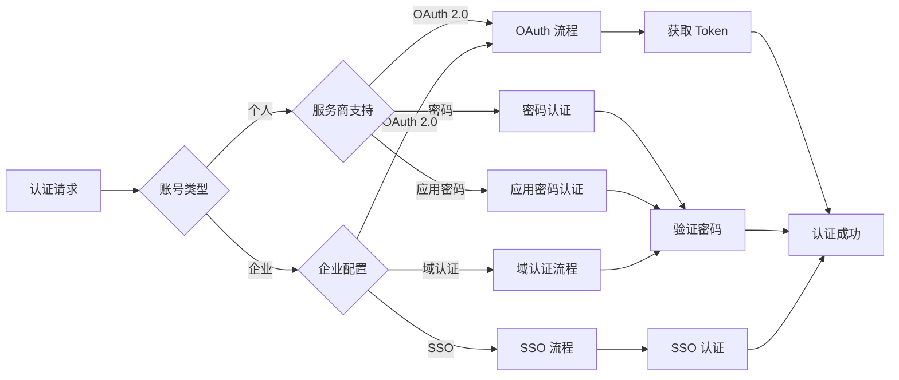
```mermaid
graph LR
    A[认证请求] --> B{账号类型}
    B -->|个人| C{服务商支持}
    B -->|企业| D{企业配置}
    
    C -->|OAuth 2.0| E[OAuth 流程]
    C -->|密码| F[密码认证]
    C -->|应用密码| G[应用密码认证]
    
    D -->|OAuth 2.0| E
    D -->|域认证| H[域认证流程]
    D -->|SSO| I[SSO 流程]
    
    E --> J[获取 Token]
    F --> K[验证密码]
    G --> K
    H --> K
    I --> L[SSO 认证]
    
    J --> M[认证成功]
    K --> M
    L --> M
```

### 密码认证流程

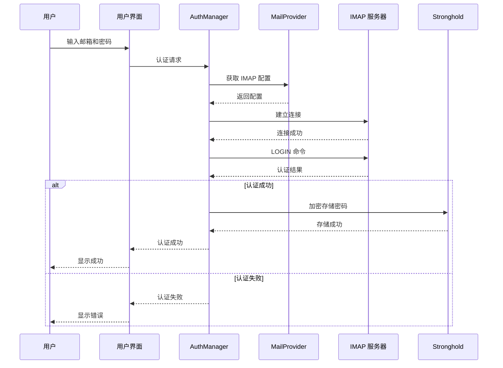
```mermaid
sequenceDiagram
    participant User as 用户
    participant UI as 用户界面
    participant Auth as AuthManager
    participant Provider as MailProvider
    participant IMAP as IMAP 服务器
    participant Secure as Stronghold

    User->>UI: 输入邮箱和密码
    UI->>Auth: 认证请求
    Auth->>Provider: 获取 IMAP 配置
    Provider-->>Auth: 返回配置
    Auth->>IMAP: 建立连接
    IMAP-->>Auth: 连接成功
    Auth->>IMAP: LOGIN 命令
    IMAP-->>Auth: 认证结果
    
    alt 认证成功
        Auth->>Secure: 加密存储密码
        Secure-->>Auth: 存储成功
        Auth-->>UI: 认证成功
        UI-->>User: 显示成功
    else 认证失败
        Auth-->>UI: 认证失败
        UI-->>User: 显示错误
    end
```

### OAuth 2.0 认证流程

#### 个人账号 OAuth 流程

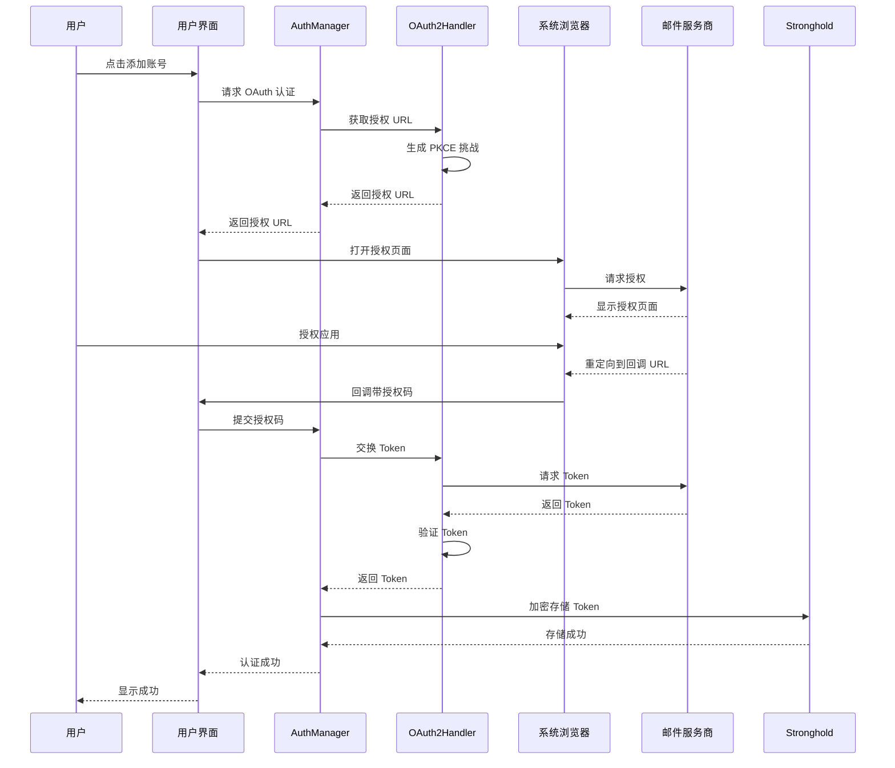
```mermaid
sequenceDiagram
    participant User as 用户
    participant UI as 用户界面
    participant Auth as AuthManager
    participant OAuth as OAuth2Handler
    participant Browser as 系统浏览器
    participant Provider as 邮件服务商
    participant Secure as Stronghold

    User->>UI: 点击添加账号
    UI->>Auth: 请求 OAuth 认证
    Auth->>OAuth: 获取授权 URL
    OAuth->>OAuth: 生成 PKCE 挑战
    OAuth-->>Auth: 返回授权 URL
    Auth-->>UI: 返回授权 URL
    UI->>Browser: 打开授权页面
    Browser->>Provider: 请求授权
    Provider-->>Browser: 显示授权页面
    User->>Browser: 授权应用
    Provider-->>Browser: 重定向到回调 URL
    Browser->>UI: 回调带授权码
    UI->>Auth: 提交授权码
    Auth->>OAuth: 交换 Token
    OAuth->>Provider: 请求 Token
    Provider-->>OAuth: 返回 Token
    OAuth->>OAuth: 验证 Token
    OAuth-->>Auth: 返回 Token
    Auth->>Secure: 加密存储 Token
    Secure-->>Auth: 存储成功
    Auth-->>UI: 认证成功
    UI-->>User: 显示成功
```

#### 企业账号 OAuth 流程（Microsoft 365 示例）

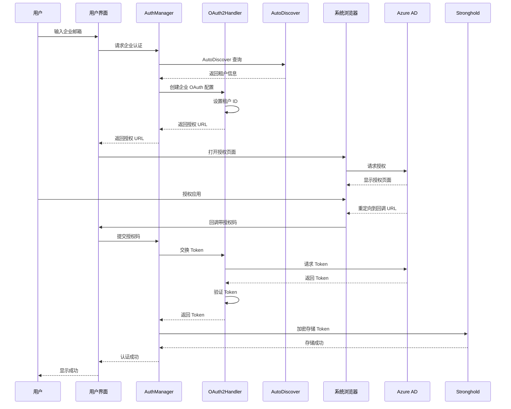
```mermaid
sequenceDiagram
    participant User as 用户
    participant UI as 用户界面
    participant Auth as AuthManager
    participant OAuth as OAuth2Handler
    participant Discover as AutoDiscover
    participant Browser as 系统浏览器
    participant Azure as Azure AD
    participant Secure as Stronghold

    User->>UI: 输入企业邮箱
    UI->>Auth: 请求企业认证
    Auth->>Discover: AutoDiscover 查询
    Discover-->>Auth: 返回租户信息
    Auth->>OAuth: 创建企业 OAuth 配置
    OAuth->>OAuth: 设置租户 ID
    OAuth-->>Auth: 返回授权 URL
    Auth-->>UI: 返回授权 URL
    UI->>Browser: 打开授权页面
    Browser->>Azure: 请求授权
    Azure-->>Browser: 显示授权页面
    User->>Browser: 授权应用
    Azure-->>Browser: 重定向到回调 URL
    Browser->>UI: 回调带授权码
    UI->>Auth: 提交授权码
    Auth->>OAuth: 交换 Token
    OAuth->>Azure: 请求 Token
    Azure-->>OAuth: 返回 Token
    OAuth->>OAuth: 验证 Token
    OAuth-->>Auth: 返回 Token
    Auth->>Secure: 加密存储 Token
    Secure-->>Auth: 存储成功
    Auth-->>UI: 认证成功
    UI-->>User: 显示成功
```

### Token 生命周期管理

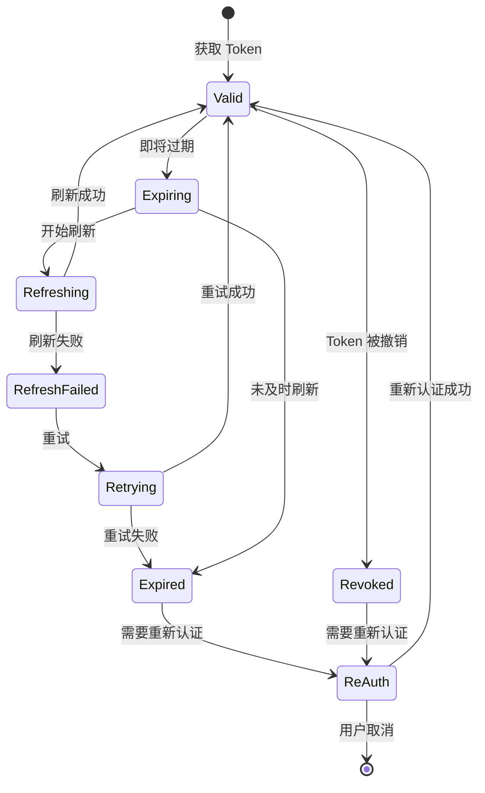
```mermaid
stateDiagram-v2
    [*] --> Valid: 获取 Token
    Valid --> Expiring: 即将过期
    Expiring --> Refreshing: 开始刷新
    Refreshing --> Valid: 刷新成功
    Refreshing --> RefreshFailed: 刷新失败
    RefreshFailed --> Retrying: 重试
    Retrying --> Valid: 重试成功
    Retrying --> Expired: 重试失败
    Expiring --> Expired: 未及时刷新
    Expired --> ReAuth: 需要重新认证
    ReAuth --> Valid: 重新认证成功
    ReAuth --> [*]: 用户取消
    Valid --> Revoked: Token 被撤销
    Revoked --> ReAuth: 需要重新认证
```

---

## 邮件操作流设计

### 操作类型概述

邮件客户端支持以下主要操作：

| 操作类型 | 描述 | 优先级 | 同步策略 |
|---------|------|--------|----------|
| 标记已读/未读 | 修改邮件标志 | 高 | 立即同步 |
| 标记星标 | 添加/移除星标 | 高 | 立即同步 |
| 移动邮件 | 移动到其他文件夹 | 中 | 立即同步 |
| 删除邮件 | 移动到垃圾箱或永久删除 | 高 | 立即同步 |
| 下载附件 | 下载邮件附件 | 中 | 按需下载 |
| 存档邮件 | 移动到存档文件夹 | 中 | 立即同步 |

### 邮件操作流程图

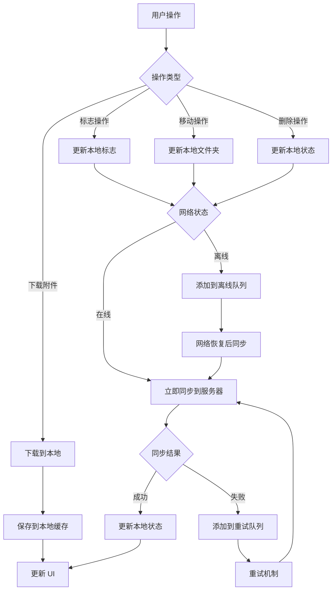
```mermaid
graph TD
    A[用户操作] --> B{操作类型}
    
    B -->|标志操作| C[更新本地标志]
    B -->|移动操作| D[更新本地文件夹]
    B -->|删除操作| E[更新本地状态]
    B -->|下载附件| F[下载到本地]
    
    C --> G{网络状态}
    D --> G
    E --> G
    
    G -->|在线| H[立即同步到服务器]
    G -->|离线| I[添加到离线队列]
    
    H --> J{同步结果}
    J -->|成功| K[更新本地状态]
    J -->|失败| L[添加到重试队列]
    
    I --> M[网络恢复后同步]
    L --> N[重试机制]
    M --> H
    N --> H
    
    F --> O[保存到本地缓存]
    O --> P[更新 UI]
    K --> P
```

### 标志操作详细流程

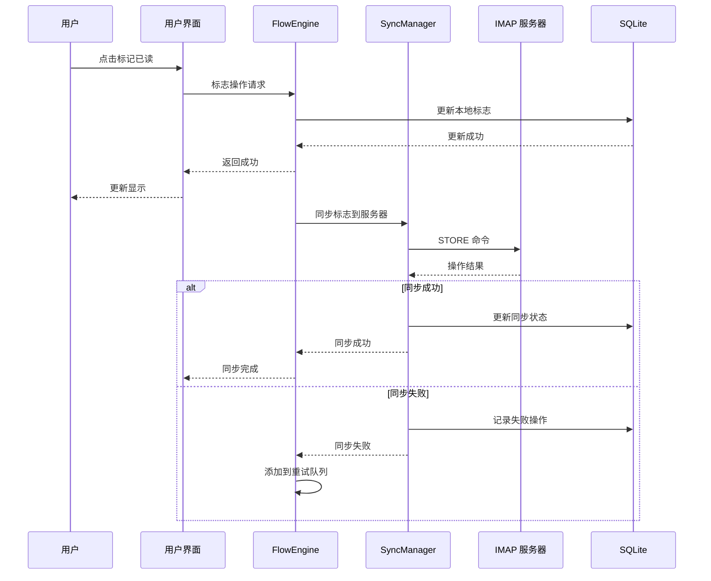
```mermaid
sequenceDiagram
    participant User as 用户
    participant UI as 用户界面
    participant Engine as FlowEngine
    participant Sync as SyncManager
    participant IMAP as IMAP 服务器
    participant DB as SQLite

    User->>UI: 点击标记已读
    UI->>Engine: 标志操作请求
    Engine->>DB: 更新本地标志
    DB-->>Engine: 更新成功
    Engine-->>UI: 返回成功
    UI-->>User: 更新显示
    
    Engine->>Sync: 同步标志到服务器
    Sync->>IMAP: STORE 命令
    IMAP-->>Sync: 操作结果
    
    alt 同步成功
        Sync->>DB: 更新同步状态
        Sync-->>Engine: 同步成功
        Engine-->>UI: 同步完成
    else 同步失败
        Sync->>DB: 记录失败操作
        Sync-->>Engine: 同步失败
        Engine->>Engine: 添加到重试队列
    end
```

### 邮件删除流程

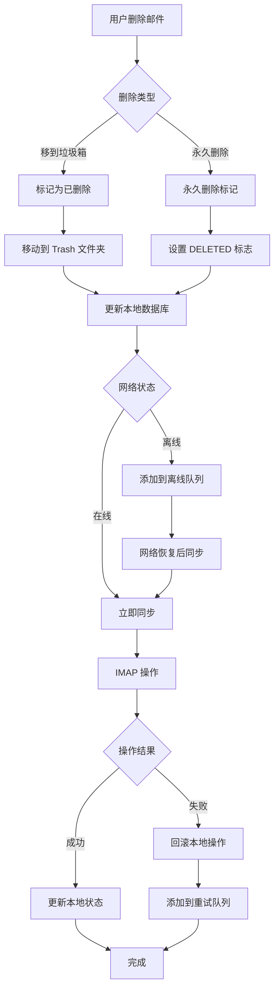
```mermaid
graph TD
    A[用户删除邮件] --> B{删除类型}
    
    B -->|移到垃圾箱| C[标记为已删除]
    B -->|永久删除| D[永久删除标记]
    
    C --> E[移动到 Trash 文件夹]
    D --> F[设置 DELETED 标志]
    
    E --> G[更新本地数据库]
    F --> G
    
    G --> H{网络状态}
    H -->|在线| I[立即同步]
    H -->|离线| J[添加到离线队列]
    
    I --> K[IMAP 操作]
    K --> L{操作结果}
    
    L -->|成功| M[更新本地状态]
    L -->|失败| N[回滚本地操作]
    
    N --> O[添加到重试队列]
    J --> P[网络恢复后同步]
    
    M --> Q[完成]
    O --> Q
    P --> I
```

### 附件下载管理

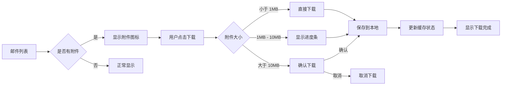
```mermaid
graph LR
    A[邮件列表] --> B{是否有附件}
    B -->|是| C[显示附件图标]
    B -->|否| D[正常显示]
    
    C --> E[用户点击下载]
    E --> F{附件大小}
    
    F -->|小于 1MB| G[直接下载]
    F -->|1MB - 10MB| H[显示进度条]
    F -->|大于 10MB| I[确认下载]
    
    G --> J[保存到本地]
    H --> J
    I -->|确认| J
    I -->|取消| K[取消下载]
    
    J --> L[更新缓存状态]
    L --> M[显示下载完成]
```

### 附件下载状态管理

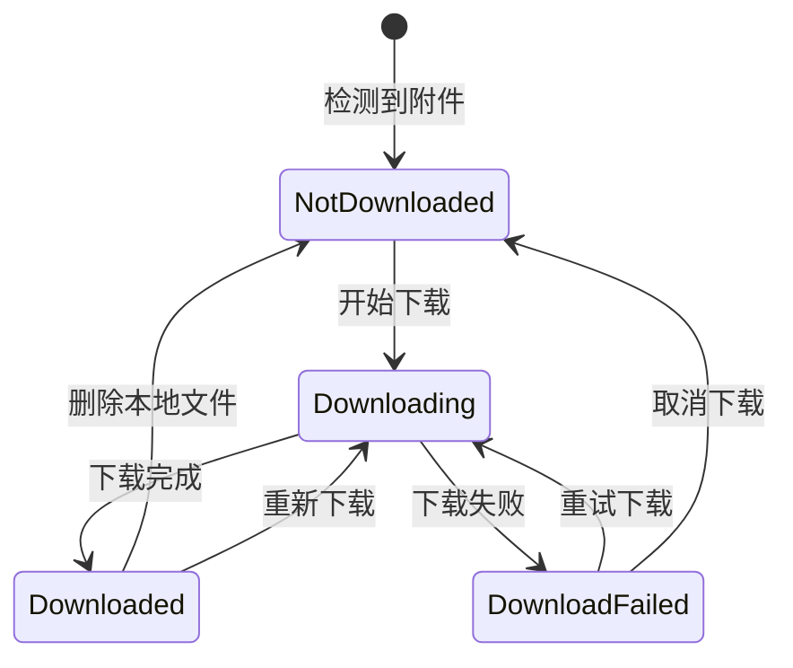
```mermaid
stateDiagram-v2
    [*] --> NotDownloaded: 检测到附件
    NotDownloaded --> Downloading: 开始下载
    Downloading --> Downloaded: 下载完成
    Downloading --> DownloadFailed: 下载失败
    DownloadFailed --> Downloading: 重试下载
    DownloadFailed --> NotDownloaded: 取消下载
    Downloaded --> NotDownloaded: 删除本地文件
    Downloaded --> Downloading: 重新下载
```

---

## 多客户端同步设计

### 同步场景概述

邮件客户端需要在多个设备之间保持数据同步，主要场景包括：

1. **多设备同步**：用户在手机、平板、电脑等多个设备上使用
2. **离线操作**：设备离线时的操作需要在恢复在线后同步
3. **冲突处理**：多个设备同时修改同一邮件时的冲突解决
4. **状态一致性**：确保所有设备上的邮件状态保持一致

### 多客户端同步架构

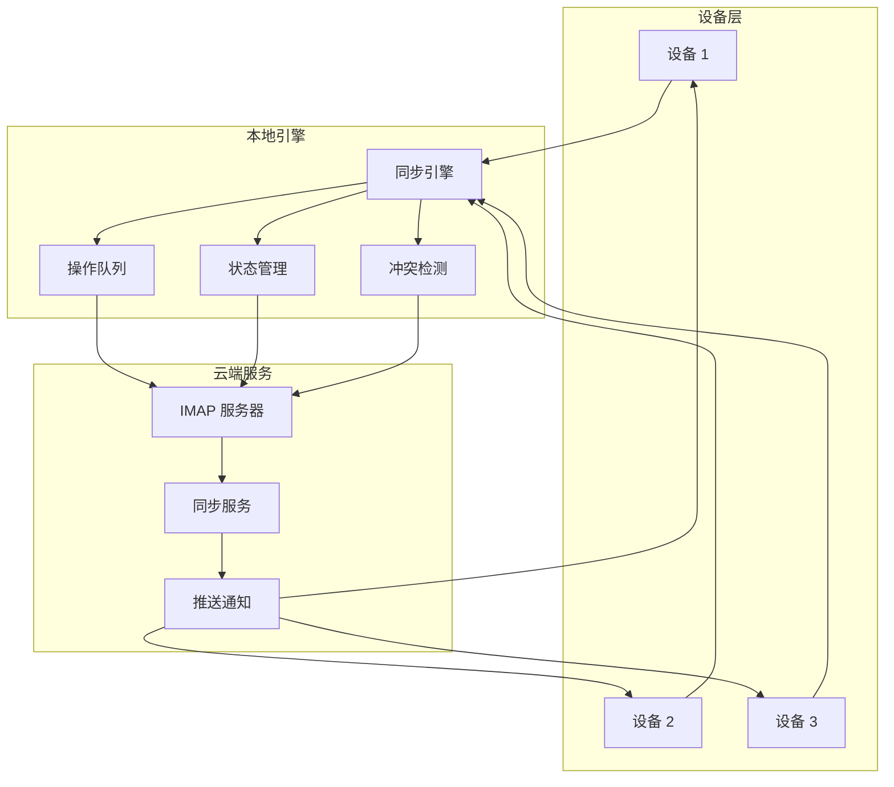
```mermaid
graph TB
    subgraph Devices["设备层"]
        D1[设备 1]
        D2[设备 2]
        D3[设备 3]
    end
    
    subgraph Cloud["云端服务"]
        IMAP[IMAP 服务器]
        Sync[同步服务]
        Notify[推送通知]
    end
    
    subgraph Local["本地引擎"]
        Engine[同步引擎]
        Queue[操作队列]
        Conflict[冲突检测]
        State[状态管理]
    end
    
    D1 --> Engine
    D2 --> Engine
    D3 --> Engine
    
    Engine --> Queue
    Engine --> Conflict
    Engine --> State
    
    Queue --> IMAP
    State --> IMAP
    Conflict --> IMAP
    
    IMAP --> Sync
    Sync --> Notify
    Notify --> D1
    Notify --> D2
    Notify --> D3
```

### 操作队列设计

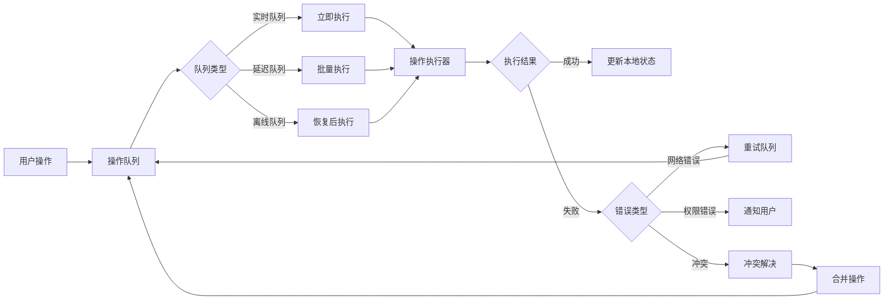
```mermaid
graph LR
    A[用户操作] --> B[操作队列]
    
    B --> C{队列类型}
    C -->|实时队列| D[立即执行]
    C -->|延迟队列| E[批量执行]
    C -->|离线队列| F[恢复后执行]
    
    D --> G[操作执行器]
    E --> G
    F --> G
    
    G --> H{执行结果}
    H -->|成功| I[更新本地状态]
    H -->|失败| J{错误类型}
    
    J -->|网络错误| K[重试队列]
    J -->|权限错误| L[通知用户]
    J -->|冲突| M[冲突解决]
    
    K --> B
    M --> N[合并操作]
    N --> B
```

### 双向同步流程

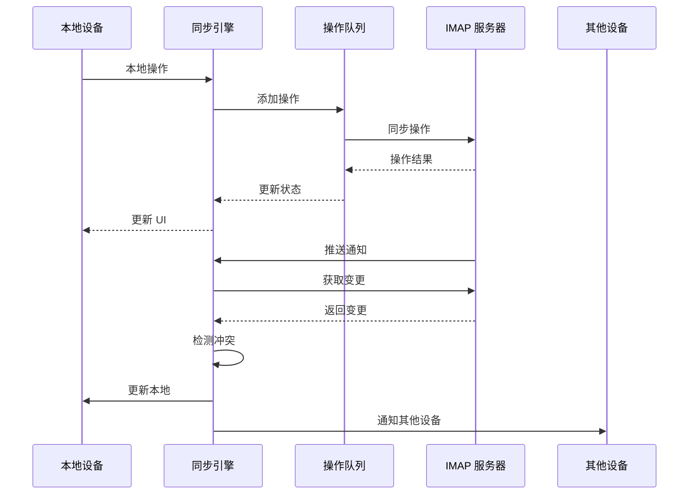
```mermaid
sequenceDiagram
    participant Device as 本地设备
    participant Engine as 同步引擎
    participant Queue as 操作队列
    participant IMAP as IMAP 服务器
    participant Other as 其他设备

    Device->>Engine: 本地操作
    Engine->>Queue: 添加操作
    Queue->>IMAP: 同步操作
    IMAP-->>Queue: 操作结果
    Queue-->>Engine: 更新状态
    Engine-->>Device: 更新 UI
    
    IMAP->>Engine: 推送通知
    Engine->>IMAP: 获取变更
    IMAP-->>Engine: 返回变更
    Engine->>Engine: 检测冲突
    Engine->>Device: 更新本地
    Engine->>Other: 通知其他设备
```

### 离线操作队列

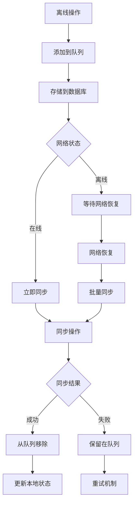
```mermaid
graph TD
    A[离线操作] --> B[添加到队列]
    B --> C[存储到数据库]
    
    C --> D{网络状态}
    D -->|离线| E[等待网络恢复]
    D -->|在线| F[立即同步]
    
    E --> G[网络恢复]
    G --> H[批量同步]
    
    F --> I[同步操作]
    H --> I
    
    I --> J{同步结果}
    J -->|成功| K[从队列移除]
    J -->|失败| L[保留在队列]
    
    K --> M[更新本地状态]
    L --> N[重试机制]
```

### 冲突检测与解决

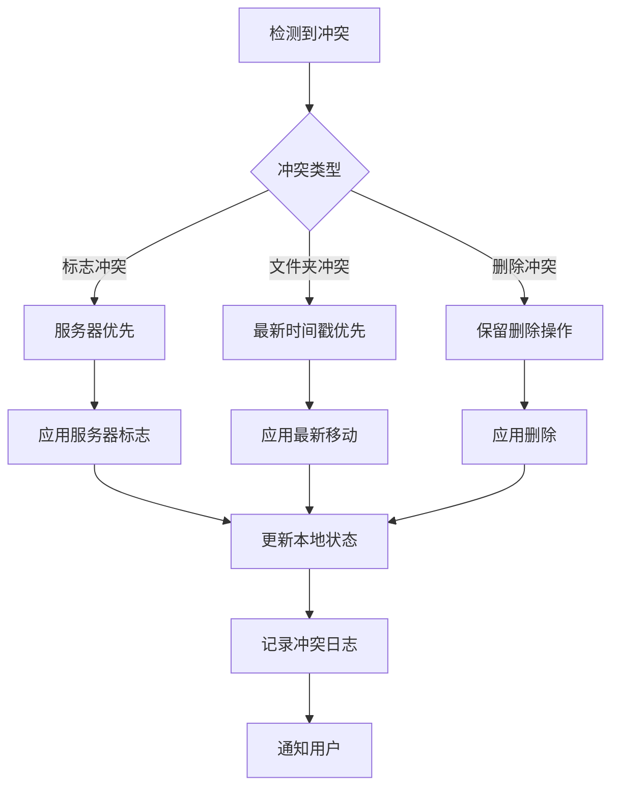
```mermaid
graph TD
    A[检测到冲突] --> B{冲突类型}
    
    B -->|标志冲突| C[服务器优先]
    B -->|文件夹冲突| D[最新时间戳优先]
    B -->|删除冲突| E[保留删除操作]
    
    C --> F[应用服务器标志]
    D --> G[应用最新移动]
    E --> H[应用删除]
    
    F --> I[更新本地状态]
    G --> I
    H --> I
    
    I --> J[记录冲突日志]
    J --> K[通知用户]
```

### 操作幂等性设计

所有操作都设计为幂等的，确保重复执行不会产生副作用：

| 操作类型 | 幂等性保证 | 实现方式 |
|---------|-----------|----------|
| 标记已读 | 重复设置已读标志无害 | 检查当前状态再操作 |
| 移动邮件 | 重复移动到同一文件夹无害 | 检查当前文件夹 |
| 删除邮件 | 重复删除无害 | 检查删除标志 |
| 下载附件 | 重复下载覆盖本地文件 | 检查本地文件是否存在 |

### 操作确认与回滚

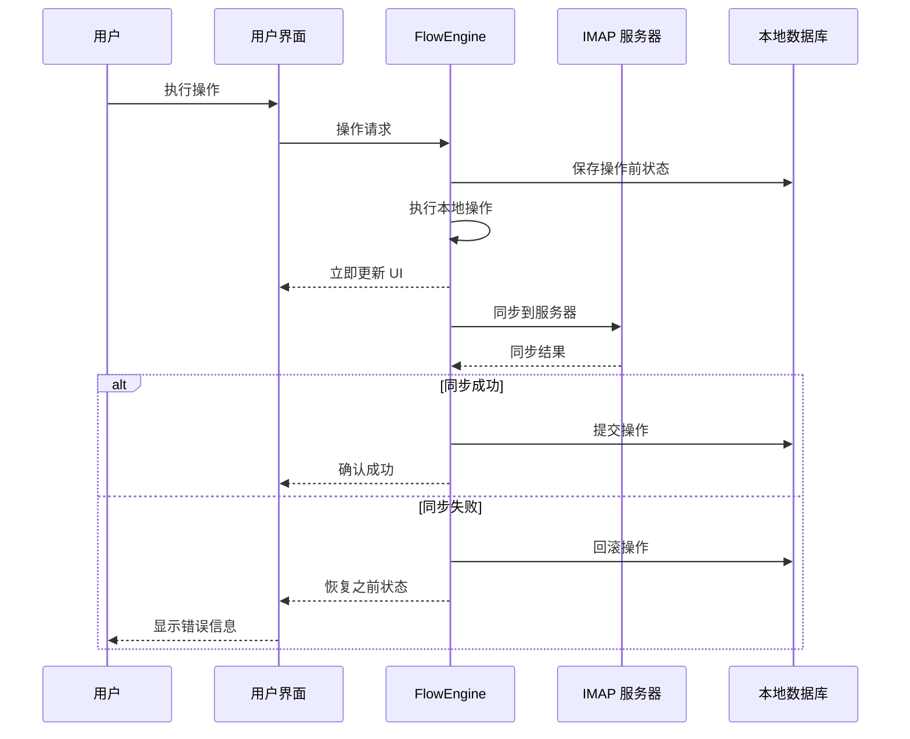
```mermaid
sequenceDiagram
    participant User as 用户
    participant UI as 用户界面
    participant Engine as FlowEngine
    participant IMAP as IMAP 服务器
    participant DB as 本地数据库

    User->>UI: 执行操作
    UI->>Engine: 操作请求
    Engine->>DB: 保存操作前状态
    Engine->>Engine: 执行本地操作
    Engine-->>UI: 立即更新 UI
    
    Engine->>IMAP: 同步到服务器
    IMAP-->>Engine: 同步结果
    
    alt 同步成功
        Engine->>DB: 提交操作
        Engine-->>UI: 确认成功
    else 同步失败
        Engine->>DB: 回滚操作
        Engine-->>UI: 恢复之前状态
        UI-->>User: 显示错误信息
    end
```

### 同步状态监控

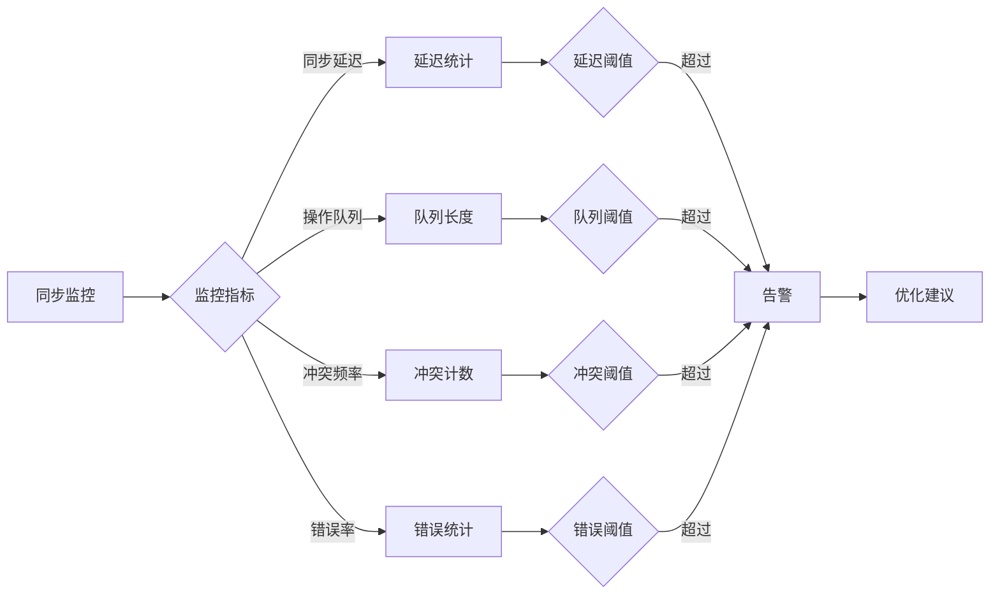
```mermaid
graph LR
    A[同步监控] --> B{监控指标}
    
    B -->|同步延迟| C[延迟统计]
    B -->|操作队列| D[队列长度]
    B -->|冲突频率| E[冲突计数]
    B -->|错误率| F[错误统计]
    
    C --> G{延迟阈值}
    D --> H{队列阈值}
    E --> I{冲突阈值}
    F --> J{错误阈值}
    
    G -->|超过| K[告警]
    H -->|超过| K
    I -->|超过| K
    J -->|超过| K
    
    K --> L[优化建议]
```

### Token 定期刷新机制

#### 刷新策略概述

为确保 OAuth Token 的有效性，系统实现了自动刷新机制：

- **定期检查**：每隔一段时间检查所有 Token 的过期时间
- **提前刷新**：在 Token 过期前一段时间主动刷新
- **失败重试**：刷新失败时进行重试
- **用户通知**：多次刷新失败时通知用户重新认证

#### 主动刷新调度流程

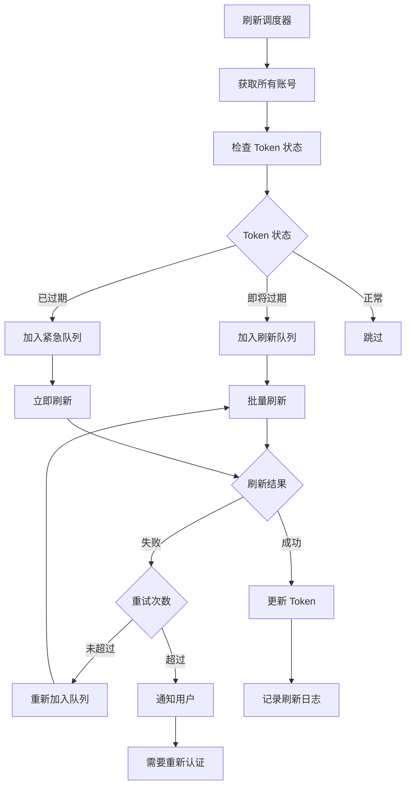
```mermaid
graph TD
    A[刷新调度器] --> B[获取所有账号]
    B --> C[检查 Token 状态]
    
    C --> D{Token 状态}
    D -->|即将过期| E[加入刷新队列]
    D -->|已过期| F[加入紧急队列]
    D -->|正常| G[跳过]
    
    E --> H[批量刷新]
    F --> I[立即刷新]
    
    H --> J{刷新结果}
    I --> J
    
    J -->|成功| K[更新 Token]
    J -->|失败| L{重试次数}
    
    L -->|未超过| M[重新加入队列]
    L -->|超过| N[通知用户]
    
    K --> O[记录刷新日志]
    M --> H
    N --> P[需要重新认证]
```

#### Token 刷新调度器架构

```mermaid
graph LR
    A[TokenRefreshScheduler] --> B[Token 检查器]
    A --> C[刷新队列]
    A --> D[并发控制器]
    A --> E[错误处理器]
    
    B --> F[定期扫描]
    B --> G[过期检测]
    
    C --> H[普通队列]
    C --> I[紧急队列]
    
    D --> J[并发限制]
    D --> K[优先级控制]
    
    E --> L[重试机制]
    E --> M[用户通知]
```

#### 刷新详细时序图

```mermaid
sequenceDiagram
    participant Scheduler as 调度器
    participant Checker as 检查器
    participant Queue as 刷新队列
    participant Refresher as 刷新器
    participant OAuth as OAuth 服务
    participant DB as 数据库
    participant User as 用户

    loop 定期检查 (每5分钟)
        Scheduler->>Checker: 检查所有 Token
        Checker->>DB: 查询 Token 信息
        DB-->>Checker: 返回 Token 列表
        
        loop 每个 Token
            Checker->>Checker: 计算剩余时间
            
            alt 即将过期 (< 10分钟)
                Checker->>Queue: 加入紧急队列
            else 较快过期 (< 1小时)
                Checker->>Queue: 加入普通队列
            end
        end
        
        alt 队列不为空
            Queue->>Refresher: 获取刷新任务
            Refresher->>OAuth: 刷新 Token
            OAuth-->>Refresher: 返回新 Token
            
            alt 刷新成功
                Refresher->>DB: 更新 Token
                Refresher->>Scheduler: 记录成功
            else 刷新失败
                Refresher->>Refresher: 重试
                
                alt 重试失败
                    Refresher->>User: 通知重新认证
                end
            end
        end
    end
```

#### 刷新状态机

```mermaid
stateDiagram-v2
    [*] --> Idle: 调度器启动
    Idle --> Checking: 定期检查时间到
    Checking --> Refreshing: 发现需要刷新的 Token
    Checking --> Idle: 无需刷新
    Refreshing --> Success: 刷新成功
    Refreshing --> Failed: 刷新失败
    Success --> Idle: 更新完成
    Failed --> Retrying: 重试次数未超
    Failed --> NotifyUser: 重试次数超限
    Retrying --> Refreshing: 重新刷新
    Retrying --> Failed: 重试失败
    NotifyUser --> Idle: 用户处理完成
```

#### 刷新配置参数

```rust
/// Token 刷新配置
#[derive(Debug, Clone, Serialize, Deserialize)]
pub struct TokenRefreshConfig {
    /// 检查间隔（秒）
    pub check_interval_secs: u64,
    /// 提前刷新时间（秒）
    pub refresh_before_expiry_secs: u64,
    /// 最大重试次数
    pub max_retry_count: u32,
    /// 重试间隔基数（秒）
    pub retry_interval_base_secs: u64,
    /// 最大重试间隔（秒）
    pub max_retry_interval_secs: u64,
    /// 最大并发刷新数
    pub max_concurrent_refreshes: usize,
    /// 刷新超时时间（秒）
    pub refresh_timeout_secs: u64,
}

impl Default for TokenRefreshConfig {
    fn default() -> Self {
        Self {
            check_interval_secs: 300, // 5分钟
            refresh_before_expiry_secs: 600, // 10分钟
            max_retry_count: 3,
            retry_interval_base_secs: 60, // 1分钟
            max_retry_interval_secs: 3600, // 1小时
            max_concurrent_refreshes: 5,
            refresh_timeout_secs: 30,
        }
    }
}
```

#### 刷新错误分类与处理

| 错误类型 | 处理策略 | 重试 | 用户
通知 |
|---------|---------|------|----------|
| 网络错误 | 指数退避重试 | 是 | 否 |
| 服务器错误 | 固定间隔重试 | 是 | 否 |
| Token 过期 | 立即通知用户 | 否 | 是 |
| 权限被撤销 | 立即通知用户 | 否 | 是 |
| 配额超限 | 延迟重试 | 是 | 是 |

#### 刷新历史记录

系统记录所有 Token 刷新操作的历史，用于分析和优化：

```rust
/// Token 刷新历史记录
#[derive(Debug, Clone, Serialize, Deserialize)]
pub struct TokenRefreshHistory {
    /// 账号 ID
    pub account_id: String,
    /// 刷新时间
    pub refresh_time: i64,
    /// 刷新结果
    pub result: RefreshResult,
    /// 耗时（毫秒）
    pub duration_ms: u64,
    /// 错误信息（如果失败）
    pub error_message: Option<String>,
}

/// 刷新结果
#[derive(Debug, Clone, Serialize, Deserialize)]
pub enum RefreshResult {
    Success,
    Failed,
    RetryLater,
    NeedReauth,
}
```

---

## 首次同步流程

### 完整流程图

```mermaid
graph TD
    A[添加账号成功] --> B[首次同步启动]
    
    B --> C[连接 IMAP 服务器]
    C --> D{连接结果}
    D -->|成功| E[获取文件夹列表]
    D -->|失败| F[显示错误]
    
    E --> G[文件夹匹配]
    G --> H[创建本地文件夹结构]
    
    H --> I[选择同步策略]
    I --> J{策略类型}
    
    J -->|完整同步| K[同步所有邮件]
    J -->|部分同步| L[同步最近 N 封]
    J -->|智能同步| M[同步重要邮件]
    
    K --> N[下载邮件头]
    L --> N
    M --> N
    
    N --> O[解析邮件内容]
    O --> P[存储到数据库]
    
    P --> Q{是否有更多邮件}
    Q -->|是| N
    Q -->|否| R[同步完成]
    
    R --> S[更新同步状态]
    S --> T[启动增量同步]
    
    F --> U[提供重试选项]
    U --> B
```

### 首次同步详细时序图

```mermaid
sequenceDiagram
    participant User as 用户
    participant UI as 用户界面
    participant Engine as FlowEngine
    participant Sync as SyncManager
    participant IMAP as IMAP 服务器
    participant DB as SQLite

    User->>UI: 添加账号完成
    UI->>Engine: 启动首次同步
    Engine->>Sync: 开始首次同步
    
    Sync->>IMAP: 连接服务器
    IMAP-->>Sync: 连接成功
    
    Sync->>IMAP: 获取文件夹列表
    IMAP-->>Sync: 返回文件夹列表
    
    Sync->>DB: 创建文件夹结构
    
    loop 每个文件夹
        Sync->>IMAP: 获取邮件 UID 列表
        IMAP-->>Sync: 返回 UID 列表
        
        loop 批量获取邮件
            Sync->>IMAP: FETCH 邮件头
            IMAP-->>Sync: 返回邮件头
            Sync->>DB: 存储邮件
            Sync->>UI: 更新进度
        end
    end
    
    Sync->>DB: 更新同步状态
    Sync-->>Engine: 首次同步完成
    Engine-->>UI: 显示完成
    UI-->>User: 同步成功
```

### 首次同步策略

| 策略 | 描述 | 适用场景 | 时间估计 |
|------|------|----------|----------|
| 完整同步 | 同步所有邮件和文件夹 | 邮件数量 < 1000 | 5-30 分钟 |
| 部分同步 | 同步最近 1000 封邮件 | 邮件数量 > 1000 | 1-5 分钟 |
| 智能同步 | 同步重要文件夹和最近邮件 | 快速开始使用 | 30 秒 - 2 分钟 |

---

## 文件夹匹配与同步

### 文件夹匹配规则

系统使用智能匹配规则将服务器文件夹映射到本地标准文件夹：

```mermaid
graph LR
    A[服务器文件夹] --> B{匹配规则}
    
    B -->|名称匹配| C[收件箱]
    B -->|关键字匹配| D[已发送]
    B -->|属性匹配| E[草稿]
    B -->|特殊标志| F[垃圾箱]
    
    C --> G[INBOX]
    D --> H[Sentence]
    E --> I[Drafts]
    F --> J[Trash]
    
    G --> K[本地映射]
    H --> K
    I --> K
    J --> K
```

### 文件夹匹配映射表

| 本地文件夹 | 服务器文件夹模式 | 匹配规则 |
|-----------|----------------|----------|
| 收件箱 | INBOX, Inbox, 收件箱 | 精确匹配 |
| 已发送 | Sent, 已发送, Sent Messages | 关键字匹配 |
| 草稿 | Drafts, 草稿 | 关键字匹配 |
| 垃圾箱 | Trash, Deleted, 垃圾箱, 已删除 | 关键字匹配 |
| 垃圾邮件 | Spam, Junk, 垃圾邮件 | 关键字匹配 |
| 存档 | Archive, 存档 | 关键字匹配 |

### 文件夹同步状态机

```mermaid
stateDiagram-v2
    [*] --> NotSynced: 发现新文件夹
    NotSynced --> Syncing: 开始同步
    Syncing --> Synced: 同步完成
    Syncing --> SyncFailed: 同步失败
    SyncFailed --> Syncing: 重试同步
    Synced --> Updating: 检测到变更
    Updating --> Synced: 更新完成
    Updating --> SyncFailed: 更新失败
    Synced --> NotSynced: 文件夹删除
```

---

## 增量同步机制

### 增量同步策略

系统采用多种策略实现高效的增量同步：

```mermaid
graph TD
    A[增量同步] --> B{服务器支持}
    
    B -->|CONDSTORE| C[使用 MODSEQ]
    B -->|UIDPLUS| D[使用 UID 搜索]
    B -->|基础 IMAP| E[使用标志比较]
    
    C --> F[获取最新 MODSEQ]
    D --> G[搜索新 UID]
    E --> H[比较邮件标志]
    
    F --> I[获取变更邮件]
    G --> I
    H --> I
    
    I --> J[更新本地数据]
    J --> K[更新同步状态]
```

### CONDSTORE 增量同步

```mermaid
sequenceDiagram
    participant Sync as SyncManager
    participant IMAP as IMAP 服务器
    participant DB as SQLite

    Sync->>DB: 获取上次同步 MODSEQ
    DB-->>Sync: 返回 MODSEQ
    
    Sync->>IMAP: CHANGEDSINCE <modseq>
    IMAP-->>Sync: 返回变更邮件
    
    loop 变更邮件
        Sync->>IMAP: FETCH 邮件详情
        IMAP-->>Sync: 返回邮件
        Sync->>DB: 更新邮件
    end
    
    Sync->>IMAP: 获取最新 MODSEQ
    IMAP-->>Sync: 返回新 MODSEQ
    Sync->>DB: 更新同步状态
```

### 同步状态记录

```rust
/// 同步状态记录
#[derive(Debug, Clone, Serialize, Deserialize)]
pub struct SyncState {
    /// 文件夹路径
    pub folder_path: String,
    /// 上次同步时间
    pub last_sync_time: i64,
    /// 上次同步 UID
    pub last_uid: u32,
    /// 上次 MODSEQ（如果支持）
    pub last_modseq: Option<u64>,
    /// 同步的邮件数量
    pub synced_count: u64,
    /// 同步状态
    pub status: SyncStatus,
}

/// 同步状态
#[derive(Debug, Clone, Serialize, Deserialize)]
pub enum SyncStatus {
    /// 从未同步
    NeverSynced,
    /// 同步中
    Syncing,
    /// 同步完成
    Synced,
    /// 同步失败
    Failed,
}
```

### 推送通知集成

```mermaid
graph LR
    A[IMAP IDLE] --> B[监听新邮件]
    B --> C[收到通知]
    C --> D[触发增量同步]
    
    D --> E[获取新邮件]
    E --> F[更新本地数据]
    F --> G[发送系统通知]
    
    G --> H[更新 UI]
    H --> I[用户看到新邮件]
```

---

## 新邮件通知机制

### 通知系统架构

```mermaid
graph TB
    subgraph Detection["邮件检测"]
        IDLE[IMAP IDLE]
        Poll[定期轮询]
        Push[推送通知]
    end
    
    subgraph Processing["通知处理"]
        Queue[通知队列]
        Dedup[去重处理]
        Merge[通知合并]
    end
    
    subgraph Notification["系统通知"]
        Desktop[桌面通知]
        Sound[提示音]
        Badge[角标]
    end
    
    IDLE --> Queue
    Poll --> Queue
    Push --> Queue
    
    Queue --> Dedup
    Dedup --> Merge
    Merge --> Desktop
    Merge --> Sound
    Merge --> Badge
```

### IMAP IDLE 实时监听

```mermaid
sequenceDiagram
    participant Client as 邮件客户端
    participant IMAP as IMAP 服务器
    participant Notify as 通知管理器

    Client->>IMAP: SELECT INBOX
    IMAP-->>Client: 文件夹选中成功
    
    Client->>IMAP: IDLE
    IMAP-->>Client: 开始 IDLE 模式
    
    loop IDLE 模式
        IMAP->>Client: EXISTS 更新
        Client->>Client: 退出 IDLE
        Client->>IMAP: DONE
        Client->>Notify: 新邮件到达
        Notify->>Notify: 处理通知
        Client->>IMAP: IDLE
    end
```

### 通知去重与合并

```mermaid
graph TD
    A[新邮件通知] --> B{去重检查}
    
    B -->|重复| C[丢弃通知]
    B -->|新通知| D{合并检查}
    
    D -->|可合并| E[合并到现有通知]
    D -->|不可合并| F[创建新通知]
    
    E --> G[更新通知计数]
    F --> H[显示新通知]
    
    C --> I[结束]
    G --> I
    H --> I
```

---

## 错误处理与重试策略

### 错误类型定义

```rust
/// 邮件客户端错误类型
#[derive(Debug, Clone, Serialize, Deserialize)]
pub enum MailError {
    /// 网络错误
    NetworkError {
        message: String,
        retry_after: Option<u64>,
    },
    /// 认证错误
    AuthenticationError {
        message: String,
        need_reauth: bool,
    },
    /// 权限错误
    PermissionError {
        message: String,
        required_permission: String,
    },
    /// 配额错误
    QuotaError {
        message: String,
        current_usage: u64,
        limit: u64,
    },
    /// 协议错误
    ProtocolError {
        message: String,
        command: String,
    },
    /// 存储错误
    StorageError {
        message: String,
        path: String,
    },
    /// 超时错误
    TimeoutError {
        operation: String,
        timeout_secs: u64,
    },
}
```

### 重试策略

```mermaid
graph TD
    A[操作失败] --> B{错误类型}
    
    B -->|网络错误| C[指数退避重试]
    B -->|认证错误| D[重新认证]
    B -->|权限错误| E[通知用户]
    B -->|配额错误| F[延迟重试]
    B -->|协议错误| G[记录日志]
    B -->|存储错误| H[清理重试]
    B -->|超时错误| I[增加超时重试]
    
    C --> J{重试次数}
    D --> K[更新认证]
    E --> L[用户处理]
    F --> M[等待后重试]
    G --> N[跳过操作]
    H --> O[清理后重试]
    I --> P[延长超时]
    
    J -->|未超限| Q[重新执行]
    J -->|超限| R[最终失败]
    
    K --> Q
    M --> Q
    O --> Q
    P --> Q
    
    Q --> S{执行结果}
    S -->|成功| T[完成]
    S -->|失败| A
```

### 错误恢复流程

```mermaid
sequenceDiagram
    participant Engine as FlowEngine
    participant Retry as RetryManager
    participant Auth as AuthManager
    participant IMAP as IMAP 服务器
    participant User as 用户

    Engine->>IMAP: 执行操作
    IMAP-->>Engine: 操作失败
    
    Engine->>Retry: 报告错误
    Retry->>Retry: 分类错误
    
    alt 认证错误
        Retry->>Auth: 重新认证
        Auth-->>Retry: 认证结果
        Retry->>Engine: 重试操作
    else 网络错误
        Retry->>Retry: 等待退避时间
        Retry->>Engine: 重试操作
    else 权限错误
        Retry->>User: 通知用户
        User-->>Retry: 用户处理
        Retry->>Engine: 继续或跳过
    end
```

---

## 邮件搜索功能设计

### 搜索类型概述

系统支持多种搜索类型，满足不同场景需求：

| 搜索类型 | 描述 | 实现方式 | 性能 |
|---------|------|----------|------|
| 基础搜索 | 发件人、主题、正文关键字 | 本地数据库 LIKE | 快 |
| 高级搜索 | 多条件组合、时间范围 | 本地数据库查询 | 中 |
| 全文搜索 | 邮件内容全文索引 | 倒排索引 | 快 |
| IMAP 搜索 | 服务器端搜索 | IMAP SEARCH 命令 | 慢 |

### 搜索架构设计

```mermaid
graph TB
    A[搜索请求] --> B{搜索类型}
    
    B -->|基础搜索| C[本地数据库查询]
    B -->|高级搜索| D[组合查询构建]
    B -->|全文搜索| E[倒排索引搜索]
    B -->|IMAP 搜索| F[服务器搜索]
    
    C --> G[返回结果]
    D --> G
    E --> G
    F --> G
    
    G --> H[结果排序]
    H --> I[分页显示]
    
    subgraph Index["索引管理"]
        J[邮件索引器]
        K[增量更新]
        L[定期重建]
    end
    
    J --> E
    K --> J
    L --> J
```

### 搜索流程详细时序图

```mermaid
sequenceDiagram
    participant User as 用户
    participant UI as 用户界面
    participant Search as 搜索引擎
    participant DB as SQLite
    participant Index as 索引引擎
    participant IMAP as IMAP 服务器

    User->>UI: 输入搜索关键词
    UI->>Search: 搜索请求
    Search->>DB: 基础字段搜索
    DB-->>Search: 返回结果
    
    alt 全文搜索
        Search->>Index: 全文索引搜索
        Index-->>Search: 返回匹配邮件
    end
    
    alt 扩展到服务器
        Search->>IMAP: IMAP SEARCH
        IMAP-->>Search: 返回服务器结果
        Search->>DB: 合并结果
    end
    
    Search->>Search: 排序和分页
    Search-->>UI: 返回搜索结果
    UI-->>User: 显示结果
```

### 全文索引设计

系统使用倒排索引实现邮件内容的全文搜索：

```rust
/// 全文索引结构
#[derive(Debug, Clone, Serialize, Deserialize)]
pub struct InvertedIndex {
    /// 词到邮件 ID 的映射
    pub word_to_emails: HashMap<String, Vec<String>>,
    /// 邮件 ID 到词的映射
    pub email_to_words: HashMap<String, Vec<String>>,
    /// 词频统计
    pub word_frequency: HashMap<String, u64>,
    /// 最后更新时间
    pub last_updated: i64,
}

/// 搜索结果
#[derive(Debug, Clone, Serialize, Deserialize)]
pub struct SearchResult {
    /// 邮件 ID
    pub email_id: String,
    /// 相关性分数
    pub relevance_score: f32,
    /// 匹配的高亮片段
    pub highlights: Vec<String>,
}
```

### 搜索索引构建流程

```mermaid
graph LR
    A[新邮件到达] --> B[分词处理]
    B --> C[词干提取]
    C --> D[停用词过滤]
    
    D --> E[更新倒排索引]
    E --> F[更新词频统计]
    
    F --> G[索引完成]
```

### 搜索查询语法

系统支持丰富的搜索查询语法：

| 查询语法 | 描述 | 示例 |
|---------|------|------|
| `keyword` | 简单关键字搜索 | `meeting` |
| `from:email` | 发件人搜索 | `from:john@example.com` |
| `to:email` | 收件人搜索 | `to:jane@example.com` |
| `subject:text` | 主题搜索 | `subject:report` |
| `date:range` | 日期范围 | `date:2024-01-01..2024-12-31` |
| `has:attachment` | 有附件 | `has:attachment` |
| `is:read` | 已读邮件 | `is:read` |
| `is:starred` | 星标邮件 | `is:starred` |

### 混合搜索策略

```mermaid
graph TD
    A[搜索请求] --> B{本地结果数量}
    
    B -->|充足| C[仅本地搜索]
    B -->|不足| D[扩展到服务器]
    
    C --> E[返回本地结果]
    
    D --> F[IMAP SEARCH]
    F --> G[获取服务器结果]
    G --> H[合并去重]
    
    H --> I[返回合并结果]
    
    E --> J[显示结果]
    I --> J
```

---

## 邮件发送流程设计

### 发送流程概述

邮件发送是一个复杂的过程，涉及多个步骤和错误处理：

```mermaid
graph TD
    A[用户发送邮件] --> B[验证邮件内容]
    B --> C{验证结果}
    
    C -->|失败| D[显示错误]
    C -->|成功| E[保存到发件箱]
    
    E --> F[添加到发送队列]
    F --> G{网络状态}
    
    G -->|离线| H[等待网络]
    G -->|在线| I[连接 SMTP 服务器]
    
    H --> I
    I --> J[SMTP 认证]
    J --> K{认证结果}
    
    K -->|失败| L[认证错误处理]
    K -->|成功| M[发送邮件]
    
    M --> N{发送结果}
    N -->|成功| O[移动到已发送]
    N -->|失败| P[发送失败处理]
    
    O --> Q[更新本地状态]
    P --> R[重试或通知]
    
    L --> R
```

### 邮件发送完整流程图

```mermaid
graph TB
    subgraph Preparation["准备阶段"]
        A1[用户撰写邮件]
        A2[添加附件]
        A3[验证收件人]
        A4[检查配额]
    end
    
    subgraph Sending["发送阶段"]
        B1[连接 SMTP]
        B2[SMTP 认证]
        B3[发送邮件]
        B4[处理响应]
    end
    
    subgraph Completion["完成阶段"]
        C1[保存到已发送]
        C2[更新本地状态]
        C3[通知用户]
    end
    
    subgraph ErrorHandling["错误处理"]
        D1[认证失败]
        D2[发送失败]
        D3[网络错误]
        D4[配额超限]
    end
    
    A1 --> A2 --> A3 --> A4
    A4 --> B1 --> B2 --> B3 --> B4
    B4 --> C1 --> C2 --> C3
    
    B2 -.->|失败| D1
    B3 -.->|失败| D2
    B1 -.->|失败| D3
    A4 -.->|失败| D4
    
    D1 --> B2
    D2 --> B3
    D3 --> B1
    D4 --> A4
```

### SMTP 发送详细时序图

```mermaid
sequenceDiagram
    participant User as 用户
    participant UI as 用户界面
    participant Engine as FlowEngine
    participant SMTP as SMTP 服务器
    participant IMAP as IMAP 服务器
    participant DB as SQLite

    User->>UI: 点击发送
    UI->>Engine: 发送邮件请求
    Engine->>Engine: 验证邮件
    
    Engine->>SMTP: 连接服务器
    SMTP-->>Engine: 连接成功
    
    Engine->>SMTP: EHLO
    SMTP-->>Engine: 支持的命令
    
    Engine->>SMTP: STARTTLS
    SMTP-->>Engine: TLS 握手
    
    Engine->>SMTP: AUTH
    SMTP-->>Engine: 认证成功
    
    Engine->>SMTP: MAIL FROM
    SMTP-->>Engine: 发件人确认
    
    Engine->>SMTP: RCPT TO
    SMTP-->>Engine: 收件人确认
    
    Engine->>SMTP: DATA
    SMTP-->>Engine: 准备接收
    
    Engine->>SMTP: 邮件内容
    SMTP-->>Engine: 发送成功
    
    Engine->>IMAP: APPEND 到已发送
    IMAP-->>Engine: 保存成功
    
    Engine->>DB: 更新本地状态
    Engine-->>UI: 发送成功
    UI-->>User: 显示成功
```

### 发送队列设计

```mermaid
graph LR
    A[发送请求] --> B[优先级队列]
    
    B --> C{优先级}
    C -->|高| D[立即发送队列]
    C -->|中| E[正常发送队列]
    C -->|低| F[延迟发送队列]
    
    D --> G[发送处理器]
    E --> G
    F --> G
    
    G --> H{发送结果}
    H -->|成功| I[完成]
    H -->|失败| J[重试队列]
    
    J --> K{重试次数}
    K -->|未超限| B
    K -->|超限| L[失败通知]
```

### 发送错误处理策略

| 错误类型 | 处理策略 | 重试 | 用户通知 |
|---------|---------|------|----------|
| 网络错误 | 指数退避重试 | 是 | 否 |
| 认证错误 | 重新认证后重试 | 是 | 否 |
| 收件人无效 | 立即通知用户 | 否 | 是 |
| 附件过大 | 压缩或分割 | 否 | 是 |
| 配额超限 | 等待后重试 | 是 | 是 |
| 服务器拒绝 | 记录日志并通知 | 否 | 是 |

### 附件处理流程

```mermaid
graph TD
    A[添加附件] --> B{附件大小}
    
    B -->|小于 1MB| C[直接附加]
    B -->|1MB - 10MB| D[压缩后附加]
    B -->|大于 10MB| E[云存储链接]
    
    C --> F[编码为 Base64]
    D --> F
    
    F --> G[添加到邮件]
    G --> H[计算邮件大小]
    
    H --> I{大小限制}
    I -->|超限| J[提示用户]
    I -->|正常| K[准备发送]
    
    E --> L[上传到云存储]
    L --> M[生成下载链接]
    M --> N[添加链接到邮件]
    N --> K
```

---

## 草稿保存机制设计

### 草稿保存策略

草稿保存采用多层次的保存策略，确保数据安全和用户体验：

```mermaid
graph LR
    A[编辑邮件] --> B{保存触发}
    
    B -->|自动保存| C[定时保存]
    B -->|手动保存| D[立即保存]
    B -->|退出保存| E[提示保存]
    
    C --> F[本地保存]
    D --> F
    E --> F
    
    F --> G{网络状态}
    G -->|在线| H[同步到服务器]
    G -->|离线| I[仅本地保存]
    
    H --> J[更新服务器草稿]
    I --> K[标记为待同步]
    
    J --> L[保存完成]
    K --> L
```

### 草稿保存流程图

```mermaid
sequenceDiagram
    participant User as 用户
    participant UI as 用户界面
    participant Engine as FlowEngine
    participant IMAP as IMAP 服务器
    participant DB as SQLite

    User->>UI: 编辑邮件
    UI->>Engine: 定时保存触发
    
    Engine->>DB: 保存本地草稿
    DB-->>Engine: 保存成功
    
    alt 网络在线
        Engine->>IMAP: APPEND 到草稿箱
        IMAP-->>Engine: 保存成功
        Engine->>DB: 更新服务器 UID
        Engine-->>UI: 保存成功
    else 网络离线
        Engine->>DB: 标记为待同步
        Engine-->>UI: 本地保存成功
    end
    
    UI-->>User: 显示保存状态
```

### 草稿生命周期状态机

```mermaid
stateDiagram-v2
    [*] --> Editing: 开始编辑
    Editing --> SavingLocal: 触发保存
    SavingLocal --> SavedLocal: 本地保存成功
    SavingLocal --> SaveFailed: 本地保存失败
    SavedLocal --> SyncingToServer: 网络可用
    SyncingToServer --> Synced: 服务器同步成功
    SyncingToServer --> SyncFailed: 服务器同步失败
    SyncFailed --> SyncingToServer: 重试同步
    Synced --> Editing: 继续编辑
    SaveFailed --> Editing: 恢复编辑
    Editing --> Sent: 发送邮件
    Sent --> [*]: 删除草稿
    Synced --> Deleted: 用户删除
    Deleted --> [*]: 草稿删除
```

### 草稿 IMAP 同步流程

```mermaid
graph TD
    A[草稿变更] --> B{变更类型}
    
    B -->|新建| C[APPEND 到草稿箱]
    B -->|更新| D[替换现有草稿]
    B -->|删除| E[删除草稿]
    
    C --> F[获取新 UID]
    D --> G[使用现有 UID]
    
    F --> H[更新本地引用]
    G --> H
    
    H --> I[同步完成]
    E --> I
```

### 草稿数据模型

```rust
/// 草稿数据结构
#[derive(Debug, Clone, Serialize, Deserialize)]
pub struct Draft {
    /// 草稿 ID
    pub id: String,
    /// 账号 ID
    pub account_id: String
,
    /// 邮件主题
    pub subject: String,
    /// 发件人
    pub from: String,
    /// 收件人列表
    pub to: Vec<String>,
    /// 抄送列表
    pub cc: Vec<String>,
    /// 密送列表
    pub bcc: Vec<String>,
    /// 邮件正文
    pub body: String,
    /// 正文类型（文本/HTML）
    pub body_type: BodyType,
    /// 附件列表
    pub attachments: Vec<Attachment>,
    /// 引用邮件 ID（回复/转发）
    pub in_reply_to: Option<String>,
    /// 创建时间
    pub created_at: i64,
    /// 更新时间
    pub updated_at: i64,
    /// 服务器 UID（如果已同步）
    pub server_uid: Option<u32>,
    /// 同步状态
    pub sync_status: DraftSyncStatus,
}

/// 草稿同步状态
#[derive(Debug, Clone, Serialize, Deserialize)]
pub enum DraftSyncStatus {
    /// 仅本地
    Local
Only,
    /// 正在同步
    Syncing,
    /// 已同步
    Synced,
    /// 同步失败
    SyncFailed,
}

/// 附件结构
#[derive(Debug, Clone, Serialize, Deserialize)]
pub struct Attachment {
    /// 文件名
    pub filename: String,
    /// MIME 类型
    pub mime_type: String,
    /// 文件大小
    pub size: u64,
    /// 本地路径
    pub local_path: String,
    /// 内容 ID（内嵌附件）
    pub content_id: Option<String>,
}
```

### 草稿版本管理

```mermaid
graph LR
    A[草稿更新] --> B[创建新版本]
    B
 --> C[保存版本快照]
    
    C --> D{版本数量}
    D -->|超过限制| E[删除最旧版本]
    D -->|正常| F[保留所有版本]
    
    E --> G[版本管理完成]
    F --> G
    
    G --> H[可回滚到历史版本]
```

### 草稿与邮件关联

```mermaid
graph TD
    A[草稿] --> B{关联类型}
    
    B -->|新邮件| C[无关联]
    B -->|回复| D[关联原邮件]
    B -->|转发| E[关联原邮件]
    
    D --> F[记录 In-Reply-To]
    E --> G[记录 References]
    
    F --> H[发送时关联]
    G --> H
    
    C --> I[独立草稿]
    H --> J[关联邮件]
```

---

## 性能优化策略设计

### 性能优化领域概述

邮件客户端的性能优化涉及多个方面：

| 优化领域 | 关键指标 | 优化策略 |
|---------|---------|----------|
| 启动性能 | 启动时间 < 2秒 | 延迟加载、缓存预热 |
| 同步性能 | 同步速度 > 100封/秒 | 增量同步、批量操作 |
| UI 响应 | 操作响应 < 100ms | 异步操作、虚拟滚动 |
| 内存使用 | 内存占用 < 200MB | 数据分页、懒加载 |
| 数据库性能 | 查询时间 < 50ms | 索引优化、查询优化 |

### 启动性能优化

```mermaid
graph LR
    A[应用启动] --> B[并行初始化]
    
    B --> C[加载配置]
    B --> D[初始化数据库]
    B --> E[恢复会话]
    
    C --> F[显示主界面]
    D --> F
    E --> F
    
    F --> G[后台加载]
    
    G --> H[同步邮件]
    G --> I[加载头像]
    G --> J[构建索引]
```

### 同步性能优化策略

```mermaid
graph TD
    A[同步请求] --> B{同步类型}
    
    B -->|首次同步| C[批量下载]
    B -->|增量同步| D[差异检测]
    
    C --> E[并发下载]
    D --> F[精确同步]
    
    E --> G[批量插入数据库]
    F --> H[增量更新]
    
    G --> I[同步完成]
    H --> I
```

### UI响应性能优化

```mermaid
graph LR
    A[用户操作] --> B{操作类型}
    
    B -->|列表滚动| C[虚拟滚动]
    B -->|搜索| D[防抖搜索]
    B -->|加载更多| E[分页加载]
    
    C --> F[仅渲染可见项]
    D --> G[延迟执行搜索]
    E --> H[按需加载数据]
    
    F --> I[流畅滚动]
    G --> J[减少查询]
    H --> K[快速响应]
```

### 内存优化策略

```mermaid
graph TD
    A[内存管理] --> B{数据类型}
    
    B -->|邮件列表| C[分页缓存]
    B -->|邮件内容| D[懒加载]
    B -->|附件| E[临时文件]
    B -->|头像| F[LRU 缓存]
    
    C --> G[限制缓存大小]
    D --> H[按需加载]
    E --> I[自动清理]
    F --> J[固定大小缓存]
    
    G --> K[内存控制]
    H --> K
    I --> K
    J --> K
```

### 数据库性能优化

```mermaid
graph LR
    A[数据库优化] --> B[索引优化]
    A --> C[查询优化]
    A --> D[连接池]
    
    B --> E[关键字段索引]
    C --> F[查询计划分析]
    D --> G[连接复用]
    
    E --> H[快速查询]
    F --> I[优化慢查询]
    G --> J[减少连接开销]
```

### 性能监控指标

```rust
/// 性能监控指标
#[derive(Debug, Clone, Serialize, Deserialize)]
pub struct PerformanceMetrics {
    /// 启动时间（毫秒）
    pub startup_time_ms: u64,
    /// 同步速度（邮件/秒）
    pub sync_speed: f32,
    /// UI 响应时间（毫秒）
    pub ui_response_time_ms: u64,
    /// 内存使用量（MB）
    pub memory_usage_mb: u64,
    /// 数据库查询时间（毫秒）
    pub db_query_time_ms: u64,
    /// 网络延迟（毫秒）
    pub network_latency_ms: u64,
}

impl Default for PerformanceMetrics {
    fn default() -> Self {
        Self {
            startup_time_ms: 0,
            sync_speed: 0.0,
            ui_response_time_ms: 0,
            memory_usage_mb: 0,
            db_query_time_ms: 0,
            network_latency_ms: 0,
        }
    }
}
```

---

## 安全性设计

### 安全威胁模型

```mermaid
graph TD
    A[安全威胁] --> B{威胁类型}
    
    B -->|认证威胁| C[密码泄露]
    B -->|数据威胁| D[邮件内容泄露]
    B -->|通信威胁| E[中间人攻击]
    B -->|存储威胁| F[本地数据泄露]
    
    C --> G[OAuth 2.0 认证]
    D --> H[端到端加密]
    E --> I[TLS 强制加密]
    F --> J[Stronghold 加密存储]
    
    G --> K[安全防护]
    H --> K
    I --> K
    J --> K
```

### 认证安全设计

```mermaid
graph LR
    A[认证请求] --> B{认证方式}
    
    B -->|OAuth 2.0| C[PKCE 增强]
    B -->|密码| D[Stronghold 存储]
    
    C --> E[Token 加密存储]
    D --> F[密码加密存储]
    
    E --> G[定期刷新 Token]
    F --> H[自动填充]
    
    G --> I[安全认证]
    H --> I
```

### 数据安全架构

```mermaid
graph TB
    subgraph DataFlow["数据流"]
        A1[网络传输] --> A2[TLS 加密]
        A2 --> A3[内存处理]
        A3 --> A4[Stronghold 存储]
    end
    
    subgraph AccessControl["访问控制"]
        B1[身份验证] --> B2[权限检查]
        B2 --> B3[审计日志]
    end
    
    subgraph DataProtection["数据保护"]
        C1[敏感数据加密]
        C2[安全删除]
        C3[数据备份]
    end
    
    A4 --> B1
    B3 --> C1
```

### 通信安全设计

```mermaid
sequenceDiagram
    participant Client as 邮件客户端
    participant Server as 邮件服务器
    participant CA as 证书颁发机构

    Client->>Server: 连接请求
    Server->>Client: 发送证书
    Client->>CA: 验证证书
    CA-->>Client: 证书有效
    
    Client->>Server: TLS 握手
    Server-->>Client: 握手成功
    
    Client->>Server: 加密通信
    Server-->>Client: 加密响应
```

### 密码安全存储

```mermaid
graph LR
    A[密码输入] --> B[加密处理]
    
    B --> C[生成随机盐]
    C --> D[PBKDF2 派生]
    D --> E[Stronghold 存储]
    
    E --> F[访问时解密]
    F --> G[内存中明文]
    G --> H[使用后清除]
```

### 安全审计日志

```rust
/// 安全审计日志
#[derive(Debug, Clone, Serialize, Deserialize)]
pub struct SecurityAuditLog {
    /// 日志 ID
    pub id: String,
    /// 时间戳
    pub timestamp: i64,
    /// 事件类型
    pub event_type: SecurityEventType,
    /// 账号 ID
    pub account_id: Option<String>,
    /// IP 地址
    pub ip_address: Option<String>,
    /// 用户代理
    pub user_agent: Option<String>,
    /// 操作描述
    pub description: String,
    /// 风险级别
    pub risk_level: RiskLevel,
}

/// 安全事件类型
#[derive(Debug, Clone, Serialize, Deserialize)]
pub enum SecurityEventType {
    /// 登录成功
    LoginSuccess,
    /// 登录失败
    LoginFailed,
    /// Token 刷新
    TokenRefresh,
    /// 密码变更
    PasswordChange,
    /// 敏感操作
    SensitiveOperation,
    /// 异常访问
    AbnormalAccess,
}

/// 风险级别
#[derive(Debug, Clone, Serialize, Deserialize)]
pub enum RiskLevel {
    Low,
    Medium,
    High,
    Critical,
}
```

### 安全事件类型

| 事件类型 | 描述 | 风险级别 | 处理策略 |
|---------|------|----------|----------|
| 登录成功 | 用户成功登录 | Low | 记录日志 |
| 登录失败 | 用户登录失败 | Medium | 记录日志，多次失败锁定 |
| Token 刷新 | OAuth Token 刷新 | Low | 记录日志 |
| 密码变更 | 用户修改密码 | Medium | 记录日志，通知用户 |
| 敏感操作 | 删除邮件等操作 | Medium | 记录日志，二次确认 |
| 异常访问 | 异常地理位置登录 | High | 记录日志，通知用户 |

---

## 日志与监控设计

### 日志系统架构

```mermaid
graph TB
    subgraph LogCollection["日志收集"]
        A1[应用日志]
        A2[错误日志]
        A3[性能日志]
        A4[安全日志]
    end
    
    subgraph LogProcessing["日志处理"]
        B1[日志聚合]
        B2[日志过滤]
        B3[日志格式化]
    end
    
    subgraph LogStorage["日志存储"]
        C1[本地文件]
        C2[数据库]
        C3[云存储]
    end
    
    subgraph LogAnalysis["日志分析"]
        D1[错误追踪]
        D2[性能分析]
        D3[安全审计]
    end
    
    A1 --> B1
    A2 --> B1
    A3 --> B1
    A4 --> B1
    
    B1 --> B2 --> B3
    
    B3 --> C1
    B3 --> C2
    B3 --> C3
    
    C1 --> D1
    C2 --> D2
    C2 --> D3
    C3 --> D1
```

### 日志级别与分类

| 日志级别 | 描述 | 使用场景 |
|---------|------|----------|
| ERROR | 错误信息 | 系统错误、异常情况 |
| WARN | 警告信息 | 潜在问题、性能警告 |
| INFO | 一般信息 | 系统状态、重要操作 |
| DEBUG | 调试信息 | 开发调试、问题诊断 |
| TRACE | 详细追踪 | 详细执行流程 |

### 结构化日志格式

```json
{
  "timestamp": "2024-01-15T10:30:00Z",
  "level": "INFO",
  "category": "sync",
  "message": "邮件同步完成",
  "context": {
    "account_id": "user@example.com",
    "folder": "INBOX",
    "emails_synced": 150,
    "duration_ms": 2500
  },
  "trace_id": "abc123",
  "span_id": "def456",
  "user_id": "user123",
  "session_id": "session789",
  "version": "1.0.0",
  "environment": "production"
}
```

### 性能监控系统

```mermaid
graph LR
    A[性能监控] --> B{监控类型}
    
    B -->|实时监控| C[CPU/内存]
    B -->|业务监控| D[同步速度]
    B -->|用户体验| E[响应时间]
    
    C --> F[资源使用趋势]
    D --> G[同步效率分析]
    E --> H[用户体验评估]
    
    F --> I[性能报告]
    G --> I
    H --> I
```

### 关键性能指标定义

```rust
/// 关键性能指标
#[derive(Debug, Clone, Serialize, Deserialize)]
pub struct KeyPerformanceIndicators {
    /// 应用启动时间
    pub startup_time_ms: u64,
    /// 邮件同步速度
    pub sync_speed_emails_per_sec: f32,
    /// UI 响应时间
    pub ui_response_time_ms: u64,
    /// 内存使用峰值
    pub memory_peak_mb: u64,
    /// 网络请求成功率
    pub network_success_rate: f32,
    /// 错误发生率
    pub error_rate: f32,
}

impl Default for KeyPerformanceIndicators {
    fn default() -> Self {
        Self {
            startup_time_ms: 0,
            sync_speed_emails_per_sec: 0.0,
            ui_response_time_ms: 0,
            memory_peak_mb: 0,
            network_success_rate: 100.0,
            error_rate: 0.0,
        }
    }
}
```

### 错误追踪系统

```mermaid
graph TD
    A[错误发生] --> B[错误分类]
    
    B --> C{错误类型}
    C -->|网络错误| D[网络错误追踪]
    C -->|认证错误| E[认证错误追踪]
    C -->|系统错误| F[系统错误追踪]
    
    D --> G[错误聚合]
    E --> G
    F --> G
    
    G --> H[错误分析]
    H --> I[生成报告]
    I --> J[告警通知]
```

### 健康检查机制

```mermaid
sequenceDiagram
    participant Monitor as 监控系统
    participant App as 应用程序
    participant DB as 数据库
    participant Network as 网络服务

    loop 定期检查 (每30秒)
        Monitor->>App: 健康检查请求
        App->>DB: 数据库连接检查
        DB-->>App: 连接正常
        App->>Network: 网络连接检查
        Network-->>App: 连接正常
        App-->>Monitor: 健康状态正常
    end
```

### 监控仪表盘设计

```mermaid
graph TB
    subgraph Dashboard["监控仪表盘"]
        A1[系统概览]
        A2[性能指标]
        A3[错误统计]
        A4[用户活动]
    end
    
    subgraph Alerts["告警系统"]
        B1[阈值告警]
        B2[异常检测]
        B3[趋势分析]
    end
    
    subgraph Reports["报告生成"]
        C1[日报告]
        C2[周报告]
        C3[月报告]
    end
    
    A1 --> B1
    A2 --> B2
    A3 --> B3
    
    B1 --> C1
    B2 --> C2
    B3 --> C3
```

### 告警规则配置

```rust
/// 告警规则
#[derive(Debug, Clone, Serialize, Deserialize)]
pub struct AlertRule {
    /// 规则 ID
    pub id: String,
    /// 规则名称
    pub name: String,
    /// 监控指标
    pub metric: String,
    /// 条件
    pub condition: AlertCondition,
    /// 持续时间（秒）
    pub duration: u64,
    /// 严重程度
    pub severity: AlertSeverity,
    /// 通知渠道
    pub channels: Vec<String>,
    /// 静默时间（秒）
    pub silence_duration: u64,
}

/// 告警条件
#[derive(Debug, Clone, Serialize, Deserialize)]
pub enum AlertCondition {
    GreaterThan(f64),
    LessThan(f64),
    Equals(f64),
    NotEquals(f64),
    RateOfChange(f64),
    Absent,
}

/// 告警严重程度
#[derive(Debug, Clone, Serialize, Deserialize)]
pub enum AlertSeverity {
    Info,
    Warning,
    Error,
    Critical,
}
```

### 日志脱敏规则

| 数据类型 | 脱敏规则 | 示例 |
|---------|---------|------|
| 邮箱地址 | 保留首尾字符 | `j***@example.com` |
| 密码 | 完全隐藏 | `***` |
| Token | 保留前6位 | `abc123***` |
| IP 地址 | 保留前3位 | `192.168.1.*` |
| 手机号码 | 保留前3后4位 | `138****5678` |

---

## Rust 引擎框架代码

### 核心模块结构

```
postium-mail-engine/
├── src/
│   ├── lib.rs                 # 库入口
│   ├── engine/
│   │   ├── mod.rs            # 引擎模块
│   │   ├── flow_engine.rs    # 流程引擎
│   │   ├── task_scheduler.rs # 任务调度器
│   │   └── notification_manager.rs # 通知管理器
│   ├── providers/
│   │   ├── mod.rs            # 服务商模块
│   │   ├── traits.rs         # 服务商 Trait
│   │   ├── provider_pool.rs  # 服务商池
│   │   ├── gmail.rs          # Gmail 实现
│   │   ├── outlook.rs        # Outlook 实现
│   │   ├── yahoo.rs          # Yahoo 实现
│   │   └── native.rs         # 国内邮箱实现
│   ├── auth/
│   │   ├── mod.rs            # 认证模块
│   │   ├── auth_manager.rs   # 认证管理器
│   │   ├── oauth_handler.rs  # OAuth
 处理器
│   │   ├── password_auth.rs  # 密码认证

│   │   └── token_manager.rs  # Token 管理
│   ├── sync/
│   │   ├── mod.rs            # 同步模块
│   │   ├── sync_manager.rs   # 同步管理器
│   │   ├── folder_manager.rs # 文件夹管理器
│   │   ├── mail_processor.rs # 邮件处理器
│   │   └── delta_sync.rs     # 增量同步
│   ├── storage/
│   │   ├── mod.rs            # 存储模块
│   │   ├── database.rs       # 数据库操作
│   │   ├── cache.rs          # 缓存管理
│   │   └── stronghold.rs     # 安全存储
│   ├── config/
│   │   ├── mod.rs            # 配置模块
│   │   └── settings.rs       # 设置管理
│   └── error.rs              # 错误定义
├── Cargo.toml
└── README.md
```

### 1. 服务商 Trait 定义

```rust
use async_trait::async_trait;
use serde::{Deserialize, Serialize};
use std::collections::HashMap;

/// 账号类型
#[derive(Debug, Clone, Serialize, Deserialize, PartialEq)]
pub enum AccountType {
    Personal,
    Enterprise,
}

impl Default for AccountType {
    fn default() -> Self {
        Self::Personal
    }
}

/// 认证类型
#[derive(Debug, Clone, Serialize, Deserialize, PartialEq)]
pub enum AuthType {
    Password,
    OAuth2,
    AppPassword,
    DomainAuth,
    SamlSso,
}

/// SSL 模式
#[derive(Debug, Clone, Serialize, Deserialize, PartialEq)]
pub enum SslMode {
    None,
    StartTls,
    Implicit,
}

/// IMAP 配置
#[derive(Debug, Clone, Serialize, Deserialize)]
pub struct ImapConfig {
    pub host: String,
    pub port: u16,
    pub ssl: SslMode,
}

/// SMTP 配置
#[derive(Debug, Clone, Serialize, Deserialize)]
pub struct SmtpConfig {
    pub host: String,
    pub port: u16,
    pub ssl: SslMode,
}

/// OAuth 配置
#[derive(Debug, Clone, Serialize, Deserialize)]
pub struct OAuthConfig {
    pub client_id: String,
    pub client_secret: String,
    pub auth_url: String,
    pub token_url: String,
    pub redirect_uri: String,
    pub scopes: Vec<String>,
    pub pkce_enabled: bool,
    pub tenant_id: Option<String>,
}

/// 企业配置
#[derive(Debug, Clone, Serialize, Deserialize)]
pub struct EnterpriseConfig {
    pub tenant_id: Option<String>,
    pub domain: String,
    pub conditional_access: bool,
    pub mfa_required: bool,
    pub custom_server: bool,
    pub custom_imap: Option<ImapConfig>,
    pub custom_smtp: Option<SmtpConfig>,
}

/// OAuth Token
#[derive(Debug, Clone, Serialize, Deserialize)]
pub struct OAuthToken {
    pub access_token: String,
    pub refresh_token: Option<String>,
    pub expires_at: i64,
    pub id_token: Option<String>,
    pub tenant_id: Option<String>,
}

/// 服务商能力
#[derive(Debug, Clone, Serialize, Deserialize)]
pub struct ProviderCapabilities {
    pub supports_idle: bool,
    pub supports_condstore: bool,
    pub supports_push: bool,
    pub supports_oauth: bool,
    pub supports_enterprise: bool,
    pub max_message_size: u64,
}

/// 邮件服务商 Trait
#[async_trait]
pub trait MailProvider: Send + Sync {
    /// 服务商标识
    fn provider_id(&self) -> &str;
    
    /// 服务商名称
    fn provider_name(&self) -> &str;
    
    /// 账号类型
    fn account_type(&self) -> AccountType;
    
    /// 支持的认证类型
    fn auth_types(&self) -> Vec<AuthType>;
    
    /// 默认 IMAP 配置
    fn default_imap_config(&self) -> ImapConfig;
    
    /// 默认 SMTP 配置
    fn default_smtp_config(&self) -> SmtpConfig;
    
    /// OAuth 配置（如果支持）
    fn oauth_config(&self) -> Option<OAuthConfig>;
    
    /// 企业配置（如果是企业账号）
    fn enterprise_config(&self) -> Option<EnterpriseConfig> {
        None
    }
    
    /// 服务商能力
    fn capabilities(&self) -> ProviderCapabilities;
    
    /// 检测邮箱是否属于该服务商
    async fn detect(&self, email: &str) -> bool;
    
    /// 支持的域名列表
    fn supported_domains(&self) -> Vec<&str>;
    
    /// 生成 XOAUTH2 字符串
    fn generate_xoauth2(&self, email: &str, access_token: &str) -> String {
        format!("user={}\x01auth=Bearer {}\x01\x01", email, access_token)
    }
    
    /// 克隆
    fn box_clone(&self) -> Box<dyn MailProvider>;
}

impl Clone for Box<dyn MailProvider> {
    fn clone(&self) -> Self {
        self.box_clone()
    }
}

/// 服务商工厂 Trait
#[async_trait]
pub trait ProviderFactory: Send + Sync {
    /// 创建服务商实例
    async fn create_provider(&self, email: &str) -> Option<Box<dyn MailProvider>>;
    
    /// 创建企业服务商实例
    async fn create_enterprise_provider(
        &self,
        domain: &str,
        config: EnterpriseConfig,
    ) -> Option<Box<dyn MailProvider>>;
    
    /// 获取支持的服务商列表
    fn supported_providers(&self) -> Vec<ProviderInfo>;
    
    /// 获取支持的企业服务商列表
    fn supported_enterprise_providers(&self) -> Vec<ProviderInfo>;
}

/// 服务商信息
#[derive(Debug, Clone, Serialize, Deserialize)]
pub struct ProviderInfo {
    pub id: String,
    pub name: String,
    pub account_type: AccountType,
    pub domains: Vec<String>,
    pub auth_types: Vec<AuthType>,
}
```

### 2. Gmail 服务商实现（个人）

```rust
use crate::providers::traits::*;
use async_trait::async_trait;

/// Gmail 服务商实现
#[derive(Debug, Clone)]
pub struct GmailProvider {
    oauth_config: OAuthConfig,
}

impl GmailProvider {
    pub fn new(client_id: String, client_secret: String) -> Self {
        Self {
            oauth_config: OAuthConfig {
                client_id,
                client_secret,
                auth_url: "https://accounts.google.com/o/oauth2/v2/auth".to_string(),
                token_url: "https://oauth2.googleapis.com/token".to_string(),
                redirect_uri: "urn:ietf:wg:oauth:2.0:oob".to_string(),
                scopes: vec![
                    "https://mail.google.com/".to_string(),
                    "https://www.googleapis.com/auth/userinfo.email".to_string(),
                    "https://www.googleapis.com/auth/userinfo.profile".to_string(),
                ],
                pkce_enabled: true,
                tenant_id: None,
            },
        }
    }
    
    pub fn from_env() -> Result<Self, String> {
        let client_id = std::env::var("GMAIL_CLIENT_ID")
            .map_err(|_| "GMAIL_CLIENT_ID not set")?;
        let client_secret = std::env::var("GMAIL_CLIENT_SECRET")
            .map_err(|_| "GMAIL_CLIENT_SECRET not set")?;
        Ok(Self::new(client_id, client_secret))
    }
}

#[async_trait]
impl MailProvider for GmailProvider {
    fn provider_id(&self) -> &str {
        "gmail"
    }
    
    fn provider_name(&self) -> &str {
        "Gmail"
    }
    
    fn account_type(&self) -> AccountType {
        AccountType::Personal
    }
    
    fn auth_types(&self) -> Vec<AuthType> {
        vec![AuthType::OAuth2]
    }
    
    fn default_imap_config(&self) -> ImapConfig {
        ImapConfig {
            host: "imap.gmail.com".to_string(),
            port: 993,
            ssl: SslMode::Implicit,
        }
    }
    
    fn default_smtp_config(&self) -> SmtpConfig {
        SmtpConfig {
            host: "smtp.gmail.com".to_string(),
            port: 587,
            ssl: SslMode::StartTls,
        }
    }
    
    fn oauth_config(&self) -> Option<OAuthConfig> {
        Some(self.oauth_config.clone())
    }
    
    fn capabilities(&self) -> ProviderCapabilities {
        ProviderCapabilities {
            supports_idle: true,
            supports_condstore: true,
            supports_push: true,
            supports_oauth: true,
            supports_enterprise: false,
            max_message_size: 25 * 1024 * 1024, // 25MB
        }
    }
    
    async fn detect(&self, email: &str) -> bool {
        email.ends_with("@gmail.com") || email.ends_with("@googlemail.com")
    }
    
    fn supported_domains(&self) -> Vec<&str> {
        vec!["gmail.com", "googlemail.com"]
    }
    
    fn box_clone(&self) -> Box<dyn MailProvider> {
        Box::new(self.clone())
    }
}
```

### 2b. Google Workspace 服务商实现（企业）

```rust
/// Google Workspace 企业邮箱服务商
#[derive(Debug, Clone)]
pub struct GoogleWorkspaceProvider {
    oauth_config: OAuthConfig,
    enterprise_config: EnterpriseConfig,
}

impl GoogleWorkspaceProvider {
    pub fn new(
        client_id: String,
        client_secret: String,
        domain: String,
    ) -> Self {
        Self {
            oauth_config: OAuthConfig {
                client_id,
                client_secret,
                auth_url: "https://accounts.google.com/o/oauth2/v2/auth".to_string(),
                token_url: "https://oauth2.googleapis.com/token".to_string(),
                redirect_uri: "urn:ietf:wg:oauth:2.0:oob".to_string(),
                scopes: vec![
                    "https://mail.google.com/".to_string(),
                    "https://www.googleapis.com/auth/userinfo.email".to_string(),
                    "https://www.googleapis.com/auth/admin.directory.user.readonly".to_string(),
                ],
                pkce_enabled: true,
                tenant_id: None,
            },
            enterprise_config: EnterpriseConfig {
                tenant_id: None,
                domain,
                conditional_access: false,
                mfa_required: true,
                custom_server: false,
                custom_imap: None,
                custom_smtp: None,
            },
        }
    }
    
    pub fn from_env_with_domain(domain: String) -> Result<Self, String> {
        let client_id = std::env::var("GOOGLE_WORKSPACE_CLIENT_ID")
            .map_err(|_| "GOOGLE_WORKSPACE_CLIENT_ID not set")?;
        let client_secret = std::env::var("GOOGLE_WORKSPACE_CLIENT_SECRET")
            .map_err(|_| "GOOGLE_WORKSPACE_CLIENT_SECRET not set")?;
        Ok(Self::new(client_id, client_secret, domain))
    }
}

#[async_trait]
impl MailProvider for GoogleWorkspaceProvider {
    fn provider_id(&self) -> &str {
        "google-workspace"
    }
    
    fn provider_name(&self) -> &str {
        "Google Workspace"
    }
    
    fn account_type(&self) -> AccountType {
        AccountType::Enterprise
    }
    
    fn auth_types(&self) -> Vec<AuthType> {
        vec![AuthType::OAuth2]
    }
    
    fn default_imap_config(&self) -> ImapConfig {
        ImapConfig {
            host: "imap.gmail.com".to_string(),
            port: 993,
            ssl: SslMode::Implicit,
        }
    }
    
    fn default_smtp_config(&self) -> SmtpConfig {
        SmtpConfig {
            host: "smtp.gmail.com".to_string(),
            port: 587,
            ssl: SslMode::StartTls,
        }
    }
    
    fn oauth_config(&self) -> Option<OAuthConfig> {
        Some(self.oauth_config.clone())
    }
    
    fn enterprise_config(&self) -> Option<EnterpriseConfig> {
        Some(self.enterprise_config.clone())
    }
    
    fn capabilities(&self) -> ProviderCapabilities {
        ProviderCapabilities {
            supports_idle: true,
            supports_condstore: true,
            supports_push: true,
            supports_oauth: true,
            supports_enterprise: true,
            max_message_size: 25 * 1024 * 1024, // 25MB
        }
    }
    
    async fn detect(&self, email: &str) -> bool {
        email.ends_with(&format!("@{}", self.enterprise_config.domain))
    }
    
    fn supported_domains(&self) -> Vec<&str> {
        vec![&self.enterprise_config.domain]
    }
    
    fn box_clone(&self) -> Box<dyn MailProvider> {
        Box::new(self.clone())
    }
}
```

### 3. Outlook 服务商实现（个人）

```rust
/// Outlook 个人邮箱服务商
#[derive(Debug, Clone)]
pub struct OutlookProvider {
    oauth_config: OAuthConfig,
}

impl OutlookProvider {
    pub fn new(client_id: String, client_secret: String) -> Self {
        Self {
            oauth_config: OAuthConfig {
                client_id,
                client_secret,
                auth_url: "https://login.microsoftonline.com/common/oauth2/v2.0/authorize".to_string(),
                token_url: "https://login.microsoftonline.com/common/oauth2/v2.0/token".to_string(),
                redirect_uri: "urn:ietf:wg:oauth:2.0:oob".to_string(),
                scopes: vec![
                    "https://outlook.office.com/IMAP.AccessAsUser.All".to_string(),
                    "https://outlook.office.com/SMTP.Send".to_string(),
                    "offline_access".to_string(),
                ],
                pkce_enabled: true,
                tenant_id: None,
            },
        }
    }
    
    pub fn from_env() -> Result<Self, String> {
        let client_id = std::env::var("OUTLOOK_CLIENT_ID")
            .map_err(|_| "OUTLOOK_CLIENT_ID not set")?;
        let client_secret = std::env::var("OUTLOOK_CLIENT_SECRET")
            .map_err(|_| "OUTLOOK_CLIENT_SECRET not set")?;
        Ok(Self::new(client_id, client_secret))
    }
}

#[async_trait]
impl MailProvider for OutlookProvider {
    fn provider_id(&self) -> &str {
        "outlook"
    }
    
    fn provider_name(&self) -> &str {
        "Outlook"
    }
    
    fn account_type(&self) -> AccountType {
        AccountType::Personal
    }
    
    fn auth_types(&self) -> Vec<AuthType> {
        vec![AuthType::OAuth2]
    }
    
    fn default_imap_config(&self) -> ImapConfig {
        ImapConfig {
            host: "outlook.office365.com".to_string(),
            port: 993,
            ssl: SslMode::Implicit,
        }
    }
    
    fn default_smtp_config(&self) -> SmtpConfig {
        SmtpConfig {
            host: "smtp.office365.com".to_string(),
            port: 587,
            ssl: SslMode::StartTls,
        }
    }
    
    fn oauth_config(&self) -> Option<OAuthConfig> {
        Some(self.oauth_config.clone())
    }
    
    fn capabilities(&self) -> ProviderCapabilities {
        ProviderCapabilities {
            supports_idle: true,
            supports_condstore: true,
            supports_push: true,
            supports_oauth: true,
            supports_enterprise: false,
            max_message_size: 25 * 1024 * 1024, // 25MB
        }
    }
    
    async fn detect(&self, email: &str) -> bool {
        let personal_domains = ["outlook.com", "hotmail.com", "live.com", "msn.com"];
        personal_domains.iter().any(|domain| email.ends_with(&format!("@{}", domain)))
    }
    
    fn supported_domains(&self) -> Vec<&str> {
        vec!["outlook.com", "hotmail.com", "live.com", "msn.com"]
    }
    
    fn box_clone(&self) -> Box<dyn MailProvider> {
        Box::new(self.clone())
    }
}
```

### 3b. Microsoft 365 服务商实现（企业）

```rust
/// Microsoft 365 企业邮箱服务商
#[derive(Debug, Clone)]
pub struct Microsoft365Provider {
    oauth_config: OAuthConfig,
    enterprise_config: EnterpriseConfig,
}

impl Microsoft365Provider {
    pub fn new(
        client_id: String,
        client_secret: String,
        tenant_id: String,
        domain: String,
    ) -> Self {
        Self {
            oauth_config: OAuthConfig {
                client_id,
                client_secret,
                auth_url: format!(
                    "https://login.microsoftonline.com/{}/oauth2/v2.0/authorize",
                    tenant_id
                ),
                token_url: format!(
                    "https://login.microsoftonline.com/{}/oauth2/v2.0/token",
                    tenant_id
                ),
                redirect_uri: "urn:ietf:wg:oauth:2.0:oob".to_string(),
                scopes: vec![
                    "https://outlook.office.com/IMAP.AccessAsUser.All".to_string(),
                    "https://outlook.office.com/SMTP.Send".to_string(),
                    "offline_access".to_string(),
                ],
                pkce_enabled: true,
                tenant_id: Some(tenant_id.clone()),
            },
            enterprise_config: EnterpriseConfig {
                tenant_id: Some(tenant_id),
                domain,
                conditional_access: true,
                mfa_required: true,
                custom_server: false,
                custom_imap: None,
                custom_smtp: None,
            },
        }
    }
    
    pub fn from_env_with_tenant(tenant_id: String, domain: String) -> Result<Self, String> {
        let client_id = std::env::var("M365_CLIENT_ID")
            .map_err(|_| "M365_CLIENT_ID not set")?;
        let client_secret = std::env::var("M365_CLIENT_SECRET")
            .map_err(|_| "M365_CLIENT_SECRET not set")?;
        Ok(Self::new(client_id, client_secret, tenant_id, domain))
    }
    
    /// 通过 AutoDiscover 发现租户信息
    pub async fn discover_tenant(email: &str) -> Result<(String, String), String> {
        // 实现 AutoDiscover 逻辑
        // 这里简化为解析邮箱域名
        let domain = email.split('@').nth(1)
            .ok_or("Invalid email format")?;
        
        // 实际实现中应该调用 AutoDiscover 服务
        Ok((format!("{}.onmicrosoft.com", domain), domain.to_string()))
    }
}

#[async_trait]
impl MailProvider for Microsoft365Provider {
    fn provider_id(&self) -> &str {
        "microsoft-365"
    }
    
    fn provider_name(&self) -> &str {
        "Microsoft 365"
    }
    
    fn account_type(&self) -> AccountType {
        AccountType::Enterprise
    }
    
    fn auth_types(&self) -> Vec<AuthType> {
        vec![AuthType::OAuth2]
    }
    
    fn default_imap_config(&self) -> ImapConfig {
        ImapConfig {
            host: "outlook.office365.com".to_string(),
            port: 993,
            ssl: SslMode::Implicit,
        }
    }
    
    fn default_smtp_config(&self) -> SmtpConfig {
        SmtpConfig {
            host: "smtp.office365.com".to_string(),
            port: 587,
            ssl: SslMode::StartTls,
        }
    }
    
    fn oauth_config(&self) -> Option<OAuthConfig> {
        Some(self.oauth_config.clone())
    }
    
    fn enterprise_config(&self) -> Option<EnterpriseConfig> {
        Some(self.enterprise_config.clone())
    }
    
    fn capabilities(&self) -> ProviderCapabilities {
        ProviderCapabilities {
            supports_idle: true,
            supports_condstore: true,
            supports_push: true,
            supports_oauth: true,
            supports_enterprise: true,
            max_message_size: 25 * 1024 * 1024, // 25MB
        }
    }
    
    async fn detect(&self, email: &str) -> bool {
        email.ends_with(&format!("@{}", self.enterprise_config.domain))
    }
    
    fn supported_domains(&self) -> Vec<&str> {
        vec![&self.enterprise_config.domain]
    }
    
    fn box_clone(&self) -> Box<dyn MailProvider> {
        Box::new(self.clone())
    }
}
```

### 3c. 自定义企业邮箱服务商实现

```rust
/// 自定义企业邮箱服务商
#[derive(Debug, Clone)]
pub struct CustomEnterpriseProvider {
    imap_config: ImapConfig,
    smtp_config: SmtpConfig,
    enterprise_config: EnterpriseConfig,
    provider_name: String,
}

impl CustomEnterpriseProvider {
    pub fn new(
        imap_config: ImapConfig,
        smtp_config: SmtpConfig,
        domain: String,
        provider_name: String,
    ) -> Self {
        Self {
            imap_config,
            smtp_config,
            enterprise_config: EnterpriseConfig {
                tenant_id: None,
                domain,
                conditional_access: false,
                mfa_required: false,
                custom_server: true,
                custom_imap: Some(imap_config.clone()),
                custom_smtp: Some(smtp_config.clone()),
            },
            provider_name,
        }
    }
}

#[async_trait]
impl MailProvider for CustomEnterpriseProvider {
    fn provider_id(&self) -> &str {
        "custom-enterprise"
    }
    
    fn provider_name(&self) -> &str {
        &self.provider_name
    }
    
    fn account_type(&self) -> AccountType {
        AccountType::Enterprise
    }
    
    fn auth_types(&self) -> Vec<AuthType> {
        vec![AuthType::Password, AuthType::DomainAuth]
    }
    
    fn default_imap_config(&self) -> ImapConfig {
        self.imap_config.clone()
    }
    
    fn default_smtp_config(&self) -> SmtpConfig {
        self.smtp_config.clone()
    }
    
    fn oauth_config(&self) -> Option<OAuthConfig> {
        None
    }
    
    fn enterprise_config(&self) -> Option<EnterpriseConfig> {
        Some(self.enterprise_config.clone())
    }
    
    fn capabilities(&self) -> ProviderCapabilities {
        ProviderCapabilities {
            supports_idle: true,
            supports_condstore: false,
            supports_push: false,
            supports_oauth: false,
            supports_enterprise: true,
            max_message_size: 50 * 1024 * 1024, // 50MB
        }
    }
    
    async fn detect(&self, email: &str) -> bool {
        email.ends_with(&format!("@{}", self.enterprise_config.domain))
    }
    
    fn supported_domains(&self) -> Vec<&str> {
        vec![&self.enterprise_config.domain]
    }
    
    fn box_clone(&self) -> Box<dyn MailProvider> {
        Box::new(self.clone())
    }
}
```

### 4. 服务商池实现

```rust
use std::collections::HashMap;
use std::sync::Arc;
use tokio::sync::RwLock;

/// 服务商池
#[derive(Debug)]
pub struct ProviderPool {
    personal_providers: Arc<RwLock<Vec<Box<dyn MailProvider>>>>,
    enterprise_providers: Arc<RwLock<Vec<Box<dyn MailProvider>>>>,
    detection_order: Vec<&'static str>,
}

impl ProviderPool {
    pub fn new() -> Self {
        Self {
            personal_providers: Arc::new(RwLock::new(Vec::new())),
            enterprise_providers: Arc::new(RwLock::new(Vec::new())),
            detection_order: vec!["gmail", "outlook", "yahoo", "native"],
        }
    }
    
    /// 从环境变量初始化所有服务商
    pub async fn initialize_from_env(&self) -> Result<(), String> {
        let mut personal = self.personal_providers.write().await;
        let mut enterprise = self.enterprise_providers.write().await;
        
        // 添加个人邮箱服务商
        if let Ok(gmail) = GmailProvider::from_env() {
            personal.push(Box::new(gmail));
        }
        
        if let Ok(outlook) = OutlookProvider::from_env() {
            personal.push(Box::new(outlook));
        }
        
        if let Ok(yahoo) = YahooProvider::from_env() {
            personal.push(Box::new(yahoo));
        }
        
        // 添加国内邮箱服务商
        personal.push(Box::new(NativeProvider::new_163()));
        personal.push(Box::new(NativeProvider::new_qq()));
        personal.push(Box::new(NativeProvider::new_icloud()));
        
        Ok(())
    }
    
    /// 自动检测邮箱服务商
    pub async fn detect_provider(&self, email: &str) -> Option<Box<dyn MailProvider>> {
        // 检查个人邮箱
        let personal = self.personal_providers.read().await;
        for provider in personal.iter() {
            if provider.detect(email).await {
                return Some(provider.box_clone());
            }
        }
        
        // 检查企业邮箱
        let enterprise = self.enterprise_providers.read().await;
        for provider in enterprise.iter() {
            if provider.detect(email).await {
                return Some(provider.box_clone());
            }
        }
        
        // 尝试通过域名检测企业邮箱
        if let Some(domain) = email.split('@').nth(1) {
            // 尝试检测 Microsoft 365
            if let Ok(provider) = self.create_microsoft_365_provider(domain).await {
                return Some(provider);
            }
            
            // 尝试检测 Google Workspace
            if let Ok(provider) = self.create_google_workspace_provider(domain).await {
                return Some(provider);
            }
        }
        
        None
    }
    
    async fn is_microsoft_365_domain(&self, domain: &str) -> bool {
        // 实现 DNS SRV 记录查询或 AutoDiscover 检测
        false
    }
    
    async fn is_google_workspace_domain(&self, domain: &str) -> bool {
        // 实现 DNS MX 记录查询
        false
    }
    
    async fn create_microsoft_365_provider(&self, domain: &str) -> Result<Box<dyn MailProvider>, String> {
        if self.is_microsoft_365_domain(domain).await {
            let (
tenant_id, domain) = Microsoft365Provider::discover_tenant(&format!("user@{}", domain)).
await?;
            Ok(Box::new(Microsoft365Provider::from_env_with_tenant(tenant_id, domain)?))
        } else {
            Err("Not a Microsoft 365 domain".to_string())
        }
    }
    
    async fn create_google_workspace_provider(&self, domain: &str) -> Result<Box<dyn MailProvider>, String> {
        if self.is_google_workspace_domain(domain).await {
            Ok(Box::new(GoogleWorkspaceProvider::from_env_with_domain(domain.to_string())?))
        } else {
            Err("Not a Google Workspace domain".to_string())
        }
    }
    
    /// 创建自定义企业邮箱服务商
    pub fn create_custom_provider(
        &self,
        imap_config: ImapConfig,
        smtp_config: SmtpConfig,
        domain: String,
        provider_name: String,
    ) -> Box<dyn MailProvider> {
        Box::new(CustomEnterpriseProvider::new(
            imap_config,
            smtp_config,
            domain,
            provider_name,
        ))
    }
    
    /// 获取服务商
    pub async fn get_provider(&self, provider_id: &str) -> Option<Box<dyn MailProvider>> {
        let personal = self.personal_providers.read().await;
        for provider in personal.iter() {
            if provider.provider_id() == provider_id {
                return Some(provider.box_clone());
            }
        }
        
        let enterprise = self.enterprise_providers.read().await;
        for provider in enterprise.iter() {
            if provider.provider_id() == provider_id {
                return Some(provider.box_clone());
            }
        }
        
        None
    }
    
    /// 获取所有个人邮箱服务商
    pub async fn get_personal_providers(&self) -> Vec<ProviderInfo> {
        let personal = self.personal_providers.read().await;
        personal.iter().map(|p| ProviderInfo {
            id: p.provider_id().to_string(),
            name: p.provider_name().to_string(),
            account_type: p.account_type(),
            domains: p.supported_domains().iter().map(|s| s.to_string()).collect(),
            auth_types: p.auth_types(),
        }).collect()
    }
    
    /// 获取所有企业邮箱服务商
    pub async fn get_enterprise_providers(&self) -> Vec<ProviderInfo> {
        let enterprise = self.enterprise_providers.read().await;
        enterprise.iter().map(|p| ProviderInfo {
            id: p.provider_id().to_string(),
            name: p.provider_name().to_string(),
            account_type: p.account_type(),
            domains: p.supported_domains().iter().map(|s| s.to_string()).collect(),
            auth_types: p.auth_types(),
        }).collect()
    }
    
    /// 获取所有服务商
    pub async fn get_all_providers(&self) -> Vec<ProviderInfo> {
        let mut providers = self.get_personal_providers().await;
        providers.extend(self.get_enterprise_providers().await);
        providers
    }
}

impl Default for ProviderPool {
    fn default() -> Self {
        Self::new()
    }
}
```

### 5. 认证管理器

```rust
use crate::providers::traits::*;
use crate::auth::{OAuth2Handler, PasswordAuth};

/// 认证结果
#[derive(Debug, Clone, Serialize, Deserialize)]
pub struct AuthResult {
    pub account_id: String,
    pub email: String,
    pub provider_id: String,
    pub auth_type: AuthType,
}

/// 认证管理器
#[derive(Debug)]
pub struct AuthManager {
    provider_pool: Arc<ProviderPool>,
    oauth_handler: Arc<OAuth2Handler>,
    password_auth: Arc<PasswordAuth>,
}

impl AuthManager {
    pub fn new(
        provider_pool: Arc<ProviderPool>,
        oauth_handler: Arc<OAuth2Handler>,
        password_auth: Arc<PasswordAuth>,
    ) -> Self {
        Self {
            provider_pool,
            oauth_handler,
            password_auth,
        }
    }
    
    /// 统一认证入口
    pub async fn authenticate(
        &self,
        email: &str,
        auth_type: &AuthType,
        credentials: &str,
    ) -> Result<AuthResult, String> {
        // 检测服务商
        let provider = self.provider_pool.detect_provider(email).await
            .ok_or("Unsupported email provider")?;
        
        // 验证服务商是否支持该认证方式
        if !provider.auth_types().contains(auth_type) {
            return Err("Authentication type not supported by provider".to_string());
        }
        
        match auth_type {
            AuthType::OAuth2 => self.oauth_auth(email, &provider, credentials).await,
            AuthType::Password | AuthType::AppPassword => {
                self.password_auth(email, &provider, credentials).await
            }
            _ => Err("Unsupported authentication type".to_string()),
        }
    }
    
    async fn oauth_auth(
        &self,
        email: &str,
        provider: &Box<dyn MailProvider>,
        _credentials: &str,
    ) -> Result<AuthResult, String> {
        let oauth_config = provider.oauth_config()
            .ok_or("OAuth not supported by provider")?;
        
        let token = self.oauth_handler.authorize(email, &oauth_config).await?;
        
        Ok(AuthResult {
            account_id: uuid::Uuid::new_v4().to_string(),
            email: email.to_string(),
            provider_id: provider.provider_id().to_string(),
            auth_type: AuthType::OAuth2,
        })
    }
    
    async fn password_auth(
        &self,
        email: &str,
        provider: &Box<dyn MailProvider>,
        password: &str,
    ) -> Result<AuthResult, String> {
        let imap_config = provider.default_imap_config();
        
        self.password_auth.authenticate(
            email,
            password,
            &imap_config,
        ).await?;
        
        Ok(AuthResult {
            account_id: uuid::Uuid::new_v4().to_string(),
            email: email.to_string(),
            provider_id: provider.provider_id().to_string(),
            auth_type: AuthType::Password,
        })
    }
}
```

### 6. 流程引擎核心

```rust
use tauri::Manager;

/// 同步阶段
#[derive(Debug, Clone, Serialize, Deserialize)]
pub enum SyncStage {
    Connecting,
    Authenticating,
    SyncingFolders,
    SyncingEmails { folder: String },
    Completed,
    Error { message: String },
}

/// 同步进度
#[derive(Debug, Clone, Serialize, Deserialize)]
pub struct SyncProgress {
    pub stage: SyncStage,
    pub current: u64,
    pub total: u64,
    pub message: String,
}

/// 引擎事件
#[derive(Debug, Clone, Serialize, Deserialize)]
pub enum EngineEvent {
    AccountAdded { account_id: String, email: String },
    AccountRemoved { account_id: String },
    SyncStarted { account_id: String },
    SyncProgress { account_id: String, progress: SyncProgress },
    SyncCompleted { account_id: String, result: SyncResult },
    SyncError { account_id: String, error: String },
    NewMail { account_id: String, folder: String, count: u32 },
    AuthRequired { account_id: String, reason: String },
}

/// 同步结果
#[derive(Debug, Clone, Serialize, Deserialize)]
pub struct SyncResult {
    pub total_synced: u64,
    pub folders_synced: u32,
    pub errors: Vec<String>,
    pub duration_ms: u64,
}

/// 流程引擎
#[derive(Debug)]
pub struct FlowEngine {
    provider_pool: Arc<ProviderPool>,
    auth_manager: Arc<AuthManager>,
    sync_manager: Arc<SyncManager>,
    notification_manager: Arc<NotificationManager>,
    task_scheduler: Arc<TaskScheduler>,
    app_handle: tauri::AppHandle,
}

impl FlowEngine {
    pub fn new(
        provider_pool: Arc<ProviderPool>,
        auth_manager: Arc<AuthManager>,
        sync_manager: Arc<SyncManager>,
        notification_manager: Arc<NotificationManager>,
        task_scheduler: Arc<TaskScheduler>,
        app_handle: tauri::AppHandle,
    ) -> Self {
        Self {
            provider_pool,
            auth_manager,
            sync_manager,
            notification_manager,
            task_scheduler,
            app_handle,
        }
    }
    
    /// 初始化引擎
    pub async fn initialize(&self) -> Result<(), String> {
        self.provider_pool.initialize_from_env().await?;
        self.task_scheduler.start().await;
        Ok(())
    }
    
    /// 添加账号
    pub async fn add_account(
        &self,
        email: &str,
        auth_type: &AuthType,
        credentials: &str,
    ) -> Result<String, String> {
        let auth_result = self.auth_manager.authenticate(email, auth_type, credentials).await?;
        
        self.emit_event(EngineEvent::AccountAdded {
            account_id: auth_result.account_id.clone(),
            email: email.to_string(),
        }).await;
        
        // 启动首次同步
        self.start_first_sync(&auth_result.account_id).await?;
        
        Ok(auth_result.account_id)
    }
    
    /// 启动首次同步
    pub async fn start_first_sync(&self, account_id: &str) -> Result<(), String> {
        self.emit_event(EngineEvent::SyncStarted {
            account_id: account_id.to_string(),
        }).await;
        
        let result = self.sync_manager.first_sync(account_id).await?;
        
        self.emit_event(EngineEvent::SyncCompleted {
            account_id: account_id.to_string(),
            result,
        }).await;
        
        // 添加到定时同步
        self.task_scheduler.add_sync_task(account_id, 5).await?;
        
        Ok(())
    }
    
    /// 触发手动同步
    pub async fn trigger_sync(&self, account_id: &str) -> Result<(), String> {
        self.sync_manager.sync(account_id).await
    }
    
    /// 移除账号
    pub async fn remove_account(&self, account_id: &str) -> Result<(), String> {
        self.task_scheduler.stop_sync(account_id).await;
        
        self.emit_event(EngineEvent::AccountRemoved {
            account_id: account_id.to_string(),
        }).await;
        
        Ok(())
    }
    
    async fn emit_event(&self, event: EngineEvent) {
        Self::emit_event_static(&self.app_handle, event).await;
    }
    
    async fn emit_event_static(app_handle: &tauri::AppHandle, event: EngineEvent) {
        app_handle.emit_all("engine-event", &event).ok();
    }
    
    /// 监听进度
    pub fn on_progress<F>(&self, callback: F)
    where
        F: Fn(SyncProgress) + Send + 'static,
    {
        // 实现进度监听
    }
}
```

### 7. 任务调度器

```rust
use chrono::{DateTime, Utc};
use std::collections::HashMap;
use std::sync::Arc;
use tokio::sync::{RwLock, mpsc};
use tokio::time::{interval, Duration};

struct ScheduledTask {
    account_id: String,
    interval_minutes: u64,
    last_run: Option<DateTime<Utc>>,
    next_run: DateTime<Utc>,
    enabled: bool,
}

/// 任务调度器
#[derive(Debug)]
pub struct TaskScheduler {
    tasks: Arc<RwLock<HashMap<String, ScheduledTask>>>,
    running: Arc<RwLock<bool>>,
}

impl TaskScheduler {
    pub fn new() -> Self {
        Self {
            tasks: Arc::new(RwLock::new(HashMap::new())),
            running: Arc::new(RwLock::new(false)),
        }
    }
    
    /// 启动调度器
    pub async fn start(&self) {
        let mut running = self.running.write().await;
        if *running {
            return;
        }
        *running = true;
        drop(running);
        
        let tasks = self.tasks.clone();
        let running_flag = self.running.clone();
        
        tokio::spawn(async move {
            let mut ticker = interval(Duration::from_secs(60));
            
            loop {
                ticker.tick().await;
                
                let is_running = *running_flag.read().await;
                if !is_running {
                    break;
                }
                
                let mut tasks = tasks.write().await;
                let now = Utc::now();
                
                for (account_id, task) in tasks.iter_mut() {
                    if task.enabled && now >= task.next_run {
                        // 触发同步任务
                        // 这里应该调用 SyncManager
                        task.last_run = Some(now);
                        task.next_run = now + chrono::Duration::minutes(task.interval_minutes as i64);
                    }
                }
            }
        });
    }
    
    /// 停止调度器
    pub async fn stop(&self) {
        let mut running = self.running.write().await;
        *running = false;
    }
    
    /// 添加同步任务
    pub async fn add_sync_task(
        &self,
        account_id: &str,
        interval_minutes: u64,
    ) -> Result<(), String> {
        let mut tasks = self.tasks.write().await;
        
        let task = ScheduledTask {
            account_id: account_id.to_string(),
            interval_minutes,
            last_run: None,
            next_run: Utc::now() + chrono::Duration::minutes(interval_minutes as i64),
            enabled: true,
        };
        
        tasks.insert(account_id.to_string(), task);
        
        Ok(())
    }
    
    /// 停止同步任务
    pub async fn stop_sync(&self, account_id: &str) {
        let mut tasks = self.tasks.write().await;
        tasks.remove(account_id);
    }
    
    /// 更新同步间隔
    pub async fn update_interval(
        &self,
        account_id: &str,
        interval_minutes: u64,
    ) -> Result<(), String> {
        let mut tasks = self.tasks.write().await;
        
        if let Some(task) = tasks.get_mut(account_id) {
            task.interval_minutes = interval_minutes;
            task.next_run = Utc::now() + chrono::Duration::minutes(interval_minutes as i64);
        }
        
        Ok(())
    }
    
    /// 暂停同步
    pub async fn pause_sync(&self, account_id: &str) {
        let mut tasks = self.tasks.write().await;
        if let Some(task) = tasks.get_mut(account_id) {
            task.enabled = false;
        }
    }
    
    /// 恢复同步
    pub async fn resume_sync(&self, account_id: &str) {
        let mut tasks = self.tasks.write().await;
        if let Some(task) = tasks.get_mut(account_id) {
            task.enabled = true;
            task.next_run = Utc::now() + chrono::Duration::minutes(task.interval_minutes as i64);
        }
    }
}

impl Default for TaskScheduler {
    fn default() -> Self {
        Self::new()
    }
}
```

### 8. 增量同步实现

```rust
use sqlx::SqlitePool;

/// 增量同步管理器
#[derive(Debug)]
pub struct DeltaSync {
    db: SqlitePool,
}

impl DeltaSync {
    pub fn new(db: SqlitePool) -> Self {
        Self { db }
    }
    
    /// 增量同步
    pub async fn sync_incremental(
        &self,
        account_id: &str,
        folder: &str,
    ) -> Result<DeltaSyncResult, String> {
        // 检查是否支持 CONDSTORE
        if self.check_condstore_support(account_id, folder).await? {
            self.sync_with_condstore(account_id, folder).await
        } else {
            self.sync_with_uid_search(account_id, folder).await
        }
    }
    
    async fn sync_with_condstore(
        &self,
        account_id: &str,
        folder: &str,
    ) -> Result<DeltaSyncResult, String> {
        let sync_state = self.get_sync_state(account_id, folder).await?;
        
        // IMAP CHANGEDSINCE 操作
        // 这里应该调用 IMAP 客户端
        
        Ok(DeltaSyncResult::default())
    }
    
    async fn sync_with_uid_search(
        &self,
        account_id: &str,
        folder: &str,
    ) -> Result<DeltaSyncResult, String> {
        let last_uid = self.get_last_uid(account_id, folder).await?;
        
        // IMAP UID SEARCH 操作
        // 这里应该调用 IMAP 客户端
        
        Ok(DeltaSyncResult::default())
    }
    
    async fn get_sync_state(
        &self,
        account_id: &str,
        folder: &str,
    ) -> Result<SyncState, String> {
        // 从数据库获取同步状态
        Ok(SyncState::default())
    }
    
    async fn update_sync_state(
        &self,
        account_id: &str,
        folder: &str,
        state: &SyncState,
    ) -> Result<(), String> {
        // 更新数据库中的同步状态
        Ok(())
    }
    
    async fn get_stored_uids(
        &self,
        account_id: &str,
        folder: &str,
    ) -> Result<Vec<u32>, String> {
        // 从数据库获取已存储的 UID 列表
        Ok(Vec::new())
    }
    
    async fn check_condstore_support(
        &self,
        account_id: &str,
        folder: &str,
    ) -> Result<bool, String> {
        // 检查服务器是否支持 CONDSTORE
        Ok(false)
    }
}

/// 增量同步结果
#[derive(Debug, Clone, Default)]
pub struct DeltaSyncResult {
    pub changed_uids: Vec<u32>,
    pub new_uids: Vec<u32>,
    pub deleted_uids: Vec<u32>,
    pub expunged_uids: Vec<u32>,
    pub new_or_updated: u64,
    pub highest_modseq: Option<u64>,
    pub new_last_uid: u32,
}

/// 增量消息
#[derive(Debug, Clone)]
pub struct DeltaMessage {
    pub uid: u32,
    pub modseq: Option<u64>,
    pub flags: Vec<String>,
}
```

### 9. 通知管理器

```rust
use std::collections::HashMap;
use std::sync::Arc;
use tokio::sync::RwLock;
use tauri::Manager;

/// 通知管理器
#[derive(Debug)]
pub struct NotificationManager {
    app_handle: tauri::AppHandle,
    pending_notifications: Arc<RwLock<HashMap<String, PendingNotification>>>,
    dedup_cache: Arc<RwLock<HashMap<String, i64>>>,
}

struct PendingNotification {
    account_id: String,
    messages: Vec<NewMailInfo>,
    first_arrived: i64,
}

/// 新邮件信息
#[derive(Debug, Clone, Serialize, Deserialize)]
pub struct NewMailInfo {
    pub from: String,
    pub subject: String,
    pub date: i64,
}

/// 邮件通知
#[derive(Debug, Clone, Serialize, Deserialize)]
pub struct MailNotification {
    pub account_id: String,
    pub account_name: String,
    pub count: u32,
    pub messages: Vec<NewMailInfo>,
    pub summary: String,
}

impl NotificationManager {
    pub fn new(app_handle: tauri::AppHandle) -> Self {
        Self {
            app_handle,
            pending_notifications: Arc::new(RwLock::new(HashMap::new())),
            dedup_cache: Arc::new(RwLock::new(HashMap::new())),
        }
    }
    
    /// 处理新邮件
    pub async fn on_new_mail(
        &self,
        account_id: &str,
        folder: &str,
        messages: Vec<NewMailInfo>,
    ) -> Result<(), String> {
        // 去重检查
        let mut dedup_cache = self.dedup_cache.write().await;
        let now = chrono::Utc::now().timestamp();
        
        let unique_messages: Vec<NewMailInfo> = messages
            .into_iter()
            .filter(|msg| {
                let key = format!("{}-{}", msg.from, msg.subject);
                if let Some(&last_time) = dedup_cache.get(&key) {
                    now - last_time > 300 // 5分钟内不重复通知
                } else {
                    dedup_cache.insert(key, now);
                    true
                }
            })
            .collect();
        
        if unique_messages.is_empty() {
            return Ok(());
        }
        
        // 添加到待处理通知
        let mut pending = self.pending_notifications.write().await;
        let notification = pending.entry(account_id.to_string()).or_insert(PendingNotification {
            account_id: account_id.to_string(),
            messages: Vec::new(),
            first_arrived: now,
        });
        
        notification.messages.extend(unique_messages);
        
        // 如果是第一个通知，启动定时器
        if notification.messages.len() == notification.messages.len() {
            self.schedule_notification(account_id).await;
        }
        
        Ok(())
    }
    
    async fn is_duplicate(&self, message: &NewMailInfo) -> bool {
        let dedup_cache = self.dedup_cache.read().await;
        let key = format!("{}-{}", message.from, message.subject);
        let now = chrono::Utc::now().timestamp();
        
        if let Some(&last_time) = dedup_cache.get(&key) {
            now - last_time < 300
        } else {
            false
        }
    }
    
    async fn send_notification(&self, notification: &MailNotification) -> Result<(), String> {
        // 发送系统通知
        self.app_handle
            .emit_all("new-mail-notification", notification)
            .map_err(|e| e.to_string())?;
        
        Ok(())
    }
    
    fn build_summary(&self, messages: &[NewMailInfo]) -> String {
        if messages.len() == 1 {
            format!(
                "来自 {} 的新邮件: {}",
                messages[0].from,
                messages[0].subject
            )
        } else {
            format!("收到 {} 封新邮件", messages.len())
        }
    }
    
    async fn schedule_notification(&self, account_id: &str) {
        // 延迟发送通知，等待更多邮件到达
        tokio::time::sleep(tokio::time::Duration::from_secs(3)).await;
        
        let mut pending = self.pending_notifications.write().await;
        if let Some(notification) = pending.remove(account_id) {
            let mail_notification = MailNotification {
                account_id: notification.account_id,
                account_name: "Account".to_string(), // 应该从数据库获取
                count: notification.messages.len() as u32,
                messages: notification.messages.clone(),
                summary: self.build_summary(&notification.messages),
            };
            
            self.send_notification(&mail_notification).await.ok();
        }
    }
    
    pub async fn clear_notification(&self, account_id: &str) {
        let mut pending = self.pending_notifications.write().await;
        pending.remove(account_id);
    }
    
    pub async fn get_unread_count(&self, account_id: &str) -> u32 {
        // 从数据库获取未读邮件数量
        0
    }
}
```

### 10. 模块导出

```rust
// src/lib.rs
pub mod engine {
    pub mod flow_engine;
    pub mod task_scheduler;
    pub mod notification_manager;
}

pub mod providers {
    pub mod traits;
    pub mod provider_pool;
    pub mod gmail;
    pub mod outlook;
    pub mod yahoo;
    pub mod native;
}

pub mod auth {
    pub mod auth_manager;
    pub mod oauth_handler;
    pub mod password_auth;
    pub mod token_manager;
}

pub mod sync {
    pub mod sync_manager;
    pub mod folder_manager;
    pub mod mail_processor;
    pub mod delta_sync;
    pub mod sync_state;
}

pub mod storage {
    pub mod database;
    pub mod cache;
    pub mod stronghold;
}

pub mod config {
    pub mod settings;
}

pub mod error;

// 重导出常用类型
pub use engine::flow_engine::{FlowEngine, EngineEvent, SyncProgress, SyncResult};
pub use providers::traits::*;
pub use auth::auth_manager::{AuthManager, AuthResult};
pub use error::MailError;
```

### 11. Yahoo / NativeProvider 适配器实现

```rust
/// Yahoo 邮箱服务商
#[derive(Debug, Clone)]
pub struct YahooProvider {
    oauth_config: OAuthConfig,
}

impl YahooProvider {
    pub fn new(client_id: String, client_secret: String) -> Self {
        Self {
            oauth_config: OAuthConfig {
                client_id,
                client_secret,
                auth_url: "https://api.login.yahoo.com/oauth2/request_auth".to_string(),
                token_url: "https://api.login.yahoo.com/oauth2/get_token".to_string(),
                redirect_uri: "urn:ietf:wg:oauth:2.0:oob".to_string(),
                scopes: vec![
                    "mail-w".to_string(),
                    "mail-r".to_string(),
                    "openid".to_string(),
                ],
                pkce_enabled: true,
                tenant_id: None,
            },
        }
    }
    
    pub fn from_env() -> Result<Self, String> {
        let client_id = std::env::var("YAHOO_CLIENT_ID")
            .map_err(|_| "YAHOO_CLIENT_ID not set")?;
        let client_secret = std::env::var("YAHOO_CLIENT_SECRET")
            .map_err(|_| "YAHOO_CLIENT_SECRET not set")?;
        Ok(Self::new(client_id, client_secret))
    }
}

#[async_trait]
impl MailProvider for YahooProvider {
    fn provider_id(&self) -> &str { "yahoo" }
    fn provider_name(&self) -> &str { "Yahoo" }
    fn account_type(&self) -> AccountType { AccountType::Personal }
    fn auth_types(&self) -> Vec<AuthType> {
        vec![AuthType::OAuth2, AuthType::Password]
    }
    fn default_imap_config(&self) -> ImapConfig {
        ImapConfig {
            host: "imap.mail.yahoo.com".to_string(),
            port: 993,
            ssl: SslMode::Implicit,
        }
    }
    fn default_smtp_config(&self) -> SmtpConfig {
        SmtpConfig {
            host: "smtp.mail.yahoo.com".to_string(),
            port: 587,
            ssl: SslMode::StartTls,
        }
    }
    fn oauth_config(&self) -> Option<OAuthConfig> { Some(self.oauth_config.clone()) }
    fn capabilities(&self) -> ProviderCapabilities {
        ProviderCapabilities {
            supports_idle: true,
            supports_condstore: false,
            supports_push: false,
            supports_oauth: true,
            supports_enterprise: false,
            max_message_size: 25 * 1024 * 1024,
        }
    }
    async fn detect(&self, email: &str) -> bool {
        email.ends_with("@yahoo.com") || email.ends_with("@ymail.com")
    }
    fn supported_domains(&self) -> Vec<&str> { vec!["yahoo.com", "ymail.com"] }
    fn box_clone(&self) -> Box<dyn MailProvider> { Box::new(self.clone()) }
}

/// 国内邮箱服务商（163、QQ、iCloud）
#[derive(Debug, Clone)]
pub struct NativeProvider {
    id: String,
    name: String,
    domains: Vec<String>,
    imap: ImapConfig,
    smtp:
 SmtpConfig,
}

impl NativeProvider {
    pub fn new_163() -> Self {
        Self {
            id: "163".to_string(),
            name: "163邮箱".to_string(),
            domains: vec!["163.com".to_string()],
            imap: ImapConfig {
                host: "imap.163.com".to_string(),
                port: 993,
                ssl: SslMode::Implicit,
            },
            smtp: SmtpConfig {
                host: "smtp.163.com".to_string(),
                port: 465,
                ssl: SslMode::Implicit,
            },
        }
    }
    
    pub fn new_qq() -> Self {
        Self {
            id: "qq".to_string(),
            name: "QQ邮箱".to_string(),
            domains: vec!["qq.com".to_string()],
            imap: ImapConfig {
                host: "imap.qq.com".to_string(),
                port: 993,
                ssl: SslMode::Implicit,
            },
            smtp: SmtpConfig {
                host: "smtp.qq.com".to_string(),
                port: 465,
                ssl: SslMode::Implicit,
            },
        }
    }
    
    pub fn new_icloud() -> Self {
        Self {
            id: "icloud".to_string(),
            name: "iCloud".to_string(),
            domains: vec!["icloud.com".to_string()],
            imap: ImapConfig {
                host: "imap.mail.me.com".to_string(),
                port: 993,
                ssl: SslMode::Implicit,
            },
            smtp: SmtpConfig {
                host: "smtp.mail.me.com".to_string(),
                port: 587,
                ssl: SslMode::StartTls,
            },
        }
    }
}

#[async_trait]
impl MailProvider for NativeProvider {
    fn provider_id(&self) -> &str { &self.id }
    fn provider_name(&self) -> &str { &self.name }
    fn account_type(&self) -> AccountType { AccountType::Personal }
    fn auth_types(&self) -> Vec<AuthType> {
        vec![AuthType::AppPassword, AuthType::Password]
    }
    fn default_imap_config(&self) -> ImapConfig { self.imap.clone() }
    fn default_smtp_config(&self) -> SmtpConfig { self.smtp.clone() }
    fn oauth_config(&self) -> Option<OAuthConfig> { None }
    fn capabilities(&self) -> ProviderCapabilities {
        ProviderCapabilities {
            supports_idle: true,
            supports_condstore: false,
            supports_push: false,
            supports_oauth: false,
            supports_enterprise: false,
            max_message_size: 50 * 1024 * 1024,
        }
    }
    async fn detect(&self, email: &str) -> bool {
        self.domains.iter().any(|d| email.ends_with(&format!("@{}", d)))
    }
    fn supported_domains(&self) -> Vec<&str> {
        self.domains.iter().map(|s| s.as_str()).collect()
    }
    fn box_clone(&self) -> Box<dyn MailProvider> { Box::new(self.clone()) }
}
```

### 12. lib.rs FlowEngine 集成示例

```rust
use postium_mail_engine::{
    FlowEngine, ProviderPool, AuthManager, SyncManager,
    NotificationManager, TaskScheduler, AuthType,
};
use std::sync::Arc;
use tauri::Manager;

pub struct EngineState {
    engine: Arc<FlowEngine>,
}

#[tokio::main]
async fn main() {
    tauri::Builder::default()
        .setup(|app| {
            let app_handle = app.handle();
            
            tokio::spawn(async move {
                // 初始化各个组件
                let provider_pool = Arc::new(ProviderPool::new());
                let oauth_handler = Arc::new(OAuth2Handler::new());
                let password_auth = Arc::new(PasswordAuth::new());
                let auth_manager = Arc::new(AuthManager::new(
                    provider_pool.clone(),
                    oauth_handler,
                    password_auth,
                ));
                
                let sync_manager = Arc::new(SyncManager::new().await);
                let notification_manager = Arc::new(NotificationManager::new(app_handle.clone()));
                let task_scheduler = Arc::new(TaskScheduler::new());
                
                // 创建流程引擎
                let engine = Arc::new(FlowEngine::new(
                    provider_pool,
                    auth_manager,
                    sync_manager,
                    notification_manager,
                    task_scheduler,
                    app_handle,
                ));
                
                // 初始化引擎
                engine.initialize().await.ok();
                
                // 保存到应用状态
                app_handle.manage(EngineState { engine });
            });
            
            Ok(())
        })
        .run(tauri::generate_context!())
        .expect("error while running tauri application");
}
```

### 13. Tauri 命令层适配示例

```rust
use tauri::State;
use std::sync::Arc;

#[tauri::command]
async fn add_account(
    email: String,
    auth_type: String,
    credentials: String,
    state: State<'_, EngineState>,
) -> Result<String, String> {
    let auth_type = match auth_type.as_str() {
        "oauth2" => AuthType::OAuth2,
        "password" => AuthType::Password,
        _ => return Err("Invalid auth type".to_string()),
    };
    
    state.engine.add_account(&email, &auth_type, &credentials).await
}

#[tauri::command]
async fn mark_as_read(
    account_id: String,
    email_ids: Vec<String>,
    state: State<'_, EngineState>,
) -> Result<(), String> {
    // 实现标记已读
    Ok(())
}

#[tauri::command]
async fn search_emails(
    account_id: String,
    query: String,
    state: State<'_, EngineState>,
) -> Result<Vec<Email>, String> {
    // 实现邮件搜索
    Ok(Vec::new())
}

#[tauri::command]
async fn send_email(
    account_id: String,
    email: Email,
    state: State<'_, EngineState>,
) -> Result<(), String> {
    // 实现邮件发送
    Ok(())
}
```

---

## 全局数据库 Schema

### 完整 ER 图（所有表关系）

```mermaid
erDiagram
    Account ||--o{ Folder : contains
    Account ||--o{ Email : has
    Account ||--o{ SyncState : has
    Account ||--o{ Token : has
    Account ||--o{ Operation : has
    
    Folder ||--o{ Email : contains
    
    Email ||--o{ Attachment : has
    Email ||--o{ EmailFlag : has
    
    Account {
        string id PK
        string email
        string provider_id
        string auth_type
        string display_name
        datetime created_at
        datetime updated_at
        boolean is_active
    }
    
    Folder {
        string id PK
        string account_id FK
        string name
        string path
        string special_use
        integer total_emails
        integer unread_emails
        datetime last_synced
    }
    
    Email {
        string id PK
        string account_id FK
        string folder_id FK
        string subject
        string from_address
        string from_name
        string to_addresses
        string cc_addresses
        datetime date
        datetime received_at
        string message_id
        integer uid
        string flags
        boolean is_read
        boolean is_starred
        text body_text
        text body_html
        datetime created_at
    }
    
    Attachment {
        string id PK
        string email_id FK
        string filename
        string mime_type
        integer size
        string local_path
        string content_id
        datetime created_at
    }
    
    EmailFlag {
        string id PK
        string email_id FK
        string flag_name
        datetime created_at
    }
    
    SyncState {
        string id PK
        string account_id FK
        string folder_path
        integer last_uid
        integer last_modseq
        datetime last_sync_time
        string sync_status
        integer synced_count
    }
    
    Token {
        string id PK
        string account_id FK
        string access_token
        string refresh_token
        datetime expires_at
        string token_type
        string scope
    }
    
    Operation {
        string id PK
        string account_id FK
        string operation_type
        string target_id
        string operation_data
        string status
        integer retry_count
        datetime created_at
        datetime executed_at
    }
```

这个完整的设计文档涵盖了邮件客户端流程引擎的所有关键方面，包括架构设计、认证流程、同步机制、性能优化、安全性和实现细节。通过模块化设计和清晰的接口定义，系统具有良好的可扩展性和可维护性。
