# 邮件客户端流程引擎设计文档

## 目录

1. [概述](#概述)
2. [架构设计](#架构设计)
3. [服务商抽象层](#服务商抽象层)
4. [认证流程](#认证流程)
5. [首次同步流程](#首次同步流程)
6. [文件夹匹配与同步](#文件夹匹配与同步)
7. [增量同步机制](#增量同步机制)
8. [新邮件通知机制](#新邮件通知机制)
9. [错误处理与重试策略](#错误处理与重试策略)
10. [Rust 引擎框架代码](#rust-引擎框架代码)

---

## 概述

本文档定义了 Postium Mail 邮件客户端的流程引擎架构，旨在支持多种邮件服务商的统一接入和管理。引擎采用 Rust 异步架构，基于 Tauri 框架构建。

### 支持的服务商

| 服务商 | 认证方式 | IMAP | SMTP | 特殊配置 |
|--------|----------|------|------|----------|
| Google (Gmail) | OAuth 2.0 | imap.gmail.com:993 | smtp.gmail.com:587 | 需应用专用密码或 OAuth |
| Microsoft (Outlook/Hotmail) | OAuth 2.0 | outlook.office365.com:993 | smtp-mail.outlook.com:587 | 需要 XOAUTH2 |
| Yahoo | OAuth 2.0 / 密码 | imap.mail.yahoo.com:993 | smtp.mail.yahoo.com:587 | 需应用专用密码 |
| 163 | 密码 | imap.163.com:993 | smtp.163.com:465 | 需授权码 |
| QQ | 密码 | imap.qq.com:993 | smtp.qq.com:465 | 需授权码 |
| iCloud | 密码 | imap.mail.me.com:993 | smtp.mail.me.com:587 | 需应用专用密码 |

### 设计原则

1. **可扩展性**: 易于添加新的邮件服务商
2. **可配置性**: 服务商参数可配置
3. **容错性**: 完善的错误处理和重试机制
4. **安全性**: 敏感信息安全存储
5. **性能**: 异步并发处理

---

## 架构设计

### 整体架构图

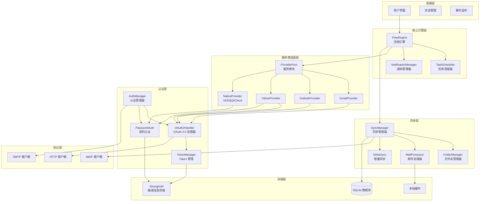
```mermaid
graph TB
    subgraph Frontend["前端层"]
        UI[用户界面]
        State[状态管理]
        Events[事件监听]
    end

    subgraph Core["核心引擎层"]
        Engine[FlowEngine<br/>流程引擎]
        Scheduler[TaskScheduler<br/>任务调度器]
        Notifier[NotificationManager<br/>通知管理器]
    end

    subgraph Providers["服务商适配层"]
        PP[ProviderPool<br/>服务商池]
        GP[GmailProvider]
        OP[OutlookProvider]
        YP[YahooProvider]
        NP[NativeProvider<br/>163/QQ/iCloud]
    end

    subgraph Auth["认证层"]
        AuthM[AuthManager<br/>认证管理器]
        OAuth[OAuth2Handler<br/>OAuth 2.0 处理器]
        Pass[PasswordAuth<br/>密码认证]
        TokenM[TokenManager<br/>Token 管理]
    end

    subgraph Sync["同步层"]
        SyncM[SyncManager<br/>同步管理器]
        FolderM[FolderManager<br/>文件夹管理器]
        MailM[MailProcessor<br/>邮件处理器]
        Delta[DeltaSync<br/>增量同步]
    end

    subgraph Storage["存储层"]
        DB[(SQLite 数据库)]
        Cache[本地缓存]
        Stronghold[Stronghold<br/>敏感信息存储]
    end

    subgraph Protocol["协议层"]
        IMAP[IMAP 客户端]
        SMTP[SMTP 客户端]
        HTTP[HTTP 客户端]
    end

    UI --> Engine
    Engine --> Scheduler
    Engine --> Notifier
    Engine --> PP
    
    PP --> GP
    PP --> OP
    PP --> YP
    PP --> NP
    
    GP --> OAuth
    OP --> OAuth
    YP --> OAuth
    YP --> Pass
    NP --> Pass
    
    OAuth --> TokenM
    AuthM --> OAuth
    AuthM --> Pass
    
    Engine --> SyncM
    SyncM --> FolderM
    SyncM --> MailM
    SyncM --> Delta
    
    SyncM --> IMAP
    AuthM --> SMTP
    OAuth --> HTTP
    
    SyncM --> DB
    MailM --> Cache
    TokenM --> Stronghold
    Pass --> Stronghold
```

### 模块职责

| 模块 | 职责 |
|------|------|
| FlowEngine | 协调各模块，管理整体流程 |
| TaskScheduler | 任务调度、定时同步、延迟重试 |
| ProviderPool | 管理服务商实例，根据邮箱类型选择适配器 |
| AuthManager | 统一认证入口，管理认证状态 |
| SyncManager | 邮件同步核心逻辑 |
| NotificationManager | 新邮件通知推送 |
| TokenManager | OAuth Token 生命周期管理 |

---

## 服务商抽象层

### 服务商接口定义

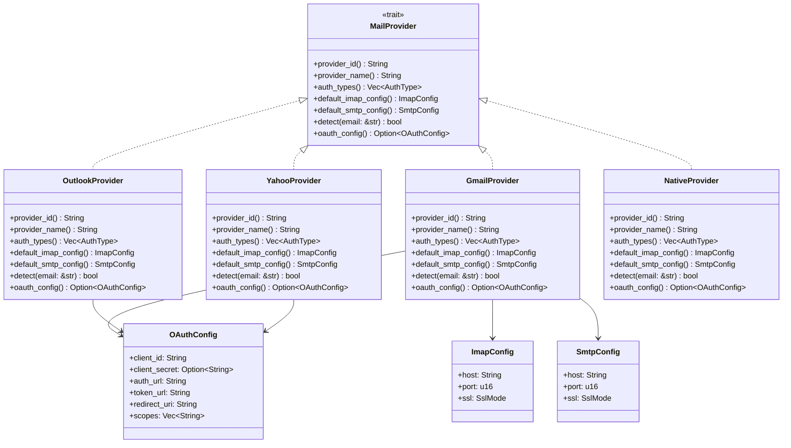
```mermaid
classDiagram
    class MailProvider {
        <<trait>>
        +provider_id() String
        +provider_name() String
        +auth_types() Vec~AuthType~
        +default_imap_config() ImapConfig
        +default_smtp_config() SmtpConfig
        +detect(email: &str) bool
        +oauth_config() Option~OAuthConfig~
    }

    class GmailProvider {
        +provider_id() String
        +provider_name() String
        +auth_types() Vec~AuthType~
        +default_imap_config() ImapConfig
        +default_smtp_config() SmtpConfig
        +detect(email: &str) bool
        +oauth_config() Option~OAuthConfig~
    }

    class OutlookProvider {
        +provider_id() String
        +provider_name() String
        +auth_types() Vec~AuthType~
        +default_imap_config() ImapConfig
        +default_smtp_config() SmtpConfig
        +detect(email: &str) bool
        +oauth_config() Option~OAuthConfig~
    }

    class YahooProvider {
        +provider_id() String
        +provider_name() String
        +auth_types() Vec~AuthType~
        +default_imap_config() ImapConfig
        +default_smtp_config() SmtpConfig
        +detect(email: &str) bool
        +oauth_config() Option~OAuthConfig~
    }

    class NativeProvider {
        +provider_id() String
        +provider_name() String
        +auth_types() Vec~AuthType~
        +default_imap_config() ImapConfig
        +default_smtp_config() SmtpConfig
        +detect(email: &str) bool
        +oauth_config() Option~OAuthConfig~
    }

    class ImapConfig {
        +host: String
        +port: u16
        +ssl: SslMode
    }

    class SmtpConfig {
        +host: String
        +port: u16
        +ssl: SslMode
    }

    class OAuthConfig {
        +client_id: String
        +client_secret: Option~String~
        +auth_url: String
        +token_url: String
        +redirect_uri: String
        +scopes: Vec~String~
    }

    MailProvider <|.. GmailProvider
    MailProvider <|.. OutlookProvider
    MailProvider <|.. YahooProvider
    MailProvider <|.. NativeProvider
    
    GmailProvider --> OAuthConfig
    OutlookProvider --> OAuthConfig
    YahooProvider --> OAuthConfig
    GmailProvider --> ImapConfig
    GmailProvider --> SmtpConfig
```

### 服务商配置表

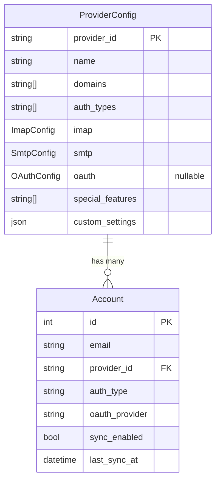
```mermaid
erDiagram
    ProviderConfig {
        string provider_id PK
        string name
        string[] domains
        string[] auth_types
        ImapConfig imap
        SmtpConfig smtp
        OAuthConfig oauth "nullable"
        string[] special_features
        json custom_settings
    }

    Account {
        int id PK
        string email
        string provider_id FK
        string auth_type
        string oauth_provider
        bool sync_enabled
        datetime last_sync_at
    }

    ProviderConfig ||--o{ Account : "has many"
```

---

## 认证流程

### 认证方式概览

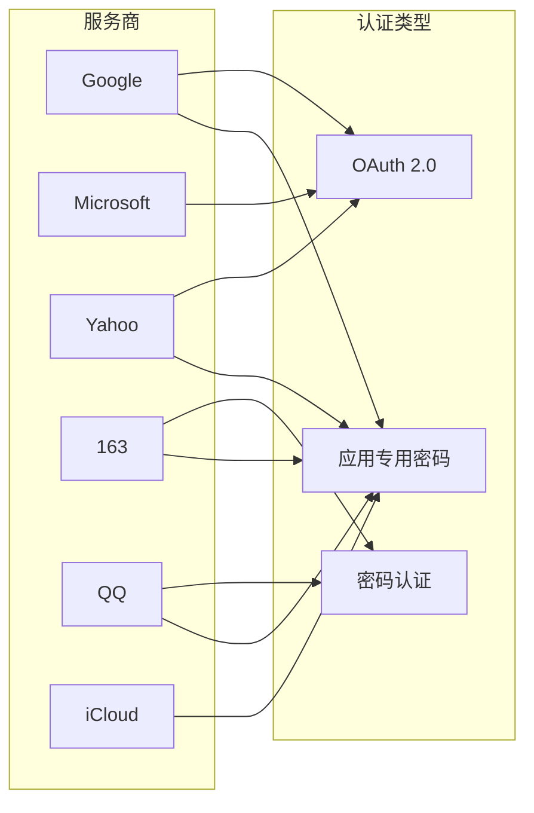
```mermaid
graph LR
    subgraph AuthTypes["认证类型"]
        Password[密码认证]
        OAuth2[OAuth 2.0]
        AppPassword[应用专用密码]
    end

    subgraph Providers["服务商"]
        Google[Google]
        Microsoft[Microsoft]
        Yahoo[Yahoo]
        N163[163]
        QQ[QQ]
        iCloud[iCloud]
    end

    Google --> OAuth2
    Google --> AppPassword
    Microsoft --> OAuth2
    Yahoo --> OAuth2
    Yahoo --> AppPassword
    N163 --> Password
    N163 --> AppPassword
    QQ --> Password
    QQ --> AppPassword
    iCloud --> AppPassword
```

### 密码认证流程

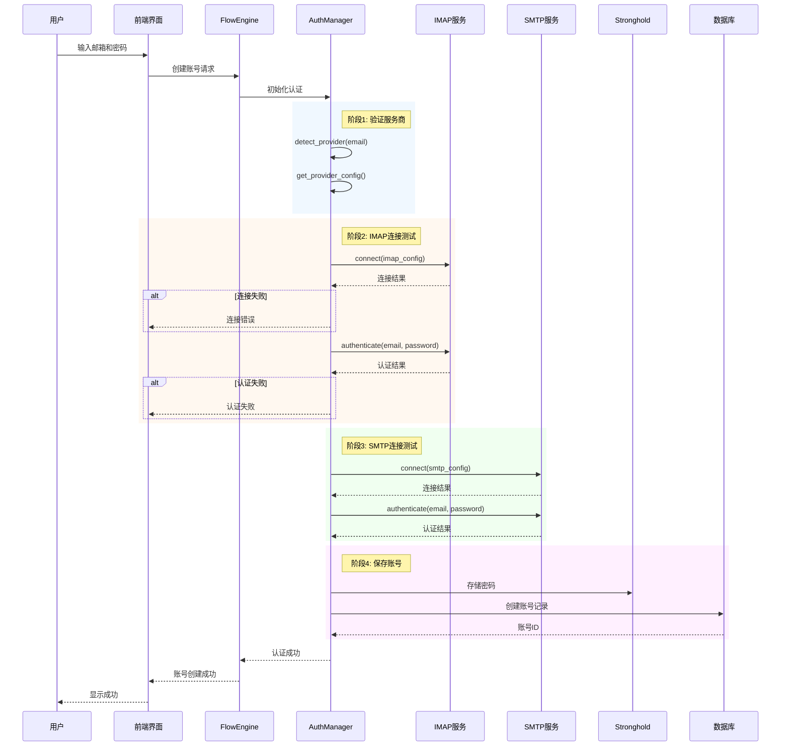
```mermaid
sequenceDiagram
    participant User as 用户
    participant UI as 前端界面
    participant Engine as FlowEngine
    participant Auth as AuthManager
    participant IMAP as IMAP服务
    participant SMTP as SMTP服务
    participant Secure as Stronghold
    participant DB as 数据库

    User->>UI: 输入邮箱和密码
    UI->>Engine: 创建账号请求
    Engine->>Auth: 初始化认证
    
    rect rgb(240, 248, 255)
        note right of Auth: 阶段1: 验证服务商
        Auth->>Auth: detect_provider(email)
        Auth->>Auth: get_provider_config()
    end
    
    rect rgb(255, 248, 240)
        note right of Auth: 阶段2: IMAP连接测试
        Auth->>IMAP: connect(imap_config)
        IMAP-->>Auth: 连接结果
        alt 连接失败
            Auth-->>UI: 连接错误
        end
        Auth->>IMAP: authenticate(email, password)
        IMAP-->>Auth: 认证结果
        alt 认证失败
            Auth-->>UI: 认证失败
        end
    end
    
    rect rgb(240, 255, 240)
        note right of Auth: 阶段3: SMTP连接测试
        Auth->>SMTP: connect(smtp_config)
        SMTP-->>Auth: 连接结果
        Auth->>SMTP: authenticate(email, password)
        SMTP-->>Auth: 认证结果
    end
    
    rect rgb(255, 240, 255)
        note right of Auth: 阶段4: 保存账号
        Auth->>Secure: 存储密码
        Auth->>DB: 创建账号记录
        DB-->>Auth: 账号ID
    end
    
    Auth-->>Engine: 认证成功
    Engine-->>UI: 账号创建成功
    UI-->>User: 显示成功
```

### OAuth 2.0 认证流程

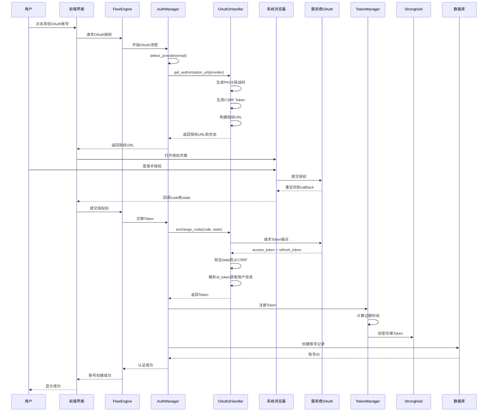
```mermaid
sequenceDiagram
    participant User as 用户
    participant UI as 前端界面
    participant Engine as FlowEngine
    participant Auth as AuthManager
    participant OAuth as OAuth2Handler
    participant Browser as 系统浏览器
    participant Provider as 服务商OAuth
    participant TokenM as TokenManager
    participant Secure as Stronghold
    participant DB as 数据库

    User->>UI: 点击添加OAuth账号
    UI->>Engine: 请求OAuth授权
    Engine->>Auth: 开始OAuth流程
    
    Auth->>Auth: detect_provider(email)
    Auth->>OAuth: get_authorization_url(provider)
    
    OAuth->>OAuth: 生成PKCE挑战码
    OAuth->>OAuth: 生成CSRF Token
    OAuth->>OAuth: 构建授权URL
    
    OAuth-->>Auth: 返回授权URL和状态
    Auth-->>UI: 返回授权URL
    UI->>Browser: 打开授权页面
    
    User->>Browser: 登录并授权
    Browser->>Provider: 提交授权
    Provider-->>Browser: 重定向到callback
    Browser-->>UI: 回调code和state
    
    UI->>Engine: 提交授权码
    Engine->>Auth: 交换Token
    
    Auth->>OAuth: exchange_code(code, state)
    OAuth->>Provider: 请求Token端点
    Provider-->>OAuth: access_token + refresh_token
    
    OAuth->>OAuth: 验证state防止CSRF
    OAuth->>OAuth: 解析id_token获取用户信息
    
    OAuth-->>Auth: 返回Token
    Auth->>TokenM: 注册Token
    
    TokenM->>TokenM: 计算过期时间
    TokenM->>Secure: 加密存储Token
    
    Auth->>DB: 创建账号记录
    DB-->>Auth: 账号ID
    
    Auth-->>Engine: 认证成功
    Engine-->>UI: 账号创建成功
    UI-->>User: 显示成功
```

### Token 生命周期管理

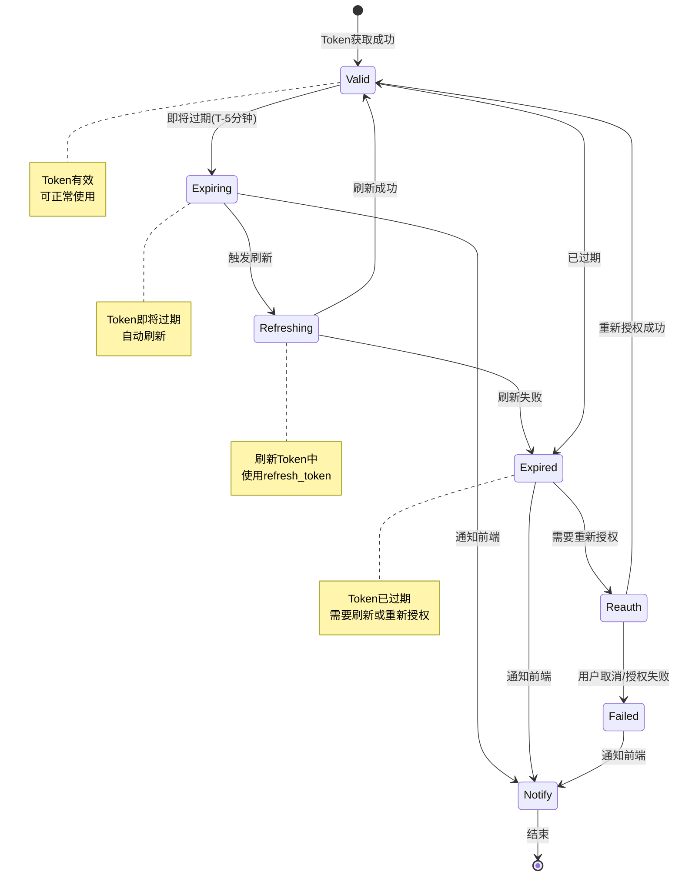
```mermaid
stateDiagram-v2
    [*] --> Valid: Token获取成功
    
    Valid --> Expiring: 即将过期(T-5分钟)
    Expiring --> Refreshing: 触发刷新
    
    Refreshing --> Valid: 刷新成功
    Refreshing --> Expired: 刷新失败
    
    Valid --> Expired: 已过期
    
    Expired --> Reauth: 需要重新授权
    Reauth --> Valid: 重新授权成功
    Reauth --> Failed: 用户取消/授权失败
    
    Expiring --> Notify: 通知前端
    Expired --> Notify: 通知前端
    Failed --> Notify: 通知前端
    
    Notify --> [*]: 结束
    
    note right of Valid
        Token有效
        可正常使用
    end note
    
    note right of Expiring
        Token即将过期
        自动刷新
    end note
    
    note right of Refreshing
        刷新Token中
        使用refresh_token
    end note
    
    note right of Expired
        Token已过期
        需要刷新或重新授权
    end note
```

---

## 首次同步流程

### 完整流程图

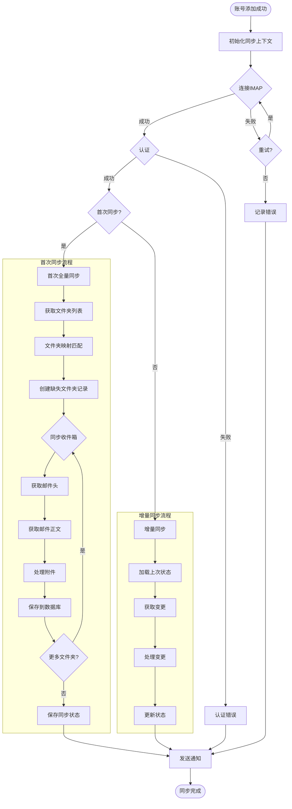
```mermaid
flowchart TB
    Start([账号添加成功]) --> Init[初始化同步上下文]
    Init --> Connect{连接IMAP}
    
    Connect -->|成功| Auth{认证}
    Connect -->|失败| RetryConn{重试?}
    RetryConn -->|是| Connect
    RetryConn -->|否| Error1[记录错误]
    
    Auth -->|成功| CheckFirst{首次同步?}
    Auth -->|失败| Error2[认证错误]
    
    CheckFirst -->|是| FirstSync[首次全量同步]
    CheckFirst -->|否| IncSync[增量同步]
    
    subgraph FirstSyncFlow["首次同步流程"]
        FirstSync --> ListFolders[获取文件夹列表]
        ListFolders --> MapFolders[文件夹映射匹配]
        MapFolders --> CreateMissing[创建缺失文件夹记录]
        CreateMissing --> SyncFolder1{同步收件箱}
        
        SyncFolder1 --> FetchHeaders1[获取邮件头]
        FetchHeaders1 --> FetchBodies1[获取邮件正文]
        FetchBodies1 --> ProcessAttach1[处理附件]
        ProcessAttach1 --> SaveToDB1[保存到数据库]
        SaveToDB1 --> NextFolder1{更多文件夹?}
        
        NextFolder1 -->|是| SyncFolder1
        NextFolder1 -->|否| SaveState[保存同步状态]
    end
    
    subgraph IncSyncFlow["增量同步流程"]
        IncSync --> LoadState[加载上次状态]
        LoadState --> GetChanges[获取变更]
        GetChanges --> ProcessChanges[处理变更]
        ProcessChanges --> UpdateState[更新状态]
    end
    
    SaveState --> Notify[发送通知]
    UpdateState --> Notify
    Error1 --> Notify
    Error2 --> Notify
    
    Notify --> End([同步完成])
```

### 首次同步详细时序图

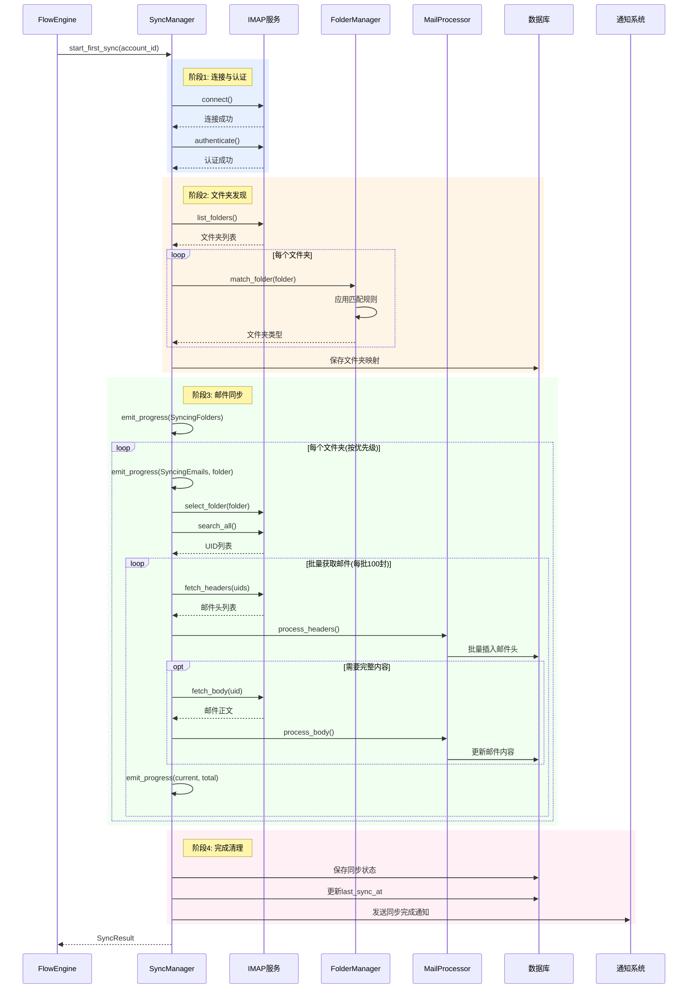
```mermaid
sequenceDiagram
    participant Engine as FlowEngine
    participant Sync as SyncManager
    participant IMAP as IMAP服务
    participant Folder as FolderManager
    participant Mail as MailProcessor
    participant DB as 数据库
    participant Notify as 通知系统

    Engine->>Sync: start_first_sync(account_id)
    
    rect rgb(230, 240, 255)
        note right of Sync: 阶段1: 连接与认证
        Sync->>IMAP: connect()
        IMAP-->>Sync: 连接成功
        Sync->>IMAP: authenticate()
        IMAP-->>Sync: 认证成功
    end
    
    rect rgb(255, 245, 230)
        note right of Sync: 阶段2: 文件夹发现
        Sync->>IMAP: list_folders()
        IMAP-->>Sync: 文件夹列表
        
        loop 每个文件夹
            Sync->>Folder: match_folder(folder)
            Folder->>Folder: 应用匹配规则
            Folder-->>Sync: 文件夹类型
        end
        
        Sync->>DB: 保存文件夹映射
    end
    
    rect rgb(240, 255, 240)
        note right of Sync: 阶段3: 邮件同步
        
        Sync->>Sync: emit_progress(SyncingFolders)
        
        loop 每个文件夹(按优先级)
            Sync->>Sync: emit_progress(SyncingEmails, folder)
            Sync->>IMAP: select_folder(folder)
            Sync->>IMAP: search_all()
            IMAP-->>Sync: UID列表
            
            loop 批量获取邮件(每批100封)
                Sync->>IMAP: fetch_headers(uids)
                IMAP-->>Sync: 邮件头列表
                
                Sync->>Mail: process_headers()
                Mail->>DB: 批量插入邮件头
                
                opt 需要完整内容
                    Sync->>IMAP: fetch_body(uid)
                    IMAP-->>Sync: 邮件正文
                    Sync->>Mail: process_body()
                    Mail->>DB: 更新邮件内容
                end
                
                Sync->>Sync: emit_progress(current, total)
            end
        end
    end
    
    rect rgb(255, 240, 245)
        note right of Sync: 阶段4: 完成清理
        Sync->>DB: 保存同步状态
        Sync->>DB: 更新last_sync_at
        Sync->>Notify: 发送同步完成通知
    end
    
    Sync-->>Engine: SyncResult
```

### 首次同步策略

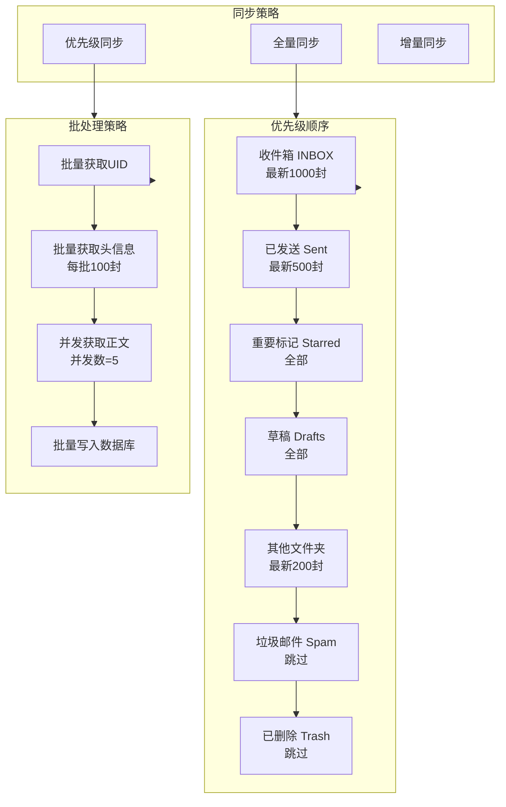
```mermaid
graph TB
    subgraph Strategy["同步策略"]
        FullSync[全量同步]
        PrioritySync[优先级同步]
        IncrementalSync[增量同步]
    end
    
    subgraph Priority["优先级顺序"]
        P1[收件箱 INBOX<br/>最新1000封]
        P2[已发送 Sent<br/>最新500封]
        P3[重要标记 Starred<br/>全部]
        P4[草稿 Drafts<br/>全部]
        P5[其他文件夹<br/>最新200封]
        P6[垃圾邮件 Spam<br/>跳过]
        P7[已删除 Trash<br/>跳过]
    end
    
    subgraph Batch["批处理策略"]
        B1[批量获取UID]
        B2[批量获取头信息<br/>每批100封]
        B3[并发获取正文<br/>并发数=5]
        B4[批量写入数据库]
    end
    
    FullSync --> Priority
    Priority --> P1
    P1 --> P2
    P2 --> P3
    P3 --> P4
    P4 --> P5
    P5 --> P6
    P6 --> P7
    
    PrioritySync --> Batch
    Batch --> B1
    B1 --> B2
    B2 --> B3
    B3 --> B4
```

---

## 文件夹匹配与同步

### 文件夹匹配规则

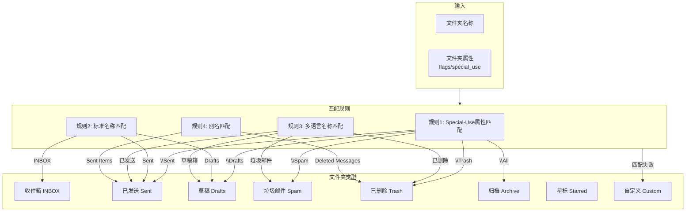
```mermaid
flowchart TB
    subgraph Input["输入"]
        FolderName[文件夹名称]
        FolderAttr[文件夹属性<br/>flags/special_use]
    end
    
    subgraph Rules["匹配规则"]
        R1[规则1: Special-Use属性匹配]
        R2[规则2: 标准名称匹配]
        R3[规则3: 多语言名称匹配]
        R4[规则4: 别名匹配]
    end
    
    subgraph Types["文件夹类型"]
        Inbox[收件箱 INBOX]
        Sent[已发送 Sent]
        Drafts[草稿 Drafts]
        Spam[垃圾邮件 Spam]
        Trash[已删除 Trash]
        Archive[归档 Archive]
        Starred[星标 Starred]
        Custom[自定义 Custom]
    end
    
    Input --> Rules
    
    R1 -->|\\All| Archive
    R1 -->|\\Drafts| Drafts
    R1 -->|\\Sent| Sent
    R1 -->|\\Spam| Spam
    R1 -->|\\Trash| Trash
    
    R2 -->|"INBOX"| Inbox
    R2 -->|"Sent"| Sent
    R2 -->|"Drafts"| Drafts
    
    R3 -->|"已发送"| Sent
    R3 -->|"草稿箱"| Drafts
    R3 -->|"垃圾邮件"| Spam
    R3 -->|"已删除"| Trash
    
    R4 -->|"Sent Items"| Sent
    R4 -->|"Deleted Messages"| Trash
    
    Rules -->|匹配失败| Custom
```

### 文件夹匹配映射表

| 文件夹类型 | Special-Use | 标准名称 | 常见别名 | 中文名称 |
|-----------|-------------|----------|----------|----------|
| INBOX | \Inbox | INBOX | Inbox | 收件箱 |
| Sent | \Sent | Sent, Sent Messages | Sent Items | 已发送, 发件箱 |
| Drafts | \Drafts | Drafts, Draft | Draft Messages | 草稿箱, 草稿 |
| Spam | \Junk | Spam, Junk | Junk Mail, Bulk Mail | 垃圾邮件, 垃圾箱 |
| Trash | \Trash | Trash, Deleted | Deleted Messages, Bin | 已删除, 回收站 |
| Archive | \Archive | Archive | All Mail, Archives | 归档, 所有邮件 |
| Starred | - | Starred, Flagged | Important, Starred | 星标, 重要 |

### 文件夹同步状态机

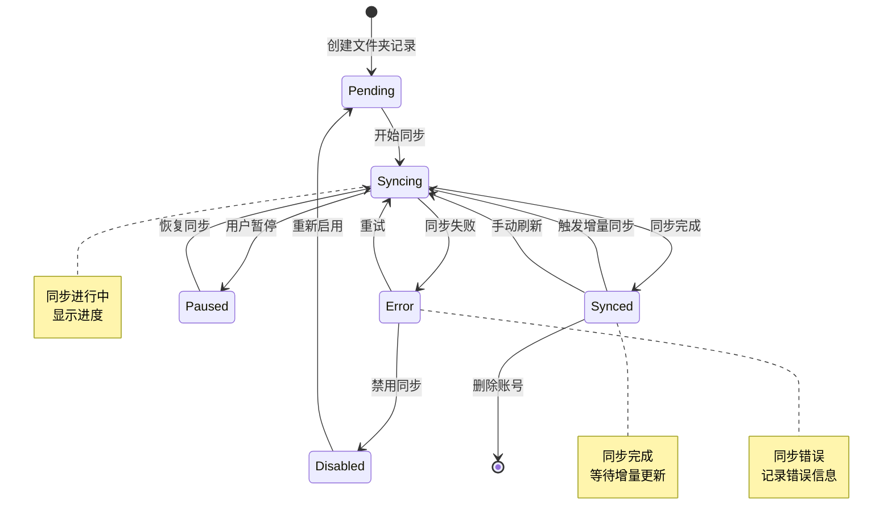
```mermaid
stateDiagram-v2
    [*] --> Pending: 创建文件夹记录
    
    Pending --> Syncing: 开始同步
    Syncing --> Synced: 同步完成
    Syncing --> Error: 同步失败
    Syncing --> Paused: 用户暂停
    
    Error --> Syncing: 重试
    Error --> Disabled: 禁用同步
    Paused --> Syncing: 恢复同步
    
    Synced --> Syncing: 触发增量同步
    Synced --> Syncing: 手动刷新
    
    Disabled --> Pending: 重新启用
    
    Synced --> [*]: 删除账号
    
    note right of Syncing
        同步进行中
        显示进度
    end note
    
    note right of Synced
        同步完成
        等待增量更新
    end note
    
    note right of Error
        同步错误
        记录错误信息
    end note
```

---

## 增量同步机制

### 增量同步策略

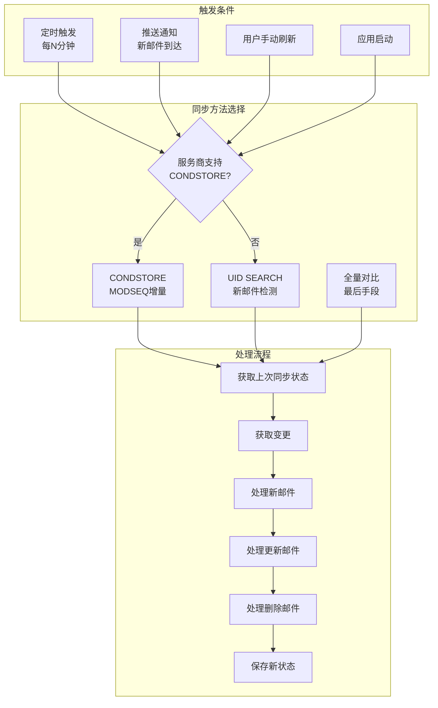
```mermaid
flowchart TB
    subgraph Triggers["触发条件"]
        T1[定时触发<br/>每N分钟]
        T2[推送通知<br/>新邮件到达]
        T3[用户手动刷新]
        T4[应用启动]
    end
    
    subgraph SyncMethod["同步方法选择"]
        Check{服务商支持<br/>CONDSTORE?}
        Condstroe[CONDSTORE<br/>MODSEQ增量]
        UidSearch[UID SEARCH<br/>新邮件检测]
        FullCompare[全量对比<br/>最后手段]
    end
    
    subgraph Process["处理流程"]
        GetState[获取上次同步状态]
        FetchChanges[获取变更]
        ProcessNew[处理新邮件]
        ProcessUpdate[处理更新邮件]
        ProcessDelete[处理删除邮件]
        SaveState[保存新状态]
    end
    
    T1 --> Check
    T2 --> Check
    T3 --> Check
    T4 --> Check
    
    Check -->|是| Condstroe
    Check -->|否| UidSearch
    
    Condstroe --> GetState
    UidSearch --> GetState
    FullCompare --> GetState
    
    GetState --> FetchChanges
    FetchChanges --> ProcessNew
    ProcessNew --> ProcessUpdate
    ProcessUpdate --> ProcessDelete
    ProcessDelete --> SaveState
```

### CONDSTORE 增量同步

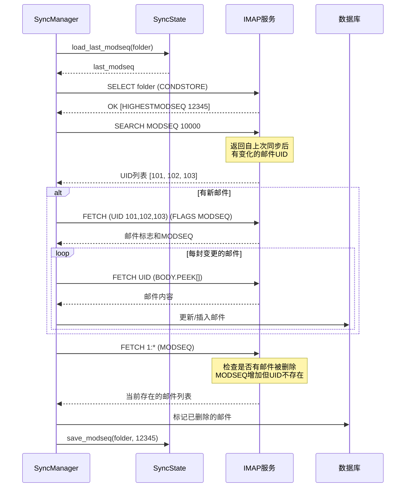
```mermaid
sequenceDiagram
    participant Sync as SyncManager
    participant State as SyncState
    participant IMAP as IMAP服务
    participant DB as 数据库

    Sync->>State: load_last_modseq(folder)
    State-->>Sync: last_modseq
    
    Sync->>IMAP: SELECT folder (CONDSTORE)
    IMAP-->>Sync: OK [HIGHESTMODSEQ 12345]
    
    Sync->>IMAP: SEARCH MODSEQ 10000
    Note over IMAP: 返回自上次同步后<br/>有变化的邮件UID
    
    IMAP-->>Sync: UID列表 [101, 102, 103]
    
    alt 有新邮件
        Sync->>IMAP: FETCH (UID 101,102,103) (FLAGS MODSEQ)
        IMAP-->>Sync: 邮件标志和MODSEQ
        
        loop 每封变更的邮件
            Sync->>IMAP: FETCH UID (BODY.PEEK[])
            IMAP-->>Sync: 邮件内容
            Sync->>DB: 更新/插入邮件
        end
    end
    
    Sync->>IMAP: FETCH 1:* (MODSEQ)
    Note over IMAP: 检查是否有邮件被删除<br/>MODSEQ增加但UID不存在
    IMAP-->>Sync: 当前存在的邮件列表
    
    Sync->>DB: 标记已删除的邮件
    Sync->>State: save_modseq(folder, 12345)
```

### 同步状态记录

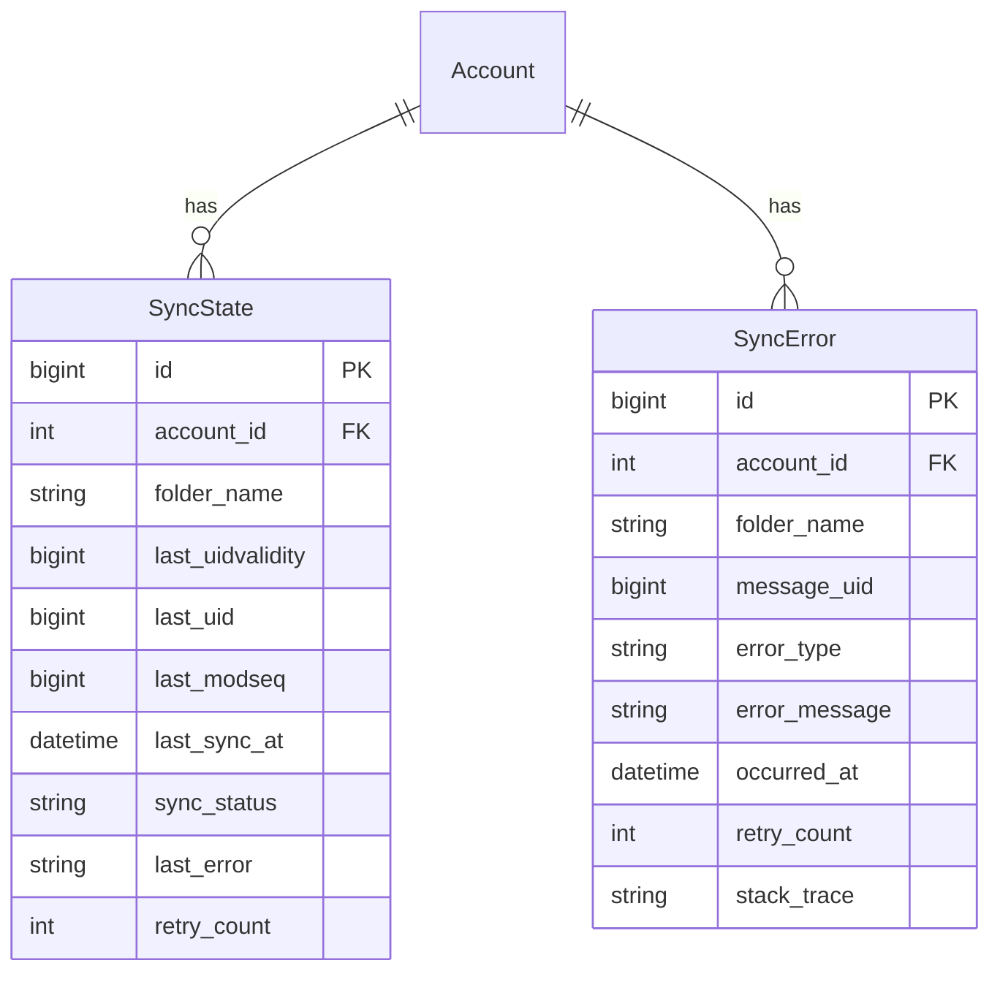
```mermaid
erDiagram
    SyncState {
        bigint id PK
        int account_id FK
        string folder_name
        bigint last_uidvalidity
        bigint last_uid
        bigint last_modseq
        datetime last_sync_at
        string sync_status
        string last_error
        int retry_count
    }
    
    SyncError {
        bigint id PK
        int account_id FK
        string folder_name
        bigint message_uid
        string error_type
        string error_message
        datetime occurred_at
        int retry_count
        string stack_trace
    }
    
    Account ||--o{ SyncState : has
    Account ||--o{ SyncError : has
```

### 推送通知集成

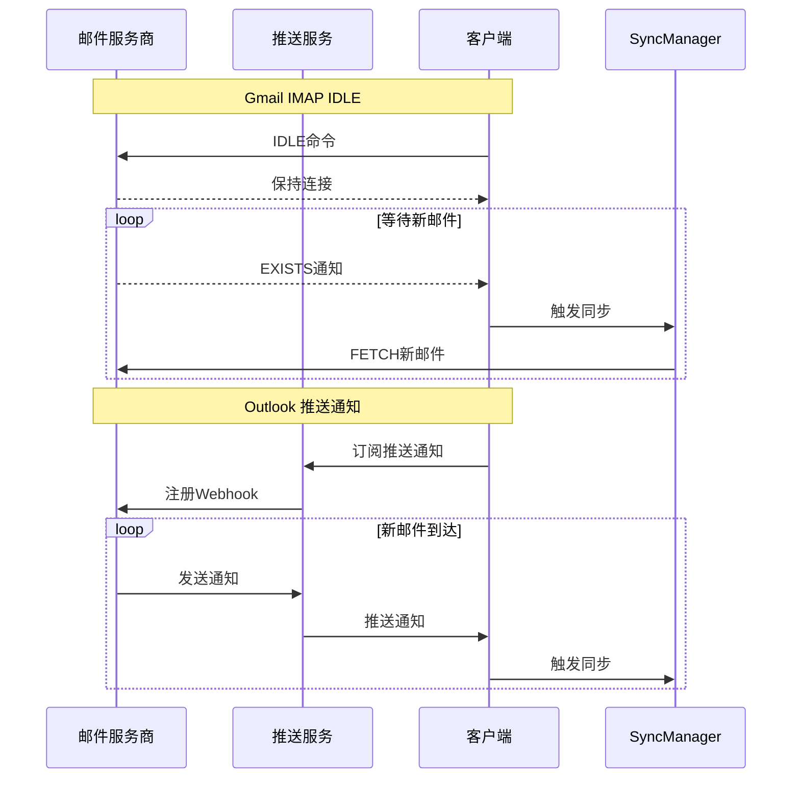
```mermaid
sequenceDiagram
    participant Provider as 邮件服务商
    participant Push as 推送服务
    participant App as 客户端
    participant Sync as SyncManager

    Note over Provider,App: Gmail IMAP IDLE
    App->>Provider: IDLE命令
    Provider-->>App: 保持连接
    
    loop 等待新邮件
        Provider-->>App: EXISTS通知
        App->>Sync: 触发同步
        Sync->>Provider: FETCH新邮件
    end
    
    Note over Provider,App: Outlook 推送通知
    App->>Push: 订阅推送通知
    Push->>Provider: 注册Webhook
    
    loop 新邮件到达
        Provider->>Push: 发送通知
        Push->>App: 推送通知
        App->>Sync: 触发同步
    end
```

---

## 新邮件通知机制

### 通知系统架构

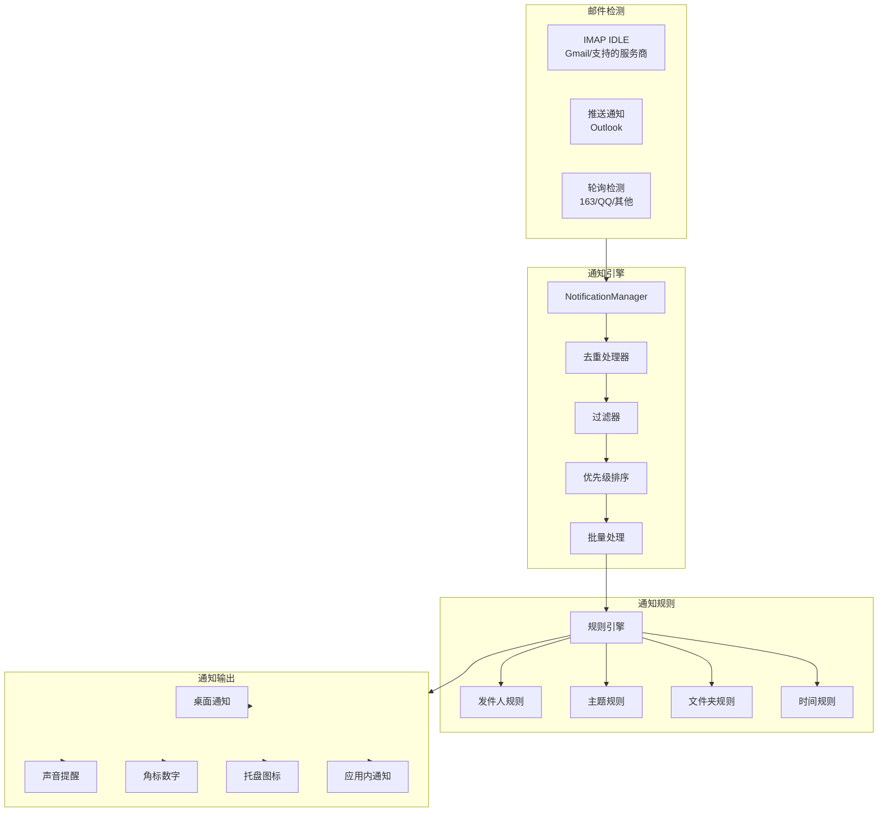
```mermaid
graph TB
    subgraph Detection["邮件检测"]
        IMAPIDLE[IMAP IDLE<br/>Gmail/支持的服务商]
        PushNotif[推送通知<br/>Outlook]
        Polling[轮询检测<br/>163/QQ/其他]
    end
    
    subgraph Engine["通知引擎"]
        NotifMgr[NotificationManager]
        Dedup[去重处理器]
        Filter[过滤器]
        Priority[优先级排序]
        Batch[批量处理]
    end
    
    subgraph Rules["通知规则"]
        RuleEngine[规则引擎]
        SenderRule[发件人规则]
        SubjectRule[主题规则]
        FolderRule[文件夹规则]
        TimeRule[时间规则]
    end
    
    subgraph Output["通知输出"]
        Desktop[桌面通知]
        Sound[声音提醒]
        Badge[角标数字]
        Tray[托盘图标]
        InApp[应用内通知]
    end
    
    Detection --> NotifMgr
    NotifMgr --> Dedup
    Dedup --> Filter
    Filter --> Priority
    Priority --> Batch
    
    Batch --> RuleEngine
    RuleEngine --> SenderRule
    RuleEngine --> SubjectRule
    RuleEngine --> FolderRule
    RuleEngine --> TimeRule
    
    RuleEngine --> Output
    Output --> Desktop
    Output --> Sound
    Output --> Badge
    Output --> Tray
    Output --> InApp
```

### IMAP IDLE 实时监听

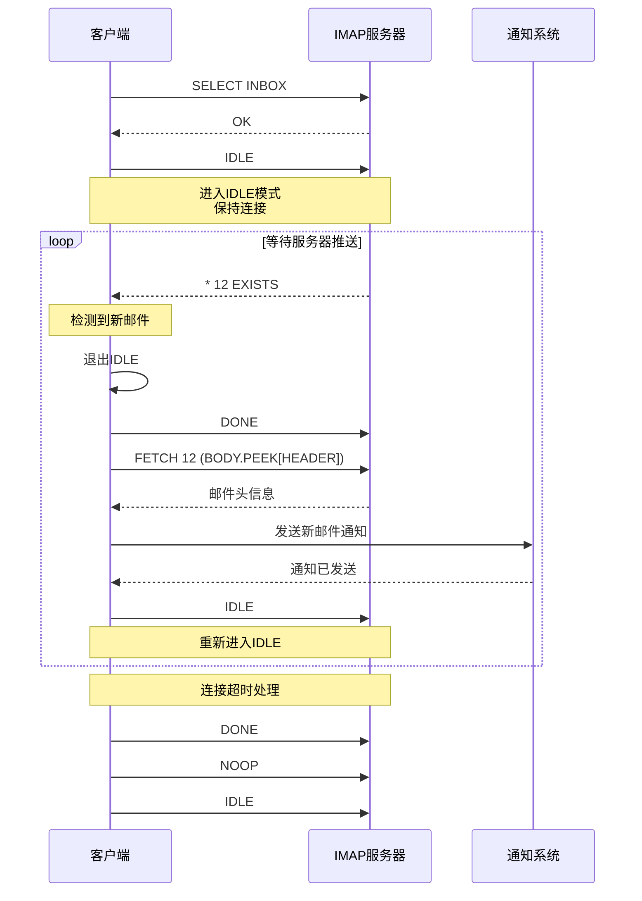
```mermaid
sequenceDiagram
    participant App as 客户端
    participant IMAP as IMAP服务器
    participant Notify as 通知系统

    App->>IMAP: SELECT INBOX
    IMAP-->>App: OK
    
    App->>IMAP: IDLE
    Note over App,IMAP: 进入IDLE模式<br/>保持连接
    
    loop 等待服务器推送
        IMAP-->>App: * 12 EXISTS
        Note over App: 检测到新邮件
        
        App->>App: 退出IDLE
        App->>IMAP: DONE
        
        App->>IMAP: FETCH 12 (BODY.PEEK[HEADER])
        IMAP-->>App: 邮件头信息
        
        App->>Notify: 发送新邮件通知
        Notify-->>App: 通知已发送
        
        App->>IMAP: IDLE
        Note over App,IMAP: 重新进入IDLE
    end
    
    Note over App,IMAP: 连接超时处理
    App->>IMAP: DONE
    App->>IMAP: NOOP
    App->>IMAP: IDLE
```

### 通知去重与合并

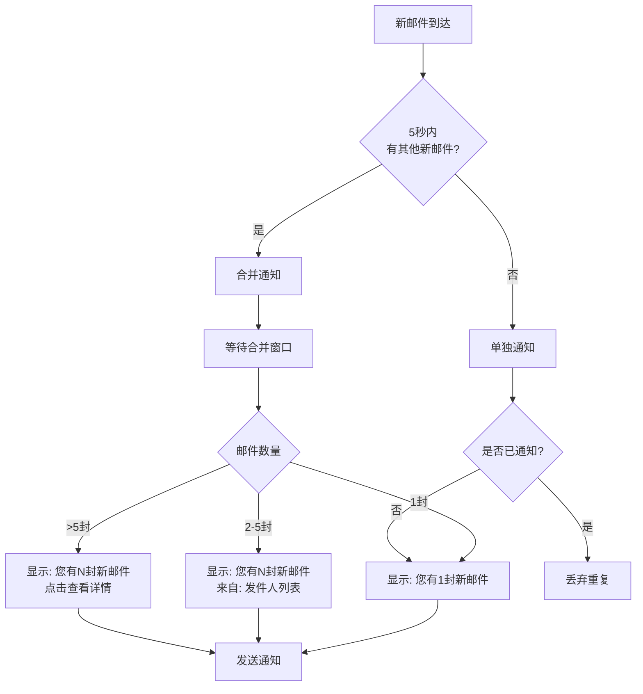
```mermaid
flowchart TB
    NewMail[新邮件到达] --> Check{5秒内<br/>有其他新邮件?}
    
    Check -->|是| Merge[合并通知]
    Check -->|否| Single[单独通知]
    
    Merge --> Wait[等待合并窗口]
    Wait --> Count{邮件数量}
    
    Count -->|1封| Show1[显示: 您有1封新邮件]
    Count -->|2-5封| ShowMulti[显示: 您有N封新邮件<br/>来自: 发件人列表]
    Count -->|>5封| ShowSummary[显示: 您有N封新邮件<br/>点击查看详情]
    
    Single --> CheckDup{是否已通知?}
    CheckDup -->|是| Drop[丢弃重复]
    CheckDup -->|否| Show1
    
    Show1 --> Emit[发送通知]
    ShowMulti --> Emit
    ShowSummary --> Emit
```

---

## 错误处理与重试策略

### 错误类型定义

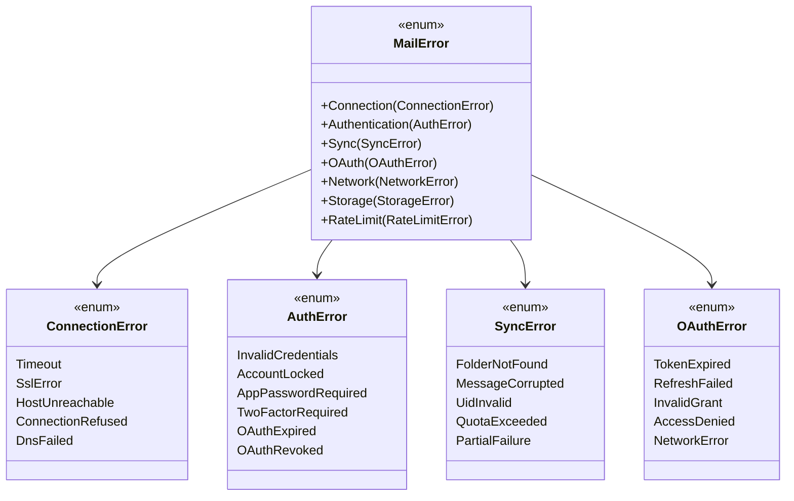
```mermaid
classDiagram
    class MailError {
        <<enum>>
        +Connection(ConnectionError)
        +Authentication(AuthError)
        +Sync(SyncError)
        +OAuth(OAuthError)
        +Network(NetworkError)
        +Storage(StorageError)
        +RateLimit(RateLimitError)
    }
    
    class ConnectionError {
        <<enum>>
        Timeout
        SslError
        HostUnreachable
        ConnectionRefused
        DnsFailed
    }
    
    class AuthError {
        <<enum>>
        InvalidCredentials
        AccountLocked
        AppPasswordRequired
        TwoFactorRequired
        OAuthExpired
        OAuthRevoked
    }
    
    class SyncError {
        <<enum>>
        FolderNotFound
        MessageCorrupted
        UidInvalid
        QuotaExceeded
        PartialFailure
    }
    
    class OAuthError {
        <<enum>>
        TokenExpired
        RefreshFailed
        InvalidGrant
        AccessDenied
        NetworkError
    }
    
    MailError --> ConnectionError
    MailError --> AuthError
    MailError --> SyncError
    MailError --> OAuthError
```

### 重试策略

```mermaid
flowchart TB
    Error[发生错误] --> Type{错误类型}
    
    Type -->|网络错误| NetRetry[网络重试策略]
    Type -->|认证错误| AuthRetry[认证重试策略]
    Type -->|OAuth错误| OAuthRetry[OAuth重试策略]
    Type -->|同步错误| SyncRetry[同步重试策略]
    Type -->|限流错误| RateRetry[限流重试策略]
    
    subgraph NetRetry["网络重试 (指数退避)"]
        N1[重试1: 1秒后]
        N2[重试2: 2秒后]
        N3[重试3: 4秒后]
        N4[重试4: 8秒后]
        N5[重试5: 16秒后]
        NFail[超过5次: 标记失败]
    end
    
    subgraph AuthRetry["认证重试"]
        A1[检查密码]
        A2[重新输入]
        A3[OAuth重新授权]
    end
    
    subgraph OAuthRetry["OAuth重试"]
        O1[尝试刷新Token]
        O2{刷新成功?}
        O3[继续操作]
        O4[重新授权]
    end
    
    subgraph SyncRetry["同步重试"]
        S1[跳过当前邮件]
        S2[记录错误]
        S3[继续同步]
        S4[稍后重试失败邮件]
    end
    
    subgraph RateRetry["限流重试"]
        R1[读取Retry-After]
        R2[等待指定时间]
        R3[指数退避]
    end
```

### 错误恢复流程

```mermaid
stateDiagram-v2
    [*] --> Normal: 正常运行
    
    Normal --> Warning: 1次失败
    Warning --> Normal: 成功
    Warning --> Degraded: 连续3次失败
    
    Degraded --> Warning: 成功
    Degraded --> Error: 连续5次失败
    
    Error --> Degraded: 成功
    Error --> Critical: 连续10次失败或认证失败
    
    Critical --> Reauth: OAuth需要重新授权
    Critical --> Manual: 需要用户干预
    
    Reauth --> Normal: 重新授权成功
    Manual --> Normal: 用户修复问题
    
    note right of Normal
        一切正常
        定时同步运行
    end note
    
    note right of Warning
        单次失败
        自动重试中
    end note
    
    note right of Degraded
        连续失败
        增加重试间隔
        限制后台同步
    end note
    
    note right of Error
        严重错误
        停止自动同步
        通知用户
    end note
    
    note right of Critical
        需要用户干预
        账号可能被锁定
        或OAuth过期
    end note
```

---

## Rust 引擎框架代码

### 核心模块结构

```
src-tauri/src/
├── engine/
│   ├── mod.rs                    # 模块导出
│   ├── flow_engine.rs            # 流程引擎核心
│   ├── task_scheduler.rs        # 任务调度器
│   └── notification_manager.rs  # 通知管理器
├── providers/
│   ├── mod.rs                    # 模块导出
│   ├── traits.rs                 # 服务商 trait 定义
│   ├── provider_pool.rs          # 服务商池
│   ├── gmail.rs                  # Gmail 适配器
│   ├── outlook.rs                # Outlook 适配器
│   ├── yahoo.rs                  # Yahoo 适配器
│   ├── native.rs                 # 国内外邮箱适配器 (163/QQ/iCloud)
│   └── config.rs                  # 服务商配置
├── auth/
│   ├── mod.rs                    # 模块导出
│   ├── auth_manager.rs           # 认证管理器
│   ├── oauth_handler.rs          # OAuth 处理器
│   ├── password_auth.rs          # 密码认证
│   └── token_manager.rs          # Token 管理
├── sync/
│   ├── mod.rs                    # 模块导出
│   ├── sync_manager.rs           # 同步管理器
│   ├── folder_manager.rs         # 文件夹管理
│   ├── mail_processor.rs         # 邮件处理器
│   ├── delta_sync.rs             # 增量同步
│   └── sync_state.rs              # 同步状态
├── error/
│   ├── mod.rs                    # 模块导出
│   ├── types.rs                  # 错误类型定义
│   └── retry.rs                   # 重试策略
└── config/
    └── provider_config.rs        # 服务商配置
```

### 1. 服务商 Trait 定义

```rust
// src-tauri/src/providers/traits.rs

use anyhow::Result;
use async_trait::async_trait;
use serde::{Deserialize, Serialize};

/// 认证类型
#[derive(Debug, Clone, Serialize, Deserialize, PartialEq)]
pub enum AuthType {
    Password,
    OAuth2,
    AppPassword,
}

/// SSL 模式
#[derive(Debug, Clone, Serialize, Deserialize, PartialEq)]
pub enum SslMode {
    None,
    StartTls,
    Implicit,
}

/// IMAP 配置
#[derive(Debug, Clone, Serialize, Deserialize)]
pub struct ImapConfig {
    pub host: String,
    pub port: u16,
    pub ssl: SslMode,
}

/// SMTP 配置
#[derive(Debug, Clone, Serialize, Deserialize)]
pub struct SmtpConfig {
    pub host: String,
    pub port: u16,
    pub ssl: SslMode,
}

/// OAuth 配置
#[derive(Debug, Clone, Serialize, Deserialize)]
pub struct OAuthConfig {
    pub client_id: String,
    pub client_secret: Option<String>,
    pub auth_url: String,
    pub token_url: String,
    pub redirect_uri: String,
    pub scopes: Vec<String>,
    pub pkce_enabled: bool,
}

/// OAuth Token
#[derive(Debug, Clone, Serialize, Deserialize)]
pub struct OAuthToken {
    pub access_token: String,
    pub refresh_token: String,
    pub expires_at: i64,
    pub id_token: Option<String>,
}

/// 服务商能力
#[derive(Debug, Clone, Serialize, Deserialize)]
pub struct ProviderCapabilities {
    pub supports_idle: bool,
    pub supports_condstore: bool,
    pub supports_push: bool,
    pub supports_oauth: bool,
    pub max_message_size: Option<u64>,
}

/// 服务商 Trait
#[async_trait]
pub trait MailProvider: Send + Sync {
    /// 服务商唯一标识
    fn provider_id(&self) -> &str;
    
    /// 服务商显示名称
    fn provider_name(&self) -> &str;
    
    /// 支持的认证类型
    fn auth_types(&self) -> Vec<AuthType>;
    
    /// 默认 IMAP 配置
    fn default_imap_config(&self) -> ImapConfig;
    
    /// 默认 SMTP 配置
    fn default_smtp_config(&self) -> SmtpConfig;
    
    /// OAuth 配置 (如果支持)
    fn oauth_config(&self) -> Option<OAuthConfig>;
    
    /// 服务商能力
    fn capabilities(&self) -> ProviderCapabilities;
    
    /// 根据邮箱地址检测是否为此服务商
    fn detect(&self, email: &str) -> bool;
    
    /// 生成 XOAUTH2 字符串
    fn generate_xoauth2(&self, email: &str, access_token: &str) -> String {
        let auth_string = format!("user={}\x01auth=Bearer {}\x01\x01", email, access_token);
        base64::engine::general_purpose::STANDARD.encode(auth_string)
    }
}

/// 服务商工厂 Trait
#[async_trait]
pub trait ProviderFactory: Send + Sync {
    /// 根据邮箱地址创建服务商实例
    fn create_provider(&self, email: &str) -> Result<Box<dyn MailProvider>>;
    
    /// 获取所有支持的服务商列表
    fn supported_providers(&self) -> Vec<ProviderInfo>;
}

#[derive(Debug, Clone, Serialize, Deserialize)]
pub struct ProviderInfo {
    pub id: String,
    pub name: String,
    pub domains: Vec<String>,
    pub auth_types: Vec<AuthType>,
}
```

### 2. Gmail 服务商实现

```rust
// src-tauri/src/providers/gmail.rs

use super::traits::*;
use anyhow::Result;
use async_trait::async_trait;

pub struct GmailProvider {
    oauth_config: OAuthConfig,
}

impl GmailProvider {
    pub fn new(client_id: String, client_secret: String) -> Self {
        Self {
            oauth_config: OAuthConfig {
                client_id,
                client_secret: Some(client_secret),
                auth_url: "https://accounts.google.com/o/oauth2/v2/auth".to_string(),
                token_url: "https://oauth2.googleapis.com/token".to_string(),
                redirect_uri: "postium://oauth/callback".to_string(),
                scopes: vec![
                    "https://mail.google.com/".to_string(),
                    "https://www.googleapis.com/auth/userinfo.email".to_string(),
                    "https://www.googleapis.com/auth/userinfo.profile".to_string(),
                ],
                pkce_enabled: true,
            },
        }
    }
    
    pub fn from_env() -> Result<Self> {
        let client_id = std::env::var("GOOGLE_CLIENT_ID")
            .map_err(|_| anyhow::anyhow!("GOOGLE_CLIENT_ID not set"))?;
        let client_secret = std::env::var("GOOGLE_CLIENT_SECRET")
            .map_err(|_| anyhow::anyhow!("GOOGLE_CLIENT_SECRET not set"))?;
        Ok(Self::new(client_id, client_secret))
    }
}

#[async_trait]
impl MailProvider for GmailProvider {
    fn provider_id(&self) -> &str {
        "gmail"
    }
    
    fn provider_name(&self) -> &str {
        "Google Mail"
    }
    
    fn auth_types(&self) -> Vec<AuthType> {
        vec![AuthType::OAuth2, AuthType::AppPassword]
    }
    
    fn default_imap_config(&self) -> ImapConfig {
        ImapConfig {
            host: "imap.gmail.com".to_string(),
            port: 993,
            ssl: SslMode::Implicit,
        }
    }
    
    fn default_smtp_config(&self) -> SmtpConfig {
        SmtpConfig {
            host: "smtp.gmail.com".to_string(),
            port: 587,
            ssl: SslMode::StartTls,
        }
    }
    
    fn oauth_config(&self) -> Option<OAuthConfig> {
        Some(self.oauth_config.clone())
    }
    
    fn capabilities(&self) -> ProviderCapabilities {
        ProviderCapabilities {
            supports_idle: true,
            supports_condstore: true,
            supports_push: true,
            supports_oauth: true,
            max_message_size: Some(25 * 1024 * 1024), // 25MB
        }
    }
    
    fn detect(&self, email: &str) -> bool {
        let domain = email.split('@').last().unwrap_or("");
        matches!(domain.to_lowercase().as_str(), "gmail.com" | "googlemail.com")
    }
}
```

### 3. Outlook 服务商实现

```rust
// src-tauri/src/providers/outlook.rs

use super::traits::*;
use anyhow::Result;
use async_trait::async_trait;

pub struct OutlookProvider {
    oauth_config: OAuthConfig,
}

impl OutlookProvider {
    pub fn new(client_id: String) -> Self {
        Self {
            oauth_config: OAuthConfig {
                client_id,
                client_secret: None, // 公共客户端不需要
                auth_url: "https://login.microsoftonline.com/common/oauth2/v2.0/authorize".to_string(),
                token_url: "https://login.microsoftonline.com/common/oauth2/v2.0/token".to_string(),
                redirect_uri: "postium://oauth/callback".to_string(),
                scopes: vec![
                    "https://outlook.office.com/IMAP.AccessAsUser.All".to_string(),
                    "https://outlook.office.com/SMTP.Send".to_string(),
                    "offline_access".to_string(),
                    "openid".to_string(),
                ],
                pkce_enabled: true,
            },
        }
    }
    
    pub fn from_env() -> Result<Self> {
        let client_id = std::env::var("MICROSOFT_CLIENT_ID")
            .map_err(|_| anyhow::anyhow!("MICROSOFT_CLIENT_ID not set"))?;
        Ok(Self::new(client_id))
    }
}

#[async_trait]
impl MailProvider for OutlookProvider {
    fn provider_id(&self) -> &str {
        "outlook"
    }
    
    fn provider_name(&self) -> &str {
        "Microsoft Outlook"
    }
    
    fn auth_types(&self) -> Vec<AuthType> {
        vec![AuthType::OAuth2]
    }
    
    fn default_imap_config(&self) -> ImapConfig {
        ImapConfig {
            host: "outlook.office365.com".to_string(),
            port: 993,
            ssl: SslMode::Implicit,
        }
    }
    
    fn default_smtp_config(&self) -> SmtpConfig {
        SmtpConfig {
            host: "smtp-mail.outlook.com".to_string(),
            port: 587,
            ssl: SslMode::StartTls,
        }
    }
    
    fn oauth_config(&self) -> Option<OAuthConfig> {
        Some(self.oauth_config.clone())
    }
    
    fn capabilities(&self) -> ProviderCapabilities {
        ProviderCapabilities {
            supports_idle: false,
            supports_condstore: true,
            supports_push: true,
            supports_oauth: true,
            max_message_size: Some(150 * 1024 * 1024), // 150MB
        }
    }
    
    fn detect(&self, email: &str) -> bool {
        let domain = email.split('@').last().unwrap_or("");
        matches!(
            domain.to_lowercase().as_str(),
            "outlook.com" | "hotmail.com" | "live.com" | "msn.com"
        )
    }
}
```

### 4. 服务商池实现

```rust
// src-tauri/src/providers/provider_pool.rs

use super::traits::*;
use super::{GmailProvider, OutlookProvider, YahooProvider, NativeProvider};
use anyhow::{anyhow, Result};
use std::collections::HashMap;
use std::sync::Arc;
use tokio::sync::RwLock;

/// 服务商池
pub struct ProviderPool {
    providers: Arc<RwLock<HashMap<String, Box<dyn MailProvider>>>>,
    ordered_providers: Vec<&'static str>,
}

impl ProviderPool {
    pub fn new() -> Self {
        Self {
            providers: Arc::new(RwLock::new(HashMap::new())),
            ordered_providers: vec![
                "gmail",
                "outlook",
                "yahoo",
                "icloud",
                "163",
                "qq",
            ],
        }
    }
    
    /// 从环境变量初始化所有服务商
    pub async fn initialize_from_env(&self) -> Result<()> {
        let mut providers = self.providers.write().await;
        
        // 初始化 Gmail
        if let Ok(provider) = GmailProvider::from_env() {
            providers.insert("gmail".to_string(), Box::new(provider));
        }
        
        // 初始化 Outlook
        if let Ok(provider) = OutlookProvider::from_env() {
            providers.insert("outlook".to_string(), Box::new(provider));
        }
        
        // 初始化 Yahoo
        if let Ok(provider) = YahooProvider::from_env() {
            providers.insert("yahoo".to_string(), Box::new(provider));
        }
        
        // 初始化国内邮箱
        providers.insert("163".to_string(), Box::new(NativeProvider::new_163()));
        providers.insert("qq".to_string(), Box::new(NativeProvider::new_qq()));
        providers.insert("icloud".to_string(), Box::new(NativeProvider::new_icloud()));
        
        Ok(())
    }
    
    /// 根据邮箱地址自动检测服务商
    pub async fn detect_provider(&self, email: &str) -> Result<Box<dyn MailProvider>> {
        let providers = self.providers.read().await;
        
        for provider_id in &self.ordered_providers {
            if let Some(provider) = providers.get(*provider_id) {
                if provider.detect(email) {
                    return Ok(provider.box_clone());
                }
            }
        }
        
        // 未识别的服务商，尝试从域名推断
        let domain = email.split('@').last().unwrap_or("");
        Err(anyhow!("未知的邮箱服务商: {}", domain))
    }
    
    /// 获取指定服务商
    pub async fn get_provider(&self, provider_id: &str) -> Result<Box<dyn MailProvider>> {
        let providers = self.providers.read().await;
        providers
            .get(provider_id)
            .map(|p| p.box_clone())
            .ok_or_else(|| anyhow!("服务商不存在: {}", provider_id))
    }
    
    /// 获取所有支持的服务商信息
    pub async fn get_all_providers(&self) -> Vec<ProviderInfo> {
        let providers = self.providers.read().await;
        providers
            .values()
            .map(|p| ProviderInfo {
                id: p.provider_id().to_string(),
                name: p.provider_name().to_string(),
                domains: vec![], // 需要各服务商提供
                auth_types: p.auth_types(),
            })
            .collect()
    }
}

impl Default for ProviderPool {
    fn default() -> Self {
        Self::new()
    }
}
```

### 5. 认证管理器

```rust
// src-tauri/src/auth/auth_manager.rs

use crate::providers::traits::*;
use crate::models::account::CreateAccountRequest;
use anyhow::{anyhow, Result};
use std::sync::Arc;
use tokio::sync::RwLock;

/// 认证结果
#[derive(Debug, Clone)]
pub struct AuthResult {
    pub account_id: i32,
    pub email: String,
    pub provider_id: String,
    pub auth_type: AuthType,
}

/// 认证管理器
pub struct AuthManager {
    provider_pool: Arc<ProviderPool>,
    oauth_handler: Arc<OAuthHandler>,
    password_auth: Arc<PasswordAuth>,
}

impl AuthManager {
    pub fn new(
        provider_pool: Arc<ProviderPool>,
        oauth_handler: Arc<OAuthHandler>,
        password_auth: Arc<PasswordAuth>,
    ) -> Self {
        Self {
            provider_pool,
            oauth_handler,
            password_auth,
        }
    }
    
    /// 开始认证流程
    pub async fn authenticate(
        &self,
        request: &CreateAccountRequest,
    ) -> Result<AuthResult> {
        // 1. 检测服务商
        let provider = self.provider_pool.detect_provider(&request.email).await?;
        
        // 2. 根据认证类型选择认证方式
        let auth_type = match request.auth_type.as_deref() {
            Some("oauth2") => AuthType::OAuth2,
            Some("password") | None => AuthType::Password,
            Some("app_password") => AuthType::AppPassword,
            _ => return Err(anyhow!("不支持的认证类型")),
        };
        
        // 3. 验证认证类型是否被服务商支持
        if !provider.auth_types().contains(&auth_type) {
            return Err(anyhow!(
                "服务商 {} 不支持认证类型 {:?}",
                provider.provider_name(),
                auth_type
            ));
        }
        
        // 4. 执行认证
        match auth_type {
            AuthType::OAuth2 => {
                self.oauth_auth(&provider, request).await
            }
            AuthType::Password | AuthType::AppPassword => {
                self.password_auth(&provider, request).await
            }
        }
    }
    
    /// OAuth 认证
    async fn oauth_auth(
        &self,
        provider: &Box<dyn MailProvider>,
        request: &CreateAccountRequest,
    ) -> Result<AuthResult> {
        let oauth_config = provider.oauth_config()
            .ok_or_else(|| anyhow!("服务商不支持 OAuth"))?;
        
        // 交换授权码获取 Token
        let token = self.oauth_handler
            .exchange_code(
                &oauth_config,
                &request.password, // 这里 password 字段存储的是授权码
                &request.email,
            )
            .await?;
        
        // 验证 Token 并测试连接
        self.oauth_handler
            .verify_and_test_imap(
                &provider.default_imap_config(),
                &request.email,
                &token.access_token,
            )
            .await?;
        
        // 创建账号记录
        let account_id = self.create_account_record(
            &request.email,
            provider.provider_id(),
            &token,
        ).await?;
        
        Ok(AuthResult {
            account_id,
            email: request.email.clone(),
            provider_id: provider.provider_id().to_string(),
            auth_type: AuthType::OAuth2,
        })
    }
    
    /// 密码认证
    async fn password_auth(
        &self,
        provider: &Box<dyn MailProvider>,
        request: &CreateAccountRequest,
    ) -> Result<AuthResult> {
        let imap_config = Self::build_imap_config(provider, request);
        let smtp_config = Self::build_smtp_config(provider, request);
        
        // 测试 IMAP 连接
        self.password_auth
            .test_imap(
                &imap_config,
                &request.email,
                &request.password,
            )
            .await?;
        
        // 测试 SMTP 连接
        self.password_auth
            .test_smtp(
                &smtp_config,
                &request.email,
                &request.password,
            )
            .await?;
        
        // 创建账号记录
        let account_id = self.create_password_account_record(
            &request.email,
            provider.provider_id(),
            &request.password,
        ).await?;
        
        Ok(AuthResult {
            account_id,
            email: request.email.clone(),
            provider_id: provider.provider_id().to_string(),
            auth_type: AuthType::Password,
        })
    }
    
    // ... 其他辅助方法
}
```

### 6. 流程引擎核心

```rust
// src-tauri/src/engine/flow_engine.rs

use crate::auth::AuthManager;
use crate::providers::ProviderPool;
use crate::sync::SyncManager;
use crate::notification::NotificationManager;
use anyhow::Result;
use std::sync::Arc;
use tauri::AppHandle;

/// 同步阶段
#[derive(Debug, Clone, serde::Serialize)]
pub enum SyncStage {
    Connecting,
    Authenticating,
    SyncingFolders,
    SyncingEmails { folder: String },
    Completed,
    Error { message: String },
}

/// 同步进度
#[derive(Debug, Clone, serde::Serialize)]
pub struct SyncProgress {
    pub stage: SyncStage,
    pub current: u32,
    pub total: u32,
    pub message: String,
}

/// 引擎事件
#[derive(Debug, Clone, serde::Serialize)]
#[serde(tag = "type")]
pub enum EngineEvent {
    AccountAdded { account_id: i32, email: String },
    AccountRemoved { account_id: i32 },
    SyncStarted { account_id: i32 },
    SyncProgress { account_id: i32, progress: SyncProgress },
    SyncCompleted { account_id: i32, result: SyncResult },
    SyncError { account_id: i32, error: String },
    NewMail { account_id: i32, folder: String, count: u32 },
    AuthRequired { account_id: i32, reason: String },
}

/// 同步结果
#[derive(Debug, Clone, serde::Serialize)]
pub struct SyncResult {
    pub total_synced: u32,
    pub folders_synced: u32,
    pub errors: Vec<String>,
    pub duration_ms: u64,
}

/// 流程引擎
pub struct FlowEngine {
    provider_pool: Arc<ProviderPool>,
    auth_manager: Arc<AuthManager>,
    sync_manager: Arc<SyncManager>,
    notification_manager: Arc<NotificationManager>,
    task_scheduler: Arc<TaskScheduler>,
    app_handle: AppHandle,
}

impl FlowEngine {
    pub fn new(app_handle: AppHandle) -> Self {
        let provider_pool = Arc::new(ProviderPool::new());
        let auth_manager = Arc::new(AuthManager::new(
            provider_pool.clone(),
            Arc::new(OAuthHandler::new()),
            Arc::new(PasswordAuth::new()),
        ));
        let sync_manager = Arc::new(SyncManager::new(app_handle.clone()));
        let notification_manager = Arc::new(NotificationManager::new(app_handle.clone()));
        let task_scheduler = Arc::new(TaskScheduler::new());
        
        Self {
            provider_pool,
            auth_manager,
            sync_manager,
            notification_manager,
            task_scheduler,
            app_handle,
        }
    }
    
    /// 初始化引擎
    pub async fn initialize(&self) -> Result<()> {
        // 初始化服务商池
        self.provider_pool.initialize_from_env().await?;
        
        // 启动任务调度器
        self.task_scheduler.start().await?;
        
        // 加载所有账号并启动同步
        self.load_accounts_and_start_sync().await?;
        
        tracing::info!("Flow engine initialized successfully");
        Ok(())
    }
    
    /// 添加账号
    pub async fn add_account(
        &self,
        request: CreateAccountRequest,
    ) -> Result<i32> {
        // 1. 认证
        let auth_result = self.auth_manager.authenticate(&request).await?;
        
        // 2. 发送账号添加事件
        self.emit_event(EngineEvent::AccountAdded {
            account_id: auth_result.account_id,
            email: auth_result.email.clone(),
        }).await?;
        
        // 3. 启动首次同步
        self.start_first_sync(auth_result.account_id).await?;
        
        Ok(auth_result.account_id)
    }
    
    /// 启动首次同步
    pub async fn start_first_sync(&self, account_id: i32) -> Result<()> {
        let sync_manager = self.sync_manager.clone();
        let notification_manager = self.notification_manager.clone();
        let app_handle = self.app_handle.clone();
        
        tokio::spawn(async move {
            // 发送同步开始事件
            let _ = Self::emit_event_static(
                &app_handle,
                EngineEvent::SyncStarted { account_id },
            ).await;
            
            // 执行同步
            let result = sync_manager.sync_account(account_id).await;
            
            match result {
                Ok(sync_result) => {
                    let _ = Self::emit_event_static(
                        &app_handle,
                        EngineEvent::SyncCompleted {
                            account_id,
                            result: sync_result,
                        },
                    ).await;
                }
                Err(e) => {
                    let _ = Self::emit_event_static(
                        &app_handle,
                        EngineEvent::SyncError {
                            account_id,
                            error: e.to_string(),
                        },
                    ).await;
                }
            }
        });
        
        Ok(())
    }
    
    /// 手动触发同步
    pub async fn trigger_sync(&self, account_id: i32) -> Result<()> {
        self.sync_manager.sync_account(account_id).await?;
        Ok(())
    }
    
    /// 删除账号
    pub async fn remove_account(&self, account_id: i32) -> Result<()> {
        // 1. 停止同步任务
        self.task_scheduler.stop_sync(account_id).await?;
        
        // 2. 删除账号数据
        self.sync_manager.cleanup_account(account_id).await?;
        
        // 3. 发送事件
        self.emit_event(EngineEvent::AccountRemoved { account_id }).await?;
        
        Ok(())
    }
    
    /// 发送事件
    async fn emit_event(&self, event: EngineEvent) -> Result<()> {
        Self::emit_event_static(&self.app_handle, event).await
    }
    
    async fn emit_event_static(
        app_handle: &AppHandle,
        event: EngineEvent,
    ) -> Result<()> {
        app_handle.emit_all("flow-engine-event", &event)?;
        Ok(())
    }
    
    /// 注册同步进度回调
    pub fn on_progress<F>(&self, callback: F) -> Result<()>
    where
        F: Fn(SyncProgress) + Send + 'static,
    {
        self.sync_manager.set_progress_callback(callback)
    }
}
```

### 7. 任务调度器

```rust
// src-tauri/src/engine/task_scheduler.rs

use anyhow::Result;
use chrono::{DateTime, Duration, Utc};
use std::collections::HashMap;
use std::sync::Arc;
use tokio::sync::RwLock;
use tokio::time::{interval, sleep};

/// 定时任务
#[derive(Debug, Clone)]
struct ScheduledTask {
    account_id: i32,
    interval_minutes: u32,
    last_run: Option<DateTime<Utc>>,
    next_run: DateTime<Utc>,
    enabled: bool,
}

/// 任务调度器
pub struct TaskScheduler {
    tasks: Arc<RwLock<HashMap<i32, ScheduledTask>>>,
    running: Arc<RwLock<bool>>,
}

impl TaskScheduler {
    pub fn new() -> Self {
        Self {
            tasks: Arc::new(RwLock::new(HashMap::new())),
            running: Arc::new(RwLock::new(false)),
        }
    }
    
    /// 启动调度器
    pub async fn start(&self) -> Result<()> {
        let mut running = self.running.write().await;
        if *running {
            return Ok(());
        }
        *running = true;
        drop(running);
        
        let tasks = self.tasks.clone();
        let running_flag = self.running.clone();
        
        tokio::spawn(async move {
            let mut ticker = interval(tokio::time::Duration::from_secs(60));
            
            loop {
                ticker.tick().await;
                
                let is_running = *running_flag.read().await;
                if !is_running {
                    break;
                }
                
                let now = Utc::now();
                let mut tasks_guard = tasks.write().await;
                
                for (account_id, task) in tasks_guard.iter_mut() {
                    if task.enabled && task.next_run <= now {
                        // 触发同步
                        // 这里需要通过事件系统通知 FlowEngine
                        tracing::info!("Triggering scheduled sync for account {}", account_id);
                        
                        task.last_run = Some(now);
                        task.next_run = now + Duration::minutes(task.interval_minutes as i64);
                    }
                }
            }
        });
        
        Ok(())
    }
    
    /// 停止调度器
    pub async fn stop(&self) -> Result<()> {
        let mut running = self.running.write().await;
        *running = false;
        Ok(())
    }
    
    /// 添加同步任务
    pub async fn add_sync_task(
        &self,
        account_id: i32,
        interval_minutes: u32,
    ) -> Result<()> {
        let now = Utc::now();
        let task = ScheduledTask {
            account_id,
            interval_minutes,
            last_run: None,
            next_run: now + Duration::minutes(interval_minutes as i64),
            enabled: true,
        };
        
        let mut tasks = self.tasks.write().await;
        tasks.insert(account_id, task);
        
        tracing::info!(
            "Added sync task for account {} with interval {} minutes",
            account_id,
            interval_minutes
        );
        
        Ok(())
    }
    
    /// 停止同步任务
    pub async fn stop_sync(&self, account_id: i32) -> Result<()> {
        let mut tasks = self.tasks.write().await;
        tasks.remove(&account_id);
        Ok(())
    }
    
    /// 更新同步间隔
    pub async fn update_interval(
        &self,
        account_id: i32,
        interval_minutes: u32,
    ) -> Result<()> {
        let mut tasks = self.tasks.write().await;
        if let Some(task) = tasks.get_mut(&account_id) {
            task.interval_minutes = interval_minutes;
            task.next_run = task.last_run
                .unwrap_or_else(Utc::now)
                + Duration::minutes(interval_minutes as i64);
        }
        Ok(())
    }
    
    /// 暂停同步
    pub async fn pause_sync(&self, account_id: i32) -> Result<()> {
        let mut tasks = self.tasks.write().await;
        if let Some(task) = tasks.get_mut(&account_id) {
            task.enabled = false;
        }
        Ok(())
    }
    
    /// 恢复同步
    pub async fn resume_sync(&self, account_id: i32) -> Result<()> {
        let mut tasks = self.tasks.write().await;
        if let Some(task) = tasks.get_mut(&account_id) {
            task.enabled = true;
            task.next_run = Utc::now();
        }
        Ok(())
    }
}

impl Default for TaskScheduler {
    fn default() -> Self {
        Self::new()
    }
}
```

### 8. 增量同步实现

```rust
// src-tauri/src/sync/delta_sync.rs

use crate::models::sync_state::SyncState;
use anyhow::Result;
use async_imap::types::{Fetch, Seq};
use chrono::Utc;

/// 增量同步器
pub struct DeltaSync {
    db: sea_orm::DatabaseConnection,
}

impl DeltaSync {
    pub fn new(db: sea_orm::DatabaseConnection) -> Self {
        Self { db }
    }
    
    /// 执行增量同步
    pub async fn sync_incremental(
        &self,
        account_id: i32,
        folder: &str,
        imap_session: &mut async_imap::Session<Box<dyn async_imap::AsyncRead + async_imap::AsyncWrite + Unpin + Send>>,
    ) -> Result<DeltaSyncResult> {
        // 1. 获取上次同步状态
        let sync_state = self.get_sync_state(account_id, folder).await?;
        
        // 2. 检查服务器支持的特性
        let supports_condstore = self.check_condstore_support(imap_session).await?;
        
        let result = if supports_condstore && sync_state.last_modseq.is_some() {
            // 使用 CONDSTORE 增量同步
            self.sync_with_condstore(
                account_id,
                folder,
                sync_state.last_modseq.unwrap(),
                imap_session,
            ).await?
        } else {
            // 使用 UID 搜索增量同步
            self.sync_with_uid_search(
                account_id,
                folder,
                sync_state.last_uid.unwrap_or(0),
                imap_session,
            ).await?
        };
        
        // 3. 更新同步状态
        self.update_sync_state(account_id, folder, &result).await?;
        
        Ok(result)
    }
    
    /// 使用 CONDSTORE 同步
    async fn sync_with_condstore(
        &self,
        account_id: i32,
        folder: &str,
        last_modseq: u64,
        imap_session: &mut async_imap::Session<Box<dyn async_imap::AsyncRead + async_imap::AsyncWrite + Unpin + Send>>,
    ) -> Result<DeltaSyncResult> {
        let mut result = DeltaSyncResult::default();
        
        // 选择文件夹，启用 CONDSTORE
        let select_response = imap_session
            .select_with_condstore(folder)
            .await?;
        
        result.highest_modseq = select_response.highest_modseq;
        
        // 搜索自上次同步后有变化的邮件
        let search_criteria = format!("MODSEQ {}", last_modseq);
        let uids = imap_session
            .uid_search(&search_criteria)
            .await?;
        
        result.changed_uids = uids.clone();
        
        if !uids.is_empty() {
            // 获取邮件头信息
            let fetch_command = format!(
                "UID FETCH {} (FLAGS MODSEQ BODY.PEEK[HEADER.FIELDS (SUBJECT FROM DATE MESSAGE-ID)])",
                uids.iter()
                    .map(|u| u.to_string())
                    .collect::<Vec<_>>()
                    .join(",")
            );
            
            let messages = imap_session
                .run(&fetch_command)
                .await?;
            
            for msg in messages {
                if let Some(uid) = msg.uid {
                    let new_flags = msg.flags();
                    let modseq = msg.modseq;
                    
                    // 检查是否被删除
                    if new_flags.contains(&async_imap::types::Flag::Deleted) {
                        result.deleted_uids.push(uid);
                    } else {
                        result.new_or_updated.push(DeltaMessage {
                            uid,
                            modseq,
                            flags: new_flags.iter().map(|f| format!("{:?}", f)).collect(),
                        });
                    }
                }
            }
        }
        
        // 检查被永久删除的邮件
        let all_uids = imap_session.uid_search("ALL").await?;
        // 与本地数据库对比，找出已删除的邮件
        let stored_uids = self.get_stored_uids(account_id, folder).await?;
        for uid in stored_uids {
            if !all_uids.contains(&uid) {
                result.expunged_uids.push(uid);
            }
        }
        
        Ok(result)
    }
    
    /// 使用 UID 搜索同步
    async fn sync_with_uid_search(
        &self,
        account_id: i32,
        folder: &str,
        last_uid: u32,
        imap_session: &mut async_imap::Session<Box<dyn async_imap::AsyncRead + async_imap::AsyncWrite + Unpin + Send>>,
    ) -> Result<DeltaSyncResult> {
        let mut result = DeltaSyncResult::default();
        
        // 选择文件夹
        imap_session.select(folder).await?;
        
        // 搜索大于上次UID的邮件
        let search_criteria = format!("UID {}:*", last_uid + 1);
        let uids = imap_session
            .uid_search(&search_criteria)
            .await?;
        
        result.new_uids = uids.clone();
        result.changed_uids = uids.clone();
        
        // 获取新邮件的头信息
        if !uids.is_empty() {
            let messages = imap_session
                .uid_fetch(
                    &uids.iter().map(|u| u.to_string()).collect::<Vec<_>>().join(","),
                    "(FLAGS BODY.PEEK[HEADER.FIELDS (SUBJECT FROM DATE MESSAGE-ID)])",
                )
                .await?;
            
            for msg in messages {
                if let Some(uid) = msg.uid {
                    result.new_or_updated.push(DeltaMessage {
                        uid,
                        modseq: None,
                        flags: msg.flags().iter().map(|f| format!("{:?}", f)).collect(),
                    });
                }
            }
        }
        
        // 检查删除
        let all_uids = imap_session.uid_search("ALL").await?;
        let stored_uids = self.get_stored_uids(account_id, folder).await?;
        for uid in stored_uids {
            if !all_uids.contains(&uid) {
                result.expunged_uids.push(uid);
            }
        }
        
        // 更新 last_uid
        result.new_last_uid = uids.iter().max().copied();
        
        Ok(result)
    }
    
    /// 获取同步状态
    async fn get_sync_state(
        &self,
        account_id: i32,
        folder: &str,
    ) -> Result<SyncState> {
        // 从数据库加载同步状态
        // 实现略
        todo!()
    }
    
    /// 更新同步状态
    async fn update_sync_state(
        &self,
        account_id: i32,
        folder: &str,
        result: &DeltaSyncResult,
    ) -> Result<()> {
        // 更新数据库中的同步状态
        // 实现略
        Ok(())
    }
    
    /// 获取已存储的UID列表
    async fn get_stored_uids(
        &self,
        account_id: i32,
        folder: &str,
    ) -> Result<Vec<u32>> {
        // 从数据库获取已存储邮件的UID
        // 实现略
        todo!()
    }
    
    /// 检查服务器是否支持 CONDSTORE
    async fn check_condstore_support(
        &self,
        imap_session: &mut async_imap::Session<Box<dyn async_imap::AsyncRead + async_imap::AsyncWrite + Unpin + Send>>,
    ) -> Result<bool> {
        let capabilities = imap_session.capabilities().await?;
        Ok(capabilities.has_str("CONDSTORE"))
    }
}

/// 增量同步结果
#[derive(Debug, Default)]
pub struct DeltaSyncResult {
    pub changed_uids: Vec<u32>,
    pub new_uids: Vec<u32>,
    pub deleted_uids: Vec<u32>,
    pub expunged_uids: Vec<u32>,
    pub new_or_updated: Vec<DeltaMessage>,
    pub highest_modseq: Option<u64>,
    pub new_last_uid: Option<u32>,
}

#[derive(Debug)]
pub struct DeltaMessage {
    pub uid: u32,
    pub modseq: Option<u64>,
    pub flags: Vec<String>,
}
```

### 9. 通知管理器

```rust
// src-tauri/src/engine/notification_manager.rs

use anyhow::Result;
use std::collections::HashMap;
use std::sync::Arc;
use std::time::{Duration, Instant};
use tauri::{AppHandle, Manager};
use tokio::sync::RwLock;

/// 通知管理器
pub struct NotificationManager {
    app_handle: AppHandle,
    pending_notifications: Arc<RwLock<HashMap<i32, PendingNotification>>>,
    dedup_cache: Arc<RwLock<HashMap<String, Instant>>>,
}

#[derive(Debug, Clone)]
struct PendingNotification {
    account_id: i32,
    messages: Vec<NewMailInfo>,
    first_arrived: Instant,
}

#[derive(Debug, Clone, serde::Serialize)]
pub struct NewMailInfo {
    pub from: String,
    pub subject: String,
    pub date: String,
}

#[derive(Debug, Clone, serde::Serialize)]
pub struct MailNotification {
    pub account_id: i32,
    pub account_name: String,
    pub count: u32,
    pub messages: Vec<NewMailInfo>,
    pub summary: String,
}

impl NotificationManager {
    pub fn new(app_handle: AppHandle) -> Self {
        Self {
            app_handle,
            pending_notifications: Arc::new(RwLock::new(HashMap::new())),
            dedup_cache: Arc::new(RwLock::new(HashMap::new())),
        }
    }
    
    /// 处理新邮件通知
    pub async fn on_new_mail(
        &self,
        account_id: i32,
        message_info: NewMailInfo,
    ) -> Result<()> {
        // 去重检查
        let message_id = format!("{}-{}", account_id, message_info.subject);
        if self.is_duplicate(&message_id).await {
            return Ok(());
        }
        
        // 添加到待发送通知
        let mut pending = self.pending_notifications.write().await;
        let notification = pending.entry(account_id).or_insert(PendingNotification {
            account_id,
            messages: Vec::new(),
            first_arrived: Instant::now(),
        });
        
        notification.messages.push(message_info);
        
        // 如果是第一个通知，启动合并计时器
        if notification.messages.len() == 1 {
            let pending_clone = self.pending_notifications.clone();
            let app_handle = self.app_handle.clone();
            
            tokio::spawn(async move {
                // 等待合并窗口 (5秒)
                tokio::time::sleep(Duration::from_secs(5)).await;
                
                let mut pending = pending_clone.write().await;
                if let Some(notif) = pending.remove(&account_id) {
                    // 发送合并后的通知
                    Self::send_notification(&app_handle, notif).await;
                }
            });
        }
        
        Ok(())
    }
    
    /// 检查是否重复
    async fn is_duplicate(&self, message_id: &str) -> bool {
        let mut cache = self.dedup_cache.write().await;
        
        // 清理过期的缓存 (保留1分钟)
        let now = Instant::now();
        cache.retain(|_, &mut instant| now.duration_since(instant) < Duration::from_secs(60));
        
        if cache.contains_key(message_id) {
            return true;
        }
        
        cache.insert(message_id.to_string(), now);
        false
    }
    
    /// 发送通知
    async fn send_notification(app_handle: &AppHandle, notification: PendingNotification) {
        let count = notification.messages.len() as u32;
        let summary = Self::build_summary(&notification.messages, count);
        
        let mail_notification = MailNotification {
            account_id: notification.account_id,
            account_name: String::new(), // 需要从账号获取
            count,
            messages: notification.messages.clone(),
            summary,
        };
        
        // 发送桌面通知
        if let Some(window) = app_handle.get_webview_window("main") {
            let _ = window.emit("new-mail-notification", &mail_notification);
        }
        
        // 发送系统通知
        #[cfg(not(target_os = "linux"))]
        {
            let _ = tauri_plugin_notification::NotificationBuilder::new()
                .title("新邮件到达")
                .body(&mail_notification.summary)
                .show(app_handle);
        }
    }
    
    /// 构建通知摘要
    fn build_summary(messages: &[NewMailInfo], count: u32) -> String {
        match count {
            0 => "无新邮件".to_string(),
            1 => {
                let msg = &messages[0];
                format!("{}: {}", msg.from, msg.subject)
            }
            2..=5 => {
                let senders: Vec<&str> = messages.iter()
                    .map(|m| m.from.as_str())
                    .collect();
                format!("您有{}封新邮件，来自: {}", count, senders.join(", "))
            }
            _ => format!("您有{}封新邮件，点击查看详情", count),
        }
    }
    
    /// 清除通知
    pub async fn clear_notification(&self, account_id: i32) -> Result<()> {
        let mut pending = self.pending_notifications.write().await;
        pending.remove(&account_id);
        Ok(())
    }
    
    /// 获取未读计数
    pub async fn get_unread_count(&self, account_id: i32) -> Result<u32> {
        // 从数据库查询未读邮件数
        // 实现略
        Ok(0)
    }
}
```

### 10. 模块导出

```rust
// src-tauri/src/engine/mod.rs

mod flow_engine;
mod task_scheduler;
mod notification_manager;

pub use flow_engine::*;
pub use task_scheduler::*;
pub use notification_manager::*;
```

```rust
// src-tauri/src/providers/mod.rs

mod traits;
mod provider_pool;
mod gmail;
mod outlook;
mod yahoo;
mod native;
mod config;

pub use traits::*;
pub use provider_pool::*;
pub use gmail::*;
pub use outlook::*;
pub use yahoo::*;
pub use native::*;
```

```rust
// src-tauri/src/auth/mod.rs

mod auth_manager;
mod oauth_handler;
mod password_auth;
mod token_manager;

pub use auth_manager::*;
pub use oauth_handler::*;
pub use password_auth::*;
pub use token_manager::*;
```

```rust
// src-tauri/src/sync/mod.rs

mod sync_manager;
mod folder_manager;
mod mail_processor;
mod delta_sync;
mod sync_state;

pub use sync_manager::*;
pub use folder_manager::*;
pub use mail_processor::*;
pub use delta_sync::*;
pub use sync_state::*;
```

---

## 总结

本文档定义了 Postium Mail 邮件客户端流程引擎的完整架构，包括：

1. **服务商抽象层** - 支持多种邮件服务商的统一接口
2. **认证流程** - 支持 OAuth 2.0 和密码认证
3. **首次同步** - 完整的文件夹发现和邮件同步流程
4. **增量同步** - 基于 CONDSTORE 和 UID 搜索的高效同步
5. **通知机制** - 去重、合并、优先级处理的新邮件通知
6. **错误处理** - 分类错误和智能重试策略

框架代码提供了 Rust 实现的骨架，可以基于此进行详细开发。

### 下一步工作

1. 实现各个服务商的具体适配器
2. 完善错误处理和重试逻辑
3. 实现 IMAP IDLE 实时监听
4. 添加推送通知集成
5. 优化大批量邮件同步性能
6. 添加同步冲突处理