# 邮件客户端流程引擎设计文档

## 目录

1. [概述](#概述)
2. [架构设计](#架构设计)
3. [服务商抽象层](#服务商抽象层)
4. [认证流程](#认证流程)
5. [邮件操作流设计](#邮件操作流设计)
6. [多客户端同步设计](#多客户端同步设计)
7. [Token 定期刷新机制](#token-定期刷新机制)
8. [首次同步流程](#首次同步流程)
9. [文件夹匹配与同步](#文件夹匹配与同步)
10. [增量同步机制](#增量同步机制)
11. [新邮件通知机制](#新邮件通知机制)
12. [错误处理与重试策略](#错误处理与重试策略)
13. [邮件搜索功能设计](#邮件搜索功能设计)
14. [邮件发送流程设计](#邮件发送流程设计)
15. [草稿保存机制设计](#草稿保存机制设计)
16. [性能优化策略设计](#性能优化策略设计)
17. [安全性设计](#安全性设计)
18. [日志与监控设计](#日志与监控设计)
19. [全局数据库 Schema](#全局数据库-schema)
20. [Rust 引擎框架代码](#rust-引擎框架代码)
21. [Tauri 集成与命令层适配](#tauri-集成与命令层适配)
22. [总结](#总结)

---

## 概述

本文档定义了 Postium Mail 邮件客户端的流程引擎架构，旨在支持多种邮件服务商的统一接入和管理。引擎采用 Rust 异步架构，基于 Tauri 框架构建。

### 个人邮件 vs 企业邮件

在设计邮件客户端时，需要区分个人邮件和企业邮件，因为它们在服务器配置、认证方式、安全策略等方面存在显著差异：

#### 主要差异对比

| 维度 | 个人邮件 | 企业邮件 |
|------|----------|----------|
| **服务器配置** | 固定地址（如 imap.gmail.com） | 可自定义（如 mail.company.com） |
| **域名特征** | 标准域名（@gmail.com, @outlook.com） | 自定义域名（@company.com） |
| **认证方式** | OAuth/密码/应用密码 | OAuth企业租户/域认证/SAML/MFA |
| **安全策略** | 基础安全策略 | 条件访问、设备管理、DLP策略 |
| **API 支持** | 标准 IMAP/SMTP | Graph API、EWS、企业通讯录API |
| **邮箱配额** | 固定配额（15-25GB） | 企业可定制（50GB-无限） |
| **功能扩展** | 基础功能 | 日历集成、通讯录、团队协作 |

#### 设计策略

本引擎采用**统一抽象 + 差异化配置**的策略：

1. **统一抽象**：所有服务商（个人/企业）都实现相同的 `MailProvider` trait
2. **差异化配置**：通过 `AccountType` 枚举区分个人/企业，并提供不同的配置策略
3. **自动检测**：系统自动识别邮箱类型（通过域名或用户指定）
4. **灵活扩展**：企业邮箱支持自定义服务器配置

### 支持的服务商

#### 个人邮件服务商

| 服务商 | 认证方式 | IMAP | SMTP | 特殊配置 |
|--------|----------|------|------|----------|
| Google (Gmail) | OAuth 2.0 | imap.gmail.com:993 | smtp.gmail.com:587 | 需应用专用密码或 OAuth |
| Microsoft (Outlook/Hotmail) | OAuth 2.0 | outlook.office365.com:993 | smtp-mail.outlook.com:587 | 需要 XOAUTH2 |
| Yahoo | OAuth 2.0 / 密码 | imap.mail.yahoo.com:993 | smtp.mail.yahoo.com:587 | 需应用专用密码 |
| 163 | 密码 | imap.163.com:993 | smtp.163.com:465 | 需授权码 |
| QQ | 密码 | imap.qq.com:993 | smtp.qq.com:465 | 需授权码 |
| iCloud | 密码 | imap.mail.me.com:993 | smtp.mail.me.com:587 | 需应用专用密码 |

#### 企业邮件服务商

| 服务商 | 认证方式 | IMAP | SMTP | 特殊配置 |
|--------|----------|------|------|----------|
| Microsoft 365 | OAuth 2.0 (企业租户) | outlook.office365.com:993 | smtp.office365.com:587 | 条件访问策略、MFA |
| Google Workspace | OAuth 2.0 (企业域) | imap.gmail.com:993 | smtp.gmail.com:587 | 企业安全管理 |
| Exchange Server | 域认证/OAuth | 企业自定义 | 企业自定义 | 自建服务器配置 |
| 自建邮件服务器 | 多种认证 | 完全自定义 | 完全自定义 | 需手动配置所有参数 |

### 设计原则

1. **可扩展性**: 易于添加新的邮件服务商（个人和企业）
2. **可配置性**: 服务商参数可配置，支持企业自定义服务器
3. **容错性**: 完善的错误处理和重试机制
4. **安全性**: 敏感信息安全存储，支持企业安全策略
5. **性能**: 异步并发处理
6. **灵活性**: 自动检测邮箱类型，支持手动指定企业配置

---

## 架构设计

### 整体架构图

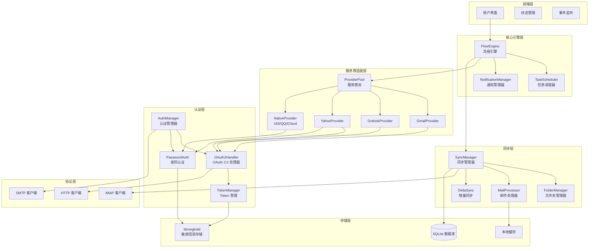
```mermaid
graph TB
    subgraph Frontend["前端层"]
        UI[用户界面]
        State[状态管理]
        Events[事件监听]
    end

    subgraph Core["核心引擎层"]
        Engine[FlowEngine<br/>流程引擎]
        Scheduler[TaskScheduler<br/>任务调度器]
        Notifier[NotificationManager<br/>通知管理器]
    end

    subgraph Providers["服务商适配层"]
        PP[ProviderPool<br/>服务商池]
        GP[GmailProvider]
        OP[OutlookProvider]
        YP[YahooProvider]
        NP[NativeProvider<br/>163/QQ/iCloud]
    end

    subgraph Auth["认证层"]
        AuthM[AuthManager<br/>认证管理器]
        OAuth[OAuth2Handler<br/>OAuth 2.0 处理器]
        Pass[PasswordAuth<br/>密码认证]
        TokenM[TokenManager<br/>Token 管理]
    end

    subgraph Sync["同步层"]
        SyncM[SyncManager<br/>同步管理器]
        FolderM[FolderManager<br/>文件夹管理器]
        MailM[MailProcessor<br/>邮件处理器]
        Delta[DeltaSync<br/>增量同步]
    end

    subgraph Storage["存储层"]
        DB[(SQLite 数据库)]
        Cache[本地缓存]
        Stronghold[Stronghold<br/>敏感信息存储]
    end

    subgraph Protocol["协议层"]
        IMAP[IMAP 客户端]
        SMTP[SMTP 客户端]
        HTTP[HTTP 客户端]
    end

    UI --> Engine
    Engine --> Scheduler
    Engine --> Notifier
    Engine --> PP
    
    PP --> GP
    PP --> OP
    PP --> YP
    PP --> NP
    
    GP --> OAuth
    OP --> OAuth
    YP --> OAuth
    YP --> Pass
    NP --> Pass
    
    OAuth --> TokenM
    AuthM --> OAuth
    AuthM --> Pass
    
    Engine --> SyncM
    SyncM --> FolderM
    SyncM --> MailM
    SyncM --> Delta
    
    SyncM --> IMAP
    AuthM --> SMTP
    OAuth --> HTTP
    
    SyncM --> DB
    MailM --> Cache
    TokenM --> Stronghold
    Pass --> Stronghold
```

### 模块职责

| 模块 | 职责 |
|------|------|
| FlowEngine | 协调各模块，管理整体流程 |
| TaskScheduler | 任务调度、定时同步、延迟重试 |
| ProviderPool | 管理服务商实例，根据邮箱类型选择适配器 |
| AuthManager | 统一认证入口，管理认证状态 |
| SyncManager | 邮件同步核心逻辑 |
| NotificationManager | 新邮件通知推送 |
| TokenManager | OAuth Token 生命周期管理 |

---

## 服务商抽象层

### 服务商接口定义

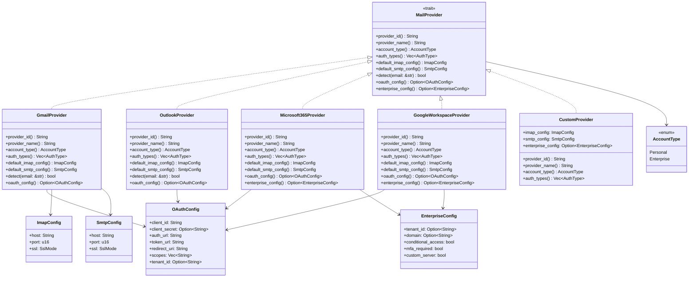
```mermaid
classDiagram
    class MailProvider {
        <<trait>>
        +provider_id() String
        +provider_name() String
        +account_type() AccountType
        +auth_types() Vec~AuthType~
        +default_imap_config() ImapConfig
        +default_smtp_config() SmtpConfig
        +detect(email: &str) bool
        +oauth_config() Option~OAuthConfig~
        +enterprise_config() Option~EnterpriseConfig~
    }

    class AccountType {
        <<enum>>
        Personal
        Enterprise
    }

    class GmailProvider {
        +provider_id() String
        +provider_name() String
        +account_type() AccountType
        +auth_types() Vec~AuthType~
        +default_imap_config() ImapConfig
        +default_smtp_config() SmtpConfig
        +detect(email: &str) bool
        +oauth_config() Option~OAuthConfig~
    }

    class OutlookProvider {
        +provider_id() String
        +provider_name() String
        +account_type() AccountType
        +auth_types() Vec~AuthType~
        +default_imap_config() ImapConfig
        +default_smtp_config() SmtpConfig
        +detect(email: &str) bool
        +oauth_config() Option~OAuthConfig~
    }

    class Microsoft365Provider {
        +provider_id() String
        +provider_name() String
        +account_type() AccountType
        +auth_types() Vec~AuthType~
        +default_imap_config() ImapConfig
        +default_smtp_config() SmtpConfig
        +oauth_config() Option~OAuthConfig~
        +enterprise_config() Option~EnterpriseConfig~
    }

    class GoogleWorkspaceProvider {
        +provider_id() String
        +provider_name() String
        +account_type() AccountType
        +auth_types() Vec~AuthType~
        +default_imap_config() ImapConfig
        +default_smtp_config() SmtpConfig
        +oauth_config() Option~OAuthConfig~
        +enterprise_config() Option~EnterpriseConfig~
    }

    class CustomProvider {
        +provider_id() String
        +provider_name() String
        +account_type() AccountType
        +auth_types() Vec~AuthType~
        +imap_config: ImapConfig
        +smtp_config: SmtpConfig
        +enterprise_config: Option~EnterpriseConfig~
    }

    class ImapConfig {
        +host: String
        +port: u16
        +ssl: SslMode
    }

    class SmtpConfig {
        +host: String
        +port: u16
        +ssl: SslMode
    }

    class OAuthConfig {
        +client_id: String
        +client_secret: Option~String~
        +auth_url: String
        +token_url: String
        +redirect_uri: String
        +scopes: Vec~String~
        +tenant_id: Option~String~
    }

    class EnterpriseConfig {
        +tenant_id: Option~String~
        +domain: Option~String~
        +conditional_access: bool
        +mfa_required: bool
        +custom_server: bool
    }

    MailProvider <|.. GmailProvider
    MailProvider <|.. OutlookProvider
    MailProvider <|.. Microsoft365Provider
    MailProvider <|.. GoogleWorkspaceProvider
    MailProvider <|.. CustomProvider
    
    GmailProvider --> OAuthConfig
    OutlookProvider --> OAuthConfig
    Microsoft365Provider --> OAuthConfig
    Microsoft365Provider --> EnterpriseConfig
    GoogleWorkspaceProvider --> OAuthConfig
    GoogleWorkspaceProvider --> EnterpriseConfig
    GmailProvider --> ImapConfig
    GmailProvider --> SmtpConfig
    MailProvider --> AccountType
```

### 服务商配置表

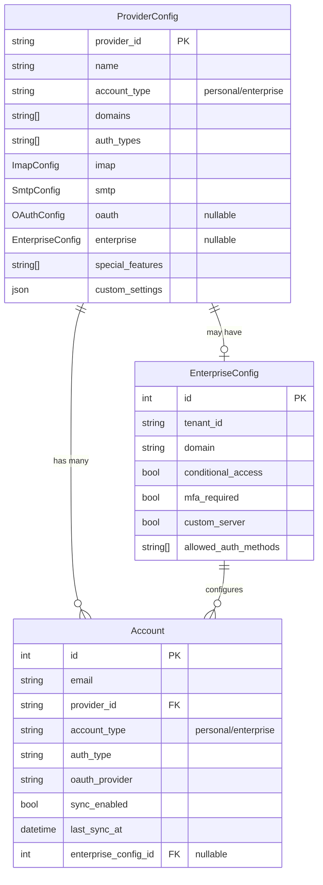
```mermaid
erDiagram
    ProviderConfig {
        string provider_id PK
        string name
        string account_type "personal/enterprise"
        string[] domains
        string[] auth_types
        ImapConfig imap
        SmtpConfig smtp
        OAuthConfig oauth "nullable"
        EnterpriseConfig enterprise "nullable"
        string[] special_features
        json custom_settings
    }

    EnterpriseConfig {
        int id PK
        string tenant_id
        string domain
        bool conditional_access
        bool mfa_required
        bool custom_server
        string[] allowed_auth_methods
    }

    Account {
        int id PK
        string email
        string provider_id FK
        string account_type "personal/enterprise"
        string auth_type
        string oauth_provider
        bool sync_enabled
        datetime last_sync_at
        int enterprise_config_id FK "nullable"
    }

    ProviderConfig ||--o{ Account : "has many"
    EnterpriseConfig ||--o{ Account : "configures"
    ProviderConfig ||--o| EnterpriseConfig : "may have"
```

---

## 认证流程

### 账号类型识别流程

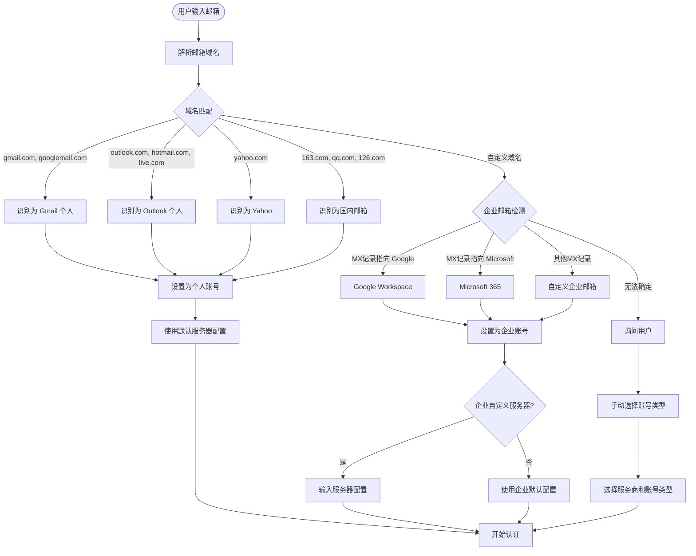
```mermaid
flowchart TB
    Start([用户输入邮箱]) --> Parse[解析邮箱域名]
    Parse --> Check{域名匹配}
    
    Check -->|"gmail.com, googlemail.com"| Gmail[识别为 Gmail 个人]
    Check -->|"outlook.com, hotmail.com, live.com"| Outlook[识别为 Outlook 个人]
    Check -->|"yahoo.com"| Yahoo[识别为 Yahoo]
    Check -->|"163.com, qq.com, 126.com"| Native[识别为国内邮箱]
    
    Check -->|"自定义域名"| EnterpriseCheck{企业邮箱检测}
    
    EnterpriseCheck -->|MX记录指向 Google| GW[Google Workspace]
    EnterpriseCheck -->|MX记录指向 Microsoft| M365[Microsoft 365]
    EnterpriseCheck -->|其他MX记录| Custom[自定义企业邮箱]
    EnterpriseCheck -->|无法确定| Ask[询问用户]
    
    Gmail --> SetPersonal[设置为个人账号]
    Outlook --> SetPersonal
    Yahoo --> SetPersonal
    Native --> SetPersonal
    
    GW --> SetEnterprise[设置为企业账号]
    M365 --> SetEnterprise
    Custom --> SetEnterprise
    Ask --> Manual[手动选择账号类型]
    
    SetPersonal --> ConfigPersonal[使用默认服务器配置]
    SetEnterprise --> CheckCustom{企业自定义服务器?}
    CheckCustom -->|是| InputServer[输入服务器配置]
    CheckCustom -->|否| ConfigEnterprise[使用企业默认配置]
    
    Manual --> SelectType[选择服务商和账号类型]
    
    ConfigPersonal --> Auth[开始认证]
    InputServer --> Auth
    ConfigEnterprise --> Auth
    SelectType --> Auth
```

### 认证方式概览

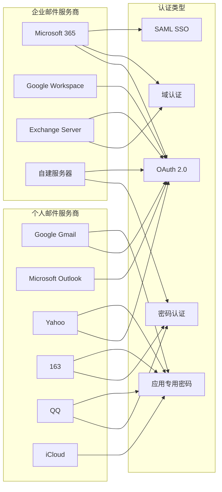
```mermaid
graph LR
    subgraph AuthTypes["认证类型"]
        Password[密码认证]
        OAuth2[OAuth 2.0]
        AppPassword[应用专用密码]
        DomainAuth[域认证]
        SAML[SAML SSO]
    end

    subgraph PersonalProviders["个人邮件服务商"]
        Google[Google Gmail]
        Microsoft[Microsoft Outlook]
        Yahoo[Yahoo]
        N163[163]
        QQ[QQ]
        iCloud[iCloud]
    end

    subgraph EnterpriseProviders["企业邮件服务商"]
        M365[Microsoft 365]
        GW[Google Workspace]
        Exchange[Exchange Server]
        Custom[自建服务器]
    end

    Google --> OAuth2
    Google --> AppPassword
    Microsoft --> OAuth2
    Yahoo --> OAuth2
    Yahoo --> AppPassword
    N163 --> Password
    N163 --> AppPassword
    QQ --> Password
    QQ --> AppPassword
    iCloud --> AppPassword
    
    M365 --> OAuth2
    M365 --> DomainAuth
    M365 --> SAML
    GW --> OAuth2
    Exchange --> DomainAuth
    Exchange --> OAuth2
    Custom --> Password
    Custom --> OAuth2
```

### 密码认证流程

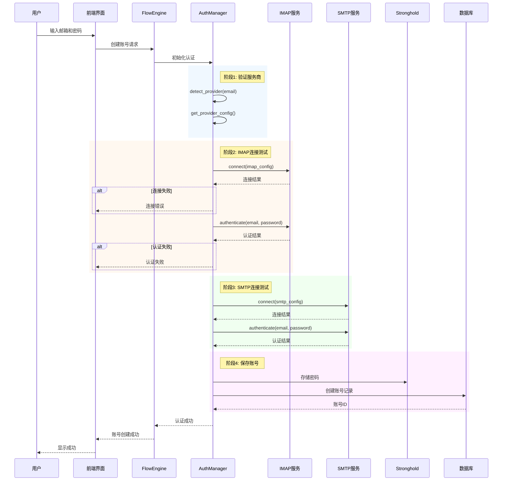
```mermaid
sequenceDiagram
    participant User as 用户
    participant UI as 前端界面
    participant Engine as FlowEngine
    participant Auth as AuthManager
    participant IMAP as IMAP服务
    participant SMTP as SMTP服务
    participant Secure as Stronghold
    participant DB as 数据库

    User->>UI: 输入邮箱和密码
    UI->>Engine: 创建账号请求
    Engine->>Auth: 初始化认证
    
    rect rgb(240, 248, 255)
        note right of Auth: 阶段1: 验证服务商
        Auth->>Auth: detect_provider(email)
        Auth->>Auth: get_provider_config()
    end
    
    rect rgb(255, 248, 240)
        note right of Auth: 阶段2: IMAP连接测试
        Auth->>IMAP: connect(imap_config)
        IMAP-->>Auth: 连接结果
        alt 连接失败
            Auth-->>UI: 连接错误
        end
        Auth->>IMAP: authenticate(email, password)
        IMAP-->>Auth: 认证结果
        alt 认证失败
            Auth-->>UI: 认证失败
        end
    end
    
    rect rgb(240, 255, 240)
        note right of Auth: 阶段3: SMTP连接测试
        Auth->>SMTP: connect(smtp_config)
        SMTP-->>Auth: 连接结果
        Auth->>SMTP: authenticate(email, password)
        SMTP-->>Auth: 认证结果
    end
    
    rect rgb(255, 240, 255)
        note right of Auth: 阶段4: 保存账号
        Auth->>Secure: 存储密码
        Auth->>DB: 创建账号记录
        DB-->>Auth: 账号ID
    end
    
    Auth-->>Engine: 认证成功
    Engine-->>UI: 账号创建成功
    UI-->>User: 显示成功
```

### OAuth 2.0 认证流程

#### 个人账号 OAuth 流程

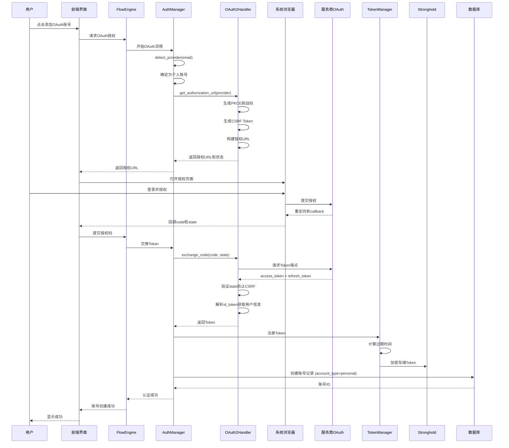
```mermaid
sequenceDiagram
    participant User as 用户
    participant UI as 前端界面
    participant Engine as FlowEngine
    participant Auth as AuthManager
    participant OAuth as OAuth2Handler
    participant Browser as 系统浏览器
    participant Provider as 服务商OAuth
    participant TokenM as TokenManager
    participant Secure as Stronghold
    participant DB as 数据库

    User->>UI: 点击添加OAuth账号
    UI->>Engine: 请求OAuth授权
    Engine->>Auth: 开始OAuth流程
    
    Auth->>Auth: detect_provider(email)
    Auth->>Auth: 确定为个人账号
    Auth->>OAuth: get_authorization_url(provider)
    
    OAuth->>OAuth: 生成PKCE挑战码
    OAuth->>OAuth: 生成CSRF Token
    OAuth->>OAuth: 构建授权URL
    
    OAuth-->>Auth: 返回授权URL和状态
    Auth-->>UI: 返回授权URL
    UI->>Browser: 打开授权页面
    
    User->>Browser: 登录并授权
    Browser->>Provider: 提交授权
    Provider-->>Browser: 重定向到callback
    Browser-->>UI: 回调code和state
    
    UI->>Engine: 提交授权码
    Engine->>Auth: 交换Token
    
    Auth->>OAuth: exchange_code(code, state)
    OAuth->>Provider: 请求Token端点
    Provider-->>OAuth: access_token + refresh_token
    
    OAuth->>OAuth: 验证state防止CSRF
    OAuth->>OAuth: 解析id_token获取用户信息
    
    OAuth-->>Auth: 返回Token
    Auth->>TokenM: 注册Token
    
    TokenM->>TokenM: 计算过期时间
    TokenM->>Secure: 加密存储Token
    
    Auth->>DB: 创建账号记录 (account_type=personal)
    DB-->>Auth: 账号ID
    
    Auth-->>Engine: 认证成功
    Engine-->>UI: 账号创建成功
    UI-->>User: 显示成功
```

#### 企业账号 OAuth 流程（Microsoft 365 示例）

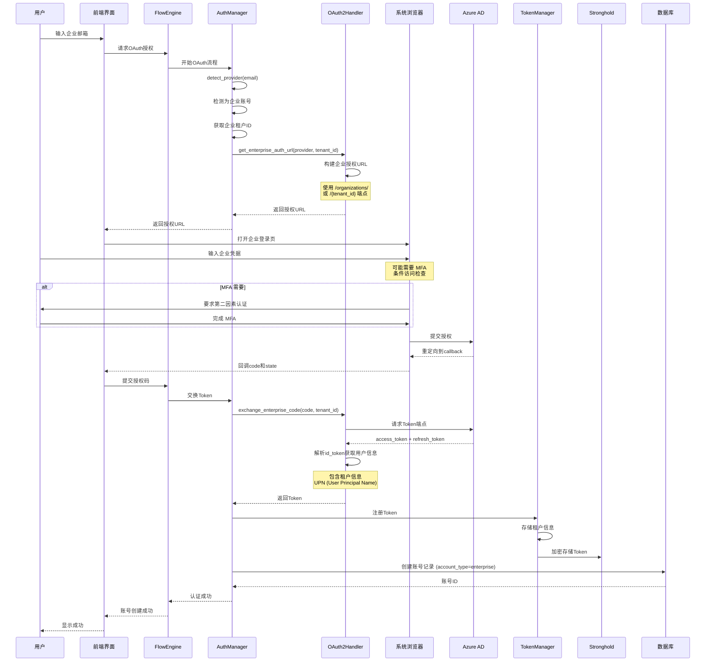
```mermaid
sequenceDiagram
    participant User as 用户
    participant UI as 前端界面
    participant Engine as FlowEngine
    participant Auth as AuthManager
    participant OAuth as OAuth2Handler
    participant Browser as 系统浏览器
    participant AzureAD as Azure AD
    participant TokenM as TokenManager
    participant Secure as Stronghold
    participant DB as 数据库

    User->>UI: 输入企业邮箱
    UI->>Engine: 请求OAuth授权
    Engine->>Auth: 开始OAuth流程
    
    Auth->>Auth: detect_provider(email)
    Auth->>Auth: 检测为企业账号
    Auth->>Auth: 获取企业租户ID
    Auth->>OAuth: get_enterprise_auth_url(provider, tenant_id)
    
    OAuth->>OAuth: 构建企业授权URL
    Note over OAuth: 使用 /organizations/<br/>或 /{tenant_id} 端点
    
    OAuth-->>Auth: 返回授权URL
    Auth-->>UI: 返回授权URL
    UI->>Browser: 打开企业登录页
    
    User->>Browser: 输入企业凭据
    Note over Browser: 可能需要 MFA<br/>条件访问检查
    
    alt MFA 需要
        Browser->>User: 要求第二因素认证
        User->>Browser: 完成 MFA
    end
    
    Browser->>AzureAD: 提交授权
    AzureAD-->>Browser: 重定向到callback
    Browser-->>UI: 回调code和state
    
    UI->>Engine: 提交授权码
    Engine->>Auth: 交换Token
    
    Auth->>OAuth: exchange_enterprise_code(code, tenant_id)
    OAuth->>AzureAD: 请求Token端点
    AzureAD-->>OAuth: access_token + refresh_token
    
    OAuth->>OAuth: 解析id_token获取用户信息
    Note over OAuth: 包含租户信息<br/>UPN (User Principal Name)
    
    OAuth-->>Auth: 返回Token
    Auth->>TokenM: 注册Token
    
    TokenM->>TokenM: 存储租户信息
    TokenM->>Secure: 加密存储Token
    
    Auth->>DB: 创建账号记录 (account_type=enterprise)
    DB-->>Auth: 账号ID
    
    Auth-->>Engine: 认证成功
    Engine-->>UI: 账号创建成功
    UI-->>User: 显示成功
```

### Token 生命周期管理

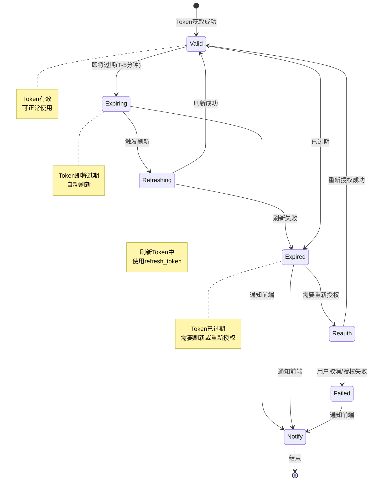
```mermaid
stateDiagram-v2
    [*] --> Valid: Token获取成功
    
    Valid --> Expiring: 即将过期(T-5分钟)
    Expiring --> Refreshing: 触发刷新
    
    Refreshing --> Valid: 刷新成功
    Refreshing --> Expired: 刷新失败
    
    Valid --> Expired: 已过期
    
    Expired --> Reauth: 需要重新授权
    Reauth --> Valid: 重新授权成功
    Reauth --> Failed: 用户取消/授权失败
    
    Expiring --> Notify: 通知前端
    Expired --> Notify: 通知前端
    Failed --> Notify: 通知前端
    
    Notify --> [*]: 结束
    
    note right of Valid
        Token有效
        可正常使用
    end note
    
    note right of Expiring
        Token即将过期
        自动刷新
    end note
    
    note right of Refreshing
        刷新Token中
        使用refresh_token
    end note
    
    note right of Expired
        Token已过期
        需要刷新或重新授权
    end note
```

## 邮件操作流设计

### 操作类型概述

邮件客户端支持多种操作类型，每种操作都有不同的同步策略和冲突处理方式：

| 操作类型 | IMAP 命令 | 本地优先 | 服务端确认 | 可离线 |
|----------|-----------|----------|------------|--------|
| 标记已读/未读 | STORE \Seen | 是 | 是 | 是 |
| 星标/取消星标 | STORE \Flagged | 是 | 是 | 是 |
| 删除（移到垃圾箱） | MOVE/STORE \Deleted | 是 | 是 | 是 |
| 永久删除 | EXPUNGE | 否 | 是 | 否 |
| 移动到文件夹 | MOVE/COPY | 是 | 是 | 是 |
| 附件下载 | FETCH BODY[] | 否 | 是 | 部分 |

### 邮件操作流程图

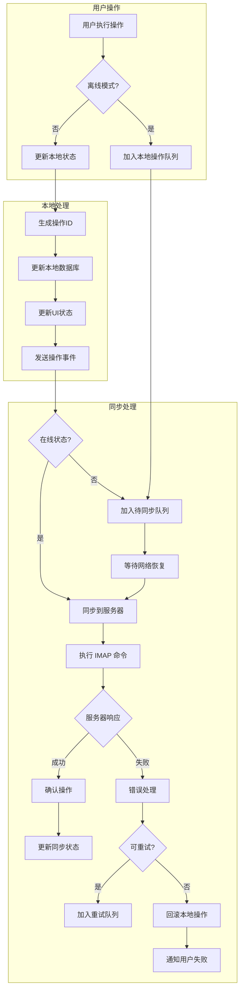
```mermaid
flowchart TB
    subgraph UserAction["用户操作"]
        Action[用户执行操作] --> CheckOffline{离线模式?}
        CheckOffline -->|是| QueueLocal[加入本地操作队列]
        CheckOffline -->|否| LocalUpdate[更新本地状态]
    end
    
    subgraph LocalProcessing["本地处理"]
        LocalUpdate --> GenOpId[生成操作ID]
        GenOpId --> UpdateDB[更新本地数据库]
        UpdateDB --> UpdateUI[更新UI状态]
        UpdateUI --> EmitEvent[发送操作事件]
    end
    
    subgraph SyncProcessing["同步处理"]
        EmitEvent --> CheckOnline{在线状态?}
        CheckOnline -->|是| SyncToServer[同步到服务器]
        CheckOnline -->|否| QueuePending[加入待同步队列]
        
        QueueLocal --> QueuePending
        QueuePending --> WaitOnline[等待网络恢复]
        WaitOnline --> SyncToServer
        
        SyncToServer --> ExecIMAP[执行 IMAP 命令]
        ExecIMAP --> ServerResponse{服务器响应}
        
        ServerResponse -->|成功| ConfirmOp[确认操作]
        ServerResponse -->|失败| HandleError[错误处理]
        
        ConfirmOp --> UpdateSynced[更新同步状态]
        HandleError --> RetryCheck{可重试?}
        RetryCheck -->|是| RetryQueue[加入重试队列]
        RetryCheck -->|否| RollbackOp[回滚本地操作]
        
        RollbackOp --> NotifyUser[通知用户失败]
    end
```

### 标志操作详细流程

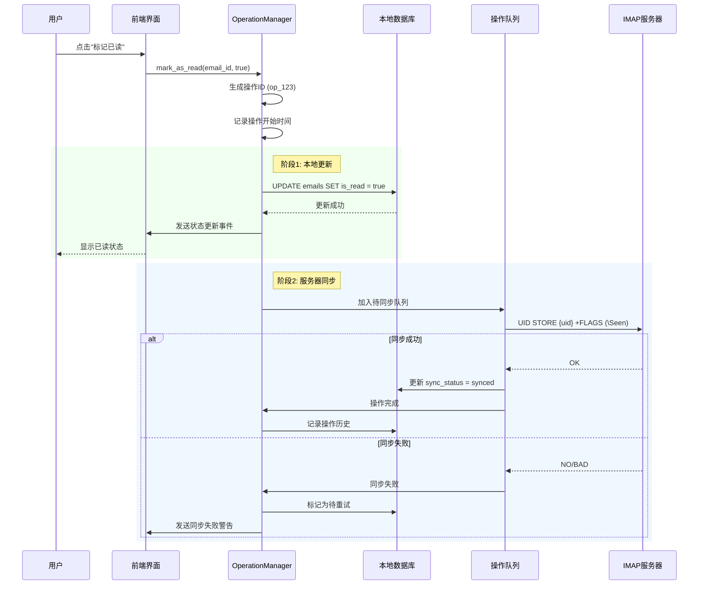
```mermaid
sequenceDiagram
    participant User as 用户
    participant UI as 前端界面
    participant Op as OperationManager
    participant DB as 本地数据库
    participant Queue as 操作队列
    participant IMAP as IMAP服务器
    
    User->>UI: 点击"标记已读"
    UI->>Op: mark_as_read(email_id, true)
    
    Op->>Op: 生成操作ID (op_123)
    Op->>Op: 记录操作开始时间
    
    rect rgb(240, 255, 240)
        note right of Op: 阶段1: 本地更新
        Op->>DB: UPDATE emails SET is_read = true
        DB-->>Op: 更新成功
        Op->>UI: 发送状态更新事件
        UI-->>User: 显示已读状态
    end
    
    rect rgb(240, 248, 255)
        note right of Op: 阶段2: 服务器同步
        Op->>Queue: 加入待同步队列
        Queue->>IMAP: UID STORE {uid} +FLAGS (\Seen)
        
        alt 同步成功
            IMAP-->>Queue: OK
            Queue->>DB: 更新 sync_status = synced
            Queue->>Op: 操作完成
            Op->>DB: 记录操作历史
        else 同步失败
            IMAP-->>Queue: NO/BAD
            Queue->>Op: 同步失败
            Op->>DB: 标记为待重试
            Op->>UI: 发送同步失败警告
        end
    end
```

### 邮件删除流程

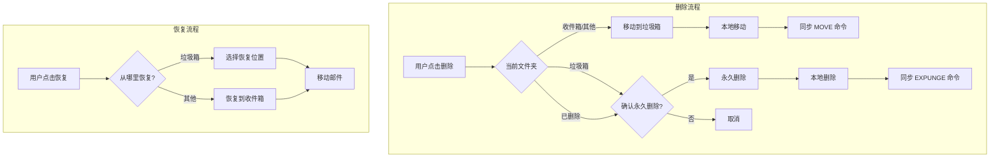
```mermaid
flowchart TB
    subgraph DeleteFlow["删除流程"]
        Delete[用户点击删除] --> CheckLocation{当前文件夹}
        
        CheckLocation -->|"收件箱/其他"| MoveTrash[移动到垃圾箱]
        CheckLocation -->|"垃圾箱"| AskPerm{确认永久删除?}
        CheckLocation -->|"已删除"| AskPerm
        
        MoveTrash --> LocalMove[本地移动]
        LocalMove --> SyncMove[同步 MOVE 命令]
        
        AskPerm -->|是| PermDelete[永久删除]
        AskPerm -->|否| Cancel[取消]
        
        PermDelete --> LocalDelete[本地删除]
        LocalDelete --> SyncExpunge[同步 EXPUNGE 命令]
    end
    
    subgraph RecoveryFlow["恢复流程"]
        Restore[用户点击恢复] --> CheckFolder{从哪里恢复?}
        CheckFolder -->|"垃圾箱"| RestoreTo[选择恢复位置]
        CheckFolder -->|"其他"| RestoreInbox[恢复到收件箱]
        
        RestoreTo --> MoveBack[移动邮件]
        RestoreInbox --> MoveBack
    end
```

### 附件下载管理

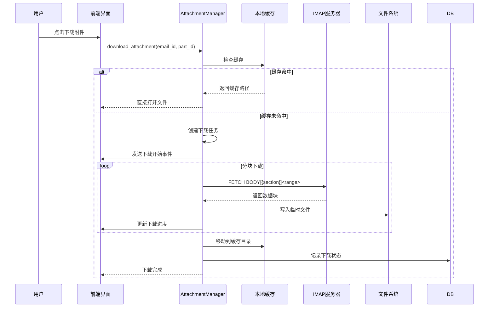
```mermaid
sequenceDiagram
    participant User as 用户
    participant UI as 前端界面
    participant Attach as AttachmentManager
    participant Cache as 本地缓存
    participant IMAP as IMAP服务器
    participant FS as 文件系统
    
    User->>UI: 点击下载附件
    UI->>Attach: download_attachment(email_id, part_id)
    
    Attach->>Cache: 检查缓存
    alt 缓存命中
        Cache-->>Attach: 返回缓存路径
        Attach-->>UI: 直接打开文件
    else 缓存未命中
        Attach->>Attach: 创建下载任务
        Attach->>UI: 发送下载开始事件
        
        loop 分块下载
            Attach->>IMAP: FETCH BODY[{section}]<range>
            IMAP-->>Attach: 返回数据块
            Attach->>FS: 写入临时文件
            Attach->>UI: 更新下载进度
        end
        
        Attach->>Cache: 移动到缓存目录
        Attach->>DB: 记录下载状态
        Attach-->>UI: 下载完成
    end
```

### 附件下载状态管理

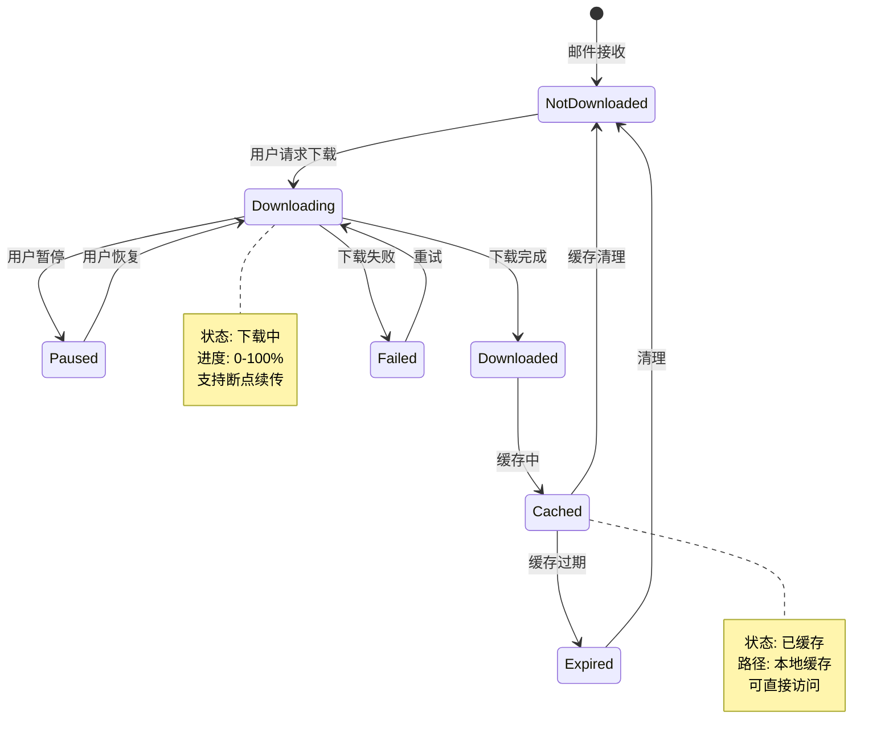
```mermaid
stateDiagram-v2
    [*] --> NotDownloaded: 邮件接收
    
    NotDownloaded --> Downloading: 用户请求下载
    Downloading --> Paused: 用户暂停
    Paused --> Downloading: 用户恢复
    
    Downloading --> Downloaded: 下载完成
    Downloaded --> Cached: 缓存中
    
    Downloading --> Failed: 下载失败
    Failed --> Downloading: 重试
    
    Cached --> NotDownloaded: 缓存清理
    Cached --> Expired: 缓存过期
    Expired --> NotDownloaded: 清理
    
    note right of Downloading
        状态: 下载中
        进度: 0-100%
        支持断点续传
    end note
    
    note right of Cached
        状态: 已缓存
        路径: 本地缓存
        可直接访问
    end note
```

---

## 多客户端同步设计

### 同步场景概述

多客户端同步需要处理以下场景：

| 场景 | 描述 | 解决策略 |
|------|------|----------|
| 本地操作同步到服务器 | 用户在客户端操作后同步 | 操作队列 + 确认机制 |
| 服务器变更同步到本地 | 其他客户端的操作 | 增量同步 + 变更检测 |
| 并发操作冲突 | 多客户端同时修改 | 最后写入胜出 + 操作日志 |
| 离线操作同步 | 离线后恢复在线 | 操作队列 + 幂等处理 |
| 部分同步失败 | 网络不稳定 | 重试 + 回滚 |

### 多客户端同步架构

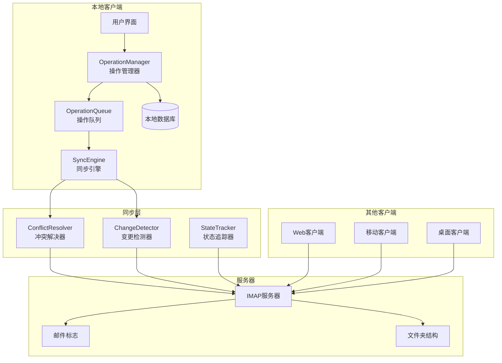
```mermaid
graph TB
    subgraph LocalClient["本地客户端"]
        UI[用户界面]
        OpManager[OperationManager<br/>操作管理器]
        OpQueue[OperationQueue<br/>操作队列]
        SyncEngine[SyncEngine<br/>同步引擎]
        LocalDB[(本地数据库)]
    end
    
    subgraph SyncLayer["同步层"]
        ConflictResolver[ConflictResolver<br/>冲突解决器]
        ChangeDetector[ChangeDetector<br/>变更检测器]
        StateTracker[StateTracker<br/>状态追踪器]
    end
    
    subgraph Server["服务器"]
        IMAP[IMAP服务器]
        Flags[邮件标志]
        Folders[文件夹结构]
    end
    
    subgraph OtherClients["其他客户端"]
        Client1[Web客户端]
        Client2[移动客户端]
        Client3[桌面客户端]
    end
    
    UI --> OpManager
    OpManager --> OpQueue
    OpManager --> LocalDB
    
    OpQueue --> SyncEngine
    SyncEngine --> ConflictResolver
    SyncEngine --> ChangeDetector
    
    ConflictResolver --> IMAP
    ChangeDetector --> IMAP
    StateTracker --> IMAP
    
    IMAP --> Flags
    IMAP --> Folders
    
    Client1 --> IMAP
    Client2 --> IMAP
    Client3 --> IMAP
```

### 操作队列设计

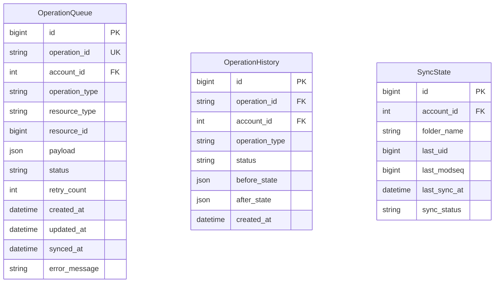
```mermaid
erDiagram
    OperationQueue {
        bigint id PK
        string operation_id UK
        int account_id FK
        string operation_type
        string resource_type
        bigint resource_id
        json payload
        string status
        int retry_count
        datetime created_at
        datetime updated_at
        datetime synced_at
        string error_message
    }
    
    OperationHistory {
        bigint id PK
        string operation_id FK
        int account_id FK
        string operation_type
        string status
        json before_state
        json after_state
        datetime created_at
    }
    
    SyncState {
        bigint id PK
        int account_id FK
        string folder_name
        bigint last_uid
        bigint last_modseq
        datetime last_sync_at
        string sync_status
    }
```

### 双向同步流程

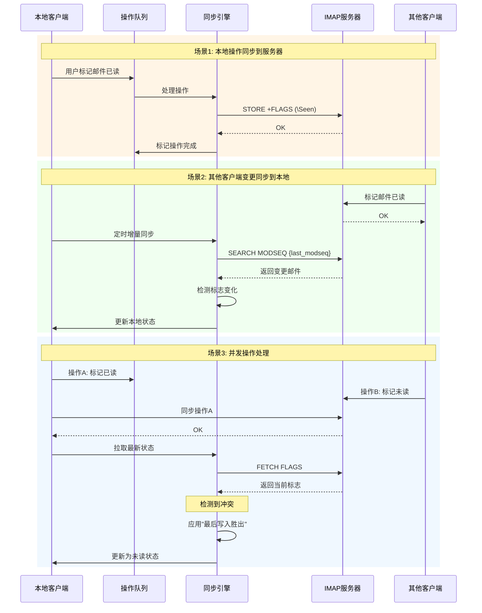
```mermaid
sequenceDiagram
    participant App as 本地客户端
    participant Queue as 操作队列
    participant Sync as 同步引擎
    participant IMAP as IMAP服务器
    participant Other as 其他客户端
    
    rect rgb(255, 245, 230)
        note over App,Other: 场景1: 本地操作同步到服务器
        App->>Queue: 用户标记邮件已读
        Queue->>Sync: 处理操作
        Sync->>IMAP: STORE +FLAGS (\Seen)
        IMAP-->>Sync: OK
        Sync->>Queue: 标记操作完成
    end
    
    rect rgb(240, 255, 240)
        note over App,Other: 场景2: 其他客户端变更同步到本地
        Other->>IMAP: 标记邮件已读
        IMAP-->>Other: OK
        
        App->>Sync: 定时增量同步
        Sync->>IMAP: SEARCH MODSEQ {last_modseq}
        IMAP-->>Sync: 返回变更邮件
        Sync->>Sync: 检测标志变化
        Sync->>App: 更新本地状态
    end
    
    rect rgb(240, 248, 255)
        note over App,Other: 场景3: 并发操作处理
        App->>Queue: 操作A: 标记已读
        Other->>IMAP: 操作B: 标记未读
        
        App->>IMAP: 同步操作A
        IMAP-->>App: OK
        App->>Sync: 拉取最新状态
        
        Sync->>IMAP: FETCH FLAGS
        IMAP-->>Sync: 返回当前标志
        Note over Sync: 检测到冲突
        Sync->>Sync: 应用"最后写入胜出"
        Sync->>App: 更新为未读状态
    end
```

### 离线操作队列

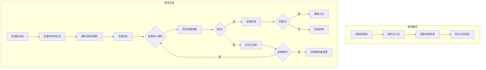
```mermaid
flowchart TB
    subgraph OfflineMode["离线模式"]
        Offline[检测到离线] --> QueueOnly[操作仅入队]
        QueueOnly --> LocalUpdate[更新本地状态]
        LocalUpdate --> MarkPending[标记为待同步]
    end
    
    subgraph OnlineRecovery["恢复在线"]
        Online[检测到在线] --> ProcessQueue[处理待同步队列]
        ProcessQueue --> SortOps[按时间排序操作]
        SortOps --> DedupOps[去重优化]
        
        DedupOps --> ProcessEach{处理每个操作}
        ProcessEach --> SyncOp[同步到服务器]
        
        SyncOp --> OpSuccess{成功?}
        OpSuccess -->|是| MarkSynced[标记已同步]
        OpSuccess -->|否| HandleFail[处理失败]
        
        HandleFail --> RetryCheck{可重试?}
        RetryCheck -->|是| Requeue[重新入队]
        RetryCheck -->|否| Rollback[回滚本地]
        
        MarkSynced --> MoreOps{还有操作?}
        MoreOps -->|是| ProcessEach
        MoreOps -->|否| PullChanges[拉取服务器变更]
    end
```

### 冲突检测与解决

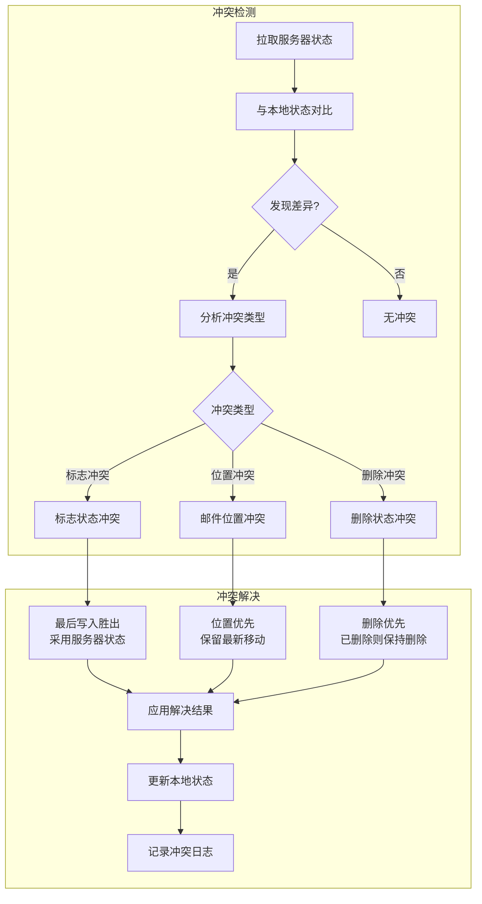
```mermaid
flowchart TB
    subgraph Detection["冲突检测"]
        Pull[拉取服务器状态] --> Compare[与本地状态对比]
        Compare --> Diff{发现差异?}
        
        Diff -->|是| Analyze[分析冲突类型]
        Diff -->|否| NoConflict[无冲突]
        
        Analyze --> TypeCheck{冲突类型}
        TypeCheck -->|标志冲突| FlagConflict[标志状态冲突]
        TypeCheck -->|位置冲突| MoveConflict[邮件位置冲突]
        TypeCheck -->|删除冲突| DeleteConflict[删除状态冲突]
    end
    
    subgraph Resolution["冲突解决"]
        FlagConflict --> FlagStrategy["最后写入胜出"<br/>采用服务器状态]
        MoveConflict --> MoveStrategy["位置优先"<br/>保留最新移动]
        DeleteConflict --> DeleteStrategy["删除优先"<br/>已删除则保持删除]
        
        FlagStrategy --> ApplyResolution
        MoveStrategy --> ApplyResolution
        DeleteStrategy --> ApplyResolution
        
        ApplyResolution[应用解决结果]
        ApplyResolution --> UpdateLocal[更新本地状态]
        UpdateLocal --> LogConflict[记录冲突日志]
    end
```

### 操作幂等性设计

为确保重试安全，所有操作需要幂等性设计：

| 操作类型 | 幂等性实现 | 操作ID生成 |
|----------|------------|------------|
| 标记已读 | `STORE` 命令本身幂等 | `{email_id}_read_{timestamp}` |
| 星标 | `STORE` 命令本身幂等 | `{email_id}_flag_{timestamp}` |
| 移动 | 检查当前位置后执行 | `{email_id}_move_{timestamp}` |
| 删除 | 检查存在性后执行 | `{email_id}_delete_{timestamp}` |

### 操作确认与回滚

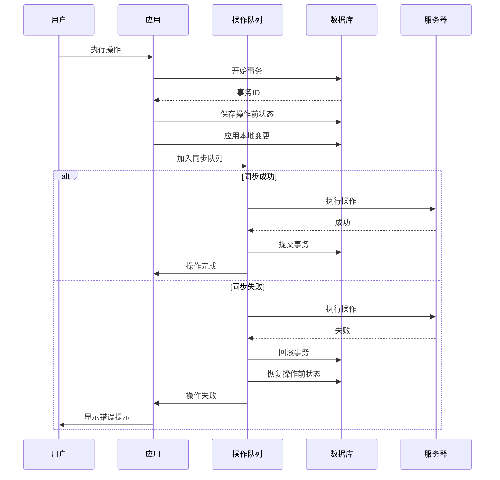
```mermaid
sequenceDiagram
    participant User as 用户
    participant App as 应用
    participant Queue as 操作队列
    participant DB as 数据库
    participant Server as 服务器
    
    User->>App: 执行操作
    App->>DB: 开始事务
    DB-->>App: 事务ID
    
    App->>DB: 保存操作前状态
    App->>DB: 应用本地变更
    App->>Queue: 加入同步队列
    
    alt 同步成功
        Queue->>Server: 执行操作
        Server-->>Queue: 成功
        Queue->>DB: 提交事务
        Queue->>App: 操作完成
    else 同步失败
        Queue->>Server: 执行操作
        Server-->>Queue: 失败
        Queue->>DB: 回滚事务
        Queue->>DB: 恢复操作前状态
        Queue->>App: 操作失败
        App->>User: 显示错误提示
    end
```

### 同步状态监控

```mermaid
stateDiagram-v2
    [*] --> Synced: 初始同步完成
    
    Synced --> LocalPending: 本地操作
    LocalPending --> Syncing: 开始同步
    Syncing --> Synced: 同步成功
    Syncing --> SyncFailed: 同步失败
    
    SyncFailed --> RetryQueue: 加入重试
    RetryQueue --> Syncing: 重试同步
    
    SyncFailed --> Conflict: 检测到冲突
    Conflict --> Resolving: 解决冲突
    Resolving --> Synced: 解决完成
    
    Synced --> ServerChanged: 服务器变更
    ServerChanged --> Pulling: 拉取变更
    Pulling --> Synced: 更新完成
    
    note right of Synced
        完全同步
        本地=服务器
    end note
    
    note right of LocalPending
        本地有未同步操作
        等待同步
    end note
    
    note right of Conflict
        检测到冲突
        需要解决
    end note
```

---

### Token 定期刷新机制

#### 刷新策略概述

Token 刷新采用**主动刷新 + 被动刷新**相结合的策略：

| 策略 | 触发条件 | 刷新时机 | 适用场景 |
|------|----------|----------|----------|
| **主动刷新** | 定时调度器 | Token过期前5分钟 | 日常维护，保持Token有效 |
| **被动刷新** | API调用失败 | Token过期或无效时 | 请求时发现Token失效 |
| **手动刷新** | 用户触发 | 用户主动请求 | Token异常时的手动恢复 |

#### 主动刷新调度流程

```mermaid
flowchart TB
    subgraph Scheduler["Token刷新调度器"]
        Start[启动调度器] --> Load[加载所有OAuth账号]
        Load --> Loop[定时循环检查]
        
        Loop --> Check{检查每个账号}
        Check --> Calc[计算剩余有效期]
        Calc --> NeedRefresh{需要刷新?<br/>剩余<5分钟}
        
        NeedRefresh -->|是| Acquire[获取刷新锁]
        NeedRefresh -->|否| Next[下一个账号]
        
        Acquire --> LockGot{获取锁成功?}
        LockGot -->|是| Refresh[执行刷新]
        LockGot -->|否| Skip[跳过(其他线程正在刷新)]
        
        Refresh --> Success{刷新成功?}
        Success -->|是| Store[存储新Token]
        Success -->|否| Record[记录失败]
        
        Store --> Update[更新过期时间]
        Update --> Next
        Record --> RetryCheck{重试次数<3?}
        RetryCheck -->|是| ScheduleRetry[安排重试]
        RetryCheck -->|否| NotifyFail[通知用户]
        ScheduleRetry --> Next
        NotifyFail --> Next
        
        Skip --> Next
        Next --> More{还有更多账号?}
        More -->|是| Check
        More -->|否| Sleep[等待下一个检查周期]
        Sleep --> Loop
    end
```

#### Token 刷新调度器架构

```mermaid
graph TB
    subgraph Core["Token刷新核心"]
        Scheduler[TokenRefreshScheduler<br/>刷新调度器]
        Queue[RefreshQueue<br/>刷新队列]
        Worker[RefreshWorker<br/>刷新工作器]
        Lock[RefreshLock<br/>分布式锁]
    end
    
    subgraph Storage["存储层"]
        TokenStore[TokenStore<br/>Token存储]
        StateStore[RefreshStateStore<br/>刷新状态存储]
        HistoryStore[RefreshHistoryStore<br/>刷新历史记录]
    end
    
    subgraph Provider["服务商层"]
        OAuth[OAuthHandler<br/>OAuth处理器]
        Provider[MailProvider<br/>服务商适配器]
    end
    
    subgraph Monitor["监控层"]
        Metrics[RefreshMetrics<br/>刷新指标]
        Alert[AlertManager<br/>告警管理]
    end
    
    Scheduler --> Queue
    Queue --> Worker
    Worker --> Lock
    Worker --> OAuth
    OAuth --> Provider
    
    Worker --> TokenStore
    Worker --> StateStore
    Worker --> HistoryStore
    
    Worker --> Metrics
    Metrics --> Alert
    
    TokenStore --> Keyring[Keyring<br/>安全存储]
```

#### 刷新详细时序图

```mermaid
sequenceDiagram
    participant Scheduler as 刷新调度器
    participant Queue as 刷新队列
    participant Worker as 刷新工作器
    participant Lock as 分布式锁
    participant OAuth as OAuthHandler
    participant Provider as 服务商API
    participant Store as Token存储
    participant Notify as 通知系统
    
    loop 每分钟检查
        Scheduler->>Queue: 扫描需要刷新的账号
        Queue->>Queue: 过滤条件:<br/>expires_at - now < 5分钟
    end
    
    Queue-->>Worker: 返回待刷新账号列表
    
    loop 处理每个账号
        Worker->>Lock: 尝试获取锁 (account_id)
        alt 获取锁成功
            Lock-->>Worker: 锁获取成功
            
            Worker->>Store: 获取当前Token
            Store-->>Worker: 返回Token信息
            
            Worker->>OAuth: refresh_token(provider, token)
            OAuth->>Provider: POST /oauth2/v2.0/token
            
            alt 刷新成功
                Provider-->>OAuth: 新Token
                OAuth-->>Worker: 新Token信息
                
                Worker->>Store: 存储新Token
                Worker->>Lock: 释放锁
                
                Worker->>Notify: 发送刷新成功事件
            else 刷新失败
                Provider-->>OAuth: 错误响应
                OAuth-->>Worker: 刷新失败
                
                alt 可重试错误
                    Worker->>Worker: 记录重试次数
                    Worker->>Queue: 重新加入队列
                    Worker->>Lock: 释放锁
                else 不可恢复错误
                    Worker->>Notify: 发送需要重新授权通知
                    Worker->>Lock: 释放锁
                end
            end
        else 获取锁失败
            Lock-->>Worker: 锁被占用
            Note over Worker: 跳过，其他实例正在刷新
        end
    end
```

#### 刷新状态机

```mermaid
stateDiagram-v2
    [*] --> Idle: 账号创建
    
    Idle --> Scheduled: 加入刷新队列
    Scheduled --> Refreshing: 开始刷新
    
    Refreshing --> Success: 刷新成功
    Refreshing --> RetryableError: 可重试错误
    Refreshing --> FatalError: 致命错误
    
    RetryableError --> Scheduled: 安排重试
    RetryableError --> Failed: 重试次数耗尽
    
    FatalError --> NeedReauth: 需要重新授权
    Failed --> NeedReauth: 用户干预
    
    Success --> Idle: 更新完成
    
    NeedReauth --> Idle: 用户重新授权
    NeedReauth --> Disabled: 用户取消
    
    Disabled --> Idle: 用户重新启用
    
    note right of Idle
        正常状态
        Token有效
    end note
    
    note right of Scheduled
        已安排刷新
        等待执行
    end note
    
    note right of Refreshing
        刷新进行中
        防止并发
    end note
    
    note right of NeedReauth
        需要用户重新授权
        Token无法刷新
    end note
```

#### 刷新配置参数

```rust
/// Token刷新配置
#[derive(Debug, Clone)]
pub struct TokenRefreshConfig {
    /// 刷新检查间隔（秒）
    pub check_interval_secs: u64,
    /// 提前刷新时间（秒），Token过期前多久开始刷新
    pub refresh_before_expiry_secs: u64,
    /// 最大重试次数
    pub max_retry_count: u32,
    /// 重试间隔基数（秒），实际间隔 = base * 2^retry_count
    pub retry_interval_base_secs: u64,
    /// 最大重试间隔（秒）
    pub max_retry_interval_secs: u64,
    /// 并发刷新最大数量
    pub max_concurrent_refreshes: usize,
    /// 刷新超时时间（秒）
    pub refresh_timeout_secs: u64,
}

impl Default for TokenRefreshConfig {
    fn default() -> Self {
        Self {
            check_interval_secs: 60,           // 每分钟检查一次
            refresh_before_expiry_secs: 300,   // 过期前5分钟刷新
            max_retry_count: 3,                // 最多重试3次
            retry_interval_base_secs: 30,      // 重试间隔基数30秒
            max_retry_interval_secs: 300,      // 最大重试间隔5分钟
            max_concurrent_refreshes: 5,       // 最多同时刷新5个账号
            refresh_timeout_secs: 30,          // 刷新超时30秒
        }
    }
}
```

#### 刷新错误分类与处理

| 错误类型 | 错误码 | 处理策略 | 用户通知 |
|----------|--------|----------|----------|
| 网络超时 | `NETWORK_TIMEOUT` | 指数退避重试 | 无 |
| 服务暂时不可用 | `SERVICE_UNAVAILABLE` | 指数退避重试 | 无 |
| Rate Limit | `RATE_LIMITED` | 等待后重试 | 无 |
| Refresh Token 过期 | `INVALID_GRANT` | 需要重新授权 | 是，高优先级 |
| Token 已撤销 | `TOKEN_REVOKED` | 需要重新授权 | 是，高优先级 |
| 账号被禁用 | `ACCOUNT_DISABLED` | 停止刷新，标记账号 | 是，高优先级 |
| 权限不足 | `INSUFFICIENT_SCOPE` | 需要重新授权 | 是 |

#### 刷新历史记录

```mermaid
erDiagram
    RefreshHistory {
        bigint id PK
        int account_id FK
        string provider_id
        string status "success/failed"
        string error_code
        string error_message
        datetime started_at
        datetime completed_at
        int duration_ms
        int retry_count
        string old_token_hash
        string new_token_hash
        int old_expires_at
        int new_expires_at
    }
    
    RefreshMetrics {
        bigint id PK
        date date
        int total_refreshes
        int successful_refreshes
        int failed_refreshes
        int avg_duration_ms
        int max_duration_ms
    }
    
    Account ||--o{ RefreshHistory : has
```

---

## 首次同步流程

### 完整流程图

```mermaid
flowchart TB
    Start([账号添加成功]) --> Init[初始化同步上下文]
    Init --> Connect{连接IMAP}
    
    Connect -->|成功| Auth{认证}
    Connect -->|失败| RetryConn{重试?}
    RetryConn -->|是| Connect
    RetryConn -->|否| Error1[记录错误]
    
    Auth -->|成功| CheckFirst{首次同步?}
    Auth -->|失败| Error2[认证错误]
    
    CheckFirst -->|是| FirstSync[首次全量同步]
    CheckFirst -->|否| IncSync[增量同步]
    
    subgraph FirstSyncFlow["首次同步流程"]
        FirstSync --> ListFolders[获取文件夹列表]
        ListFolders --> MapFolders[文件夹映射匹配]
        MapFolders --> CreateMissing[创建缺失文件夹记录]
        CreateMissing --> SyncFolder1{同步收件箱}
        
        SyncFolder1 --> FetchHeaders1[获取邮件头]
        FetchHeaders1 --> FetchBodies1[获取邮件正文]
        FetchBodies1 --> ProcessAttach1[处理附件]
        ProcessAttach1 --> SaveToDB1[保存到数据库]
        SaveToDB1 --> NextFolder1{更多文件夹?}
        
        NextFolder1 -->|是| SyncFolder1
        NextFolder1 -->|否| SaveState[保存同步状态]
    end
    
    subgraph IncSyncFlow["增量同步流程"]
        IncSync --> LoadState[加载上次状态]
        LoadState --> GetChanges[获取变更]
        GetChanges --> ProcessChanges[处理变更]
        ProcessChanges --> UpdateState[更新状态]
    end
    
    SaveState --> Notify[发送通知]
    UpdateState --> Notify
    Error1 --> Notify
    Error2 --> Notify
    
    Notify --> End([同步完成])
```

### 首次同步详细时序图

```mermaid
sequenceDiagram
    participant Engine as FlowEngine
    participant Sync as SyncManager
    participant IMAP as IMAP服务
    participant Folder as FolderManager
    participant Mail as MailProcessor
    participant DB as 数据库
    participant Notify as 通知系统

    Engine->>Sync: start_first_sync(account_id)
    
    rect rgb(230, 240, 255)
        note right of Sync: 阶段1: 连接与认证
        Sync->>IMAP: connect()
        IMAP-->>Sync: 连接成功
        Sync->>IMAP: authenticate()
        IMAP-->>Sync: 认证成功
    end
    
    rect rgb(255, 245, 230)
        note right of Sync: 阶段2: 文件夹发现
        Sync->>IMAP: list_folders()
        IMAP-->>Sync: 文件夹列表
        
        loop 每个文件夹
            Sync->>Folder: match_folder(folder)
            Folder->>Folder: 应用匹配规则
            Folder-->>Sync: 文件夹类型
        end
        
        Sync->>DB: 保存文件夹映射
    end
    
    rect rgb(240, 255, 240)
        note right of Sync: 阶段3: 邮件同步
        
        Sync->>Sync: emit_progress(SyncingFolders)
        
        loop 每个文件夹(按优先级)
            Sync->>Sync: emit_progress(SyncingEmails, folder)
            Sync->>IMAP: select_folder(folder)
            Sync->>IMAP: search_all()
            IMAP-->>Sync: UID列表
            
            loop 批量获取邮件(每批100封)
                Sync->>IMAP: fetch_headers(uids)
                IMAP-->>Sync: 邮件头列表
                
                Sync->>Mail: process_headers()
                Mail->>DB: 批量插入邮件头
                
                opt 需要完整内容
                    Sync->>IMAP: fetch_body(uid)
                    IMAP-->>Sync: 邮件正文
                    Sync->>Mail: process_body()
                    Mail->>DB: 更新邮件内容
                end
                
                Sync->>Sync: emit_progress(current, total)
            end
        end
    end
    
    rect rgb(255, 240, 245)
        note right of Sync: 阶段4: 完成清理
        Sync->>DB: 保存同步状态
        Sync->>DB: 更新last_sync_at
        Sync->>Notify: 发送同步完成通知
    end
    
    Sync-->>Engine: SyncResult
```

### 首次同步策略

```mermaid
graph TB
    subgraph Strategy["同步策略"]
        FullSync[全量同步]
        PrioritySync[优先级同步]
        IncrementalSync[增量同步]
    end
    
    subgraph Priority["优先级顺序"]
        P1[收件箱 INBOX<br/>最新1000封]
        P2[已发送 Sent<br/>最新500封]
        P3[重要标记 Starred<br/>全部]
        P4[草稿 Drafts<br/>全部]
        P5[其他文件夹<br/>最新200封]
        P6[垃圾邮件 Spam<br/>跳过]
        P7[已删除 Trash<br/>跳过]
    end
    
    subgraph Batch["批处理策略"]
        B1[批量获取UID]
        B2[批量获取头信息<br/>每批100封]
        B3[并发获取正文<br/>并发数=5]
        B4[批量写入数据库]
    end
    
    FullSync --> Priority
    Priority --> P1
    P1 --> P2
    P2 --> P3
    P3 --> P4
    P4 --> P5
    P5 --> P6
    P6 --> P7
    
    PrioritySync --> Batch
    Batch --> B1
    B1 --> B2
    B2 --> B3
    B3 --> B4
```

---

## 文件夹匹配与同步

### 文件夹匹配规则

```mermaid
flowchart TB
    subgraph Input["输入"]
        FolderName[文件夹名称]
        FolderAttr[文件夹属性<br/>flags/special_use]
    end
    
    subgraph Rules["匹配规则"]
        R1[规则1: Special-Use属性匹配]
        R2[规则2: 标准名称匹配]
        R3[规则3: 多语言名称匹配]
        R4[规则4: 别名匹配]
    end
    
    subgraph Types["文件夹类型"]
        Inbox[收件箱 INBOX]
        Sent[已发送 Sent]
        Drafts[草稿 Drafts]
        Spam[垃圾邮件 Spam]
        Trash[已删除 Trash]
        Archive[归档 Archive]
        Starred[星标 Starred]
        Custom[自定义 Custom]
    end
    
    Input --> Rules
    
    R1 -->|\\All| Archive
    R1 -->|\\Drafts| Drafts
    R1 -->|\\Sent| Sent
    R1 -->|\\Spam| Spam
    R1 -->|\\Trash| Trash
    
    R2 -->|"INBOX"| Inbox
    R2 -->|"Sent"| Sent
    R2 -->|"Drafts"| Drafts
    
    R3 -->|"已发送"| Sent
    R3 -->|"草稿箱"| Drafts
    R3 -->|"垃圾邮件"| Spam
    R3 -->|"已删除"| Trash
    
    R4 -->|"Sent Items"| Sent
    R4 -->|"Deleted Messages"| Trash
    
    Rules -->|匹配失败| Custom
```

### 文件夹匹配映射表

| 文件夹类型 | Special-Use | 标准名称 | 常见别名 | 中文名称 |
|-----------|-------------|----------|----------|----------|
| INBOX | \Inbox | INBOX | Inbox | 收件箱 |
| Sent | \Sent | Sent, Sent Messages | Sent Items | 已发送, 发件箱 |
| Drafts | \Drafts | Drafts, Draft | Draft Messages | 草稿箱, 草稿 |
| Spam | \Junk | Spam, Junk | Junk Mail, Bulk Mail | 垃圾邮件, 垃圾箱 |
| Trash | \Trash | Trash, Deleted | Deleted Messages, Bin | 已删除, 回收站 |
| Archive | \Archive | Archive | All Mail, Archives | 归档, 所有邮件 |
| Starred | - | Starred, Flagged | Important, Starred | 星标, 重要 |

### 文件夹同步状态机

```mermaid
stateDiagram-v2
    [*] --> Pending: 创建文件夹记录
    
    Pending --> Syncing: 开始同步
    Syncing --> Synced: 同步完成
    Syncing --> Error: 同步失败
    Syncing --> Paused: 用户暂停
    
    Error --> Syncing: 重试
    Error --> Disabled: 禁用同步
    Paused --> Syncing: 恢复同步
    
    Synced --> Syncing: 触发增量同步
    Synced --> Syncing: 手动刷新
    
    Disabled --> Pending: 重新启用
    
    Synced --> [*]: 删除账号
    
    note right of Syncing
        同步进行中
        显示进度
    end note
    
    note right of Synced
        同步完成
        等待增量更新
    end note
    
    note right of Error
        同步错误
        记录错误信息
    end note
```

---

## 增量同步机制

### 增量同步策略

```mermaid
flowchart TB
    subgraph Triggers["触发条件"]
        T1[定时触发<br/>每N分钟]
        T2[推送通知<br/>新邮件到达]
        T3[用户手动刷新]
        T4[应用启动]
    end
    
    subgraph SyncMethod["同步方法选择"]
        Check{服务商支持<br/>CONDSTORE?}
        Condstroe[CONDSTORE<br/>MODSEQ增量]
        UidSearch[UID SEARCH<br/>新邮件检测]
        FullCompare[全量对比<br/>最后手段]
    end
    
    subgraph Process["处理流程"]
        GetState[获取上次同步状态]
        FetchChanges[获取变更]
        ProcessNew[处理新邮件]
        ProcessUpdate[处理更新邮件]
        ProcessDelete[处理删除邮件]
        SaveState[保存新状态]
    end
    
    T1 --> Check
    T2 --> Check
    T3 --> Check
    T4 --> Check
    
    Check -->|是| Condstroe
    Check -->|否| UidSearch
    
    Condstroe --> GetState
    UidSearch --> GetState
    FullCompare --> GetState
    
    GetState --> FetchChanges
    FetchChanges --> ProcessNew
    ProcessNew --> ProcessUpdate
    ProcessUpdate --> ProcessDelete
    ProcessDelete --> SaveState
```

### CONDSTORE 增量同步

```mermaid
sequenceDiagram
    participant Sync as SyncManager
    participant State as SyncState
    participant IMAP as IMAP服务
    participant DB as 数据库

    Sync->>State: load_last_modseq(folder)
    State-->>Sync: last_modseq
    
    Sync->>IMAP: SELECT folder (CONDSTORE)
    IMAP-->>Sync: OK [HIGHESTMODSEQ 12345]
    
    Sync->>IMAP: SEARCH MODSEQ 10000
    Note over IMAP: 返回自上次同步后<br/>有变化的邮件UID
    
    IMAP-->>Sync: UID列表 [101, 102, 103]
    
    alt 有新邮件
        Sync->>IMAP: FETCH (UID 101,102,103) (FLAGS MODSEQ)
        IMAP-->>Sync: 邮件标志和MODSEQ
        
        loop 每封变更的邮件
            Sync->>IMAP: FETCH UID (BODY.PEEK[])
            IMAP-->>Sync: 邮件内容
            Sync->>DB: 更新/插入邮件
        end
    end
    
    Sync->>IMAP: FETCH 1:* (MODSEQ)
    Note over IMAP: 检查是否有邮件被删除<br/>MODSEQ增加但UID不存在
    IMAP-->>Sync: 当前存在的邮件列表
    
    Sync->>DB: 标记已删除的邮件
    Sync->>State: save_modseq(folder, 12345)
```

### 同步状态记录

```mermaid
erDiagram
    SyncState {
        bigint id PK
        int account_id FK
        string folder_name
        bigint last_uidvalidity
        bigint last_uid
        bigint last_modseq
        datetime last_sync_at
        string sync_status
        string last_error
        int retry_count
    }
    
    SyncError {
        bigint id PK
        int account_id FK
        string folder_name
        bigint message_uid
        string error_type
        string error_message
        datetime occurred_at
        int retry_count
        string stack_trace
    }
    
    Account ||--o{ SyncState : has
    Account ||--o{ SyncError : has
```

### 推送通知集成

```mermaid
sequenceDiagram
    participant Provider as 邮件服务商
    participant Push as 推送服务
    participant App as 客户端
    participant Sync as SyncManager

    Note over Provider,App: Gmail IMAP IDLE
    App->>Provider: IDLE命令
    Provider-->>App: 保持连接
    
    loop 等待新邮件
        Provider-->>App: EXISTS通知
        App->>Sync: 触发同步
        Sync->>Provider: FETCH新邮件
    end
    
    Note over Provider,App: Outlook 推送通知
    App->>Push: 订阅推送通知
    Push->>Provider: 注册Webhook
    
    loop 新邮件到达
        Provider->>Push: 发送通知
        Push->>App: 推送通知
        App->>Sync: 触发同步
    end
```

---

## 新邮件通知机制

### 通知系统架构

```mermaid
graph TB
    subgraph Detection["邮件检测"]
        IMAPIDLE[IMAP IDLE<br/>Gmail/支持的服务商]
        PushNotif[推送通知<br/>Outlook]
        Polling[轮询检测<br/>163/QQ/其他]
    end
    
    subgraph Engine["通知引擎"]
        NotifMgr[NotificationManager]
        Dedup[去重处理器]
        Filter[过滤器]
        Priority[优先级排序]
        Batch[批量处理]
    end
    
    subgraph Rules["通知规则"]
        RuleEngine[规则引擎]
        SenderRule[发件人规则]
        SubjectRule[主题规则]
        FolderRule[文件夹规则]
        TimeRule[时间规则]
    end
    
    subgraph Output["通知输出"]
        Desktop[桌面通知]
        Sound[声音提醒]
        Badge[角标数字]
        Tray[托盘图标]
        InApp[应用内通知]
    end
    
    Detection --> NotifMgr
    NotifMgr --> Dedup
    Dedup --> Filter
    Filter --> Priority
    Priority --> Batch
    
    Batch --> RuleEngine
    RuleEngine --> SenderRule
    RuleEngine --> SubjectRule
    RuleEngine --> FolderRule
    RuleEngine --> TimeRule
    
    RuleEngine --> Output
    Output --> Desktop
    Output --> Sound
    Output --> Badge
    Output --> Tray
    Output --> InApp
```

### IMAP IDLE 实时监听

```mermaid
sequenceDiagram
    participant App as 客户端
    participant IMAP as IMAP服务器
    participant Notify as 通知系统

    App->>IMAP: SELECT INBOX
    IMAP-->>App: OK
    
    App->>IMAP: IDLE
    Note over App,IMAP: 进入IDLE模式<br/>保持连接
    
    loop 等待服务器推送
        IMAP-->>App: * 12 EXISTS
        Note over App: 检测到新邮件
        
        App->>App: 退出IDLE
        App->>IMAP: DONE
        
        App->>IMAP: FETCH 12 (BODY.PEEK[HEADER])
        IMAP-->>App: 邮件头信息
        
        App->>Notify: 发送新邮件通知
        Notify-->>App: 通知已发送
        
        App->>IMAP: IDLE
        Note over App,IMAP: 重新进入IDLE
    end
    
    Note over App,IMAP: 连接超时处理
    App->>IMAP: DONE
    App->>IMAP: NOOP
    App->>IMAP: IDLE
```

### 通知去重与合并

```mermaid
flowchart TB
    NewMail[新邮件到达] --> Check{5秒内<br/>有其他新邮件?}
    
    Check -->|是| Merge[合并通知]
    Check -->|否| Single[单独通知]
    
    Merge --> Wait[等待合并窗口]
    Wait --> Count{邮件数量}
    
    Count -->|1封| Show1[显示: 您有1封新邮件]
    Count -->|2-5封| ShowMulti[显示: 您有N封新邮件<br/>来自: 发件人列表]
    Count -->|>5封| ShowSummary[显示: 您有N封新邮件<br/>点击查看详情]
    
    Single --> CheckDup{是否已通知?}
    CheckDup -->|是| Drop[丢弃重复]
    CheckDup -->|否| Show1
    
    Show1 --> Emit[发送通知]
    ShowMulti --> Emit
    ShowSummary --> Emit
```

---

## 错误处理与重试策略

### 错误类型定义

```mermaid
classDiagram
    class MailError {
        <<enum>>
        +Connection(ConnectionError)
        +Authentication(AuthError)
        +Sync(SyncError)
        +OAuth(OAuthError)
        +Network(NetworkError)
        +Storage(StorageError)
        +RateLimit(RateLimitError)
    }
    
    class ConnectionError {
        <<enum>>
        Timeout
        SslError
        HostUnreachable
        ConnectionRefused
        DnsFailed
    }
    
    class AuthError {
        <<enum>>
        InvalidCredentials
        AccountLocked
        AppPasswordRequired
        TwoFactorRequired
        OAuthExpired
        OAuthRevoked
    }
    
    class SyncError {
        <<enum>>
        FolderNotFound
        MessageCorrupted
        UidInvalid
        QuotaExceeded
        PartialFailure
    }
    
    class OAuthError {
        <<enum>>
        TokenExpired
        RefreshFailed
        InvalidGrant
        AccessDenied
        NetworkError
    }
    
    MailError --> ConnectionError
    MailError --> AuthError
    MailError --> SyncError
    MailError --> OAuthError
```

### 重试策略

```mermaid
flowchart TB
    Error[发生错误] --> Type{错误类型}
    
    Type -->|网络错误| NetRetry[网络重试策略]
    Type -->|认证错误| AuthRetry[认证重试策略]
    Type -->|OAuth错误| OAuthRetry[OAuth重试策略]
    Type -->|同步错误| SyncRetry[同步重试策略]
    Type -->|限流错误| RateRetry[限流重试策略]
    
    subgraph NetRetry["网络重试 (指数退避)"]
        N1[重试1: 1秒后]
        N2[重试2: 2秒后]
        N3[重试3: 4秒后]
        N4[重试4: 8秒后]
        N5[重试5: 16秒后]
        NFail[超过5次: 标记失败]
    end
    
    subgraph AuthRetry["认证重试"]
        A1[检查密码]
        A2[重新输入]
        A3[OAuth重新授权]
    end
    
    subgraph OAuthRetry["OAuth重试"]
        O1[尝试刷新Token]
        O2{刷新成功?}
        O3[继续操作]
        O4[重新授权]
    end
    
    subgraph SyncRetry["同步重试"]
        S1[跳过当前邮件]
        S2[记录错误]
        S3[继续同步]
        S4[稍后重试失败邮件]
    end
    
    subgraph RateRetry["限流重试"]
        R1[读取Retry-After]
        R2[等待指定时间]
        R3[指数退避]
    end
```

### 错误恢复流程

```mermaid
stateDiagram-v2
    [*] --> Normal: 正常运行
    
    Normal --> Warning: 1次失败
    Warning --> Normal: 成功
    Warning --> Degraded: 连续3次失败
    
    Degraded --> Warning: 成功
    Degraded --> Error: 连续5次失败
    
    Error --> Degraded: 成功
    Error --> Critical: 连续10次失败或认证失败
    
    Critical --> Reauth: OAuth需要重新授权
    Critical --> Manual: 需要用户干预
    
    Reauth --> Normal: 重新授权成功
    Manual --> Normal: 用户修复问题
    
    note right of Normal
        一切正常
        定时同步运行
    end note
    
    note right of Warning
        单次失败
        自动重试中
    end note
    
    note right of Degraded
        连续失败
        增加重试间隔
        限制后台同步
    end note
    
    note right of Error
        严重错误
        停止自动同步
        通知用户
    end note
    
    note right of Critical
        需要用户干预
        账号可能被锁定
        或OAuth过期
    end note
```

---

## 邮件搜索功能设计

### 搜索类型概述

邮件搜索支持多种搜索类型，满足不同场景的需求：

| 搜索类型 | 描述 | 实现方式 | 性能 |
|----------|------|----------|------|
| **全文搜索** | 搜索邮件正文和主题 | FTS5 全文索引 | 快 |
| **字段搜索** | 搜索特定字段 | SQL LIKE / 索引查询 | 中 |
| **日期搜索** | 按日期范围筛选 | 索引查询 | 快 |
| **附件搜索** | 搜索附件文件名 | 元数据索引 | 快 |
| **标志搜索** | 按已读/星标筛选 | 数据库查询 | 快 |
| **服务端搜索** | IMAP SEARCH 命令 | 实时查询 | 慢 |

### 搜索架构设计

```mermaid
graph TB
    subgraph UserInput["用户输入"]
        Query[搜索关键词]
        Filters[筛选条件]
    end
    
    subgraph SearchEngine["搜索引擎"]
        Parser[QueryParser<br/>查询解析器]
        Optimizer[QueryOptimizer<br/>查询优化器]
        Executor[QueryExecutor<br/>查询执行器]
    end
    
    subgraph IndexLayer["索引层"]
        FTSIndex[FTS5 全文索引]
        MetaIndex[元数据索引]
        Cache[搜索缓存]
    end
    
    subgraph DataLayer["数据层"]
        LocalDB[(本地数据库)]
        IMAP[IMAP 服务端]
    end
    
    subgraph Results["结果处理"]
        Ranker[结果排序]
        Pager[分页器]
        Highlighter[高亮器]
    end
    
    Query --> Parser
    Filters --> Parser
    Parser --> Optimizer
    Optimizer --> Executor
    
    Executor --> FTSIndex
    Executor --> MetaIndex
    Executor --> Cache
    
    FTSIndex --> LocalDB
    MetaIndex --> LocalDB
    Cache --> LocalDB
    
    Executor -->|服务端搜索| IMAP
    
    Executor --> Ranker
    Ranker --> Pager
    Pager --> Highlighter
```

### 搜索流程详细时序图

```mermaid
sequenceDiagram
    participant User as 用户
    participant UI as 前端界面
    participant Search as SearchService
    participant Parser as QueryParser
    participant Index as FTSIndex
    participant Cache as 搜索缓存
    participant DB as 数据库
    participant IMAP as IMAP服务器
    
    User->>UI: 输入搜索关键词
    UI->>Search: search(query, filters)
    
    Search->>Parser: 解析查询
    Parser-->>Search: 解析结果
    
    alt 缓存命中
        Search->>Cache: 检查缓存
        Cache-->>Search: 返回缓存结果
        Search-->>UI: 返回搜索结果
    else 缓存未命中
        Search->>Index: 执行全文搜索
        
        Index->>DB: FTS5 查询
        DB-->>Index: 匹配的邮件ID
        
        Index-->>Search: 搜索结果
        
        Search->>Search: 应用筛选条件
        Search->>Search: 排序和分页
        
        Search->>Cache: 缓存结果
        
        Search-->>UI: 返回搜索结果
        UI-->>User: 显示结果列表
    end
```

### 全文索引设计

```mermaid
erDiagram
    emails_fts {
        int rowid PK
        int email_id FK
        string subject
        string sender
        string recipients
        string body_text
        string attachment_names
    }
    
    search_index {
        int id PK
        int email_id FK
        string token
        int position
        string field
    }
    
    search_history {
        int id PK
        string query
        int result_count
        datetime searched_at
        string account_filter
    }
    
    emails ||--o{ emails_fts : indexed
    emails ||--o{ search_index : tokens
```

### 搜索索引构建流程

```mermaid
flowchart TB
    subgraph IndexBuild["索引构建"]
        NewEmail[新邮件到达] --> Extract[提取文本内容]
        Extract --> Tokenize[分词处理]
        Tokenize --> BuildFTS[构建FTS索引]
        BuildFTS --> StoreIndex[存储索引]
    end
    
    subgraph IncrementalUpdate["增量更新"]
        EmailUpdate[邮件更新] --> DetectChange[检测变更]
        DetectChange --> UpdateIndex[更新索引]
        UpdateIndex --> CleanOld[清理旧索引]
    end
    
    subgraph BackgroundJobs["后台任务"]
        Schedule[定时任务] --> RebuildIndex[重建索引]
        Schedule --> CleanIndex[清理过期索引]
        Schedule --> OptimizeIndex[优化索引]
    end
```

### 搜索查询语法

```
搜索语法示例：

# 基本搜索
keyword                    # 搜索所有字段

# 字段搜索
from:john@example.com      # 发件人
to:mary@example.com        # 收件人
subject:project            # 主题
has:attachment             # 有附件
is:read                    # 已读
is:unread                  # 未读
is:starred                 # 星标

# 日期搜索
after:2024-01-01           # 日期之后
before:2024-12-31          # 日期之前

# 组合搜索
from:john subject:project  # AND 组合
from:john OR from:mary     # OR 组合
-project                   # 排除关键词
```

### 混合搜索策略

```mermaid
flowchart TB
    Query[搜索请求] --> CheckScope{搜索范围}
    
    CheckScope -->|本地| LocalSearch[本地索引搜索]
    CheckScope -->|服务端| ServerSearch[IMAP SEARCH]
    CheckScope -->|混合| HybridSearch[混合搜索]
    
    LocalSearch --> LocalResult[本地结果]
    
    ServerSearch --> IMAPSearch[IMAP SEARCH 命令]
    IMAPSearch --> ServerResult[服务端结果]
    ServerResult --> MergeLocal[合并到本地]
    
    HybridSearch --> LocalFirst[本地搜索]
    LocalFirst --> CheckEnough{结果足够?}
    CheckEnough -->|是| ReturnLocal[返回本地结果]
    CheckEnough -->|否| ServerQuery[服务端查询]
    ServerQuery --> MergeResults[合并结果]
```

---

## 邮件发送流程设计

### 发送流程概述

邮件发送涉及多个阶段，从邮件创建到发送确认：

| 阶段 | 描述 | 关键操作 |
|------|------|----------|
| **邮件创建** | 构建 MIME 格式邮件 | 设置头部、正文、附件 |
| **本地保存** | 保存到本地数据库 | 存入发件箱/草稿箱 |
| **SMTP 连接** | 连接 SMTP 服务器 | TLS 握手、认证 |
| **邮件传输** | 发送邮件内容 | DATA 命令、分块传输 |
| **发送确认** | 确认发送结果 | 更新状态、移动到已发送 |
| **错误处理** | 处理发送失败 | 重试、通知用户 |

### 邮件发送完整流程图

```mermaid
flowchart TB
    subgraph Compose["邮件创建"]
        Start[用户编写邮件] --> SetHeaders[设置邮件头]
        SetHeaders --> SetBody[设置正文]
        SetBody --> AddAttach{有附件?}
        AddAttach -->|是| ProcessAttach[处理附件]
        AddAttach -->|否| BuildMIME[构建 MIME]
        ProcessAttach --> EncodeAttach[编码附件]
        EncodeAttach --> BuildMIME
    end
    
    subgraph LocalSave["本地保存"]
        BuildMIME --> SaveLocal[保存到本地]
        SaveLocal --> SaveOutbox[存入发件箱]
        SaveOutbox --> ShowSending[显示发送中状态]
    end
    
    subgraph Sending["发送处理"]
        ShowSending --> CheckOffline{离线模式?}
        CheckOffline -->|是| QueueOffline[加入发送队列]
        CheckOffline -->|否| ConnectSMTP[连接 SMTP]
        
        QueueOffline --> WaitOnline[等待在线]
        WaitOnline --> ConnectSMTP
        
        ConnectSMTP --> TLSHandshake[TLS 握手]
        TLSHandshake --> Authenticate[认证]
        Authenticate --> SendData[发送邮件数据]
        
        SendData --> ServerResp{服务器响应}
        ServerResp -->|成功| SendSuccess[发送成功]
        ServerResp -->|失败| SendFailed[发送失败]
    end
    
    subgraph Completion["完成处理"]
        SendSuccess --> MoveSent[移动到已发送]
        MoveSent --> UpdateStatus[更新状态]
        UpdateStatus --> NotifySuccess[通知成功]
        
        SendFailed --> CheckError{错误类型}
        CheckError -->|临时错误| RetryQueue[加入重试队列]
        CheckError -->|永久错误| NotifyFailed[通知失败]
        
        RetryQueue --> ScheduleRetry[安排重试]
        ScheduleRetry --> ConnectSMTP
    end
```

### SMTP 发送详细时序图

```mermaid
sequenceDiagram
    participant User as 用户
    participant UI as 前端界面
    participant Send as SendService
    participant Queue as 发送队列
    participant SMTP as SMTP服务器
    participant DB as 本地数据库
    
    User->>UI: 点击发送
    UI->>Send: send_email(draft)
    
    Send->>Send: 构建 MIME 邮件
    Send->>DB: 保存到发件箱 (status=sending)
    DB-->>Send: 保存成功
    Send-->>UI: 显示发送中
    
    Send->>Queue: 加入发送队列
    Queue->>SMTP: 连接服务器
    
    SMTP-->>Queue: 220 Ready
    Queue->>SMTP: EHLO
    SMTP-->>Queue: 250 OK
    Queue->>SMTP: STARTTLS
    SMTP-->>Queue: 220 Ready
    Queue->>SMTP: EHLO (TLS)
    SMTP-->>Queue: 250 OK
    Queue->>SMTP: AUTH
    SMTP-->>Queue: 334
    Queue->>SMTP: credentials
    SMTP-->>Queue: 235 Authenticated
    
    Queue->>SMTP: MAIL FROM
    SMTP-->>Queue: 250 OK
    Queue->>SMTP: RCPT TO
    SMTP-->>Queue: 250 OK
    Queue->>SMTP: DATA
    SMTP-->>Queue: 354 Ready
    
    Queue->>SMTP: 发送邮件内容
    Queue->>SMTP: CRLF.CRLF
    SMTP-->>Queue: 250 OK (queued)
    
    Queue->>SMTP: QUIT
    SMTP-->>Queue: 221 Bye
    
    Queue->>DB: 更新状态 (status=sent)
    Queue->>DB: 移动到已发送文件夹
    
    Queue-->>Send: 发送成功
    Send-->>UI: 发送成功通知
    UI-->>User: 显示发送成功
```

### 发送队列设计

```mermaid
erDiagram
    send_queue {
        bigint id PK
        int account_id FK
        string message_id UK
        string recipients
        string subject
        text mime_content
        string status
        int retry_count
        datetime next_retry_at
        datetime created_at
        datetime sent_at
        string error_message
        string error_code
    }
    
    send_history {
        bigint id PK
        int account_id FK
        string message_id
        string recipients
        string subject
        string status
        datetime sent_at
        int duration_ms
        string smtp_response
    }
    
    Account ||--o{ send_queue : has
    Account ||--o{ send_history : has
```

### 发送错误处理策略

| 错误类型 | SMTP 代码 | 处理策略 | 重试次数 |
|----------|-----------|----------|----------|
| 连接超时 | - | 指数退避重试 | 5 |
| 认证失败 | 535 | 不重试，通知用户 | 0 |
| 收件人不存在 | 550 | 不重试，通知用户 | 0 |
| 邮箱已满 | 552 | 延迟重试 | 3 |
| 附件过大 | 552 | 通知用户压缩 | 0 |
| 被标记为垃圾邮件 | 550 | 通知用户 | 0 |
| 服务暂时不可用 | 421 | 指数退避重试 | 5 |
| 速率限制 | 451 | 等待后重试 | 3 |

### 附件处理流程

```mermaid
flowchart TB
    subgraph AttachProcess["附件处理"]
        AddAttach[添加附件] --> CheckSize{检查大小}
        CheckSize -->|超过限制| Compress[压缩/分割]
        CheckSize -->|正常| Encode[Base64 编码]
        Compress --> Encode
        Encode --> CreateCID[创建 Content-ID]
        CreateCID --> AddMIME[添加 MIME 部分]
    end
    
    subgraph LargeFile["大文件处理"]
        LargeAttach[大附件] --> CheckProvider{服务商限制}
        CheckProvider -->|Gmail| CloudLink[生成云端链接]
        CheckProvider -->|Outlook| OneDriveLink[OneDrive 链接]
        CheckProvider -->|其他| ChunkSend[分块发送]
    end
```

---

## 草稿保存机制设计

### 草稿保存策略

草稿保存采用多策略结合，确保用户编辑内容不丢失：

| 策略 | 触发条件 | 保存位置 | 优先级 |
|------|----------|----------|--------|
| **自动保存** | 内容变更 + 停止输入 3秒 | 本地 + IMAP | 高 |
| **定时保存** | 每 30 秒 | 本地 | 中 |
| **手动保存** | 用户点击保存 | 本地 + IMAP | 高 |
| **退出保存** | 关闭编辑器 | 本地 + IMAP | 最高 |

### 草稿保存流程图

```mermaid
flowchart TB
    subgraph Triggers["保存触发"]
        Type[用户输入] --> StopTyping{停止输入3秒}
        StopTyping --> AutoSave[自动保存]
        
        Timer[定时器] --> TimerTrigger{每30秒}
        TimerTrigger --> PeriodicSave[定时保存]
        
        ClickSave[点击保存] --> ManualSave[手动保存]
        CloseEditor[关闭编辑器] --> ExitSave[退出保存]
    end
    
    subgraph SaveProcess["保存处理"]
        AutoSave --> CheckChange{内容变更?}
        PeriodicSave --> CheckChange
        ManualSave --> BuildDraft[构建草稿对象]
        ExitSave --> BuildDraft
        
        CheckChange -->|是| BuildDraft
        CheckChange -->|否| Skip[跳过]
        
        BuildDraft --> SaveLocal[保存到本地]
        SaveLocal --> UpdateUI[更新 UI 状态]
        
        UpdateUI --> CheckOnline{在线状态?}
        CheckOnline -->|是| SyncIMAP[同步到 IMAP]
        CheckOnline -->|否| MarkPending[标记待同步]
        
        SyncIMAP --> IMAPResult{同步结果}
        IMAPResult -->|成功| UpdateSynced[更新同步状态]
        IMAPResult -->|失败| RetryLater[稍后重试]
    end
```

### 草稿生命周期状态机

```mermaid
stateDiagram-v2
    [*] --> New: 创建新草稿
    
    New --> Draft: 首次保存
    Draft --> Draft: 内容更新
    Draft --> Syncing: 同步到 IMAP
    
    Syncing --> Synced: 同步成功
    Syncing --> SyncFailed: 同步失败
    SyncFailed --> Syncing: 重试
    
    Draft --> Sending: 发送中
    Synced --> Sending: 发送中
    
    Sending --> Sent: 发送成功
    Sending --> SendFailed: 发送失败
    SendFailed --> Draft: 返回草稿
    
    Sent --> [*]: 移到已发送
    Draft --> Deleted: 用户删除
    Deleted --> [*]
    
    note right of Draft
        本地草稿
        可离线编辑
    end note
    
    note right of Synced
        已同步
        多设备可见
    end note
```

### 草稿 IMAP 同步流程

```mermaid
sequenceDiagram
    participant App as 本地客户端
    participant DB as 本地数据库
    participant IMAP as IMAP服务器
    participant Other as 其他客户端
    
    rect rgb(240, 255, 240)
        note over App,IMAP: 场景1: 本地保存到服务器
        App->>DB: 保存草稿到本地
        DB-->>App: 草稿 ID
        
        App->>IMAP: SELECT Drafts
        IMAP-->>App: OK
        
        App->>IMAP: APPEND Drafts {draft-mime}
        IMAP-->>App: OK [APPENDUID uid]
        
        App->>DB: 更新 UID 和同步状态
    end
    
    rect rgb(240, 248, 255)
        note over App,Other: 场景2: 多设备同步
        Other->>IMAP: 保存草稿
        IMAP-->>Other: OK
        
        App->>IMAP: 定时同步 Drafts 文件夹
        IMAP-->>App: 返回邮件列表
        
        App->>App: 对比本地草稿
        App->>App: 检测新增/修改/删除
        
        alt 服务器有新草稿
            App->>IMAP: FETCH 新草稿
            IMAP-->>App: 草稿内容
            App->>DB: 保存到本地
        end
        
        alt 本地有未同步草稿
            App->>IMAP: APPEND 本地草稿
            IMAP-->>App: OK
            App->>DB: 更新同步状态
        end
    end
```

### 草稿数据模型

```mermaid
erDiagram
    drafts {
        bigint id PK
        int account_id FK
        string message_id UK
        string imap_uid
        string subject
        text recipients_to
        text recipients_cc
        text recipients_bcc
        text body_text
        text body_html
        string reply_to
        string in_reply_to
        string references
        text attachments
        string status
        datetime created_at
        datetime updated_at
        datetime synced_at
        bool is_synced
    }
    
    draft_versions {
        bigint id PK
        int draft_id FK
        text content_snapshot
        datetime saved_at
        string trigger "auto/manual"
    }
    
    Account ||--o{ drafts : has
    drafts ||--o{ draft_versions : has
```

### 草稿版本管理

```mermaid
flowchart TB
    subgraph VersionControl["版本控制"]
        Save[保存草稿] --> CheckInterval{距上次保存<br/>超过1分钟?}
        CheckInterval -->|是| CreateVersion[创建版本快照]
        CheckInterval -->|否| UpdateCurrent[更新当前版本]
        
        CreateVersion --> StoreSnapshot[存储快照]
        StoreSnapshot --> CleanOld[清理旧版本]
        
        CleanOld --> KeepVersions{保留策略}
        KeepVersions -->|最近10个版本| Keep10[保留10个]
        KeepVersions -->|最近24小时| Keep24h[保留24小时内]
    end
    
    subgraph Restore["版本恢复"]
        UserRestore[用户请求恢复] --> ListVersions[列出版本]
        ListVersions --> SelectVersion[选择版本]
        SelectVersion --> LoadSnapshot[加载快照]
        LoadSnapshot --> RestoreDraft[恢复草稿]
    end
```

### 草稿与邮件关联

```mermaid
flowchart LR
    subgraph Relations["关联关系"]
        Original[原始邮件] --> Reply[回复草稿]
        Original --> Forward[转发草稿]
        
        Reply --> ReplyDraft[回复草稿]
        ReplyDraft --> ReplySent[回复邮件]
        
        Forward --> ForwardDraft[转发草稿]
        ForwardDraft --> ForwardSent[转发邮件]
    end
    
    subgraph Metadata["元数据"]
        InReplyTo["In-Reply-To: <original@message.id>"]
        References["References: <original@message.id>"]
        ThreadTopic["Thread-Topic: 原始主题"]
    end
```

---

## 性能优化策略设计

### 性能优化领域概述

性能优化覆盖多个关键领域，确保邮件客户端流畅运行：

| 优化领域 | 目标指标 | 优化策略 | 优先级 |
|----------|----------|----------|--------|
| **启动性能** | 冷启动 < 3s | 延迟加载、后台初始化 | P0 |
| **同步性能** | 1000封/分钟 | 批量获取、并发同步 | P0 |
| **UI响应** | < 100ms | 虚拟列表、懒加载 | P0 |
| **内存占用** | < 200MB | LRU缓存、流式处理 | P1 |
| **数据库性能** | 查询 < 50ms | 索引优化、WAL模式 | P1 |
| **网络性能** | 连接复用 | 连接池、压缩传输 | P2 |

### 启动性能优化

```mermaid
flowchart TB
    subgraph StartupSequence["启动序列优化"]
        Start[应用启动] --> Critical[加载关键资源]
        Critical --> ShowUI[显示主界面]
        
        ShowUI --> Parallel{并行初始化}
        Parallel --> DB[数据库连接池]
        Parallel --> Cache[预加载缓存]
        Parallel --> Providers[初始化服务商]
        
        DB --> Ready[就绪状态]
        Cache --> Ready
        Providers --> Ready
        
        Ready --> Background[后台任务]
        Background --> Sync[静默同步]
        Background --> Index[索引更新]
    end
    
    subgraph LazyLoading["延迟加载"]
        Lazy1[账号列表] --> Lazy2[邮件内容]
        Lazy2 --> Lazy3[附件数据]
        Lazy3 --> Lazy4[搜索索引]
    end
```

### 同步性能优化策略

```mermaid
flowchart LR
    subgraph BatchOptimization["批量优化"]
        Fetch[获取邮件] --> Batch[批量获取]
        Batch --> Size{每批大小}
        Size -->|100封| Process[并行处理]
        Process --> Write[批量写入]
    end
    
    subgraph ConcurrentSync["并发同步"]
        Folders[文件夹列表] --> Select[选择优先级]
        Select --> Inbox[收件箱 P0]
        Select --> Sent[已发送 P1]
        Select --> Others[其他 P2]
        
        Inbox --> ParallelSync[并发同步]
        Sent --> ParallelSync
        Others --> Sequential[顺序同步]
    end
    
    subgraph ConnectionReuse["连接复用"]
        Pool[连接池] --> KeepAlive[保活连接]
        KeepAlive --> Reuse[复用连接]
        Reuse --> Reduce[减少握手]
    end
```

### UI响应性能优化

```mermaid
flowchart TB
    subgraph VirtualList["虚拟列表渲染"]
        Viewport[视口区域] --> CalcVisible[计算可见项]
        CalcVisible --> RenderVisible[仅渲染可见]
        RenderVisible --> Recycle[回收不可见项]
        Recycle --> Viewport
    end
    
    subgraph LazyLoading["懒加载策略"]
        List[邮件列表] --> Headers[仅加载头信息]
        Headers --> Scroll[滚动触发]
        Scroll --> LoadBody[加载正文]
        LoadBody --> LoadAttach[加载附件]
    end
    
    subgraph BackgroundProcess["后台处理"]
        UserAction[用户操作] --> CheckBlocking{是否阻塞?}
        CheckBlocking -->|是| Offload[移至后台线程]
        CheckBlocking -->|否| Direct[直接执行]
        Offload --> Notify[完成后通知]
    end
```

### 内存优化策略

```mermaid
flowchart TB
    subgraph MemoryManagement["内存管理"]
        Alloc[内存分配] --> Track[追踪使用]
        Track --> Threshold{超过阈值?}
        Threshold -->|是| Cleanup[清理缓存]
        Threshold -->|否| Continue[继续使用]
    end
    
    subgraph CacheStrategy["缓存策略"]
        Cache[缓存数据] --> LRU[LRU算法]
        LRU --> Evict[淘汰最少使用]
        Evict --> Size{数据大小}
        Size -->|小| MemoryCache[内存缓存]
        Size -->|大| DiskCache[磁盘缓存]
    end
    
    subgraph LargeData["大数据处理"]
        LargeFile[大文件] --> Stream[流式处理]
        Stream --> Chunk[分块读取]
        Chunk --> Process[处理块]
        Process --> Release[释放内存]
    end
```

### 数据库性能优化

```mermaid
flowchart TB
    subgraph IndexStrategy["索引策略"]
        Table[数据表] --> QueryPattern[查询模式分析]
        QueryPattern --> CreateIndex[创建索引]
        CreateIndex --> IndexTypes{索引类型}
        IndexTypes --> Primary[主键索引]
        IndexTypes --> Unique[唯一索引]
        IndexTypes --> Composite[组合索引]
        IndexTypes --> FTS[全文索引]
    end
    
    subgraph WriteOptimization["写入优化"]
        Write[写入操作] --> Batch[批量写入]
        Batch --> Transaction[事务包装]
        Transaction --> WAL[WAL模式]
        WAL --> AsyncFlush[异步刷盘]
    end
    
    subgraph QueryOptimization["查询优化"]
        Query[查询请求] --> Plan[查询计划]
        Plan --> Analyze[分析成本]
        Analyze --> Optimize[优化执行]
        Optimize --> Cache[结果缓存]
    end
```

### 性能监控指标

```mermaid
graph TB
    subgraph Metrics["性能指标"]
        Startup[启动时间]
        Response[响应时间]
        Throughput[吞吐量]
        Memory[内存使用]
        CPU[CPU使用率]
        Network[网络延迟]
        DBQuery[数据库查询时间]
    end
    
    subgraph Collection["采集方式"]
        Metrics --> Timer[计时器]
        Metrics --> Counter[计数器]
        Metrics --> Sampler[采样器]
        Metrics --> Profiler[性能分析器]
    end
    
    subgraph Analysis["分析报告"]
        Collection --> Dashboard[仪表盘]
        Collection --> Alert[告警]
        Collection --> Report[报告]
    end
```

---

## 安全性设计

### 安全威胁模型

```mermaid
graph TB
    subgraph Threats["威胁类型"]
        T1[凭证泄露]
        T2[中间人攻击]
        T3[数据窃取]
        T4[注入攻击]
        T5[暴力破解]
        T6[会话劫持]
    end
    
    subgraph AttackSurface["攻击面"]
        A1[网络通信]
        A2[本地存储]
        A3[用户界面]
        A4[OAuth流程]
        A5[IMAP/SMTP连接]
    end
    
    subgraph Mitigations["缓解措施"]
        M1[加密存储]
        M2[TLS验证]
        M3[输入验证]
        M4[速率限制]
        M5[PKCE流程]
        M6[安全会话]
    end
    
    Threats --> AttackSurface
    AttackSurface --> Mitigations
```

### 认证安全设计

```mermaid
sequenceDiagram
    participant User as 用户
    participant App as 应用
    participant Auth as 认证服务
    participant Storage as 安全存储
    
    rect rgb(255, 240, 240)
        note over User,Storage: OAuth 2.0 PKCE 流程
        User->>App: 发起登录
        App->>App: 生成 code_verifier
        App->>App: 计算 code_challenge
        App->>Auth: 授权请求 (code_challenge)
        Auth-->>User: 授权页面
        User->>Auth: 同意授权
        Auth-->>App: 授权码
        App->>Auth: Token请求 (code + verifier)
        Auth->>Auth: 验证 challenge
        Auth-->>App: Access Token
        App->>Storage: 加密存储 Token
    end
```

### 数据安全架构

```mermaid
graph TB
    subgraph DataClassification["数据分类"]
        Critical[关键数据<br/>密码/Token]
        Sensitive[敏感数据<br/>邮件内容]
        Normal[普通数据<br/>配置信息]
        Public[公开数据<br/>UI资源]
    end
    
    subgraph Protection["保护措施"]
        Critical --> Keyring[系统Keyring]
        Critical --> Encryption[AES-256加密]
        Sensitive --> DBEncryption[数据库加密]
        Sensitive --> SecureDelete[安全删除]
        Normal --> AccessControl[访问控制]
    end
    
    subgraph StorageLocation["存储位置"]
        Keyring --> OSKeystore[操作系统密钥库]
        Encryption --> SecureStorage[加密存储]
        DBEncryption --> SQLiteDatabase[SQLite数据库]
        AccessControl --> ConfigFiles[配置文件]
    end
```

### 通信安全设计

```mermaid
flowchart TB
    subgraph TLSConfig["TLS配置"]
        Connect[建立连接] --> TLS13{TLS 1.3?}
        TLS13 -->|支持| UseTLS13[使用TLS 1.3]
        TLS13 -->|不支持| TLS12[TLS 1.2]
        
        UseTLS13 --> CipherSuites[加密套件选择]
        TLS12 --> CipherSuites
        
        CipherSuites --> Strong[强加密套件]
        Strong --> Verify[证书验证]
    end
    
    subgraph CertValidation["证书验证"]
        Verify --> Chain[证书链验证]
        Chain --> Expiry[有效期检查]
        Expiry --> Revocation[吊销检查]
        Revocation --> Pinning{证书钉扎?}
        Pinning -->|是| CheckPin[验证钉扎]
        Pinning -->|否| TrustAnchor[信任锚点]
    end
    
    subgraph SecurityHeaders["安全头"]
        HTTPS[HTTPS Only]
        HSTS[Strict-Transport-Security]
        CSP[Content-Security-Policy]
    end
```

### 密码安全存储

```mermaid
sequenceDiagram
    participant User as 用户
    participant App as 应用
    participant Keyring as 系统Keyring
    participant DB as 数据库
    
    User->>App: 输入密码
    App->>App: 验证密码格式
    
    alt 新账号
        App->>Keyring: 存储密码
        Keyring-->>App: 存储成功
        App->>DB: 存储账号信息(不含密码)
    else 获取密码
        App->>Keyring: 请求密码
        Keyring-->>App: 返回密码
        App->>App: 使用后立即清除内存
    end
    
    note over App: 密码永不明文存储
    note over App: 使用后立即清除内存
```

### 安全审计日志

```mermaid
erDiagram
    security_audit_log {
        bigint id PK
        string event_type
        string severity
        int account_id
        string ip_address
        string user_agent
        json details
        datetime timestamp
    }
    
    security_events {
        string event_type PK
        string description
        string severity
        bool notify_admin
        bool notify_user
    }
    
    security_audit_log ||--o{ security_events : type
```

### 安全事件类型

| 事件类型 | 严重级别 | 描述 | 通知 |
|----------|----------|------|------|
| `LOGIN_SUCCESS` | INFO | 登录成功 | 否 |
| `LOGIN_FAILED` | WARNING | 登录失败 | 3次后 |
| `TOKEN_REFRESH` | INFO | Token刷新 | 否 |
| `TOKEN_EXPIRED` | WARNING | Token过期 | 是 |
| `AUTH_REVOKED` | CRITICAL | 授权被撤销 | 是 |
| `SUSPICIOUS_ACTIVITY` | CRITICAL | 可疑活动 | 是 |
| `PASSWORD_CHANGED` | INFO | 密码更改 | 是 |
| `ACCOUNT_LOCKED` | CRITICAL | 账号锁定 | 是 |

---

## 日志与监控设计

### 日志系统架构

```mermaid
graph TB
    subgraph LogSources["日志来源"]
        App[应用日志]
        Auth[认证日志]
        Sync[同步日志]
        Network[网络日志]
        Error[错误日志]
        Security[安全日志]
    end
    
    subgraph LogCollection["日志收集"]
        Sources[日志源] --> Collector[收集器]
        Collector --> Filter[过滤器]
        Filter --> Format[格式化]
        Format --> Buffer[缓冲区]
    end
    
    subgraph LogStorage["日志存储"]
        Buffer --> Rotate[日志轮转]
        Rotate --> Files[日志文件]
        Rotate --> Archive[归档压缩]
        Archive --> Cleanup[定期清理]
    end
    
    subgraph LogAnalysis["日志分析"]
        Files --> Search[日志搜索]
        Files --> Stats[统计分析]
        Files --> Alert[告警触发]
    end
    
    LogSources --> Sources
```

### 日志级别与分类

```mermaid
flowchart LR
    subgraph Levels["日志级别"]
        ERROR[ERROR<br/>错误]
        WARN[WARN<br/>警告]
        INFO[INFO<br/>信息]
        DEBUG[DEBUG<br/>调试]
        TRACE[TRACE<br/>追踪]
    end
    
    subgraph Categories["日志分类"]
        Auth[认证日志]
        Sync[同步日志]
        API[API日志]
        DB[数据库日志]
        UI[界面日志]
        Security[安全日志]
    end
    
    subgraph Output["输出目标"]
        Console[控制台]
        File[文件]
        Remote[远程服务]
    end
    
    Levels --> Categories
    Categories --> Output
```

### 结构化日志格式

```json
{
    "timestamp": "2024-01-15T10:30:00.000Z",
    "level": "INFO",
    "category": "sync",
    "message": "Email sync completed",
    "context": {
        "account_id": 1,
        "folder": "INBOX",
        "emails_synced": 150,
        "duration_ms": 2340
    },
    "trace_id": "abc123def456",
    "span_id": "span789",
    "user_id": "user@example.com",
    "session_id": "sess_12345",
    "version": "2.0.0",
    "environment": "production"
}
```

### 性能监控系统

```mermaid
graph TB
    subgraph MetricsCollection["指标采集"]
        AppMetrics[应用指标]
        SystemMetrics[系统指标]
        NetworkMetrics[网络指标]
        DBMetrics[数据库指标]
    end
    
    subgraph MetricTypes["指标类型"]
        Counter[计数器<br/>请求次数/错误次数]
        Gauge[仪表盘<br/>内存/CPU使用率]
        Histogram[直方图<br/>响应时间分布]
        Summary[摘要<br/>百分位数统计]
    end
    
    subgraph Processing["处理流程"]
        Collect[采集] --> Aggregate[聚合]
        Aggregate --> Store[存储]
        Store --> Analyze[分析]
        Analyze --> Alert[告警]
        Alert --> Notify[通知]
    end
    
    AppMetrics --> MetricTypes
    SystemMetrics --> MetricTypes
    NetworkMetrics --> MetricTypes
    DBMetrics --> MetricTypes
```

### 关键性能指标定义

| 指标名称 | 类型 | 描述 | 阈值 | 告警级别 |
|----------|------|------|------|----------|
| `app_startup_time` | Gauge | 应用启动时间 | < 3s | WARNING |
| `sync_duration_ms` | Histogram | 同步耗时 | < 60s | WARNING |
| `email_list_load_ms` | Histogram | 列表加载时间 | < 100ms | WARNING |
| `memory_usage_mb` | Gauge | 内存使用量 | < 200MB | WARNING |
| `cpu_usage_percent` | Gauge | CPU使用率 | < 50% | WARNING |
| `db_query_time_ms` | Histogram | 数据库查询时间 | < 50ms | WARNING |
| `imap_connection_count` | Gauge | IMAP连接数 | < 10 | INFO |
| `error_rate` | Counter | 错误率 | < 1% | CRITICAL |

### 错误追踪系统

```mermaid
flowchart TB
    subgraph ErrorCapture["错误捕获"]
        Throw[异常抛出] --> Catch[捕获异常]
        Catch --> Context[收集上下文]
        Context --> Stack[堆栈追踪]
        Stack --> Fingerprint[生成指纹]
    end
    
    subgraph ErrorProcessing["错误处理"]
        Fingerprint --> Dedupe[去重]
        Dedupe --> Classify[分类]
        Classify --> Severity{严重级别}
        
        Severity -->|Critical| Immediate[立即告警]
        Severity -->|Error| Queue[加入队列]
        Severity -->|Warning| Log[记录日志]
    end
    
    subgraph ErrorStorage["错误存储"]
        Queue --> SaveDB[保存数据库]
        SaveDB --> Group[错误聚合]
        Group --> Trend[趋势分析]
    end
```

### 健康检查机制

```mermaid
sequenceDiagram
    participant Scheduler as 调度器
    participant Health as 健康检查
    participant DB as 数据库
    participant IMAP as IMAP服务
    participant SMTP as SMTP服务
    
    loop 每60秒
        Scheduler->>Health: 执行健康检查
        
        Health->>DB: 检查连接
        DB-->>Health: 状态 OK
        
        Health->>IMAP: 检查连接池
        IMAP-->>Health: 活跃连接数
        
        Health->>SMTP: 检查可用性
        SMTP-->>Health: 状态 OK
        
        Health->>Health: 汇总状态
        Health-->>Scheduler: 健康报告
    end
```

### 监控仪表盘设计

```mermaid
graph TB
    subgraph Dashboard["监控仪表盘"]
        subgraph SystemStatus["系统状态"]
            CPU[CPU使用率]
            Memory[内存使用]
            Disk[磁盘空间]
            Network[网络状态]
        end
        
        subgraph AppStatus["应用状态"]
            Accounts[账号状态]
            SyncStatus[同步状态]
            ErrorRate[错误率]
            ResponseTime[响应时间]
        end
        
        subgraph BusinessMetrics["业务指标"]
            TotalEmails[邮件总数]
            UnreadCount[未读数量]
            SyncCount[同步次数]
            SendCount[发送次数]
        end
        
        subgraph Alerts["告警面板"]
            ActiveAlerts[活动告警]
            AlertHistory[告警历史]
            MutedAlerts[静默告警]
        end
    end
```

### 告警规则配置

```rust
/// 告警规则
pub struct AlertRule {
    /// 规则ID
    pub id: String,
    /// 规则名称
    pub name: String,
    /// 指标名称
    pub metric: String,
    /// 条件
    pub condition: AlertCondition,
    /// 持续时间（秒）
    pub duration: u64,
    /// 严重级别
    pub severity: AlertSeverity,
    /// 通知渠道
    pub channels: Vec<NotificationChannel>,
    /// 静默时间（秒）
    pub silence_duration: u64,
}

/// 告警条件
pub enum AlertCondition {
    GreaterThan(f64),
    LessThan(f64),
    Equals(f64),
    NotEquals(f64),
    RateOfChange(f64),
    Absent,
}

/// 告警级别
pub enum AlertSeverity {
    Info,
    Warning,
    Error,
    Critical,
}
```

### 日志脱敏规则

| 字段类型 | 脱敏规则 | 示例 |
|----------|----------|------|
| 邮箱地址 | 保留首尾字符 | `j***n@example.com` |
| 密码 | 完全隐藏 | `***` |
| Token | 保留前8字符 | `abc12345***` |
| 手机号 | 保留前3后4 | `138****5678` |
| IP地址 | 隐藏最后一段 | `192.168.1.*` |
| 文件路径 | 仅保留文件名 | `***/document.pdf` |

---

## Rust 引擎框架代码

### 核心模块结构

```
src-tauri/src/
├── lib.rs                              # 应用入口，FlowEngine 初始化
├── config.rs                           # 配置加载（OAuth等）
├── database.rs                         # 数据库连接管理
├── crypto.rs                           # 加密工具
│
├── engine/                             # ★ 流程引擎层（新增）
│   ├── mod.rs
│   ├── flow_engine.rs                  # 引擎核心，统一入口
│   ├── task_scheduler.rs               # 定时任务调度器
│   └── notification_manager.rs        # 通知管理器（去重/合并）
│
├── providers/                          # ★ 服务商适配层（重构）
│   ├── mod.rs
│   ├── traits.rs                       # MailProvider trait 定义
│   ├── account_type.rs                 # AccountType + EnterpriseConfig
│   ├── provider_pool.rs                # 服务商池（个人+企业分离）
│   ├── personal/                       # 个人邮件服务商
│   │   ├── mod.rs
│   │   ├── gmail.rs                    # Gmail 个人版
│   │   ├── outlook.rs                  # Outlook 个人版
│   │   ├── yahoo.rs                    # Yahoo
│   │   └── native.rs                   # 163 / QQ / iCloud
│   └── enterprise/                     # 企业邮件服务商
│       ├── mod.rs
│       ├── microsoft_365.rs            # Microsoft 365
│       ├── google_workspace.rs         # Google Workspace
│       └── custom.rs                   # 自建/自定义企业邮箱
│
├── auth/                               # ★ 认证模块（新增）
│   ├── mod.rs
│   ├── auth_manager.rs                 # 统一认证入口
│   ├── oauth_handler.rs                # OAuth 2.0 + PKCE 处理
│   ├── enterprise_auth.rs              # 企业认证（域认证/SAML）
│   ├── password_auth.rs                # 密码认证 + IMAP/SMTP 测试
│   ├── token_manager.rs                # Token 生命周期管理
│   └── token_refresh_scheduler.rs      # Token 定期刷新调度器
│
├── sync/                               # ★ 同步模块（重构）
│   ├── mod.rs
│   ├── sync_manager.rs                 # 同步管理器（首次/增量）
│   ├── folder_manager.rs               # 文件夹发现与映射
│   ├── mail_processor.rs               # 邮件解析与存储
│   ├── delta_sync.rs                   # CONDSTORE/UID增量同步
│   ├── change_detector.rs              # 服务器变更检测
│   └── sync_state.rs                   # 同步状态持久化
│
├── operations/                         # ★ 操作模块（新增）
│   ├── mod.rs
│   ├── operation_manager.rs            # 操作统一入口（本地优先）
│   ├── operation_queue.rs              # 操作队列（支持离线）
│   ├── conflict_resolver.rs            # 冲突检测与解决
│   └── attachment_manager.rs           # 附件下载/缓存/断点续传
│
├── search/                             # ★ 搜索模块（新增）
│   ├── mod.rs
│   ├── search_engine.rs                # FTS5 全文搜索引擎
│   ├── query_parser.rs                 # 搜索语法解析器
│   └── index_manager.rs                # 索引构建与维护
│
├── sending/                            # ★ 发送模块（新增）
│   ├── mod.rs
│   ├── smtp_sender.rs                  # SMTP 发送器
│   ├── send_queue.rs                   # 离线发送队列
│   └── mime_builder.rs                 # MIME 消息构建器
│
├── drafts/                             # ★ 草稿模块（新增）
│   ├── mod.rs
│   ├── draft_manager.rs                # 草稿 CRUD + 版本管理
│   ├── auto_save.rs                    # 自动保存引擎（防抖+定时）
│   └── draft_imap_sync.rs              # 草稿 IMAP 双向同步
│
├── security/                           # ★ 安全模块（新增）
│   ├── mod.rs
│   └── audit_log.rs                    # 安全审计日志
│
├── logging/                            # ★ 日志模块（新增）
│   ├── mod.rs
│   └── logger.rs                       # 结构化日志 + 脱敏器
│
├── performance/                        # ★ 性能模块（新增）
│   ├── mod.rs
│   ├── monitor.rs                      # 性能指标采集
│   └── memory_manager.rs               # 内存优化（LRU缓存/压力检测）
│
├── error/                              # ★ 错误处理模块（新增）
│   ├── mod.rs
│   ├── types.rs                        # 统一错误类型定义
│   └── retry.rs                        # 指数退避重试策略
│
├── services/                           # ◎ 保留现有服务（逐步迁移）
│   ├── imap/                           # IMAP 客户端（扩展IDLE/CONDSTORE）
│   │   ├── client.rs
│   │   ├── service.rs
│   │   ├── parser.rs
│   │   └── types.rs
│   ├── account_service.rs              # → 迁移到 auth/
│   ├── email_service.rs                # → 迁移到 sync/mail_processor.rs
│   ├── folder_service.rs               # → 迁移到 sync/folder_manager.rs
│   ├── oauth_service.rs                # → 迁移到 auth/oauth_handler.rs
│   ├── smtp_service.rs                 # → 迁移到 sending/smtp_sender.rs
│   └── search_service.rs               # → 迁移到 search/search_engine.rs
│
├── models/                             # ◎ 数据模型层（保留并扩展）
│   ├── account.rs                      # 账号模型（新增 account_type 字段）
│   ├── email.rs
│   ├── folder.rs
│   ├── attachment.rs
│   ├── sync_state.rs
│   └── sync_error.rs
│
├── command/                            # ◎ Tauri 命令层（薄适配层）
│   ├── account.rs
│   ├── email.rs
│   ├── sync.rs
│   ├── search.rs
│   ├── send.rs
│   ├── draft.rs
│   └── oauth.rs
│
└── migration/                          # ◎ 数据库迁移脚本
    ├── add_account_type.sql
    ├── create_enterprise_configs.sql
    ├── create_operation_tables.sql
    ├── create_refresh_tables.sql
    ├── create_search_tables.sql
    ├── create_sending_tables.sql
    └── create_drafts_tables.sql
```

> **标注说明**：★ 新增模块  ◎ 保留现有模块（逐步迁移）  → 迁移方向

### 1. 服务商 Trait 定义

```rust
// src-tauri/src/providers/traits.rs

use anyhow::Result;
use async_trait::async_trait;
use serde::{Deserialize, Serialize};

/// 账号类型（个人 vs 企业）
#[derive(Debug, Clone, Serialize, Deserialize, PartialEq, Eq, Copy)]
pub enum AccountType {
    /// 个人邮件账号
    Personal,
    /// 企业邮件账号
    Enterprise,
}

impl Default for AccountType {
    fn default() -> Self {
        Self::Personal
    }
}

/// 认证类型
#[derive(Debug, Clone, Serialize, Deserialize, PartialEq)]
pub enum AuthType {
    /// 密码认证
    Password,
    /// OAuth 2.0 认证
    OAuth2,
    /// 应用专用密码
    AppPassword,
    /// 域认证（企业）
    DomainAuth,
    /// SAML SSO（企业）
    SamlSso,
}

/// SSL 模式
#[derive(Debug, Clone, Serialize, Deserialize, PartialEq)]
pub enum SslMode {
    /// 无加密
    None,
    /// STARTTLS 升级
    StartTls,
    /// 隐式 SSL/TLS
    Implicit,
}

/// IMAP 配置
#[derive(Debug, Clone, Serialize, Deserialize)]
pub struct ImapConfig {
    pub host: String,
    pub port: u16,
    pub ssl: SslMode,
}

/// SMTP 配置
#[derive(Debug, Clone, Serialize, Deserialize)]
pub struct SmtpConfig {
    pub host: String,
    pub port: u16,
    pub ssl: SslMode,
}

/// OAuth 配置
#[derive(Debug, Clone, Serialize, Deserialize)]
pub struct OAuthConfig {
    pub client_id: String,
    pub client_secret: Option<String>,
    pub auth_url: String,
    pub token_url: String,
    pub redirect_uri: String,
    pub scopes: Vec<String>,
    pub pkce_enabled: bool,
    /// 企业租户 ID（仅企业账号）
    pub tenant_id: Option<String>,
}

/// 企业配置（仅企业账号）
#[derive(Debug, Clone, Serialize, Deserialize)]
pub struct EnterpriseConfig {
    /// Azure AD 租户 ID 或 Google Workspace 域
    pub tenant_id: Option<String>,
    /// 企业域名
    pub domain: Option<String>,
    /// 是否启用条件访问策略
    pub conditional_access: bool,
    /// 是否强制 MFA
    pub mfa_required: bool,
    /// 是否使用自定义服务器
    pub custom_server: bool,
    /// 自定义 IMAP 服务器（如果使用）
    pub custom_imap: Option<ImapConfig>,
    /// 自定义 SMTP 服务器（如果使用）
    pub custom_smtp: Option<SmtpConfig>,
}

/// OAuth Token
#[derive(Debug, Clone, Serialize, Deserialize)]
pub struct OAuthToken {
    pub access_token: String,
    pub refresh_token: String,
    pub expires_at: i64,
    pub id_token: Option<String>,
    /// 企业租户信息（仅企业账号）
    pub tenant_id: Option<String>,
}

/// 服务商能力
#[derive(Debug, Clone, Serialize, Deserialize)]
pub struct ProviderCapabilities {
    pub supports_idle: bool,
    pub supports_condstore: bool,
    pub supports_push: bool,
    pub supports_oauth: bool,
    /// 是否支持企业特性
    pub supports_enterprise: bool,
    /// 最大邮件大小
    pub max_message_size: Option<u64>,
}

/// 服务商 Trait
#[async_trait]
pub trait MailProvider: Send + Sync {
    /// 服务商唯一标识
    fn provider_id(&self) -> &str;
    
    /// 服务商显示名称
    fn provider_name(&self) -> &str;
    
    /// 账号类型（个人/企业）
    fn account_type(&self) -> AccountType;
    
    /// 支持的认证类型
    fn auth_types(&self) -> Vec<AuthType>;
    
    /// 默认 IMAP 配置
    fn default_imap_config(&self) -> ImapConfig;
    
    /// 默认 SMTP 配置
    fn default_smtp_config(&self) -> SmtpConfig;
    
    /// OAuth 配置 (如果支持)
    fn oauth_config(&self) -> Option<OAuthConfig>;
    
    /// 企业配置（仅企业账号）
    fn enterprise_config(&self) -> Option<EnterpriseConfig> {
        None
    }
    
    /// 服务商能力
    fn capabilities(&self) -> ProviderCapabilities;
    
    /// 根据邮箱地址检测是否为此服务商
    fn detect(&self, email: &str) -> bool;
    
    /// 获取支持的域名列表
    fn supported_domains(&self) -> Vec<&str>;
    
    /// 生成 XOAUTH2 字符串
    fn generate_xoauth2(&self, email: &str, access_token: &str) -> String {
        let auth_string = format!("user={}\x01auth=Bearer {}\x01\x01", email, access_token);
        base64::engine::general_purpose::STANDARD.encode(auth_string)
    }
    
    /// 克隆为 Box
    fn box_clone(&self) -> Box<dyn MailProvider>;
}

/// 实现 Clone for Box<dyn MailProvider>
impl Clone for Box<dyn MailProvider> {
    fn clone(&self) -> Self {
        self.box_clone()
    }
}

/// 服务商工厂 Trait
#[async_trait]
pub trait ProviderFactory: Send + Sync {
    /// 根据邮箱地址创建服务商实例
    fn create_provider(&self, email: &str) -> Result<Box<dyn MailProvider>>;
    
    /// 根据邮箱地址创建企业服务商实例
    fn create_enterprise_provider(
        &self,
        email: &str,
        enterprise_config: EnterpriseConfig,
    ) -> Result<Box<dyn MailProvider>>;
    
    /// 获取所有支持的服务商列表
    fn supported_providers(&self) -> Vec<ProviderInfo>;
    
    /// 获取支持的企业服务商列表
    fn supported_enterprise_providers(&self) -> Vec<ProviderInfo>;
}

#[derive(Debug, Clone, Serialize, Deserialize)]
pub struct ProviderInfo {
    pub id: String,
    pub name: String,
    pub account_type: AccountType,
    pub domains: Vec<String>,
    pub auth_types: Vec<AuthType>,
}
```

### 2. Gmail 服务商实现（个人）

```rust
// src-tauri/src/providers/gmail.rs

use super::traits::*;
use anyhow::Result;
use async_trait::async_trait;

/// Gmail 个人邮件服务商
pub struct GmailProvider {
    oauth_config: OAuthConfig,
}

impl GmailProvider {
    pub fn new(client_id: String, client_secret: String) -> Self {
        Self {
            oauth_config: OAuthConfig {
                client_id,
                client_secret: Some(client_secret),
                auth_url: "https://accounts.google.com/o/oauth2/v2/auth".to_string(),
                token_url: "https://oauth2.googleapis.com/token".to_string(),
                redirect_uri: "postium://oauth/callback".to_string(),
                scopes: vec![
                    "https://mail.google.com/".to_string(),
                    "https://www.googleapis.com/auth/userinfo.email".to_string(),
                    "https://www.googleapis.com/auth/userinfo.profile".to_string(),
                ],
                pkce_enabled: true,
                tenant_id: None, // 个人账号无租户
            },
        }
    }
    
    pub fn from_env() -> Result<Self> {
        let client_id = std::env::var("GOOGLE_CLIENT_ID")
            .map_err(|_| anyhow::anyhow!("GOOGLE_CLIENT_ID not set"))?;
        let client_secret = std::env::var("GOOGLE_CLIENT_SECRET")
            .map_err(|_| anyhow::anyhow!("GOOGLE_CLIENT_SECRET not set"))?;
        Ok(Self::new(client_id, client_secret))
    }
}

#[async_trait]
impl MailProvider for GmailProvider {
    fn provider_id(&self) -> &str {
        "gmail"
    }
    
    fn provider_name(&self) -> &str {
        "Google Mail"
    }
    
    fn account_type(&self) -> AccountType {
        AccountType::Personal
    }
    
    fn auth_types(&self) -> Vec<AuthType> {
        vec![AuthType::OAuth2, AuthType::AppPassword]
    }
    
    fn default_imap_config(&self) -> ImapConfig {
        ImapConfig {
            host: "imap.gmail.com".to_string(),
            port: 993,
            ssl: SslMode::Implicit,
        }
    }
    
    fn default_smtp_config(&self) -> SmtpConfig {
        SmtpConfig {
            host: "smtp.gmail.com".to_string(),
            port: 587,
            ssl: SslMode::StartTls,
        }
    }
    
    fn oauth_config(&self) -> Option<OAuthConfig> {
        Some(self.oauth_config.clone())
    }
    
    fn capabilities(&self) -> ProviderCapabilities {
        ProviderCapabilities {
            supports_idle: true,
            supports_condstore: true,
            supports_push: true,
            supports_oauth: true,
            supports_enterprise: false, // 个人版
            max_message_size: Some(25 * 1024 * 1024), // 25MB
        }
    }
    
    fn detect(&self, email: &str) -> bool {
        let domain = email.split('@').last().unwrap_or("");
        matches!(domain.to_lowercase().as_str(), "gmail.com" | "googlemail.com")
    }
    
    fn supported_domains(&self) -> Vec<&str> {
        vec!["gmail.com", "googlemail.com"]
    }
    
    fn box_clone(&self) -> Box<dyn MailProvider> {
        Box::new(self.clone())
    }
}

impl Clone for GmailProvider {
    fn clone(&self) -> Self {
        Self {
            oauth_config: self.oauth_config.clone(),
        }
    }
}
```

### 2b. Google Workspace 服务商实现（企业）

```rust
// src-tauri/src/providers/google_workspace.rs

use super::traits::*;
use anyhow::Result;
use async_trait::async_trait;

/// Google Workspace 企业邮件服务商
pub struct GoogleWorkspaceProvider {
    oauth_config: OAuthConfig,
    enterprise_config: EnterpriseConfig,
}

impl GoogleWorkspaceProvider {
    pub fn new(
        client_id: String,
        client_secret: String,
        domain: String,
        enterprise_config: EnterpriseConfig,
    ) -> Self {
        Self {
            oauth_config: OAuthConfig {
                client_id,
                client_secret: Some(client_secret),
                auth_url: "https://accounts.google.com/o/oauth2/v2/auth".to_string(),
                token_url: "https://oauth2.googleapis.com/token".to_string(),
                redirect_uri: "postium://oauth/callback".to_string(),
                scopes: vec![
                    "https://mail.google.com/".to_string(),
                    "https://www.googleapis.com/auth/userinfo.email".to_string(),
                    "https://www.googleapis.com/auth/directory.readonly".to_string(), // 企业通讯录
                ],
                pkce_enabled: true,
                tenant_id: Some(domain.clone()),
            },
            enterprise_config,
        }
    }
    
    pub fn from_env_with_domain(domain: String) -> Result<Self> {
        let client_id = std::env::var("GOOGLE_CLIENT_ID")
            .map_err(|_| anyhow::anyhow!("GOOGLE_CLIENT_ID not set"))?;
        let client_secret = std::env::var("GOOGLE_CLIENT_SECRET")
            .map_err(|_| anyhow::anyhow!("GOOGLE_CLIENT_SECRET not set"))?;
        
        let enterprise_config = EnterpriseConfig {
            tenant_id: Some(domain.clone()),
            domain: Some(domain.clone()),
            conditional_access: true,
            mfa_required: true,
            custom_server: false,
            custom_imap: None,
            custom_smtp: None,
        };
        
        Ok(Self::new(client_id, client_secret, domain, enterprise_config))
    }
}

#[async_trait]
impl MailProvider for GoogleWorkspaceProvider {
    fn provider_id(&self) -> &str {
        "google_workspace"
    }
    
    fn provider_name(&self) -> &str {
        "Google Workspace"
    }
    
    fn account_type(&self) -> AccountType {
        AccountType::Enterprise
    }
    
    fn auth_types(&self) -> Vec<AuthType> {
        vec![AuthType::OAuth2]
    }
    
    fn default_imap_config(&self) -> ImapConfig {
        // 企业版也使用 Gmail IMAP 服务器
        if let Some(ref custom_imap) = self.enterprise_config.custom_imap {
            custom_imap.clone()
        } else {
            ImapConfig {
                host: "imap.gmail.com".to_string(),
                port: 993,
                ssl: SslMode::Implicit,
            }
        }
    }
    
    fn default_smtp_config(&self) -> SmtpConfig {
        if let Some(ref custom_smtp) = self.enterprise_config.custom_smtp {
            custom_smtp.clone()
        } else {
            SmtpConfig {
                host: "smtp.gmail.com".to_string(),
                port: 587,
                ssl: SslMode::StartTls,
            }
        }
    }
    
    fn oauth_config(&self) -> Option<OAuthConfig> {
        Some(self.oauth_config.clone())
    }
    
    fn enterprise_config(&self) -> Option<EnterpriseConfig> {
        Some(self.enterprise_config.clone())
    }
    
    fn capabilities(&self) -> ProviderCapabilities {
        ProviderCapabilities {
            supports_idle: true,
            supports_condstore: true,
            supports_push: true,
            supports_oauth: true,
            supports_enterprise: true,
            max_message_size: Some(50 * 1024 * 1024), // 企业版 50MB
        }
    }
    
    fn detect(&self, email: &str) -> bool {
        // 企业邮箱通过域名检测，通常不在已知个人域名列表中
        let domain = email.split('@').last().unwrap_or("");
        // Google Workspace 可以使用任何自定义域名
        !matches!(
            domain.to_lowercase().as_str(),
            "gmail.com" | "googlemail.com" | "outlook.com" | "hotmail.com" | "yahoo.com"
        )
    }
    
    fn supported_domains(&self) -> Vec<&str> {
        // 企业版支持自定义域名
        vec![]
    }
    
    fn box_clone(&self) -> Box<dyn MailProvider> {
        Box::new(self.clone())
    }
}

impl Clone for GoogleWorkspaceProvider {
    fn clone(&self) -> Self {
        Self {
            oauth_config: self.oauth_config.clone(),
            enterprise_config: self.enterprise_config.clone(),
        }
    }
}
```

### 3. Outlook 服务商实现（个人）

```rust
// src-tauri/src/providers/outlook.rs

use super::traits::*;
use anyhow::Result;
use async_trait::async_trait;

/// Microsoft Outlook 个人邮件服务商
pub struct OutlookProvider {
    oauth_config: OAuthConfig,
}

impl OutlookProvider {
    pub fn new(client_id: String) -> Self {
        Self {
            oauth_config: OAuthConfig {
                client_id,
                client_secret: None, // 公共客户端不需要
                auth_url: "https://login.microsoftonline.com/common/oauth2/v2.0/authorize".to_string(),
                token_url: "https://login.microsoftonline.com/common/oauth2/v2.0/token".to_string(),
                redirect_uri: "postium://oauth/callback".to_string(),
                scopes: vec![
                    "https://outlook.office.com/IMAP.AccessAsUser.All".to_string(),
                    "https://outlook.office.com/SMTP.Send".to_string(),
                    "offline_access".to_string(),
                    "openid".to_string(),
                ],
                pkce_enabled: true,
                tenant_id: None, // 个人账号使用 common
            },
        }
    }
    
    pub fn from_env() -> Result<Self> {
        let client_id = std::env::var("MICROSOFT_CLIENT_ID")
            .map_err(|_| anyhow::anyhow!("MICROSOFT_CLIENT_ID not set"))?;
        Ok(Self::new(client_id))
    }
}

#[async_trait]
impl MailProvider for OutlookProvider {
    fn provider_id(&self) -> &str {
        "outlook"
    }
    
    fn provider_name(&self) -> &str {
        "Microsoft Outlook"
    }
    
    fn account_type(&self) -> AccountType {
        AccountType::Personal
    }
    
    fn auth_types(&self) -> Vec<AuthType> {
        vec![AuthType::OAuth2]
    }
    
    fn default_imap_config(&self) -> ImapConfig {
        ImapConfig {
            host: "outlook.office365.com".to_string(),
            port: 993,
            ssl: SslMode::Implicit,
        }
    }
    
    fn default_smtp_config(&self) -> SmtpConfig {
        SmtpConfig {
            host: "smtp-mail.outlook.com".to_string(),
            port: 587,
            ssl: SslMode::StartTls,
        }
    }
    
    fn oauth_config(&self) -> Option<OAuthConfig> {
        Some(self.oauth_config.clone())
    }
    
    fn capabilities(&self) -> ProviderCapabilities {
        ProviderCapabilities {
            supports_idle: false,
            supports_condstore: true,
            supports_push: true,
            supports_oauth: true,
            supports_enterprise: false,
            max_message_size: Some(150 * 1024 * 1024), // 150MB
        }
    }
    
    fn detect(&self, email: &str) -> bool {
        let domain = email.split('@').last().unwrap_or("");
        matches!(
            domain.to_lowercase().as_str(),
            "outlook.com" | "hotmail.com" | "live.com" | "msn.com"
        )
    }
    
    fn supported_domains(&self) -> Vec<&str> {
        vec!["outlook.com", "hotmail.com", "live.com", "msn.com"]
    }
    
    fn box_clone(&self) -> Box<dyn MailProvider> {
        Box::new(self.clone())
    }
}

impl Clone for OutlookProvider {
    fn clone(&self) -> Self {
        Self {
            oauth_config: self.oauth_config.clone(),
        }
    }
}
```

### 3b. Microsoft 365 服务商实现（企业）

```rust
// src-tauri/src/providers/microsoft_365.rs

use super::traits::*;
use anyhow::Result;
use async_trait::async_trait;

/// Microsoft 365 企业邮件服务商
pub struct Microsoft365Provider {
    oauth_config: OAuthConfig,
    enterprise_config: EnterpriseConfig,
}

impl Microsoft365Provider {
    /// 创建新的 Microsoft 365 企业服务商
    /// tenant_id: Azure AD 租户 ID（或 "common" 用于多租户）
    pub fn new(client_id: String, tenant_id: String, enterprise_config: EnterpriseConfig) -> Self {
        let auth_url = format!(
            "https://login.microsoftonline.com/{}/oauth2/v2.0/authorize",
            tenant_id
        );
        let token_url = format!(
            "https://login.microsoftonline.com/{}/oauth2/v2.0/token",
            tenant_id
        );
        
        Self {
            oauth_config: OAuthConfig {
                client_id,
                client_secret: None,
                auth_url,
                token_url,
                redirect_uri: "postium://oauth/callback".to_string(),
                scopes: vec![
                    "https://outlook.office365.com/IMAP.AccessAsUser.All".to_string(),
                    "https://outlook.office365.com/SMTP.Send".to_string(),
                    "offline_access".to_string(),
                    "openid".to_string(),
                    "profile".to_string(),
                ],
                pkce_enabled: true,
                tenant_id: Some(tenant_id),
            },
            enterprise_config,
        }
    }
    
    pub fn from_env_with_tenant(tenant_id: String, enterprise_config: EnterpriseConfig) -> Result<Self> {
        let client_id = std::env::var("MICROSOFT_CLIENT_ID")
            .map_err(|_| anyhow::anyhow!("MICROSOFT_CLIENT_ID not set"))?;
        Ok(Self::new(client_id, tenant_id, enterprise_config))
    }
    
    /// 自动发现企业租户（通过 OpenID Connect 发现）
    pub async fn discover_tenant(domain: &str) -> Result<String> {
        let discovery_url = format!(
            "https://login.microsoftonline.com/{}/.well-known/openid-configuration",
            domain
        );
        
        let response = reqwest::get(&discovery_url).await?;
        if response.status().is_success() {
            // 域名是有效的 Microsoft 365 域
            return Ok(domain.to_string());
        }
        
        Err(anyhow::anyhow!("无法发现租户信息"))
    }
}

#[async_trait]
impl MailProvider for Microsoft365Provider {
    fn provider_id(&self) -> &str {
        "microsoft_365"
    }
    
    fn provider_name(&self) -> &str {
        "Microsoft 365"
    }
    
    fn account_type(&self) -> AccountType {
        AccountType::Enterprise
    }
    
    fn auth_types(&self) -> Vec<AuthType> {
        vec![AuthType::OAuth2, AuthType::SamlSso]
    }
    
    fn default_imap_config(&self) -> ImapConfig {
        if let Some(ref custom_imap) = self.enterprise_config.custom_imap {
            custom_imap.clone()
        } else {
            ImapConfig {
                host: "outlook.office365.com".to_string(),
                port: 993,
                ssl: SslMode::Implicit,
            }
        }
    }
    
    fn default_smtp_config(&self) -> SmtpConfig {
        if let Some(ref custom_smtp) = self.enterprise_config.custom_smtp {
            custom_smtp.clone()
        } else {
            SmtpConfig {
                host: "smtp.office365.com".to_string(),
                port: 587,
                ssl: SslMode::StartTls,
            }
        }
    }
    
    fn oauth_config(&self) -> Option<OAuthConfig> {
        Some(self.oauth_config.clone())
    }
    
    fn enterprise_config(&self) -> Option<EnterpriseConfig> {
        Some(self.enterprise_config.clone())
    }
    
    fn capabilities(&self) -> ProviderCapabilities {
        ProviderCapabilities {
            supports_idle: false,
            supports_condstore: true,
            supports_push: true,
            supports_oauth: true,
            supports_enterprise: true,
            max_message_size: Some(150 * 1024 * 1024), // 150MB
        }
    }
    
    fn detect(&self, email: &str) -> bool {
        // 企业邮箱检测逻辑：不在个人域名列表中
        let domain = email.split('@').last().unwrap_or("");
        !matches!(
            domain.to_lowercase().as_str(),
            "gmail.com" | "googlemail.com" | "outlook.com" | "hotmail.com" | 
            "live.com" | "msn.com" | "yahoo.com" | "163.com" | "qq.com"
        )
    }
    
    fn supported_domains(&self) -> Vec<&str> {
        // 企业版支持自定义域名
        vec![]
    }
    
    fn box_clone(&self) -> Box<dyn MailProvider> {
        Box::new(self.clone())
    }
}

impl Clone for Microsoft365Provider {
    fn clone(&self) -> Self {
        Self {
            oauth_config: self.oauth_config.clone(),
            enterprise_config: self.enterprise_config.clone(),
        }
    }
}
```

### 3c. 自定义企业邮箱服务商实现

```rust
// src-tauri/src/providers/custom_enterprise.rs

use super::traits::*;
use anyhow::Result;
use async_trait::async_trait;

/// 自定义企业邮箱服务商（自建 Exchange/Postfix 等）
pub struct CustomEnterpriseProvider {
    imap_config: ImapConfig,
    smtp_config: SmtpConfig,
    enterprise_config: EnterpriseConfig,
    provider_name: String,
}

impl CustomEnterpriseProvider {
    pub fn new(
        name: String,
        imap_config: ImapConfig,
        smtp_config: SmtpConfig,
        enterprise_config: EnterpriseConfig,
    ) -> Self {
        Self {
            imap_config,
            smtp_config,
            enterprise_config,
            provider_name: name,
        }
    }
}

#[async_trait]
impl MailProvider for CustomEnterpriseProvider {
    fn provider_id(&self) -> &str {
        "custom_enterprise"
    }
    
    fn provider_name(&self) -> &str {
        &self.provider_name
    }
    
    fn account_type(&self) -> AccountType {
        AccountType::Enterprise
    }
    
    fn auth_types(&self) -> Vec<AuthType> {
        // 自定义服务器可能支持多种认证方式
        vec![AuthType::Password, AuthType::OAuth2, AuthType::DomainAuth]
    }
    
    fn default_imap_config(&self) -> ImapConfig {
        self.imap_config.clone()
    }
    
    fn default_smtp_config(&self) -> SmtpConfig {
        self.smtp_config.clone()
    }
    
    fn oauth_config(&self) -> Option<OAuthConfig> {
        // 自定义服务器可能没有 OAuth
        None
    }
    
    fn enterprise_config(&self) -> Option<EnterpriseConfig> {
        Some(self.enterprise_config.clone())
    }
    
    fn capabilities(&self) -> ProviderCapabilities {
        ProviderCapabilities {
            supports_idle: true,
            supports_condstore: true, // 取决于服务器
            supports_push: false,
            supports_oauth: false,
            supports_enterprise: true,
            max_message_size: None, // 未知
        }
    }
    
    fn detect(&self, _email: &str) -> bool {
        // 自定义提供商不参与自动检测
        false
    }
    
    fn supported_domains(&self) -> Vec<&str> {
        vec![]
    }
    
    fn box_clone(&self) -> Box<dyn MailProvider> {
        Box::new(self.clone())
    }
}

impl Clone for CustomEnterpriseProvider {
    fn clone(&self) -> Self {
        Self {
            imap_config: self.imap_config.clone(),
            smtp_config: self.smtp_config.clone(),
            enterprise_config: self.enterprise_config.clone(),
            provider_name: self.provider_name.clone(),
        }
    }
}
```

### 4. 服务商池实现

```rust
// src-tauri/src/providers/provider_pool.rs

use super::traits::*;
use super::{GmailProvider, OutlookProvider, YahooProvider, NativeProvider};
use super::{GoogleWorkspaceProvider, Microsoft365Provider, CustomEnterpriseProvider};
use anyhow::{anyhow, Result};
use std::collections::HashMap;
use std::sync::Arc;
use tokio::sync::RwLock;

/// 服务商池
pub struct ProviderPool {
    /// 个人邮件服务商
    personal_providers: Arc<RwLock<HashMap<String, Box<dyn MailProvider>>>>,
    /// 企业邮件服务商
    enterprise_providers: Arc<RwLock<HashMap<String, Box<dyn MailProvider>>>>,
    /// 检测优先级
    detection_order: Vec<&'static str>,
}

impl ProviderPool {
    pub fn new() -> Self {
        Self {
            personal_providers: Arc::new(RwLock::new(HashMap::new())),
            enterprise_providers: Arc::new(RwLock::new(HashMap::new())),
            detection_order: vec![
                // 个人服务商优先检测
                "gmail",
                "outlook",
                "yahoo",
                "icloud",
                "163",
                "qq",
                // 企业服务商
                "google_workspace",
                "microsoft_365",
            ],
        }
    }
    
    /// 从环境变量初始化所有服务商
    pub async fn initialize_from_env(&self) -> Result<()> {
        let mut personal = self.personal_providers.write().await;
        
        // 初始化个人邮件服务商
        if let Ok(provider) = GmailProvider::from_env() {
            personal.insert("gmail".to_string(), Box::new(provider));
        }
        
        if let Ok(provider) = OutlookProvider::from_env() {
            personal.insert("outlook".to_string(), Box::new(provider));
        }
        
        if let Ok(provider) = YahooProvider::from_env() {
            personal.insert("yahoo".to_string(), Box::new(provider));
        }
        
        personal.insert("163".to_string(), Box::new(NativeProvider::new_163()));
        personal.insert("qq".to_string(), Box::new(NativeProvider::new_qq()));
        personal.insert("icloud".to_string(), Box::new(NativeProvider::new_icloud()));
        
        drop(personal);
        
        // 企业服务商需要动态创建，不在此初始化
        
        Ok(())
    }
    
    /// 根据邮箱地址自动检测服务商
    pub async fn detect_provider(&self, email: &str) -> Result<Box<dyn MailProvider>> {
        // 1. 先检测个人邮件服务商
        let personal = self.personal_providers.read().await;
        for provider_id in &self.detection_order {
            if let Some(provider) = personal.get(*provider_id) {
                if provider.detect(email) {
                    tracing::info!(
                        "检测到个人邮箱服务商: {} ({})",
                        provider.provider_name(),
                        email
                    );
                    return Ok(provider.box_clone());
                }
            }
        }
        drop(personal);
        
        // 2. 检测企业邮件服务商（需要额外信息）
        let domain = email.split('@').last().unwrap_or("");
        
        // 尝试检测是否为 Microsoft 365
        if self.is_microsoft_365_domain(domain).await? {
            tracing::info!("检测到 Microsoft 365 企业邮箱: {}", domain);
            return self.create_microsoft_365_provider(domain).await;
        }
        
        // 尝试检测是否为 Google Workspace
        if self.is_google_workspace_domain(domain).await? {
            tracing::info!("检测到 Google Workspace 企业邮箱: {}", domain);
            return self.create_google_workspace_provider(domain).await;
        }
        
        // 3. 未知服务商，提示用户手动配置
        Err(anyhow!(
            "无法自动识别邮箱服务商: {}。请手动选择服务商类型并配置服务器信息。",
            domain
        ))
    }
    
    /// 检测域名是否为 Microsoft 365
    async fn is_microsoft_365_domain(&self, domain: &str) -> Result<bool> {
        // 通过 MX 记录或 Autodiscover 检测
        let autodiscover_url = format!(
            "https://autodiscover-s.outlook.com/autodiscover/autodiscover.xml",
        );
        
        // 简化检测：尝试访问 Microsoft 的自动发现服务
        let response = reqwest::Client::new()
            .get(&autodiscover_url)
            .header("Host", format!("autodiscover.{}", domain))
            .timeout(std::time::Duration::from_secs(5))
            .send()
            .await;
        
        Ok(response.map(|r| r.status().is_success()).unwrap_or(false))
    }
    
    /// 检测域名是否为 Google Workspace
    async fn is_google_workspace_domain(&self, domain: &str) -> Result<bool> {
        // 通过 MX 记录检测 Google Workspace
        // 简化实现：检查 MX 记录是否指向 Google 服务器
        Ok(false) // TODO: 实现 DNS MX 记录查询
    }
    
    /// 创建 Microsoft 365 企业服务商
    async fn create_microsoft_365_provider(&self, domain: &str) -> Result<Box<dyn MailProvider>> {
        let client_id = std::env::var("MICROSOFT_CLIENT_ID")
            .map_err(|_| anyhow!("MICROSOFT_CLIENT_ID not set"))?;
        
        // 尝试发现租户
        let tenant_id = domain.to_string(); // 使用域名作为租户标识
        
        let enterprise_config = EnterpriseConfig {
            tenant_id: Some(tenant_id.clone()),
            domain: Some(domain.to_string()),
            conditional_access: true,
            mfa_required: true,
            custom_server: false,
            custom_imap: None,
            custom_smtp: None,
        };
        
        Ok(Box::new(Microsoft365Provider::new(
            client_id,
            tenant_id,
            enterprise_config,
        )))
    }
    
    /// 创建 Google Workspace 企业服务商
    async fn create_google_workspace_provider(&self, domain: &str) -> Result<Box<dyn MailProvider>> {
        let client_id = std::env::var("GOOGLE_CLIENT_ID")
            .map_err(|_| anyhow!("GOOGLE_CLIENT_ID not set"))?;
        let client_secret = std::env::var("GOOGLE_CLIENT_SECRET")
            .map_err(|_| anyhow!("GOOGLE_CLIENT_SECRET not set"))?;
        
        let enterprise_config = EnterpriseConfig {
            tenant_id: Some(domain.to_string()),
            domain: Some(domain.to_string()),
            conditional_access: true,
            mfa_required: true,
            custom_server: false,
            custom_imap: None,
            custom_smtp: None,
        };
        
        Ok(Box::new(GoogleWorkspaceProvider::new(
            client_id,
            client_secret,
            domain.to_string(),
            enterprise_config,
        )))
    }
    
    /// 创建自定义企业邮箱服务商
    pub fn create_custom_provider(
        &self,
        name: String,
        imap_config: ImapConfig,
        smtp_config: SmtpConfig,
        enterprise_config: EnterpriseConfig,
    ) -> Box<dyn MailProvider> {
        Box::new(CustomEnterpriseProvider::new(
            name,
            imap_config,
            smtp_config,
            enterprise_config,
        ))
    }
    
    /// 获取指定服务商
    pub async fn get_provider(&self, provider_id: &str) -> Result<Box<dyn MailProvider>> {
        // 先查找个人服务商
        let personal = self.personal_providers.read().await;
        if let Some(provider) = personal.get(provider_id) {
            return Ok(provider.box_clone());
        }
        drop(personal);
        
        // 再查找企业服务商
        let enterprise = self.enterprise_providers.read().await;
        if let Some(provider) = enterprise.get(provider_id) {
            return Ok(provider.box_clone());
        }
        
        Err(anyhow!("服务商不存在: {}", provider_id))
    }
    
    /// 获取所有个人服务商信息
    pub async fn get_personal_providers(&self) -> Vec<ProviderInfo> {
        let providers = self.personal_providers.read().await;
        providers
            .values()
            .map(|p| ProviderInfo {
                id: p.provider_id().to_string(),
                name: p.provider_name().to_string(),
                account_type: AccountType::Personal,
                domains: p.supported_domains().iter().map(|s| s.to_string()).collect(),
                auth_types: p.auth_types(),
            })
            .collect()
    }
    
    /// 获取所有企业服务商信息
    pub async fn get_enterprise_providers(&self) -> Vec<ProviderInfo> {
        let providers = self.enterprise_providers.read().await;
        providers
            .values()
            .map(|p| ProviderInfo {
                id: p.provider_id().to_string(),
                name: p.provider_name().to_string(),
                account_type: AccountType::Enterprise,
                domains: vec![],
                auth_types: p.auth_types(),
            })
            .collect()
    }
    
    /// 获取所有服务商信息
    pub async fn get_all_providers(&self) -> Vec<ProviderInfo> {
        let mut result = self.get_personal_providers().await;
        result.extend(self.get_enterprise_providers().await);
        result
    }
}

impl Default for ProviderPool {
    fn default() -> Self {
        Self::new()
    }
}
```

### 5. 认证管理器

```rust
// src-tauri/src/auth/auth_manager.rs

use crate::providers::traits::*;
use crate::models::account::CreateAccountRequest;
use anyhow::{anyhow, Result};
use std::sync::Arc;
use tokio::sync::RwLock;

/// 认证结果
#[derive(Debug, Clone)]
pub struct AuthResult {
    pub account_id: i32,
    pub email: String,
    pub provider_id: String,
    pub auth_type: AuthType,
}

/// 认证管理器
pub struct AuthManager {
    provider_pool: Arc<ProviderPool>,
    oauth_handler: Arc<OAuthHandler>,
    password_auth: Arc<PasswordAuth>,
}

impl AuthManager {
    pub fn new(
        provider_pool: Arc<ProviderPool>,
        oauth_handler: Arc<OAuthHandler>,
        password_auth: Arc<PasswordAuth>,
    ) -> Self {
        Self {
            provider_pool,
            oauth_handler,
            password_auth,
        }
    }
    
    /// 开始认证流程
    pub async fn authenticate(
        &self,
        request: &CreateAccountRequest,
    ) -> Result<AuthResult> {
        // 1. 检测服务商
        let provider = self.provider_pool.detect_provider(&request.email).await?;
        
        // 2. 根据认证类型选择认证方式
        let auth_type = match request.auth_type.as_deref() {
            Some("oauth2") => AuthType::OAuth2,
            Some("password") | None => AuthType::Password,
            Some("app_password") => AuthType::AppPassword,
            _ => return Err(anyhow!("不支持的认证类型")),
        };
        
        // 3. 验证认证类型是否被服务商支持
        if !provider.auth_types().contains(&auth_type) {
            return Err(anyhow!(
                "服务商 {} 不支持认证类型 {:?}",
                provider.provider_name(),
                auth_type
            ));
        }
        
        // 4. 执行认证
        match auth_type {
            AuthType::OAuth2 => {
                self.oauth_auth(&provider, request).await
            }
            AuthType::Password | AuthType::AppPassword => {
                self.password_auth(&provider, request).await
            }
        }
    }
    
    /// OAuth 认证
    async fn oauth_auth(
        &self,
        provider: &Box<dyn MailProvider>,
        request: &CreateAccountRequest,
    ) -> Result<AuthResult> {
        let oauth_config = provider.oauth_config()
            .ok_or_else(|| anyhow!("服务商不支持 OAuth"))?;
        
        // 交换授权码获取 Token
        let token = self.oauth_handler
            .exchange_code(
                &oauth_config,
                &request.password, // 这里 password 字段存储的是授权码
                &request.email,
            )
            .await?;
        
        // 验证 Token 并测试连接
        self.oauth_handler
            .verify_and_test_imap(
                &provider.default_imap_config(),
                &request.email,
                &token.access_token,
            )
            .await?;
        
        // 创建账号记录
        let account_id = self.create_account_record(
            &request.email,
            provider.provider_id(),
            &token,
        ).await?;
        
        Ok(AuthResult {
            account_id,
            email: request.email.clone(),
            provider_id: provider.provider_id().to_string(),
            auth_type: AuthType::OAuth2,
        })
    }
    
    /// 密码认证
    async fn password_auth(
        &self,
        provider: &Box<dyn MailProvider>,
        request: &CreateAccountRequest,
    ) -> Result<AuthResult> {
        let imap_config = Self::build_imap_config(provider, request);
        let smtp_config = Self::build_smtp_config(provider, request);
        
        // 测试 IMAP 连接
        self.password_auth
            .test_imap(
                &imap_config,
                &request.email,
                &request.password,
            )
            .await?;
        
        // 测试 SMTP 连接
        self.password_auth
            .test_smtp(
                &smtp_config,
                &request.email,
                &request.password,
            )
            .await?;
        
        // 创建账号记录
        let account_id = self.create_password_account_record(
            &request.email,
            provider.provider_id(),
            &request.password,
        ).await?;
        
        Ok(AuthResult {
            account_id,
            email: request.email.clone(),
            provider_id: provider.provider_id().to_string(),
            auth_type: AuthType::Password,
        })
    }
    
    // ... 其他辅助方法
}
```

### 6. 流程引擎核心

```rust
// src-tauri/src/engine/flow_engine.rs

use crate::auth::AuthManager;
use crate::providers::ProviderPool;
use crate::sync::SyncManager;
use crate::notification::NotificationManager;
use anyhow::Result;
use std::sync::Arc;
use tauri::AppHandle;

/// 同步阶段
#[derive(Debug, Clone, serde::Serialize)]
pub enum SyncStage {
    Connecting,
    Authenticating,
    SyncingFolders,
    SyncingEmails { folder: String },
    Completed,
    Error { message: String },
}

/// 同步进度
#[derive(Debug, Clone, serde::Serialize)]
pub struct SyncProgress {
    pub stage: SyncStage,
    pub current: u32,
    pub total: u32,
    pub message: String,
}

/// 引擎事件
#[derive(Debug, Clone, serde::Serialize)]
#[serde(tag = "type")]
pub enum EngineEvent {
    AccountAdded { account_id: i32, email: String },
    AccountRemoved { account_id: i32 },
    SyncStarted { account_id: i32 },
    SyncProgress { account_id: i32, progress: SyncProgress },
    SyncCompleted { account_id: i32, result: SyncResult },
    SyncError { account_id: i32, error: String },
    NewMail { account_id: i32, folder: String, count: u32 },
    AuthRequired { account_id: i32, reason: String },
}

/// 同步结果
#[derive(Debug, Clone, serde::Serialize)]
pub struct SyncResult {
    pub total_synced: u32,
    pub folders_synced: u32,
    pub errors: Vec<String>,
    pub duration_ms: u64,
}

/// 流程引擎
pub struct FlowEngine {
    provider_pool: Arc<ProviderPool>,
    auth_manager: Arc<AuthManager>,
    sync_manager: Arc<SyncManager>,
    notification_manager: Arc<NotificationManager>,
    task_scheduler: Arc<TaskScheduler>,
    app_handle: AppHandle,
}

impl FlowEngine {
    pub fn new(app_handle: AppHandle) -> Self {
        let provider_pool = Arc::new(ProviderPool::new());
        let auth_manager = Arc::new(AuthManager::new(
            provider_pool.clone(),
            Arc::new(OAuthHandler::new()),
            Arc::new(PasswordAuth::new()),
        ));
        let sync_manager = Arc::new(SyncManager::new(app_handle.clone()));
        let notification_manager = Arc::new(NotificationManager::new(app_handle.clone()));
        let task_scheduler = Arc::new(TaskScheduler::new());
        
        Self {
            provider_pool,
            auth_manager,
            sync_manager,
            notification_manager,
            task_scheduler,
            app_handle,
        }
    }
    
    /// 初始化引擎
    pub async fn initialize(&self) -> Result<()> {
        // 初始化服务商池
        self.provider_pool.initialize_from_env().await?;
        
        // 启动任务调度器
        self.task_scheduler.start().await?;
        
        // 加载所有账号并启动同步
        self.load_accounts_and_start_sync().await?;
        
        tracing::info!("Flow engine initialized successfully");
        Ok(())
    }
    
    /// 添加账号
    pub async fn add_account(
        &self,
        request: CreateAccountRequest,
    ) -> Result<i32> {
        // 1. 认证
        let auth_result = self.auth_manager.authenticate(&request).await?;
        
        // 2. 发送账号添加事件
        self.emit_event(EngineEvent::AccountAdded {
            account_id: auth_result.account_id,
            email: auth_result.email.clone(),
        }).await?;
        
        // 3. 启动首次同步
        self.start_first_sync(auth_result.account_id).await?;
        
        Ok(auth_result.account_id)
    }
    
    /// 启动首次同步
    pub async fn start_first_sync(&self, account_id: i32) -> Result<()> {
        let sync_manager = self.sync_manager.clone();
        let notification_manager = self.notification_manager.clone();
        let app_handle = self.app_handle.clone();
        
        tokio::spawn(async move {
            // 发送同步开始事件
            let _ = Self::emit_event_static(
                &app_handle,
                EngineEvent::SyncStarted { account_id },
            ).await;
            
            // 执行同步
            let result = sync_manager.sync_account(account_id).await;
            
            match result {
                Ok(sync_result) => {
                    let _ = Self::emit_event_static(
                        &app_handle,
                        EngineEvent::SyncCompleted {
                            account_id,
                            result: sync_result,
                        },
                    ).await;
                }
                Err(e) => {
                    let _ = Self::emit_event_static(
                        &app_handle,
                        EngineEvent::SyncError {
                            account_id,
                            error: e.to_string(),
                        },
                    ).await;
                }
            }
        });
        
        Ok(())
    }
    
    /// 手动触发同步
    pub async fn trigger_sync(&self, account_id: i32) -> Result<()> {
        self.sync_manager.sync_account(account_id).await?;
        Ok(())
    }
    
    /// 删除账号
    pub async fn remove_account(&self, account_id: i32) -> Result<()> {
        // 1. 停止同步任务
        self.task_scheduler.stop_sync(account_id).await?;
        
        // 2. 删除账号数据
        self.sync_manager.cleanup_account(account_id).await?;
        
        // 3. 发送事件
        self.emit_event(EngineEvent::AccountRemoved { account_id }).await?;
        
        Ok(())
    }
    
    /// 发送事件
    async fn emit_event(&self, event: EngineEvent) -> Result<()> {
        Self::emit_event_static(&self.app_handle, event).await
    }
    
    async fn emit_event_static(
        app_handle: &AppHandle,
        event: EngineEvent,
    ) -> Result<()> {
        app_handle.emit_all("flow-engine-event", &event)?;
        Ok(())
    }
    
    /// 注册同步进度回调
    pub fn on_progress<F>(&self, callback: F) -> Result<()>
    where
        F: Fn(SyncProgress) + Send + 'static,
    {
        self.sync_manager.set_progress_callback(callback)
    }
}
```

### 7. 任务调度器

```rust
// src-tauri/src/engine/task_scheduler.rs

use anyhow::Result;
use chrono::{DateTime, Duration, Utc};
use std::collections::HashMap;
use std::sync::Arc;
use tokio::sync::RwLock;
use tokio::time::{interval, sleep};

/// 定时任务
#[derive(Debug, Clone)]
struct ScheduledTask {
    account_id: i32,
    interval_minutes: u32,
    last_run: Option<DateTime<Utc>>,
    next_run: DateTime<Utc>,
    enabled: bool,
}

/// 任务调度器
pub struct TaskScheduler {
    tasks: Arc<RwLock<HashMap<i32, ScheduledTask>>>,
    running: Arc<RwLock<bool>>,
}

impl TaskScheduler {
    pub fn new() -> Self {
        Self {
            tasks: Arc::new(RwLock::new(HashMap::new())),
            running: Arc::new(RwLock::new(false)),
        }
    }
    
    /// 启动调度器
    pub async fn start(&self) -> Result<()> {
        let mut running = self.running.write().await;
        if *running {
            return Ok(());
        }
        *running = true;
        drop(running);
        
        let tasks = self.tasks.clone();
        let running_flag = self.running.clone();
        
        tokio::spawn(async move {
            let mut ticker = interval(tokio::time::Duration::from_secs(60));
            
            loop {
                ticker.tick().await;
                
                let is_running = *running_flag.read().await;
                if !is_running {
                    break;
                }
                
                let now = Utc::now();
                let mut tasks_guard = tasks.write().await;
                
                for (account_id, task) in tasks_guard.iter_mut() {
                    if task.enabled && task.next_run <= now {
                        // 触发同步
                        // 这里需要通过事件系统通知 FlowEngine
                        tracing::info!("Triggering scheduled sync for account {}", account_id);
                        
                        task.last_run = Some(now);
                        task.next_run = now + Duration::minutes(task.interval_minutes as i64);
                    }
                }
            }
        });
        
        Ok(())
    }
    
    /// 停止调度器
    pub async fn stop(&self) -> Result<()> {
        let mut running = self.running.write().await;
        *running = false;
        Ok(())
    }
    
    /// 添加同步任务
    pub async fn add_sync_task(
        &self,
        account_id: i32,
        interval_minutes: u32,
    ) -> Result<()> {
        let now = Utc::now();
        let task = ScheduledTask {
            account_id,
            interval_minutes,
            last_run: None,
            next_run: now + Duration::minutes(interval_minutes as i64),
            enabled: true,
        };
        
        let mut tasks = self.tasks.write().await;
        tasks.insert(account_id, task);
        
        tracing::info!(
            "Added sync task for account {} with interval {} minutes",
            account_id,
            interval_minutes
        );
        
        Ok(())
    }
    
    /// 停止同步任务
    pub async fn stop_sync(&self, account_id: i32) -> Result<()> {
        let mut tasks = self.tasks.write().await;
        tasks.remove(&account_id);
        Ok(())
    }
    
    /// 更新同步间隔
    pub async fn update_interval(
        &self,
        account_id: i32,
        interval_minutes: u32,
    ) -> Result<()> {
        let mut tasks = self.tasks.write().await;
        if let Some(task) = tasks.get_mut(&account_id) {
            task.interval_minutes = interval_minutes;
            task.next_run = task.last_run
                .unwrap_or_else(Utc::now)
                + Duration::minutes(interval_minutes as i64);
        }
        Ok(())
    }
    
    /// 暂停同步
    pub async fn pause_sync(&self, account_id: i32) -> Result<()> {
        let mut tasks = self.tasks.write().await;
        if let Some(task) = tasks.get_mut(&account_id) {
            task.enabled = false;
        }
        Ok(())
    }
    
    /// 恢复同步
    pub async fn resume_sync(&self, account_id: i32) -> Result<()> {
        let mut tasks = self.tasks.write().await;
        if let Some(task) = tasks.get_mut(&account_id) {
            task.enabled = true;
            task.next_run = Utc::now();
        }
        Ok(())
    }
}

impl Default for TaskScheduler {
    fn default() -> Self {
        Self::new()
    }
}
```

### 8. 增量同步实现

```rust
// src-tauri/src/sync/delta_sync.rs

use crate::models::sync_state::SyncState;
use anyhow::Result;
use async_imap::types::{Fetch, Seq};
use chrono::Utc;

/// 增量同步器
pub struct DeltaSync {
    db: sea_orm::DatabaseConnection,
}

impl DeltaSync {
    pub fn new(db: sea_orm::DatabaseConnection) -> Self {
        Self { db }
    }
    
    /// 执行增量同步
    pub async fn sync_incremental(
        &self,
        account_id: i32,
        folder: &str,
        imap_session: &mut async_imap::Session<Box<dyn async_imap::AsyncRead + async_imap::AsyncWrite + Unpin + Send>>,
    ) -> Result<DeltaSyncResult> {
        // 1. 获取上次同步状态
        let sync_state = self.get_sync_state(account_id, folder).await?;
        
        // 2. 检查服务器支持的特性
        let supports_condstore = self.check_condstore_support(imap_session).await?;
        
        let result = if supports_condstore && sync_state.last_modseq.is_some() {
            // 使用 CONDSTORE 增量同步
            self.sync_with_condstore(
                account_id,
                folder,
                sync_state.last_modseq.unwrap(),
                imap_session,
            ).await?
        } else {
            // 使用 UID 搜索增量同步
            self.sync_with_uid_search(
                account_id,
                folder,
                sync_state.last_uid.unwrap_or(0),
                imap_session,
            ).await?
        };
        
        // 3. 更新同步状态
        self.update_sync_state(account_id, folder, &result).await?;
        
        Ok(result)
    }
    
    /// 使用 CONDSTORE 同步
    async fn sync_with_condstore(
        &self,
        account_id: i32,
        folder: &str,
        last_modseq: u64,
        imap_session: &mut async_imap::Session<Box<dyn async_imap::AsyncRead + async_imap::AsyncWrite + Unpin + Send>>,
    ) -> Result<DeltaSyncResult> {
        let mut result = DeltaSyncResult::default();
        
        // 选择文件夹，启用 CONDSTORE
        let select_response = imap_session
            .select_with_condstore(folder)
            .await?;
        
        result.highest_modseq = select_response.highest_modseq;
        
        // 搜索自上次同步后有变化的邮件
        let search_criteria = format!("MODSEQ {}", last_modseq);
        let uids = imap_session
            .uid_search(&search_criteria)
            .await?;
        
        result.changed_uids = uids.clone();
        
        if !uids.is_empty() {
            // 获取邮件头信息
            let fetch_command = format!(
                "UID FETCH {} (FLAGS MODSEQ BODY.PEEK[HEADER.FIELDS (SUBJECT FROM DATE MESSAGE-ID)])",
                uids.iter()
                    .map(|u| u.to_string())
                    .collect::<Vec<_>>()
                    .join(",")
            );
            
            let messages = imap_session
                .run(&fetch_command)
                .await?;
            
            for msg in messages {
                if let Some(uid) = msg.uid {
                    let new_flags = msg.flags();
                    let modseq = msg.modseq;
                    
                    // 检查是否被删除
                    if new_flags.contains(&async_imap::types::Flag::Deleted) {
                        result.deleted_uids.push(uid);
                    } else {
                        result.new_or_updated.push(DeltaMessage {
                            uid,
                            modseq,
                            flags: new_flags.iter().map(|f| format!("{:?}", f)).collect(),
                        });
                    }
                }
            }
        }
        
        // 检查被永久删除的邮件
        let all_uids = imap_session.uid_search("ALL").await?;
        // 与本地数据库对比，找出已删除的邮件
        let stored_uids = self.get_stored_uids(account_id, folder).await?;
        for uid in stored_uids {
            if !all_uids.contains(&uid) {
                result.expunged_uids.push(uid);
            }
        }
        
        Ok(result)
    }
    
    /// 使用 UID 搜索同步
    async fn sync_with_uid_search(
        &self,
        account_id: i32,
        folder: &str,
        last_uid: u32,
        imap_session: &mut async_imap::Session<Box<dyn async_imap::AsyncRead + async_imap::AsyncWrite + Unpin + Send>>,
    ) -> Result<DeltaSyncResult> {
        let mut result = DeltaSyncResult::default();
        
        // 选择文件夹
        imap_session.select(folder).await?;
        
        // 搜索大于上次UID的邮件
        let search_criteria = format!("UID {}:*", last_uid + 1);
        let uids = imap_session
            .uid_search(&search_criteria)
            .await?;
        
        result.new_uids = uids.clone();
        result.changed_uids = uids.clone();
        
        // 获取新邮件的头信息
        if !uids.is_empty() {
            let messages = imap_session
                .uid_fetch(
                    &uids.iter().map(|u| u.to_string()).collect::<Vec<_>>().join(","),
                    "(FLAGS BODY.PEEK[HEADER.FIELDS (SUBJECT FROM DATE MESSAGE-ID)])",
                )
                .await?;
            
            for msg in messages {
                if let Some(uid) = msg.uid {
                    result.new_or_updated.push(DeltaMessage {
                        uid,
                        modseq: None,
                        flags: msg.flags().iter().map(|f| format!("{:?}", f)).collect(),
                    });
                }
            }
        }
        
        // 检查删除
        let all_uids = imap_session.uid_search("ALL").await?;
        let stored_uids = self.get_stored_uids(account_id, folder).await?;
        for uid in stored_uids {
            if !all_uids.contains(&uid) {
                result.expunged_uids.push(uid);
            }
        }
        
        // 更新 last_uid
        result.new_last_uid = uids.iter().max().copied();
        
        Ok(result)
    }
    
    /// 获取同步状态
    async fn get_sync_state(
        &self,
        account_id: i32,
        folder: &str,
    ) -> Result<SyncState> {
        // 从数据库加载同步状态
        // 实现略
        todo!()
    }
    
    /// 更新同步状态
    async fn update_sync_state(
        &self,
        account_id: i32,
        folder: &str,
        result: &DeltaSyncResult,
    ) -> Result<()> {
        // 更新数据库中的同步状态
        // 实现略
        Ok(())
    }
    
    /// 获取已存储的UID列表
    async fn get_stored_uids(
        &self,
        account_id: i32,
        folder: &str,
    ) -> Result<Vec<u32>> {
        // 从数据库获取已存储邮件的UID
        // 实现略
        todo!()
    }
    
    /// 检查服务器是否支持 CONDSTORE
    async fn check_condstore_support(
        &self,
        imap_session: &mut async_imap::Session<Box<dyn async_imap::AsyncRead + async_imap::AsyncWrite + Unpin + Send>>,
    ) -> Result<bool> {
        let capabilities = imap_session.capabilities().await?;
        Ok(capabilities.has_str("CONDSTORE"))
    }
}

/// 增量同步结果
#[derive(Debug, Default)]
pub struct DeltaSyncResult {
    pub changed_uids: Vec<u32>,
    pub new_uids: Vec<u32>,
    pub deleted_uids: Vec<u32>,
    pub expunged_uids: Vec<u32>,
    pub new_or_updated: Vec<DeltaMessage>,
    pub highest_modseq: Option<u64>,
    pub new_last_uid: Option<u32>,
}

#[derive(Debug)]
pub struct DeltaMessage {
    pub uid: u32,
    pub modseq: Option<u64>,
    pub flags: Vec<String>,
}
```

### 9. 通知管理器

```rust
// src-tauri/src/engine/notification_manager.rs

use anyhow::Result;
use std::collections::HashMap;
use std::sync::Arc;
use std::time::{Duration, Instant};
use tauri::{AppHandle, Manager};
use tokio::sync::RwLock;

/// 通知管理器
pub struct NotificationManager {
    app_handle: AppHandle,
    pending_notifications: Arc<RwLock<HashMap<i32, PendingNotification>>>,
    dedup_cache: Arc<RwLock<HashMap<String, Instant>>>,
}

#[derive(Debug, Clone)]
struct PendingNotification {
    account_id: i32,
    messages: Vec<NewMailInfo>,
    first_arrived: Instant,
}

#[derive(Debug, Clone, serde::Serialize)]
pub struct NewMailInfo {
    pub from: String,
    pub subject: String,
    pub date: String,
}

#[derive(Debug, Clone, serde::Serialize)]
pub struct MailNotification {
    pub account_id: i32,
    pub account_name: String,
    pub count: u32,
    pub messages: Vec<NewMailInfo>,
    pub summary: String,
}

impl NotificationManager {
    pub fn new(app_handle: AppHandle) -> Self {
        Self {
            app_handle,
            pending_notifications: Arc::new(RwLock::new(HashMap::new())),
            dedup_cache: Arc::new(RwLock::new(HashMap::new())),
        }
    }
    
    /// 处理新邮件通知
    pub async fn on_new_mail(
        &self,
        account_id: i32,
        message_info: NewMailInfo,
    ) -> Result<()> {
        // 去重检查
        let message_id = format!("{}-{}", account_id, message_info.subject);
        if self.is_duplicate(&message_id).await {
            return Ok(());
        }
        
        // 添加到待发送通知
        let mut pending = self.pending_notifications.write().await;
        let notification = pending.entry(account_id).or_insert(PendingNotification {
            account_id,
            messages: Vec::new(),
            first_arrived: Instant::now(),
        });
        
        notification.messages.push(message_info);
        
        // 如果是第一个通知，启动合并计时器
        if notification.messages.len() == 1 {
            let pending_clone = self.pending_notifications.clone();
            let app_handle = self.app_handle.clone();
            
            tokio::spawn(async move {
                // 等待合并窗口 (5秒)
                tokio::time::sleep(Duration::from_secs(5)).await;
                
                let mut pending = pending_clone.write().await;
                if let Some(notif) = pending.remove(&account_id) {
                    // 发送合并后的通知
                    Self::send_notification(&app_handle, notif).await;
                }
            });
        }
        
        Ok(())
    }
    
    /// 检查是否重复
    async fn is_duplicate(&self, message_id: &str) -> bool {
        let mut cache = self.dedup_cache.write().await;
        
        // 清理过期的缓存 (保留1分钟)
        let now = Instant::now();
        cache.retain(|_, &mut instant| now.duration_since(instant) < Duration::from_secs(60));
        
        if cache.contains_key(message_id) {
            return true;
        }
        
        cache.insert(message_id.to_string(), now);
        false
    }
    
    /// 发送通知
    async fn send_notification(app_handle: &AppHandle, notification: PendingNotification) {
        let count = notification.messages.len() as u32;
        let summary = Self::build_summary(&notification.messages, count);
        
        let mail_notification = MailNotification {
            account_id: notification.account_id,
            account_name: String::new(), // 需要从账号获取
            count,
            messages: notification.messages.clone(),
            summary,
        };
        
        // 发送桌面通知
        if let Some(window) = app_handle.get_webview_window("main") {
            let _ = window.emit("new-mail-notification", &mail_notification);
        }
        
        // 发送系统通知
        #[cfg(not(target_os = "linux"))]
        {
            let _ = tauri_plugin_notification::NotificationBuilder::new()
                .title("新邮件到达")
                .body(&mail_notification.summary)
                .show(app_handle);
        }
    }
    
    /// 构建通知摘要
    fn build_summary(messages: &[NewMailInfo], count: u32) -> String {
        match count {
            0 => "无新邮件".to_string(),
            1 => {
                let msg = &messages[0];
                format!("{}: {}", msg.from, msg.subject)
            }
            2..=5 => {
                let senders: Vec<&str> = messages.iter()
                    .map(|m| m.from.as_str())
                    .collect();
                format!("您有{}封新邮件，来自: {}", count, senders.join(", "))
            }
            _ => format!("您有{}封新邮件，点击查看详情", count),
        }
    }
    
    /// 清除通知
    pub async fn clear_notification(&self, account_id: i32) -> Result<()> {
        let mut pending = self.pending_notifications.write().await;
        pending.remove(&account_id);
        Ok(())
    }
    
    /// 获取未读计数
    pub async fn get_unread_count(&self, account_id: i32) -> Result<u32> {
        // 从数据库查询未读邮件数
        // 实现略
        Ok(0)
    }
}
```

### 10. 模块导出

```rust
// src-tauri/src/engine/mod.rs

mod flow_engine;
mod task_scheduler;
mod notification_manager;

pub use flow_engine::*;
pub use task_scheduler::*;
pub use notification_manager::*;
```

```rust
// src-tauri/src/providers/mod.rs

mod traits;
mod provider_pool;
mod gmail;
mod outlook;
mod yahoo;
mod native;
mod config;

pub use traits::*;
pub use provider_pool::*;
pub use gmail::*;
pub use outlook::*;
pub use yahoo::*;
pub use native::*;
```

```rust
// src-tauri/src/auth/mod.rs

mod auth_manager;
mod oauth_handler;
mod password_auth;
mod token_manager;

pub use auth_manager::*;
pub use oauth_handler::*;
pub use password_auth::*;
pub use token_manager::*;
```

```rust
// src-tauri/src/sync/mod.rs

mod sync_manager;
mod folder_manager;
mod mail_processor;
mod delta_sync;
mod sync_state;

pub use sync_manager::*;
pub use folder_manager::*;
pub use mail_processor::*;
pub use delta_sync::*;
pub use sync_state::*;
```

---

### 11. Yahoo / NativeProvider 适配器实现

```rust
// src-tauri/src/providers/personal/yahoo.rs

use super::super::traits::*;
use async_trait::async_trait;

pub struct YahooProvider {
    oauth_config: OAuthConfig,
}

impl YahooProvider {
    pub fn new(client_id: String, client_secret: String) -> Self {
        Self {
            oauth_config: OAuthConfig {
                client_id,
                client_secret: Some(client_secret),
                auth_url: "https://api.login.yahoo.com/oauth2/request_auth".to_string(),
                token_url: "https://api.login.yahoo.com/oauth2/get_token".to_string(),
                redirect_uri: "postium://oauth/callback".to_string(),
                scopes: vec![
                    "mail-r".to_string(),
                    "mail-w".to_string(),
                    "openid".to_string(),
                ],
                pkce_enabled: true,
                tenant_id: None,
            },
        }
    }
    pub fn from_env() -> anyhow::Result<Self> {
        let id = std::env::var("YAHOO_CLIENT_ID")?;
        let secret = std::env::var("YAHOO_CLIENT_SECRET")?;
        Ok(Self::new(id, secret))
    }
}

#[async_trait]
impl MailProvider for YahooProvider {
    fn provider_id(&self) -> &str { "yahoo" }
    fn provider_name(&self) -> &str { "Yahoo Mail" }
    fn account_type(&self) -> AccountType { AccountType::Personal }
    fn auth_types(&self) -> Vec<AuthType> {
        vec![AuthType::OAuth2, AuthType::AppPassword]
    }
    fn default_imap_config(&self) -> ImapConfig {
        ImapConfig { host: "imap.mail.yahoo.com".to_string(), port: 993, ssl: SslMode::Implicit }
    }
    fn default_smtp_config(&self) -> SmtpConfig {
        SmtpConfig { host: "smtp.mail.yahoo.com".to_string(), port: 587, ssl: SslMode::StartTls }
    }
    fn oauth_config(&self) -> Option<OAuthConfig> { Some(self.oauth_config.clone()) }
    fn capabilities(&self) -> ProviderCapabilities {
        ProviderCapabilities {
            supports_idle: true, supports_condstore: false,
            supports_push: false, supports_oauth: true,
            supports_enterprise: false, max_message_size: Some(25 * 1024 * 1024),
        }
    }
    fn detect(&self, email: &str) -> bool {
        let d = email.split('@').last().unwrap_or("").to_lowercase();
        matches!(d.as_str(), "yahoo.com" | "yahoo.co.jp" | "ymail.com")
    }
    fn supported_domains(&self) -> Vec<&str> { vec!["yahoo.com", "yahoo.co.jp", "ymail.com"] }
    fn box_clone(&self) -> Box<dyn MailProvider> { Box::new(self.clone()) }
}
impl Clone for YahooProvider {
    fn clone(&self) -> Self { Self { oauth_config: self.oauth_config.clone() } }
}
```

```rust
// src-tauri/src/providers/personal/native.rs
// 支持 163 / QQ / iCloud（均为密码/授权码认证，无 OAuth）

use super::super::traits::*;
use async_trait::async_trait;

pub struct NativeProvider {
    id: &'static str,
    name: &'static str,
    domains: Vec<&'static str>,
    imap: ImapConfig,
    smtp: SmtpConfig,
}

impl NativeProvider {
    pub fn new_163() -> Self {
        Self {
            id: "163", name: "163 邮箱",
            domains: vec!["163.com", "126.com", "yeah.net"],
            imap: ImapConfig { host: "imap.163.com".to_string(), port: 993, ssl: SslMode::Implicit },
            smtp: SmtpConfig { host: "smtp.163.com".to_string(), port: 465, ssl: SslMode::Implicit },
        }
    }
    pub fn new_qq() -> Self {
        Self {
            id: "qq", name: "QQ 邮箱",
            domains: vec!["qq.com", "foxmail.com"],
            imap: ImapConfig { host: "imap.qq.com".to_string(), port: 993, ssl: SslMode::Implicit },
            smtp: SmtpConfig { host: "smtp.qq.com".to_string(), port: 465, ssl: SslMode::Implicit },
        }
    }
    pub fn new_icloud() -> Self {
        Self {
            id: "icloud", name: "iCloud Mail",
            domains: vec!["icloud.com", "me.com", "mac.com"],
            imap: ImapConfig { host: "imap.mail.me.com".to_string(), port: 993, ssl: SslMode::Implicit },
            smtp: SmtpConfig { host: "smtp.mail.me.com".to_string(), port: 587, ssl: SslMode::StartTls },
        }
    }
}

#[async_trait]
impl MailProvider for NativeProvider {
    fn provider_id(&self) -> &str { self.id }
    fn provider_name(&self) -> &str { self.name }
    fn account_type(&self) -> AccountType { AccountType::Personal }
    fn auth_types(&self) -> Vec<AuthType> {
        vec![AuthType::Password, AuthType::AppPassword]
    }
    fn default_imap_config(&self) -> ImapConfig { self.imap.clone() }
    fn default_smtp_config(&self) -> SmtpConfig { self.smtp.clone() }
    fn oauth_config(&self) -> Option<OAuthConfig> { None }
    fn capabilities(&self) -> ProviderCapabilities {
        ProviderCapabilities {
            supports_idle: true, supports_condstore: false,
            supports_push: false, supports_oauth: false,
            supports_enterprise: false, max_message_size: Some(50 * 1024 * 1024),
        }
    }
    fn detect(&self, email: &str) -> bool {
        let d = email.split('@').last().unwrap_or("").to_lowercase();
        self.domains.contains(&d.as_str())
    }
    fn supported_domains(&self) -> Vec<&str> { self.domains.clone() }
    fn box_clone(&self) -> Box<dyn MailProvider> { Box::new(self.clone()) }
}

impl Clone for NativeProvider {
    fn clone(&self) -> Self {
        Self {
            id: self.id, name: self.name,
            domains: self.domains.clone(),
            imap: self.imap.clone(), smtp: self.smtp.clone(),
        }
    }
}
```

### 12. lib.rs FlowEngine 集成示例

```rust
// src-tauri/src/lib.rs
// 新架构中 FlowEngine 替代原有分散的 State 管理

use std::sync::Arc;
use tauri::{Manager, Emitter};
use crate::engine::FlowEngine;

/// 全局引擎状态
pub struct EngineState(pub Arc<FlowEngine>);

#[cfg_attr(mobile, tauri::mobile_entry_point)]
pub fn run() {
    tracing_subscriber::fmt::init();

    tauri::Builder::default()
        // ... 插件注册不变 ...
        .setup(|app| {
            let app_handle = app.handle().clone();

            // ========== 数据库初始化 ==========
            tauri::async_runtime::block_on(async {
                let db = crate::database::establish_connection()
                    .await
                    .expect("数据库连接失败");
                crate::database::init_database(&db)
                    .await
                    .expect("数据库初始化失败");

                // ========== FlowEngine 初始化 ==========
                let engine = FlowEngine::new(app_handle.clone(), Arc::new(db));
                engine.initialize()
                    .await
                    .expect("FlowEngine 初始化失败");

                // 注册到 Tauri 状态
                app_handle.manage(EngineState(Arc::new(engine)));
            });

            Ok(())
        })
        .invoke_handler(tauri::generate_handler![
            // 账号管理
            command::add_account,
            command::list_accounts,
            command::delete_account,
            // 邮件操作
            command::list_emails,
            command::get_email,
            command::mark_as_read,
            command::toggle_star,
            command::delete_email,
            command::move_email,
            // 同步
            command::sync_account,
            command::sync_account_with_progress,
            // 搜索
            command::search_emails,
            // 发送
            command::send_email,
            // 草稿
            command::save_draft,
            command::list_drafts,
            command::delete_draft,
            // OAuth
            command::get_oauth_auth_url,
            command::exchange_oauth_code,
        ])
        .run(tauri::generate_context!())
        .expect("Tauri 启动失败");
}
```

### 13. Tauri 命令层适配示例

命令层作为**薄适配层**，仅负责参数转换和权限校验，核心逻辑全部委托给 `FlowEngine`：

```rust
// src-tauri/src/command/email.rs

use tauri::State;
use crate::EngineState;
use crate::operations::OperationType;

/// 标记已读 —— 委托给 FlowEngine
#[tauri::command]
pub async fn mark_as_read(
    engine: State<'_, EngineState>,
    email_id: i32,
    is_read: bool,
) -> Result<(), String> {
    engine.0
        .operation_manager()
        .execute(OperationType::MarkRead { email_id, is_read })
        .await
        .map(|_| ())
        .map_err(|e| e.to_string())
}

/// 搜索邮件 —— 委托给 SearchService
#[tauri::command]
pub async fn search_emails(
    engine: State<'_, EngineState>,
    query: String,
    account_id: Option<i32>,
    page: u32,
    page_size: u32,
) -> Result<serde_json::Value, String> {
    engine.0
        .search_service()
        .search(account_id, &query, Default::default(), page, page_size)
        .await
        .map(|r| serde_json::to_value(r).unwrap())
        .map_err(|e| e.to_string())
}

/// 发送邮件 —— 委托给 SendQueue
#[tauri::command]
pub async fn send_email(
    engine: State<'_, EngineState>,
    account_id: i32,
    to: Vec<String>,
    subject: String,
    body_html: String,
    attachments: Vec<String>,
) -> Result<String, String> {
    engine.0
        .send_queue()
        .enqueue(account_id, to, subject, body_html, attachments)
        .await
        .map_err(|e| e.to_string())
}
```

---

## 全局数据库 Schema

### 完整 ER 图（所有表关系）

```mermaid
erDiagram
    accounts {
        int id PK
        string name
        string email
        string provider
        string account_type "personal/enterprise"
        string auth_type "password/oauth2"
        string imap_host
        int imap_port
        string smtp_host
        int smtp_port
        bool sync_enabled
        int last_sync_at
        int enterprise_config_id FK
        int created_at
        int updated_at
    }

    enterprise_configs {
        int id PK
        string tenant_id
        string domain
        bool conditional_access
        bool mfa_required
        bool custom_server
        int created_at
    }

    folders {
        int id PK
        int account_id FK
        string name
        string imap_name
        string folder_type
        int uidvalidity
        int uidnext
        int email_count
        int unread_count
    }

    emails {
        int id PK
        int account_id FK
        int folder_id FK
        int uid
        string message_id
        string subject
        string sender
        string recipients_to
        string recipients_cc
        bool is_read
        bool is_starred
        bool has_attachment
        text body_text
        text body_html
        int date
        int created_at
    }

    attachments {
        int id PK
        int email_id FK
        string filename
        string content_type
        int size
        string content_id
    }

    sync_state {
        int id PK
        int account_id FK
        string folder_name
        int last_uid
        int last_modseq
        int last_uidvalidity
        int last_sync_at
        string status
        int retry_count
    }

    sync_errors {
        int id PK
        int account_id FK
        string folder_name
        string error_type
        string error_message
        int occurred_at
        int retry_count
    }

    operation_queue {
        int id PK
        string operation_id UK
        int account_id FK
        string operation_type
        int resource_id
        text payload
        string status "pending/processing/done/failed"
        int retry_count
        int created_at
        int synced_at
    }

    operation_history {
        int id PK
        string operation_id FK
        string status
        text before_state
        text after_state
        int created_at
    }

    drafts {
        int id PK
        int account_id FK
        string message_id UK
        string imap_uid
        string subject
        text recipients_to
        text body_html
        string reply_to
        string in_reply_to
        string status
        bool is_synced
        int created_at
        int updated_at
    }

    draft_versions {
        int id PK
        int draft_id FK
        text content_snapshot
        string trigger_type
        int saved_at
    }

    send_queue {
        int id PK
        int account_id FK
        string message_id UK
        string recipients
        string subject
        text mime_content
        string status
        int retry_count
        int next_retry_at
        int created_at
        int sent_at
    }

    attachment_cache {
        int id PK
        int email_id FK
        string part_id
        string filename
        string local_path
        int size
        int downloaded_at
        int last_accessed_at
    }

    refresh_state {
        int account_id PK
        string status "idle/scheduled/refreshing"
        int last_refresh_at
        int next_refresh_at
        int retry_count
        string last_error
    }

    refresh_history {
        int id PK
        int account_id FK
        string status
        string error_code
        int started_at
        int completed_at
        int old_expires_at
        int new_expires_at
    }

    emails_fts {

本文档定义了 Postium Mail 邮件客户端流程引擎的完整架构，包括：

1. **服务商抽象层** - 支持多种邮件服务商的统一接口，区分个人和企业邮箱
2. **账号类型识别** - 自动检测个人邮箱和企业邮箱，支持手动配置
3. **认证流程** - 支持 OAuth 2.0、密码认证、域认证、SAML SSO
4. **首次同步** - 完整的文件夹发现和邮件同步流程
5. **增量同步** - 基于 CONDSTORE 和 UID 搜索的高效同步
6. **通知机制** - 去重、合并、优先级处理的新邮件通知
7. **错误处理** - 分类错误和智能重试策略
8. **企业特性** - 条件访问策略、MFA、企业通讯录支持

### 个人邮件 vs 企业邮件支持矩阵

| 功能 | 个人邮件 | 企业邮件 |
|------|----------|----------|
| 自动检测 | ✅ 域名匹配 | ✅ MX记录/Autodiscover |
| OAuth 2.0 | ✅ 标准流程 | ✅ 企业租户流程 |
| 自定义服务器 | ❌ 不支持 | ✅ 完全支持 |
| MFA | ⚠️ 可选 | ✅ 企业策略 |
| 条件访问 | ❌ | ✅ 企业策略 |
| 通讯录集成 | ❌ | ✅ 企业通讯录 |

### 下一步工作

1. 实现各个服务商的具体适配器（个人+企业）
2. 完善错误处理和重试逻辑
3. 实现 IMAP IDLE 实时监听
4. 添加推送通知集成
5. 优化大批量邮件同步性能
6. 添加同步冲突处理
7. 实现企业邮箱自动发现（Autodiscover/DNS MX）
8. 添加企业通讯录 API 集成（Graph API）
