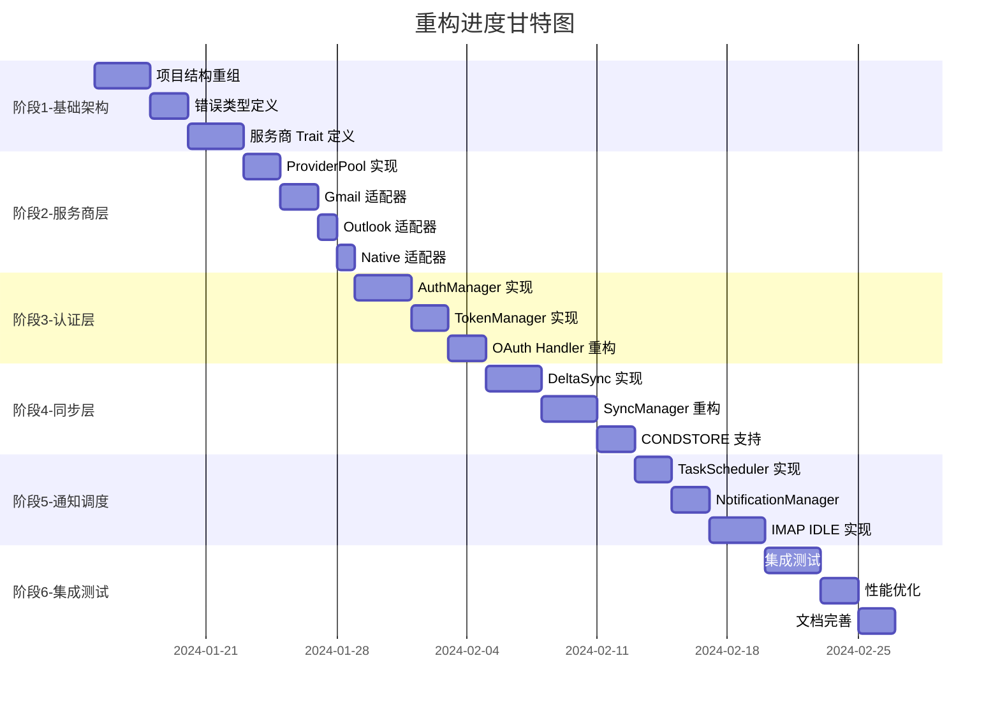

# Postium Mail 流程引擎重构计划

## 文档信息

| 项目 | 内容 |
|------|------|
| 文档版本 | 1.0.0 |
| 创建日期 | 2024-01-15 |
| 目标版本 | v2.0.0 |
| 预计工期 | 8-10 周 |

---

## 目录

1. [概述](#概述)
2. [现状分析](#现状分析)
3. [差距分析](#差距分析)
4. [重构原则](#重构原则)
5. [重构路线图](#重构路线图)
6. [详细重构任务](#详细重构任务)
7. [测试策略](#测试策略)
8. [风险与缓解措施](#风险与缓解措施)
9. [验收标准](#验收标准)

---

## 概述

### 背景

Postium Mail 当前已实现基础的邮件客户端功能，包括账号管理、IMAP/SMTP 通信、OAuth 认证、邮件同步等。然而，现有代码存在以下问题：

1. **缺乏统一的服务商抽象层**：各服务商配置硬编码，难以扩展
2. **认证逻辑分散**：OAuth 和密码认证逻辑分散在多个服务中
3. **同步策略单一**：缺乏灵活的增量同步和错误恢复机制
4. **通知机制不完善**：缺少新邮件实时推送和通知合并
5. **错误处理粗糙**：缺乏分类错误处理和智能重试策略
6. **个人/企业邮箱未区分**：现有设计未考虑个人邮箱和企业邮箱的差异

### 个人邮件 vs 企业邮件差异

| 维度 | 个人邮件 | 企业邮件 |
|------|----------|----------|
| **服务器配置** | 固定地址（如 imap.gmail.com） | 可自定义（如 mail.company.com） |
| **域名特征** | 标准域名（@gmail.com） | 自定义域名（@company.com） |
| **认证方式** | OAuth/密码/应用密码 | OAuth企业租户/域认证/SAML/MFA |
| **安全策略** | 基础安全策略 | 条件访问、设备管理、DLP策略 |
| **API 支持** | 标准 IMAP/SMTP | Graph API、EWS、企业通讯录API |

### 目标

通过引入流程引擎架构，实现：

1. **可扩展的服务商支持**：通过 Trait 抽象，轻松添加新服务商（个人和企业）
2. **统一的认证管理**：集中处理 OAuth 2.0、密码认证、域认证、SAML SSO
3. **智能同步机制**：支持 CONDSTORE 增量同步、断点续传
4. **实时通知系统**：IMAP IDLE、推送通知、通知合并
5. **健壮的错误处理**：分类错误、指数退避重试、状态恢复
6. **个人/企业邮箱区分**：自动检测邮箱类型，支持企业自定义配置
7. **企业特性支持**：条件访问策略、MFA、企业通讯录集成

### 参考文档

- [邮件客户端流程引擎设计文档](./mail-flow-engine-design.md)

---

## 现状分析

### 当前项目结构

```
src-tauri/src/
├── lib.rs                    # 应用入口，Tauri 配置
├── config.rs                 # 配置加载
├── crypto.rs                 # 加密工具
├── database.rs               # 数据库连接
├── command/                  # Tauri 命令处理层
│   ├── mod.rs
│   ├── account.rs            # 账号相关命令
│   ├── connection.rs         # 连接测试命令
│   ├── email.rs              # 邮件操作命令
│   ├── folder.rs             # 文件夹命令
│   ├── oauth.rs              # OAuth 命令
│   └── sync.rs               # 同步命令
├── models/                   # 数据模型层
│   ├── mod.rs
│   ├── account.rs            # 账号模型
│   ├── email.rs              # 邮件模型
│   ├── folder.rs             # 文件夹模型
│   ├── attachment.rs         # 附件模型
│   ├── sync_state.rs         # 同步状态模型
│   └── sync_error.rs         # 同步错误模型
├── services/                 # 业务服务层
│   ├── mod.rs
│   ├── account_service.rs    # 账号服务
│   ├── email_service.rs      # 邮件服务
│   ├── folder_service.rs     # 文件夹服务
│   ├── oauth_service.rs      # OAuth 服务
│   ├── smtp_service.rs       # SMTP 服务
│   ├── search_service.rs     # 搜索服务
│   ├── sync_manager.rs       # 同步管理器
│   ├── sync_state_service.rs # 同步状态服务
│   ├── sync_error_service.rs # 同步错误服务
│   └── imap/                 # IMAP 实现
│       ├── mod.rs
│       ├── client.rs         # IMAP 客户端
│       ├── service.rs        # IMAP 服务封装
│       ├── parser.rs         # 邮件解析
│       ├── types.rs          # 类型定义
│       └── error.rs          # 错误定义
└── migration/                # 数据库迁移
```

### 现有功能清单

| 模块 | 功能 | 实现状态 | 代码质量 |
|------|------|----------|----------|
| 账号管理 | CRUD 操作 | ✅ 完成 | 良好 |
| 账号管理 | 密码存储 (Keyring) | ✅ 完成 | 良好 |
| OAuth 2.0 | Microsoft 授权流程 | ✅ 完成 | 良好 |
| OAuth 2.0 | Google 授权流程 | ❌ 未实现 | - |
| OAuth 2.0 | Token 自动刷新 | ⚠️ 部分 | 需改进 |
| IMAP | 连接与认证 | ✅ 完成 | 良好 |
| IMAP | 文件夹列表获取 | ✅ 完成 | 良好 |
| IMAP | 邮件获取与解析 | ✅ 完成 | 良好 |
| IMAP | 标记已读/星标 | ✅ 完成 | 良好 |
| IMAP | 删除邮件 | ✅ 完成 | 良好 |
| IMAP | IDLE 实时监听 | ❌ 未实现 | - |
| SMTP | 发送邮件 | ✅ 完成 | 良好 |
| 同步 | 首次全量同步 | ✅ 完成 | 一般 |
| 同步 | 增量同步 (UID) | ⚠️ 部分 | 需改进 |
| 同步 | CONDSTORE 支持 | ❌ 未实现 | - |
| 同步 | 错误恢复 | ⚠️ 简单 | 需改进 |
| 通知 | 新邮件通知 | ❌ 未实现 | - |
| 搜索 | 全文搜索 | ✅ 完成 | 良好 |

### 关键代码分析

#### 1. 账号模型 (`models/account.rs`)

**优点**：
- 支持密码和 OAuth 两种认证类型
- 提供服务商默认配置
- 敏感信息存储在 Keyring

**问题**：
- 服务商配置硬编码，不易扩展
- 缺少服务商能力描述
- OAuth Token 管理分散

```rust
// 当前实现：硬编码的服务商配置
pub fn get_provider_defaults(provider: &str) -> Option<(ImapConfig, SmtpConfig)> {
    match provider {
        "gmail" => Some((...)),
        "outlook" | "hotmail" => Some((...)),
        "yahoo" => Some((...)),
        // 添加新服务商需要修改此处代码
        _ => None,
    }
}
```

#### 2. 同步管理器 (`services/sync_manager.rs`)

**优点**：
- 区分首次同步和增量同步
- 发送进度事件给前端
- 记录同步错误

**问题**：
- 缺乏服务商抽象，难以处理不同服务商的特殊情况
- 增量同步仅基于 UID，不支持 CONDSTORE
- 错误处理简单，无智能重试
- 无任务调度机制

```rust
// 当前实现：简单的增量同步
async fn incremental_sync_folder(...) {
    // 仅基于 UID 进行增量同步
    let new_uids = imap_service.list_uids_after(folder, last_uid).await?;
    // 不支持 MODSEQ/CONDSTORE
}
```

#### 3. OAuth 服务 (`services/oauth_service.rs`)

**优点**：
- 完整的 Microsoft OAuth 流程
- PKCE 支持
- XOAUTH2 字符串生成

**问题**：
- 仅支持 Microsoft，Google 需要另外实现
- Token 刷新逻辑未集成到同步流程
- 过期检测不主动

#### 4. IMAP 服务 (`services/imap/`)

**优点**：
- 完整的异步 IMAP 客户端实现
- 支持文件夹属性解析 (RFC 6154)
- 邮件解析完善

**问题**：
- 缺少 IDLE 模式支持
- 未实现 CONDSTORE 扩展
- 无连接池管理

---

## 差距分析

### 架构差距对比

| 层级 | 当前实现 | 目标架构 | 差距描述 |
|------|----------|----------|----------|
| 服务商层 | 硬编码配置 | `MailProvider` Trait | 缺少抽象接口 |
| 认证层 | 分散在各服务 | `AuthManager` 统一管理 | 需要重构整合 |
| 同步层 | 单一同步策略 | 多策略支持 | 需要增强 |
| 调度层 | 无 | `TaskScheduler` | 需要新建 |
| 通知层 | 无 | `NotificationManager` | 需要新建 |
| 错误处理 | 简单记录 | 分类错误+重试 | 需要增强 |

### 功能差距清单

#### 高优先级 (P0)

| 功能 | 当前状态 | 目标状态 | 工作量 |
|------|----------|----------|--------|
| 服务商 Trait 抽象 | 无 | 完整实现（含个人/企业区分） | 4 天 |
| Google OAuth 支持 | 未实现 | 完整实现 | 2 天 |
| IMAP IDLE 支持 | 未实现 | 完整实现 | 3 天 |
| 任务调度器 | 无 | 完整实现 | 2 天 |
| 账号类型识别（个人/企业） | 无 | 自动检测+手动选择 | 2 天 |

#### 中优先级 (P1)

| 功能 | 当前状态 | 目标状态 | 工作量 |
|------|----------|----------|--------|
| CONDSTORE 增量同步 | 未实现 | 完整实现 | 3 天 |
| Token 生命周期管理 | 部分 | 自动化（含企业租户） | 2 天 |
| Token 定期刷新调度 | 未实现 | 完整实现 | 2 天 |
| 新邮件通知 | 未实现 | 完整实现 | 2 天 |
| 错误分类与重试 | 简单 | 智能化 | 2 天 |
| Microsoft 365 企业支持 | 未实现 | 完整实现 | 2 天 |
| Google Workspace 企业支持 | 未实现 | 完整实现 | 2 天 |

#### 低优先级 (P2)

| 功能 | 当前状态 | 目标状态 | 工作量 |
|------|----------|----------|--------|
| 连接池管理 | 无 | 完整实现 | 2 天 |
| 同步断点续传 | 无 | 完整实现 | 1 天 |
| 通知合并 | 无 | 完整实现 | 1 天 |
| 更多服务商支持 | 3个 | 6+（含企业） | 2 天 |
| 企业邮箱自动发现 | 无 | Autodiscover/MX检测 | 2 天 |
| 企业通讯录集成 | 未实现 | Graph API 支持 | 3 天 |
| 自定义企业服务器配置 | 未实现 | 完整UI配置 | 2 天 |

---

## 重构原则

### 1. 渐进式重构

- **原则**：不进行大规模重写，而是逐步引入新模块
- **方法**：新功能使用新架构，旧功能保持兼容
- **好处**：降低风险，保持系统可用

```
阶段1: 引入新模块，不影响现有功能
阶段2: 新功能使用新架构
阶段3: 迁移现有功能到新架构
阶段4: 移除废弃代码
```

### 2. 接口优先

- **原则**：先定义接口，再实现细节
- **方法**：使用 Trait 定义抽象，确保可测试性
- **好处**：降低耦合，提高可扩展性

### 3. 测试驱动

- **原则**：重构前补充测试，重构后验证功能
- **方法**：为核心模块编写单元测试和集成测试
- **好处**：保证重构质量，防止回归

### 4. 向后兼容

- **原则**：保持现有 API 兼容性
- **方法**：保留现有命令接口，内部委托给新引擎
- **好处**：前端无需大规模修改

---

## 重构路线图

### 总体时间线

```
Week 1-2: 基础架构搭建（含账号类型抽象）
Week 3-4: 服务商层重构（个人+企业适配器）
Week 5-6: 认证与同步层重构（含企业认证）
Week 7-8: 通知与调度层实现
Week 9-10: 企业特性与测试优化
Week 11-12: 企业高级特性与集成测试
```

### 阶段划分



---

## 详细重构任务

### 阶段 1: 基础架构搭建 (Week 1-2)

#### 任务 1.0: 账号类型抽象设计

**目标**：设计个人邮箱和企业邮箱的区分机制

**实现内容**：

```rust
/// 账号类型（个人 vs 企业）
#[derive(Debug, Clone, Serialize, Deserialize, PartialEq, Eq, Copy)]
pub enum AccountType {
    /// 个人邮件账号
    Personal,
    /// 企业邮件账号
    Enterprise,
}

/// 企业配置（仅企业账号）
#[derive(Debug, Clone, Serialize, Deserialize)]
pub struct EnterpriseConfig {
    /// Azure AD 租户 ID 或 Google Workspace 域
    pub tenant_id: Option<String>,
    /// 企业域名
    pub domain: Option<String>,
    /// 是否启用条件访问策略
    pub conditional_access: bool,
    /// 是否强制 MFA
    pub mfa_required: bool,
    /// 是否使用自定义服务器
    pub custom_server: bool,
    /// 自定义 IMAP 服务器（如果使用）
    pub custom_imap: Option<ImapConfig>,
    /// 自定义 SMTP 服务器（如果使用）
    pub custom_smtp: Option<SmtpConfig>,
}
```

**数据库迁移**：
```sql
-- 添加账号类型字段
ALTER TABLE accounts ADD COLUMN account_type VARCHAR(20) DEFAULT 'personal';
ALTER TABLE accounts ADD COLUMN enterprise_config_id INTEGER REFERENCES enterprise_configs(id);

-- 创建企业配置表
CREATE TABLE enterprise_configs (
    id INTEGER PRIMARY KEY,
    tenant_id VARCHAR(100),
    domain VARCHAR(100),
    conditional_access BOOLEAN DEFAULT false,
    mfa_required BOOLEAN DEFAULT false,
    custom_server BOOLEAN DEFAULT false,
    created_at INTEGER,
    updated_at INTEGER
);
```

**验收标准**：
- [ ] AccountType 枚举定义
- [ ] EnterpriseConfig 结构定义
- [ ] 数据库迁移脚本
- [ ] 模型更新

**预计工时**：1 天

---

#### 任务 1.1: 项目结构重组

**目标**：创建新的模块目录结构

**步骤**：

```bash
# 创建新目录
mkdir -p src-tauri/src/engine
mkdir -p src-tauri/src/providers
mkdir -p src-tauri/src/auth
mkdir -p src-tauri/src/sync
mkdir -p src-tauri/src/error
```

**新目录结构**：

```
src-tauri/src/
├── engine/                    # 新增：流程引擎
│   ├── mod.rs
│   ├── flow_engine.rs         # 引擎核心
│   ├── task_scheduler.rs      # 任务调度
│   └── notification_manager.rs # 通知管理
├── providers/                 # 新增：服务商适配层
│   ├── mod.rs
│   ├── traits.rs              # MailProvider trait
│   ├── account_type.rs        # 账号类型定义（个人/企业）
│   ├── provider_pool.rs       # 服务商池
│   ├── personal/              # 个人邮件服务商
│   │   ├── mod.rs
│   │   ├── gmail.rs           # Gmail 个人版
│   │   ├── outlook.rs         # Outlook 个人版
│   │   ├── yahoo.rs           # Yahoo
│   │   └── native.rs          # 国内邮箱（163/QQ/iCloud）
│   ├── enterprise/            # 企业邮件服务商
│   │   ├── mod.rs
│   │   ├── microsoft_365.rs   # Microsoft 365
│   │   ├── google_workspace.rs # Google Workspace
│   │   └── custom.rs          # 自定义企业邮箱
│   └── config.rs              # 服务商配置
├── auth/                      # 新增：认证模块
│   ├── mod.rs
│   ├── auth_manager.rs        # 认证管理器
│   ├── oauth_handler.rs       # OAuth 处理器
│   ├── enterprise_auth.rs     # 企业认证（域认证/SAML）
│   ├── password_auth.rs       # 密码认证
│   └── token_manager.rs       # Token 管理
├── sync/                      # 重构：同步模块
│   ├── mod.rs
│   ├── sync_manager.rs        # 同步管理器
│   ├── folder_manager.rs      # 文件夹管理
│   ├── mail_processor.rs      # 邮件处理器
│   ├── delta_sync.rs          # 增量同步
│   └── sync_state.rs          # 同步状态
├── error/                     # 新增：错误处理
│   ├── mod.rs
│   ├── types.rs               # 错误类型定义
│   └── retry.rs               # 重试策略
├── services/                  # 保留：现有服务（逐步迁移）
├── models/                    # 保留：数据模型
├── command/                   # 保留：命令处理
└── lib.rs                     # 修改：初始化逻辑
```

**验收标准**：
- [ ] 新目录结构创建完成
- [ ] 各模块 `mod.rs` 文件创建
- [ ] 项目编译通过

**预计工时**：0.5 天

---

#### 任务 1.2: 错误类型定义

**目标**：定义统一的错误类型体系

**实现文件**：`src-tauri/src/error/types.rs`

```rust
use thiserror::Error;

/// 邮件客户端统一错误类型
#[derive(Debug, Error)]
pub enum MailError {
    // 连接错误
    #[error("连接失败: {0}")]
    Connection(#[from] ConnectionError),
    
    // 认证错误
    #[error("认证失败: {0}")]
    Authentication(#[from] AuthError),
    
    // 同步错误
    #[error("同步失败: {0}")]
    Sync(#[from] SyncError),
    
    // OAuth 错误
    #[error("OAuth 错误: {0}")]
    OAuth(#[from] OAuthError),
    
    // 存储错误
    #[error("存储错误: {0}")]
    Storage(#[from] StorageError),
    
    // 限流错误
    #[error("请求过于频繁，请 {retry_after} 秒后重试")]
    RateLimit { retry_after: u64 },
}

/// 连接错误
#[derive(Debug, Error)]
pub enum ConnectionError {
    #[error("连接超时")]
    Timeout,
    #[error("SSL/TLS 错误: {0}")]
    Ssl(String),
    #[error("主机无法访问: {0}")]
    HostUnreachable(String),
    #[error("连接被拒绝")]
    ConnectionRefused,
    #[error("DNS 解析失败: {0}")]
    DnsFailed(String),
}

/// 认证错误
#[derive(Debug, Error)]
pub enum AuthError {
    #[error("用户名或密码错误")]
    InvalidCredentials,
    #[error("账号被锁定")]
    AccountLocked,
    #[error("需要应用专用密码")]
    AppPasswordRequired,
    #[error("需要双因素认证")]
    TwoFactorRequired,
    #[error("OAuth Token 已过期")]
    OAuthExpired,
    #[error("OAuth 授权已撤销")]
    OAuthRevoked,
}

/// 同步错误
#[derive(Debug, Error)]
pub enum SyncError {
    #[error("文件夹不存在: {0}")]
    FolderNotFound(String),
    #[error("邮件数据损坏: {0}")]
    MessageCorrupted(String),
    #[error("无效的 UID: {0}")]
    UidInvalid(u32),
    #[error("存储配额已满")]
    QuotaExceeded,
    #[error("部分同步失败: {success}/{total}")]
    PartialFailure { success: usize, total: usize },
}

/// OAuth 错误
#[derive(Debug, Error)]
pub enum OAuthError {
    #[error("Token 已过期")]
    TokenExpired,
    #[error("Token 刷新失败: {0}")]
    RefreshFailed(String),
    #[error("无效的授权码")]
    InvalidGrant,
    #[error("访问被拒绝")]
    AccessDenied,
    #[error("网络错误: {0}")]
    NetworkError(String),
}

/// 存储错误
#[derive(Debug, Error)]
pub enum StorageError {
    #[error("数据库错误: {0}")]
    Database(String),
    #[error("Keyring 错误: {0}")]
    Keyring(String),
    #[error("数据不存在: {0}")]
    NotFound(String),
}

/// 错误严重程度
#[derive(Debug, Clone, Copy, PartialEq)]
pub enum ErrorSeverity {
    /// 可忽略，自动恢复
    Low,
    /// 需要重试
    Medium,
    /// 需要用户干预
    High,
    /// 严重错误，停止操作
    Critical,
}

impl MailError {
    /// 获取错误严重程度
    pub fn severity(&self) -> ErrorSeverity {
        match self {
            MailError::Connection(e) => match e {
                ConnectionError::Timeout => ErrorSeverity::Medium,
                ConnectionError::HostUnreachable(_) => ErrorSeverity::High,
                _ => ErrorSeverity::Medium,
            },
            MailError::Authentication(_) => ErrorSeverity::High,
            MailError::OAuth(e) => match e {
                OAuthError::TokenExpired => ErrorSeverity::Medium,
                OAuthError::AccessDenied => ErrorSeverity::Critical,
                _ => ErrorSeverity::Medium,
            },
            MailError::RateLimit { .. } => ErrorSeverity::Low,
            _ => ErrorSeverity::Medium,
        }
    }
    
    /// 是否可重试
    pub fn is_retryable(&self) -> bool {
        matches!(
            self.severity(),
            ErrorSeverity::Low | ErrorSeverity::Medium
        )
    }
    
    /// 获取建议的重试延迟（秒）
    pub fn retry_delay(&self) -> Option<u64> {
        match self {
            MailError::RateLimit { retry_after } => Some(*retry_after),
            MailError::Connection(_) => Some(5),
            MailError::OAuth(OAuthError::TokenExpired) => Some(0), // 立即刷新
            _ => None,
        }
    }
}
```

**验收标准**：
- [ ] 错误类型定义完整
- [ ] 实现 `From` trait 转换
- [ ] 单元测试覆盖

**预计工时**：1 天

---

#### 任务 1.3: 重试策略实现

**目标**：实现智能重试机制

**实现文件**：`src-tauri/src/error/retry.rs`

```rust
use std::time::Duration;
use tokio::time::sleep;

/// 重试配置
#[derive(Debug, Clone)]
pub struct RetryConfig {
    /// 最大重试次数
    pub max_retries: u32,
    /// 初始延迟
    pub initial_delay: Duration,
    /// 最大延迟
    pub max_delay: Duration,
    /// 延迟乘数（指数退避）
    pub multiplier: f64,
}

impl Default for RetryConfig {
    fn default() -> Self {
        Self {
            max_retries: 5,
            initial_delay: Duration::from_secs(1),
            max_delay: Duration::from_secs(60),
            multiplier: 2.0,
        }
    }
}

/// 重试执行器
pub struct RetryExecutor {
    config: RetryConfig,
}

impl RetryExecutor {
    pub fn new(config: RetryConfig) -> Self {
        Self { config }
    }
    
    /// 执行带重试的异步操作
    pub async fn execute<F, Fut, T, E>(
        &self,
        mut operation: F,
    ) -> Result<T, E>
    where
        F: FnMut() -> Fut,
        Fut: std::future::Future<Output = Result<T, E>>,
        E: std::fmt::Debug + IsRetryable,
    {
        let mut delay = self.config.initial_delay;
        let mut attempts = 0;
        
        loop {
            match operation().await {
                Ok(result) => return Ok(result),
                Err(error) => {
                    attempts += 1;
                    
                    if !error.is_retryable() || attempts > self.config.max_retries {
                        return Err(error);
                    }
                    
                    tracing::warn!(
                        "操作失败 (尝试 {}/{}): {:?}, {}秒后重试",
                        attempts,
                        self.config.max_retries,
                        error,
                        delay.as_secs()
                    );
                    
                    sleep(delay).await;
                    
                    // 指数退避
                    delay = std::cmp::min(
                        Duration::from_secs_f64(delay.as_secs_f64() * self.config.multiplier),
                        self.config.max_delay,
                    );
                }
            }
        }
    }
}

/// 判断错误是否可重试
pub trait IsRetryable {
    fn is_retryable(&self) -> bool;
}
```

**验收标准**：
- [ ] 指数退避重试实现
- [ ] 可配置的重试参数
- [ ] 单元测试覆盖

**预计工时**：1 天

---

#### 任务 1.4: 服务商 Trait 定义

**目标**：定义 `MailProvider` trait（含个人/企业区分）

**实现文件**：`src-tauri/src/providers/traits.rs`

```rust
use anyhow::Result;
use async_trait::async_trait;
use serde::{Deserialize, Serialize};

/// 账号类型（个人 vs 企业）
#[derive(Debug, Clone, Serialize, Deserialize, PartialEq, Eq, Copy)]
pub enum AccountType {
    /// 个人邮件账号
    Personal,
    /// 企业邮件账号
    Enterprise,
}

impl Default for AccountType {
    fn default() -> Self {
        Self::Personal
    }
}

/// 认证类型
#[derive(Debug, Clone, Serialize, Deserialize, PartialEq)]
pub enum AuthType {
    /// 密码认证
    Password,
    /// OAuth 2.0 认证
    OAuth2,
    /// 应用专用密码
    AppPassword,
    /// 域认证（企业）
    DomainAuth,
    /// SAML SSO（企业）
    SamlSso,
}

/// SSL 模式
#[derive(Debug, Clone, Serialize, Deserialize, PartialEq)]
pub enum SslMode {
    /// 无加密
    None,
    /// STARTTLS 升级
    StartTls,
    /// 隐式 SSL/TLS
    Implicit,
}

/// IMAP 配置
#[derive(Debug, Clone, Serialize, Deserialize)]
pub struct ImapConfig {
    pub host: String,
    pub port: u16,
    pub ssl: SslMode,
}

/// SMTP 配置
#[derive(Debug, Clone, Serialize, Deserialize)]
pub struct SmtpConfig {
    pub host: String,
    pub port: u16,
    pub ssl: SslMode,
}

/// OAuth 配置
#[derive(Debug, Clone, Serialize, Deserialize)]
pub struct OAuthConfig {
    pub client_id: String,
    pub client_secret: Option<String>,
    pub auth_url: String,
    pub token_url: String,
    pub redirect_uri: String,
    pub scopes: Vec<String>,
    pub pkce_enabled: bool,
    /// 企业租户 ID（仅企业账号）
    pub tenant_id: Option<String>,
}

/// 企业配置（仅企业账号）
#[derive(Debug, Clone, Serialize, Deserialize)]
pub struct EnterpriseConfig {
    /// Azure AD 租户 ID 或 Google Workspace 域
    pub tenant_id: Option<String>,
    /// 企业域名
    pub domain: Option<String>,
    /// 是否启用条件访问策略
    pub conditional_access: bool,
    /// 是否强制 MFA
    pub mfa_required: bool,
    /// 是否使用自定义服务器
    pub custom_server: bool,
    /// 自定义 IMAP 服务器（如果使用）
    pub custom_imap: Option<ImapConfig>,
    /// 自定义 SMTP 服务器（如果使用）
    pub custom_smtp: Option<SmtpConfig>,
}

/// 服务商能力
#[derive(Debug, Clone, Serialize, Deserialize)]
pub struct ProviderCapabilities {
    pub supports_idle: bool,
    pub supports_condstore: bool,
    pub supports_push: bool,
    pub supports_oauth: bool,
    /// 是否支持企业特性
    pub supports_enterprise: bool,
    pub max_message_size: Option<u64>,
}

/// 服务商信息（用于前端展示）
#[derive(Debug, Clone, Serialize, Deserialize)]
pub struct ProviderInfo {
    pub id: String,
    pub name: String,
    /// 账号类型（个人/企业）
    pub account_type: AccountType,
    pub domains: Vec<String>,
    pub auth_types: Vec<AuthType>,
    pub icon: Option<String>,
}

/// 邮件服务商 Trait
#[async_trait]
pub trait MailProvider: Send + Sync {
    /// 服务商唯一标识
    fn provider_id(&self) -> &str;
    
    /// 服务商显示名称
    fn provider_name(&self) -> &str;
    
    /// 账号类型（个人/企业）
    fn account_type(&self) -> AccountType;
    
    /// 支持的认证类型
    fn auth_types(&self) -> Vec<AuthType>;
    
    /// 默认 IMAP 配置
    fn default_imap_config(&self) -> ImapConfig;
    
    /// 默认 SMTP 配置
    fn default_smtp_config(&self) -> SmtpConfig;
    
    /// OAuth 配置（如果支持）
    fn oauth_config(&self) -> Option<OAuthConfig>;
    
    /// 企业配置（仅企业账号）
    fn enterprise_config(&self) -> Option<EnterpriseConfig> {
        None
    }
    
    /// 服务商能力
    fn capabilities(&self) -> ProviderCapabilities;
    
    /// 根据邮箱地址检测是否为此服务商
    fn detect(&self, email: &str) -> bool;
    
    /// 获取支持的域名列表
    fn supported_domains(&self) -> Vec<&str>;
    
    /// 生成 XOAUTH2 字符串
    fn generate_xoauth2(&self, email: &str, access_token: &str) -> String {
        let auth_string = format!("user={}\x01auth=Bearer {}\x01\x01", email, access_token);
        base64::engine::general_purpose::STANDARD.encode(auth_string)
    }
    
    /// 克隆为 Box
    fn box_clone(&self) -> Box<dyn MailProvider>;
}

/// 实现 Clone for Box<dyn MailProvider>
impl Clone for Box<dyn MailProvider> {
    fn clone(&self) -> Self {
        self.box_clone()
    }
}
```

**验收标准**：
- [ ] Trait 定义完整
- [ ] 所有必要方法定义
- [ ] 文档注释完整

**预计工时**：1 天

---

### 阶段 2: 服务商层实现 (Week 3-4)

#### 任务 2.1: ProviderPool 实现

**目标**：实现服务商池，管理所有服务商实例（含个人/企业分类）

**实现文件**：`src-tauri/src/providers/provider_pool.rs`

**关键功能**：
+- 从环境变量初始化服务商
+- 根据邮箱地址自动检测服务商类型（个人/企业）
+- 分离管理个人服务商和企业服务商
+- 企业邮箱自动发现（MX记录/Autodiscover）

**验收标准**：
+- [ ] 服务商注册与获取
+- [ ] 自动检测服务商（含个人/企业区分）
+- [ ] 企业邮箱检测逻辑
+- [ ] 单元测试覆盖

**预计工时**：3 天

---

#### 任务 2.2: Gmail 适配器实现

**目标**：实现 Gmail 个人邮件服务商适配器

**实现文件**：`src-tauri/src/providers/personal/gmail.rs`

**关键配置**：
```rust
// Gmail OAuth 配置
auth_url: "https://accounts.google.com/o/oauth2/v2/auth"
token_url: "https://oauth2.googleapis.com/token"
scopes: [
    "https://mail.google.com/",
    "https://www.googleapis.com/auth/userinfo.email",
]

// Gmail IMAP 配置
host: "imap.gmail.com"
port: 993
ssl: SslMode::Implicit

// Gmail 能力
account_type: AccountType::Personal
supports_idle: true
supports_condstore: true
```

**验收标准**：
+- [ ] Gmail OAuth 流程完整
+- [ ] IMAP/SMTP 配置正确
+- [ ] 标记为个人邮箱
+- [ ] 集成测试通过

**预计工时**：2 天

---

#### 任务 2.3: Outlook 适配器迁移

**目标**：将现有 Microsoft OAuth 逻辑迁移到 Outlook 个人适配器

**实现文件**：`src-tauri/src/providers/personal/outlook.rs`

**迁移策略**：
1. 从 `oauth_service.rs` 提取 Microsoft 特定逻辑
2. 封装到 Outlook 个人适配器
3. 保持现有功能不变

**验收标准**：
+- [ ] 现有 Outlook 功能保持
+- [ ] 标记为个人邮箱
+- [ ] 代码迁移完成
+- [ ] 回归测试通过

**预计工时**：1 天

---

#### 任务 2.4: Native 适配器实现

**目标**：实现国内邮箱 (163/QQ/iCloud) 适配器

**实现文件**：`src-tauri/src/providers/personal/native.rs`

**支持的服务商**：
+- 163 邮箱 (`imap.163.com:993`)
+- QQ 邮箱 (`imap.qq.com:993`)
+- iCloud (`imap.mail.me.com:993`)
+- Yahoo (`imap.mail.yahoo.com:993`)

**验收标准**：
+- [ ] 各服务商配置正确
+- [ ] 密码认证流程完整
+- [ ] 标记为个人邮箱
+- [ ] 测试覆盖

**预计工时**：1 天

---

#### 任务 2.5: Microsoft 365 企业适配器实现

**目标**：实现 Microsoft 365 企业邮件服务商适配器

**实现文件**：`src-tauri/src/providers/enterprise/microsoft_365.rs`

**关键功能**：
+- 企业租户 OAuth 流程
+- 条件访问策略支持
+- MFA 认证流程
+- 企业租户 ID 管理

**关键配置**：
```rust
// Microsoft 365 企业 OAuth 配置
auth_url: "https://login.microsoftonline.com/{tenant_id}/oauth2/v2.0/authorize"
token_url: "https://login.microsoftonline.com/{tenant_id}/oauth2/v2.0/token"
scopes: [
    "https://outlook.office365.com/IMAP.AccessAsUser.All",
    "https://outlook.office365.com/SMTP.Send",
    "offline_access",
    "openid",
]

// 企业配置
account_type: AccountType::Enterprise
conditional_access: true
mfa_required: true
```

**验收标准**：
+- [ ] 企业租户 OAuth 流程
+- [ ] MFA 处理
+- [ ] 租户 ID 存储
+- [ ] 集成测试通过

**预计工时**：2 天

---

#### 任务 2.6: Google Workspace 企业适配器实现

**目标**：实现 Google Workspace 企业邮件服务商适配器

**实现文件**：`src-tauri/src/providers/enterprise/google_workspace.rs`

**关键功能**：
+- 企业域 OAuth 流程
+- 企业安全管理支持
+- 企业通讯录 API 范围

**关键配置**：
```rust
// Google Workspace 企业 OAuth 配置
auth_url: "https://accounts.google.com/o/oauth2/v2/auth"
token_url: "https://oauth2.googleapis.com/token"
scopes: [
    "https://mail.google.com/",
    "https://www.googleapis.com/auth/userinfo.email",
    "https://www.googleapis.com/auth/directory.readonly", // 企业通讯录
]

// 企业配置
account_type: AccountType::Enterprise
domain: custom_domain
```

**验收标准**：
+- [ ] 企业域 OAuth 流程
+- [ ] 企业特性配置
+- [ ] 集成测试通过

**预计工时**：2 天

---

#### 任务 2.7: 自定义企业邮箱适配器实现

**目标**：实现自建邮件服务器适配器

**实现文件**：`src-tauri/src/providers/enterprise/custom.rs`

**关键功能**：
+- 完全自定义 IMAP/SMTP 配置
+- 支持多种认证方式
+- 灵活的服务器参数

**验收标准**：
+- [ ] 自定义服务器配置 UI
+- [ ] 多种认证方式支持
+- [ ] 测试覆盖

**预计工时**：1 天

---

### 阶段 3: 认证层重构 (Week 5-6)

#### 任务 3.1: AuthManager 实现

**目标**：统一认证入口，整合 OAuth、密码认证和企业认证

**实现文件**：`src-tauri/src/auth/auth_manager.rs`

**关键功能**：

```rust
pub struct AuthManager {
    provider_pool: Arc<ProviderPool>,
    oauth_handler: Arc<OAuthHandler>,
    enterprise_auth: Arc<EnterpriseAuth>,
    password_auth: Arc<PasswordAuth>,
}

impl AuthManager {
    /// 开始认证流程（自动选择认证方式）
    pub async fn authenticate(
        &self,
        request: &CreateAccountRequest,
    ) -> Result<AuthResult>;
    
    /// 企业认证（含租户信息）
    pub async fn authenticate_enterprise(
        &self,
        request: &CreateAccountRequest,
        enterprise_config: &EnterpriseConfig,
    ) -> Result<AuthResult>;
    
    /// 测试连接（添加账号前验证）
    pub async fn test_connection(
        &self,
        email: &str,
        provider: &str,
        credentials: &Credentials,
    ) -> Result<ConnectionTestResult>;
    
    /// 刷新认证（Token 刷新或重新认证）
    pub async fn refresh_auth(
        &self,
        account_id: i32,
    ) -> Result<()>;
    
    /// 检测账号类型（个人/企业）
    pub async fn detect_account_type(
        &self,
        email: &str,
    ) -> Result<(AccountType, Box<dyn MailProvider>)>;
}
```

**验收标准**：
+- [ ] 统一认证入口
+- [ ] 自动选择认证方式
+- [ ] 企业认证支持
+- [ ] 账号类型检测
+- [ ] 集成测试通过

**预计工时**：4 天

---

#### 任务 3.2: TokenManager 实现

**目标**：管理 OAuth Token 生命周期（含企业租户支持）

**实现文件**：`src-tauri/src/auth/token_manager.rs`

**关键功能**：

```rust
pub struct TokenManager {
    db: Arc<DbConn>,
    keyring: Keyring,
}

impl TokenManager {
    /// 获取有效的 Access Token（自动刷新）
    pub async fn get_valid_token(
        &self,
        account_id: i32,
    ) -> Result<String>;
    
    /// 刷新 Token（支持企业租户）
    pub async fn refresh_token(
        &self,
        account_id: i32,
        provider: &dyn MailProvider,
    ) -> Result<OAuthToken>;
    
    /// 刷新企业 Token（使用租户特定端点）
    pub async fn refresh_enterprise_token(
        &self,
        account_id: i32,
        tenant_id: &str,
        provider: &dyn MailProvider,
    ) -> Result<OAuthToken>;
    
    /// 检查 Token 是否即将过期
    pub fn is_expiring_soon(&self, expires_at: i64) -> bool;
    
    /// 存储 Token（含租户信息）
    pub async fn store_token(
        &self,
        account_id: i32,
        token: &OAuthToken,
    ) -> Result<()>;
    
    /// 存储企业配置
    pub async fn store_enterprise_config(
        &self,
        account_id: i32,
        config: &EnterpriseConfig,
    ) -> Result<()>;
}
```

**验收标准**：
+- [ ] 自动刷新过期 Token
+- [ ] 安全存储 Token
+- [ ] 企业租户 Token 管理
+- [ ] 单元测试覆盖

**预计工时**：3 天

---

#### 任务 3.3: OAuthHandler 重构

**目标**：将 `oauth_service.rs` 重构为通用 OAuth 处理器

**实现文件**：`src-tauri/src/auth/oauth_handler.rs`

**重构策略**：
1. 抽取服务商无关的 OAuth 逻辑
2. 支持多服务商配置（个人+企业）
3. 支持企业租户特定端点
4. 保持与现有代码兼容

**关键功能**：
```rust
impl OAuthHandler {
    /// 生成个人账号授权 URL
    pub async fn get_personal_auth_url(
        &self,
        provider: &dyn MailProvider,
    ) -> Result<AuthorizationContext>;
    
    /// 生成企业账号授权 URL（含租户）
    pub async fn get_enterprise_auth_url(
        &self,
        provider: &dyn MailProvider,
        tenant_id: &str,
    ) -> Result<AuthorizationContext>;
    
    /// 交换授权码（自动检测个人/企业）
    pub async fn exchange_code(
        &self,
        code: &str,
        state: &str,
        provider: &dyn MailProvider,
    ) -> Result<OAuthToken>;
}
```

**验收标准**：
+- [ ] 通用 OAuth 流程
+- [ ] 支持 Google 和 Microsoft（个人+企业）
+- [ ] 企业租户端点支持
+- [ ] 回归测试通过

**预计工时**：3 天

---

#### 任务 3.4: 企业认证处理器实现

**目标**：实现企业特有的认证方式

**实现文件**：`src-tauri/src/auth/enterprise_auth.rs`

**关键功能**：
+- 域认证（Kerberos/NTLM）
+- SAML SSO 流程
+- 条件访问策略处理
+- MFA 状态管理

**验收标准**：
+- [ ] 域认证支持
+- [ ] SAML SSO 流程
+- [ ] MFA 状态处理
+- [ ] 测试覆盖

**预计工时**：3 天

---

#### 任务 3.5: Token 刷新调度器实现

**目标**：实现 OAuth Token 定期刷新调度器

**实现文件**：`src-tauri/src/auth/token_refresh_scheduler.rs`

**关键功能**：

```rust
/// Token 刷新配置
#[derive(Debug, Clone)]
pub struct TokenRefreshConfig {
    /// 刷新检查间隔（秒）
    pub check_interval_secs: u64,
    /// 提前刷新时间（秒），Token过期前多久开始刷新
    pub refresh_before_expiry_secs: u64,
    /// 最大重试次数
    pub max_retry_count: u32,
    /// 重试间隔基数（秒）
    pub retry_interval_base_secs: u64,
    /// 并发刷新最大数量
    pub max_concurrent_refreshes: usize,
}

impl Default for TokenRefreshConfig {
    fn default() -> Self {
        Self {
            check_interval_secs: 60,           // 每分钟检查一次
            refresh_before_expiry_secs: 300,   // 过期前5分钟刷新
            max_retry_count: 3,
            retry_interval_base_secs: 30,
            max_concurrent_refreshes: 5,
        }
    }
}

/// Token 刷新调度器
pub struct TokenRefreshScheduler {
    config: TokenRefreshConfig,
    token_manager: Arc<TokenManager>,
    provider_pool: Arc<ProviderPool>,
    refresh_queue: Arc<RwLock<Vec<RefreshTask>>>,
    running: Arc<AtomicBool>,
}

impl TokenRefreshScheduler {
    /// 启动调度器
    pub async fn start(&self) -> Result<()>;
    
    /// 停止调度器
    pub async fn stop(&self) -> Result<()>;
    
    /// 扫描需要刷新的账号
    async fn scan_accounts(&self) -> Result<Vec<i32>>;
    
    /// 执行单个账号的刷新
    async fn refresh_account(&self, account_id: i32) -> Result<()>;
    
    /// 处理刷新失败
    async fn handle_refresh_failure(
        &self,
        account_id: i32,
        error: &OAuthError,
        retry_count: u32,
    ) -> Result<RefreshAction>;
}

/// 刷新动作
pub enum RefreshAction {
    /// 成功，更新Token
    Success { new_expires_at: i64 },
    /// 重试
    Retry { delay_secs: u64 },
    /// 需要重新授权
    NeedReauth { reason: String },
}

/// 刷新历史记录
pub struct RefreshHistory {
    pub account_id: i32,
    pub status: RefreshStatus,
    pub error_code: Option<String>,
    pub error_message: Option<String>,
    pub started_at: i64,
    pub completed_at: Option<i64>,
    pub retry_count: u32,
}
```

**刷新流程图**：

```
┌─────────────────────────────────────────────────────────────────┐
│                    Token 刷新调度流程                            │
├─────────────────────────────────────────────────────────────────┤
│                                                                 │
│  ┌──────────┐    ┌──────────┐    ┌──────────┐    ┌──────────┐  │
│  │ 定时检查 │───>│ 扫描账号 │───>│ 过滤条件 │───>│ 加入队列 │  │
│  └──────────┘    └──────────┘    └──────────┘    └──────────┘  │
│       │                                              │          │
│       │              过滤条件:                       │          │
│       │              expires_at - now < 5分钟       │          │
│       │              且不在刷新中                    │          │
│       ↓                                              ↓          │
│  ┌──────────┐    ┌──────────┐    ┌──────────┐    ┌──────────┐  │
│  │ 等待1分钟│<───│ 更新状态 │<───│ 存储Token│<───│ 执行刷新 │  │
│  └──────────┘    └──────────┘    └──────────┘    └──────────┘  │
│                                                        │        │
│                                                        ↓        │
│                   ┌──────────┐    ┌──────────┐    ┌──────────┐  │
│                   │ 记录失败 │<───│ 重试/通知│<───│ 刷新失败 │  │
│                   └──────────┘    └──────────┘    └──────────┘  │
│                                                                 │
└─────────────────────────────────────────────────────────────────┘
```

**数据库迁移**：
```sql
-- 刷新历史记录表
CREATE TABLE refresh_history (
    id INTEGER PRIMARY KEY AUTOINCREMENT,
    account_id INTEGER NOT NULL,
    provider_id TEXT NOT NULL,
    status TEXT NOT NULL,  -- 'success', 'failed'
    error_code TEXT,
    error_message TEXT,
    started_at INTEGER NOT NULL,
    completed_at INTEGER,
    duration_ms INTEGER,
    retry_count INTEGER DEFAULT 0,
    old_expires_at INTEGER,
    new_expires_at INTEGER,
    created_at INTEGER NOT NULL,
    FOREIGN KEY (account_id) REFERENCES accounts(id)
);

-- 刷新状态表（用于防并发）
CREATE TABLE refresh_state (
    account_id INTEGER PRIMARY KEY,
    status TEXT NOT NULL,  -- 'idle', 'scheduled', 'refreshing'
    last_refresh_at INTEGER,
    next_refresh_at INTEGER,
    retry_count INTEGER DEFAULT 0,
    last_error TEXT,
    updated_at INTEGER NOT NULL,
    FOREIGN KEY (account_id) REFERENCES accounts(id)
);

-- 索引
CREATE INDEX idx_refresh_history_account ON refresh_history(account_id);
CREATE INDEX idx_refresh_history_started ON refresh_history(started_at);
CREATE INDEX idx_refresh_state_next ON refresh_state(next_refresh_at);
```

**验收标准**：
- [ ] 定时扫描需要刷新的账号
- [ ] 提前5分钟刷新Token
- [ ] 刷新失败自动重试（最多3次）
- [ ] 刷新失败超过重试次数通知用户
- [ ] 并发刷新控制（最多5个同时刷新）
- [ ] 刷新历史记录
- [ ] 刷新状态持久化
- [ ] 单元测试覆盖

**预计工时**：2 天

---

### 阶段 4: 同步层重构 (Week 7-8)

#### 任务 4.1: DeltaSync 实现

**目标**：实现增量同步引擎

**实现文件**：`src-tauri/src/sync/delta_sync.rs`

**关键功能**：

```rust
pub struct DeltaSync {
    db: Arc<DbConn>,
}

impl DeltaSync {
    /// 执行增量同步
    pub async fn sync_incremental(
        &self,
        account_id: i32,
        folder: &str,
        imap_session: &mut ImapSession,
    ) -> Result<DeltaSyncResult>;
    
    /// 使用 CONDSTORE 同步
    async fn sync_with_condstore(...) -> Result<DeltaSyncResult>;
    
    /// 使用 UID 搜索同步
    async fn sync_with_uid_search(...) -> Result<DeltaSyncResult>;
}
```

**验收标准**：
- [ ] CONDSTORE 支持检测
- [ ] UID 增量同步
- [ ] 性能测试通过

**预计工时**：3 天

---

#### 任务 4.2: SyncManager 重构

**目标**：重构同步管理器，使用新架构

**实现文件**：`src-tauri/src/sync/sync_manager.rs`

**重构策略**：
1. 使用 `ProviderPool` 获取服务商配置
2. 使用 `DeltaSync` 执行增量同步
3. 使用 `RetryExecutor` 处理错误
4. 保持现有 API 兼容

**验收标准**：
- [ ] 新架构集成
- [ ] 现有功能保持
- [ ] 回归测试通过

**预计工时**：3 天

---

#### 任务 4.3: CONDSTORE 支持

**目标**：在 IMAP 客户端中实现 CONDSTORE 扩展

**修改文件**：`src-tauri/src/services/imap/client.rs`

**关键改动**：

```rust
impl AsyncImapClient {
    /// 检查 CONDSTORE 支持
    pub async fn check_condstore_support(&mut self) -> Result<bool>;
    
    /// 选择文件夹（带 CONDSTORE）
    pub async fn select_with_condstore(
        &mut self,
        folder: &str,
    ) -> Result<SelectResponse>;
    
    /// 搜索修改的邮件（MODSEQ）
    pub async fn search_modified(
        &mut self,
        last_modseq: u64,
    ) -> Result<Vec<u32>>;
}
```

**验收标准**：
- [ ] CONDSTORE 能力检测
- [ ] MODSEQ 同步实现
- [ ] 兼容不支持的服务器

**预计工时**：2 天

---

### 阶段 5: 通知与调度 (Week 9-10)

#### 任务 5.1: TaskScheduler 实现

**目标**：实现定时任务调度器

**实现文件**：`src-tauri/src/engine/task_scheduler.rs`

**关键功能**：

```rust
pub struct TaskScheduler {
    tasks: Arc<RwLock<HashMap<i32, ScheduledTask>>>,
}

impl TaskScheduler {
    /// 添加同步任务
    pub async fn add_sync_task(
        &self,
        account_id: i32,
        interval: Duration,
    ) -> Result<()>;
    
    /// 暂停/恢复任务
    pub async fn pause_task(&self, account_id: i32) -> Result<()>;
    pub async fn resume_task(&self, account_id: i32) -> Result<()>;
    
    /// 启动调度器
    pub async fn start(&self) -> Result<()>;
}
```

**验收标准**：
- [ ] 定时任务执行
- [ ] 任务暂停/恢复
- [ ] 单元测试覆盖

**预计工时**：2 天

---

#### 任务 5.2: NotificationManager 实现

**目标**：实现新邮件通知管理

**实现文件**：`src-tauri/src/engine/notification_manager.rs`

**关键功能**：
- 通知去重
- 通知合并（5秒窗口）
- 桌面通知
- 声音提醒

**验收标准**：
- [ ] 新邮件检测
- [ ] 通知合并
- [ ] 桌面通知集成

**预计工时**：2 天

---

#### 任务 5.3: IMAP IDLE 实现

**目标**：实现 IMAP IDLE 实时监听

**修改文件**：`src-tauri/src/services/imap/client.rs`

**关键功能**：

```rust
impl AsyncImapClient {
    /// 进入 IDLE 模式
    pub async fn idle_start(&mut self) -> Result<()>;
    
    /// 等待服务器通知
    pub async fn idle_wait(&mut self) -> Result<IdleEvent>;
    
    /// 退出 IDLE 模式
    pub async fn idle_done(&mut self) -> Result<()>;
}

/// IDLE 事件
pub enum IdleEvent {
    NewMail { count: u32 },
    Expunge { uid: u32 },
    Fetch { uid: u32, flags: Vec<Flag> },
}
```

**验收标准**：
- [ ] IDLE 模式进入/退出
- [ ] 服务器推送接收
- [ ] 断线重连处理

**预计工时**：3 天

---

### 阶段 6: 集成与测试 (Week 10)

#### 任务 6.1: FlowEngine 集成

**目标**：将所有模块集成到 FlowEngine

**实现文件**：`src-tauri/src/engine/flow_engine.rs`

**集成清单**：
- [ ] ProviderPool 初始化
- [ ] AuthManager 集成
- [ ] SyncManager 集成
- [ ] TaskScheduler 启动
- [ ] NotificationManager 配置

**预计工时**：2 天

---

#### 任务 6.2: 命令层适配

**目标**：适配现有 Tauri 命令到新引擎

**修改文件**：`src-tauri/src/command/*.rs`

**适配策略**：
- 保持现有命令签名不变
- 内部调用委托给 FlowEngine
- 添加新命令支持新功能

**预计工时**：2 天

---

#### 任务 6.3: 集成测试

**目标**：验证所有功能正常工作

**测试清单**：
- [ ] 账号添加（密码认证）
- [ ] 账号添加（OAuth 认证）
- [ ] 首次同步
- [ ] 增量同步
- [ ] Token 自动刷新
- [ ] 新邮件通知
- [ ] 错误恢复

**预计工时**：3 天

---

## 测试策略

### 单元测试

每个新模块必须包含单元测试：

```rust
#[cfg(test)]
mod tests {
    use super::*;
    
    #[test]
    fn test_provider_detection() {
        let provider = GmailProvider::from_env().unwrap();
        assert!(provider.detect("user@gmail.com"));
        assert!(provider.detect("user@googlemail.com"));
        assert!(!provider.detect("user@outlook.com"));
    }
    
    #[test]
    fn test_error_severity() {
        let error = MailError::Connection(ConnectionError::Timeout);
        assert_eq!(error.severity(), ErrorSeverity::Medium);
        assert!(error.is_retryable());
    }
}
```

### 集成测试

在 `src-tauri/tests/` 目录下创建集成测试：

```
tests/
├── integration/
│   ├── auth_test.rs        # 认证流程测试
│   ├── sync_test.rs        # 同步流程测试
│   ├── provider_test.rs    # 服务商测试
│   └── notification_test.rs # 通知测试
└── fixtures/
    ├── mock_imap_server.rs # 模拟 IMAP 服务器
    └── test_accounts.rs    # 测试账号配置
```

### 手动测试清单

| 功能 | 测试步骤 | 预期结果 |
|------|----------|----------|
| Gmail OAuth | 添加 Gmail 账号 | OAuth 流程完成，邮件同步 |
| Outlook OAuth | 添加 Outlook 账号 | OAuth 流程完成，邮件同步 |
| 163 密码认证 | 添加 163 账号 | 连接成功，邮件同步 |
| 增量同步 | 手动触发同步 | 仅同步新邮件 |
| Token 刷新 | 等待 Token 过期 | 自动刷新，继续同步 |
| 新邮件通知 | 发送测试邮件 | 收到桌面通知 |
| 网络断开 | 断开网络 | 显示错误，自动重试 |
| **Microsoft 365 企业** | 添加企业邮箱 | 企业租户识别，OAuth 完成 |
| **Google Workspace 企业** | 添加企业邮箱 | 企业域识别，OAuth 完成 |
| **自定义企业服务器** | 手动配置服务器 | 连接成功，邮件同步 |
| **企业 MFA** | 完成 MFA 认证 | MFA 流程正常，账号添加成功 |
| **企业条件访问** | 满足条件访问策略 | 正确处理策略要求 |
| **账号类型检测** | 输入企业邮箱 | 自动识别为企业账号 |
| **Token 定期刷新** | Token 即将过期 | 自动刷新，无感知 |
| **Token 刷新失败** | 网络错误/Token 失效 | 重试后通知用户 |
| **多账号刷新** | 多个账号同时过期 | 并发刷新，控制并发数 |

---

## 风险与缓解措施

### 风险矩阵

| 风险 | 概率 | 影响 | 缓解措施 |
|------|------|------|----------|
| 现有功能回归 | 中 | 高 | 保持 API 兼容，完整测试 |
| OAuth 配置问题 | 中 | 中 | 提供详细文档，支持环境变量 |
| IMAP 兼容性 | 低 | 高 | 测试多服务商，优雅降级 |
| 性能下降 | 低 | 中 | 性能测试，优化关键路径 |
| 时间延期 | 中 | 中 | 分阶段交付，优先核心功能 |

### 回滚计划

1. **代码回滚**：使用 Git 分支管理，保留旧代码
2. **配置回滚**：支持新旧配置格式
3. **数据迁移**：数据库变更使用迁移脚本

---

## 验收标准

### 功能验收

- [ ] 所有现有功能保持正常
- [ ] 新服务商可配置添加
- [ ] Google OAuth 认证通过
- [ ] 增量同步效率提升 50%+
- [ ] 新邮件通知正常工作
- [ ] Token 自动刷新机制生效

### 代码质量

- [ ] 单元测试覆盖率 > 70%
- [ ] 集成测试全部通过
- [ ] 无 Clippy 警告
- [ ] 文档完整

### 性能指标

| 指标 | 当前值 | 目标值 |
|------|--------|--------|
| 首次同步 1000 封邮件 | ~120s | < 60s |
| 增量同步 10 封新邮件 | ~5s | < 2s |
| 内存占用（空闲） | ~80MB | < 100MB |
| 启动时间 | ~2s | < 2s |

---

## 附录

### A. 相关文件清单

#### 新增文件

| 文件路径 | 描述 |
|----------|------|
| `src-tauri/src/engine/mod.rs` | 引擎模块入口 |
| `src-tauri/src/engine/flow_engine.rs` | 流程引擎核心 |
| `src-tauri/src/engine/task_scheduler.rs` | 任务调度器 |
| `src-tauri/src/engine/notification_manager.rs` | 通知管理器 |
| `src-tauri/src/providers/mod.rs` | 服务商模块入口 |
| `src-tauri/src/providers/traits.rs` | 服务商 Trait（含个人/企业区分） |
| `src-tauri/src/providers/account_type.rs` | 账号类型定义 |
| `src-tauri/src/providers/provider_pool.rs` | 服务商池（个人+企业） |
| `src-tauri/src/providers/personal/mod.rs` | 个人邮件服务商模块 |
| `src-tauri/src/providers/personal/gmail.rs` | Gmail 个人适配器 |
| `src-tauri/src/providers/personal/outlook.rs` | Outlook 个人适配器 |
| `src-tauri/src/providers/personal/native.rs` | 国内邮箱适配器 |
| `src-tauri/src/providers/enterprise/mod.rs` | 企业邮件服务商模块 |
| `src-tauri/src/providers/enterprise/microsoft_365.rs` | Microsoft 365 企业适配器 |
| `src-tauri/src/providers/enterprise/google_workspace.rs` | Google Workspace 企业适配器 |
| `src-tauri/src/providers/enterprise/custom.rs` | 自定义企业邮箱适配器 |
| `src-tauri/src/auth/mod.rs` | 认证模块入口 |
| `src-tauri/src/auth/auth_manager.rs` | 认证管理器 |
| `src-tauri/src/auth/token_manager.rs` | Token 管理器 |
| `src-tauri/src/auth/token_refresh_scheduler.rs` | Token 刷新调度器 |
| `src-tauri/src/auth/enterprise_auth.rs` | 企业认证处理器 |
| `src-tauri/src/error/mod.rs` | 错误模块入口 |
| `src-tauri/src/error/types.rs` | 错误类型定义 |
| `src-tauri/src/error/retry.rs` | 重试策略 |

#### 修改文件

| 文件路径 | 修改内容 |
|----------|----------|
| `src-tauri/src/lib.rs` | 初始化 FlowEngine |
| `src-tauri/src/services/imap/client.rs` | 添加 IDLE/CONDSTORE 支持 |
| `src-tauri/src/services/sync_manager.rs` | 重构使用新架构 |
| `src-tauri/src/command/*.rs` | 适配新引擎 API |
| `src-tauri/src/models/account.rs` | 添加 account_type 字段 |
| `src-tauri/migration/` | 添加企业配置表迁移 |

#### 数据库迁移文件

| 文件路径 | 描述 |
|----------|------|
| `src-tauri/migration/add_account_type.sql` | 添加账号类型字段 |
| `src-tauri/migration/create_enterprise_configs.sql` | 创建企业配置表 |
| `src-tauri/migration/create_refresh_tables.sql` | 创建刷新历史和状态表 |

### B. 环境变量配置

```bash
# .env 文件示例

# Microsoft OAuth（个人）
MICROSOFT_CLIENT_ID=your-client-id

# Google OAuth（个人）
GOOGLE_CLIENT_ID=your-client-id
GOOGLE_CLIENT_SECRET=your-client-secret

# Microsoft 365 企业（可选）
MICROSOFT_TENANT_ID=your-tenant-id

# Google Workspace 企业（可选）
GOOGLE_WORKSPACE_DOMAIN=your-domain.com

# 企业自动发现服务（可选）
ENTERPRISE_AUTODISCOVER_ENABLED=true

# 日志级别
RUST_LOG=info,postium_mail=debug
```

### C. 参考资源

#### 协议规范
+- [RFC 3501 - IMAP4rev1](https://tools.ietf.org/html/rfc3501)
+- [RFC 4549 - IMAP CONDSTORE](https://tools.ietf.org/html/rfc4549)
+- [RFC 2177 - IMAP IDLE](https://tools.ietf.org/html/rfc2177)
+- [OAuth 2.0 RFC 6749](https://tools.ietf.org/html/rfc6749)

#### 个人邮件服务商 API
+- [Gmail API Documentation](https://developers.google.com/gmail/api)
+- [Microsoft Outlook REST API](https://docs.microsoft.com/outlook/rest/)

#### 企业邮件服务商 API
+- [Microsoft Graph API](https://docs.microsoft.com/graph/)
+- [Microsoft 365 Exchange Online](https://docs.microsoft.com/exchange/exchange-online)
+- [Google Workspace APIs](https://developers.google.com/workspace/apis)
+- [Exchange Autodiscover](https://docs.microsoft.com/exchange/client-developer/exchange-web-services/autodiscover-for-exchange)

#### 企业认证相关
+- [Azure AD OAuth 2.0](https://docs.microsoft.com/azure/active-directory/develop/v2-oauth2-auth-code-flow)
+- [Azure AD Conditional Access](https://docs.microsoft.com/azure/active-directory/conditional-access/)
+- [Google Workspace SAML](https://support.google.com/a/answer/6087519)

---

**文档维护者**: Postium Mail 开发团队  
**最后更新**: 2024-01-15  
**版本**: 1.1.0（新增企业邮件支持）