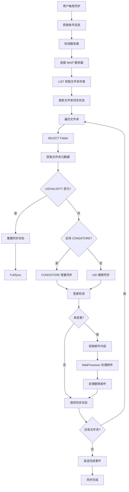

# 邮件同步流程文档

本文档详细记录了邮件同步的完整流程，基于"能力探测"与"状态驱动"架构，实现了对现代邮箱（支持 CONDSTORE）与传统邮箱（如 163）的统一兼容。

---

## 目录

1. [同步架构概述](#同步架构概述)
2. [同步核心状态](#同步核心状态)
3. [完整同步流程](#完整同步流程)
4. [函数调用层次](#函数调用层次)
5. [增量同步机制](#增量同步机制)
6. [变更检测策略](#变更检测策略)
7. [文件夹管理](#文件夹管理)
8. [邮件处理](#邮件处理)
9. [调试指南](#调试指南)

---

## 同步架构概述

### 系统组件

```
┌─────────────────────────────────────────────────────────────────┐
│                        SyncManager                              │
│                  (总调度器、流程编排)                              │
└────────────────────┬────────────────────────────────────────────┘
                     │
       ┌─────────────┼─────────────┬─────────────┬──────────────┐
       │             │             │             │              │
       ▼             ▼             ▼             ▼              ▼
┌──────────┐  ┌──────────┐  ┌──────────┐  ┌──────────┐  ┌──────────┐
│DeltaSync │  │Change    │  │Folder    │  │Mail      │  │SyncState │
│          │  │Detector  │  │Manager   │  │Processor │  │Manager   │
└──────────┘  └──────────┘  └──────────┘  └──────────┘  └──────────┘
       │             │             │             │              │
       └─────────────┴─────────────┴─────────────┴──────────────┘
                                   │
                                   ▼
                          ┌──────────────┐
                          │ IMAP Client  │
                          │ (AsyncImap)  │
                          └──────────────┘
```

### 组件职责

| 组件 | 文件位置 | 职责 |
|------|----------|------|
| **SyncManager** | `sync/sync_manager.rs` | 总调度器，协调所有同步组件，管理同步流程 |
| **DeltaSync** | `sync/delta_sync.rs` | 增量同步引擎，选择同步策略 (CONDSTORE/UID 搜索) |
| **ChangeDetector** | `sync/change_detector.rs` | 变更检测，检测新邮件、删除邮件、标志变更 |
| **FolderManager** | `sync/folder_manager.rs` | 文件夹状态管理，UIDVALIDITY 检测与重置 |
| **MailProcessor** | `sync/mail_processor.rs` | 邮件处理，解析 IMAP 数据并存储到数据库 |
| **SyncStateManager** | `sync/sync_state.rs` | 同步状态持久化管理 |
| **AsyncImapClient** | `protocols/imap/client.rs` | IMAP 协议封装，提供高级接口 |

---

## 同步核心状态

每个文件夹的同步状态由以下锚点决定（存储在 `folder_sync_state` 表）：

| 字段 | 类型 | 说明 | 作用 |
|------|------|------|------|
| `uidvalidity` | i64 | 邮箱唯一标识 | **一致性守门员**。若服务器值变化，必须重置本地数据。 |
| `uidnext` | i64 | 预期的下一个 UID | 用于检测新邮件 |
| `highest_modseq` | i64 | 最高修改序列号 | **变更游标**。仅 CONDSTORE 模式使用。 |
| `synced_at` | i64 | 上次同步时间戳 | 记录同步完成时间 |

### EmailFlags 标志状态

```rust
// change_detector.rs
pub struct EmailFlags {
    pub seen: bool,     // \Seen - 已读
    pub flagged: bool,  // \Flagged - 星标
    pub answered: bool, // \Answered - 已回复
    pub draft: bool,    // \Draft - 草稿
    pub deleted: bool,  // \Deleted - 已删除
    pub recent: bool,   // \Recent - 最近（只读）
}
```

---

## 完整同步流程

### 流程图



---

## 函数调用层次

### 1. 入口：账号同步

```rust
// sync_manager.rs:99
pub async fn sync_account(&self, account_id: i32) -> Result<SyncResult>
```

**调用流程**：

```
SyncManager::sync_account(account_id)
│
├─► [1] 获取账号信息
│   └─► storage::AccountRepository::get_by_id(&db, account_id)
│
├─► [2] 检测服务商
│   └─► provider_pool.detect_provider(&account.email)
│
├─► [3] 获取 IMAP 配置
│   └─► provider.imap_config(&account.email)
│
├─► [4] 连接 IMAP 服务器
│   └─► self.connect_imap(account_id, &imap_config, &email, &auth_type)
│       ├─► auth_manager.get_imap_auth(account_id, email, &auth_type)
│       └─► AsyncImapClient::new().connect(host, port, email, imap_auth)
│
├─► [5] 获取文件夹映射（服务商特定）
│   └─► provider.folder_mapping()
│       └─► 返回: StandardFolder { inbox, sent, drafts, spam, trash, archive }
│
├─► [6] 获取文件夹列表
│   └─► imap_client.list_folders_with_attributes()
│
├─► [7] 更新文件夹同步状态
│   └─► folder_manager.update_sync_states(account_id, &folder_infos)
│
└─► [8] 遍历文件夹同步
    └─► for folder_info in folder_infos:
        ├─► folder_mapping.find_standard_type(&folder_info.name)  // 识别文件夹类型
        └─► self.sync_folder_internal(account_id, &folder_info.name, &mut imap_client)
```

### 2. 文件夹同步

```rust
// sync_manager.rs:312
async fn sync_folder_internal(
    &self,
    account_id: i32,
    folder: &str,
    imap_client: &mut AsyncImapClient,
) -> Result<DeltaSyncResult>
```

**调用流程**：

```
SyncManager::sync_folder_internal(account_id, folder, imap_client)
│
├─► [1] 获取文件夹元数据
│   └─► imap_client.fetch_folder_metadata(folder)
│       └─► 返回: FolderMetadata { uidvalidity, uidnext, highest_modseq }
│
├─► [2] 检测 UIDVALIDITY 变化
│   ├─► folder_manager.check_uidvalidity_changed(account_id, folder, meta.uidvalidity)
│   │
│   └─► if changed:
│       ├─► folder_manager.reset_sync_state(account_id, folder)
│       └─► needs_full_resync = true
│
├─► [3] 更新文件夹元数据
│   └─► folder_manager.update_folder_metadata(
│           account_id, folder,
│           uidvalidity, uidnext, highest_modseq
│       )
│
├─► [4] 检测 CONDSTORE 支持
│   └─► imap_client.check_condstore_support()
│
├─► [5] 获取服务器 UID 列表（最近 3 个月）
│   ├─► 计算 3 个月前日期: format_imap_date(three_months_ago)
│   └─► imap_client.list_uids_since(folder, &date_since)
│
├─► [6] CONDSTORE 增量同步（如果支持）
│   ├─► imap_client.search_modified_since(last_modseq)
│   └─► 返回: (modified_uids, highest_modseq)
│
├─► [7] 获取服务器标志（UID 搜索降级）
│   └─► imap_client.fetch_modseqs(&server_uids)
│
└─► [8] 执行同步
    └─► self.sync_folder(
            account_id, folder,
            server_uids, server_uids_with_flags,
            imap_client, condstore_modified_uids, highest_modseq
        )
```

### 3. 变更检测与邮件同步

```rust
// sync_manager.rs:499
pub async fn sync_folder(
    &self,
    account_id: i32,
    folder: &str,
    server_uids: Option<&[u32]>,
    server_uids_with_flags: Option<&[(u32, Vec<String>)]>,
    imap_client: Option<&mut AsyncImapClient>,
    condstore_modified_uids: Option<&[u32]>,
    highest_modseq: Option<u64>,
) -> Result<DeltaSyncResult>
```

**调用流程**：

```
SyncManager::sync_folder(...)
│
├─► [1] 变更检测
│   └─► change_detector.detect_changes(
│           account_id, folder, server_uids,
│           last_sync_uid, supports_condstore
│       )
│       │
│       ├─► detect_new_emails()
│       │   └─► 比对 server_uids vs local_uids
│       │
│       ├─► detect_deletions()
│       │   └─► 计算 local_uids - server_uids
│       │
│       └─► 返回: ChangeDetectionResult {
│               new_emails, modified_emails, deleted_emails
│           }
│
├─► [2] 获取新邮件内容
│   └─► for uid in new_emails + modified_emails:
│       └─► imap_client.fetch_email(folder, uid)
│           └─► mail_processor::from_imap_email(&email_data, folder)
│
├─► [3] 批量处理邮件
│   └─► mail_processor.process_mails(account_id, folder, mail_data_list)
│       ├─► 插入/更新邮件到数据库
│       └─► 设置 flags: is_read, is_starred, is_answered, is_draft, is_deleted
│
├─► [4] 处理删除邮件
│   └─► mail_processor.delete_mails(account_id, folder, &deleted_emails)
│       └─► 从数据库删除邮件记录
│
└─► [5] 更新同步状态
    └─► sync_state_manager.update_sync_completed(account_id, folder, total_synced)
```

---

## 增量同步机制

### 同步策略枚举

```rust
// delta_sync.rs:11-21
pub enum SyncStrategy {
    /// 使用 MODSEQ 增量同步（CONDSTORE）
    Condstore,

    /// 使用 UID 搜索对比
    UidSearch,

    /// 完整同步
    FullSync,
}
```

### 策略选择逻辑

```
┌─────────────────────────────────────────────────────────────┐
│                    策略选择决策树                            │
├─────────────────────────────────────────────────────────────┤
│                                                             │
│  检测 CONDSTORE 支持                                        │
│       │                                                     │
│       ├── 支持 ──► SyncStrategy::Condstore                  │
│       │             │                                       │
│       │             └── SEARCH MODSEQ 获取变更              │
│       │                                                       │
│       └── 不支持 ──► SyncStrategy::UidSearch                 │
│                       │                                     │
│                       └── UID FETCH + 本地比对              │
│                                                             │
└─────────────────────────────────────────────────────────────┘
```

### 1. CONDSTORE 增量同步

**适用场景**：Gmail、Outlook 等支持 CONDSTORE 扩展的服务器

**IMAP 命令**：
```
// 1. SELECT 文件夹（启用 CONDSTORE）
A001 SELECT INBOX (CONDSTORE)

// 2. 获取变更的邮件
A002 UID SEARCH MODSEQ 12345:*

// 3. 获取变更邮件的标志
A003 UID FETCH 100:105 (FLAGS) (CHANGEDSINCE 12345)
```

**优势**：
- 服务器端过滤，只返回变更数据
- 网络流量最小
- 同步速度最快

### 2. UID 搜索同步（Fallback）

**适用场景**：163、QQ 邮箱等不支持 CONDSTORE 的服务器

**IMAP 命令**：
```
// 1. SELECT 文件夹
A001 SELECT INBOX

// 2. 获取最近 3 个月的 UID
A002 UID SEARCH SINCE 20-Dec-2025

// 3. 获取所有 UID 的标志
A003 UID FETCH 1:* (FLAGS)
```

**本地比对算法**：
```rust
// change_detector.rs
// 检测新邮件
let new_emails = server_uids - local_uids;

// 检测删除邮件
let deleted_emails = local_uids - server_uids;

// 检测标志变更
for (uid, server_flags) in server_uids_with_flags {
    if local_flags[uid] != server_flags {
        modified_emails.push(uid);
    }
}
```

---

## 变更检测策略

### ChangeDetector 实现

```rust
// change_detector.rs
pub struct ChangeDetector {
    db: Arc<DbConn>,
}

impl ChangeDetector {
    /// 检测新邮件
    pub async fn detect_new_emails(
        &self,
        account_id: i32,
        folder: &str,
        server_uids: &[u32],
        last_sync_uid: Option<u32>,
    ) -> Result<Vec<u32>> {
        // 1. 从数据库获取本地 UID 列表
        let local_uids = self.get_local_uids(account_id, folder).await?;

        // 2. 过滤出新邮件（服务器有，本地没有）
        let new_emails: Vec<u32> = server_uids
            .iter()
            .filter(|uid| !local_uids.contains(uid))
            .copied()
            .collect();

        Ok(new_emails)
    }

    /// 检测删除邮件
    pub async fn detect_deletions(
        &self,
        account_id: i32,
        folder: &str,
        server_uids: &[u32],
    ) -> Result<Vec<u32>> {
        let local_uids = self.get_local_uids(account_id, folder).await?;

        // 计算差集（本地有，服务器没有）
        let deleted_emails: Vec<u32> = local_uids
            .into_iter()
            .filter(|uid| !server_uids.contains(uid))
            .collect();

        Ok(deleted_emails)
    }

    /// 检测标志变更
    pub async fn detect_flag_changes_uid_search(
        &self,
        account_id: i32,
        folder: &str,
        server_uids_with_flags: &[(u32, Vec<String>)],
    ) -> Result<Vec<u32>> {
        let local_flags_map = self.get_local_flags_batch(account_id, folder, &uids).await?;

        let mut changed_uids = Vec::new();
        for (uid, server_flags_str) in server_uids_with_flags {
            let server_flags = EmailFlags::from_imap_flags(server_flags_str);

            if let Some(local_flags) = local_flags_map.get(uid) {
                if !local_flags.equals(&server_flags) {
                    changed_uids.push(*uid);
                }
            }
        }

        Ok(changed_uids)
    }
}
```

---

## 文件夹管理

### 服务商文件夹映射 (StandardFolder)

**文件位置**: `providers/traits.rs:342-381`

```rust
/// 标准文件夹映射
///
/// 定义了6个标准邮箱文件夹，每个文件夹对应一个或多个 IMAP 文件夹名称
/// 不同邮件服务商对标准文件夹使用不同的命名，此结构体提供映射关系
pub struct StandardFolder {
    /// 收件箱对应的 IMAP 文件夹名称列表
    pub inbox: Vec<String>,
    /// 已发送对应的 IMAP 文件夹名称列表
    pub sent: Vec<String>,
    /// 草稿箱对应的 IMAP 文件夹名称列表
    pub drafts: Vec<String>,
    /// 垃圾邮件对应的 IMAP 文件夹名称列表
    pub spam: Vec<String>,
    /// 已删除对应的 IMAP 文件夹名称列表
    pub trash: Vec<String>,
    /// 归档对应的 IMAP 文件夹名称列表
    pub archive: Vec<String>,
}
```

**各服务商映射示例**：

| 服务商 | inbox | sent | drafts | spam | trash |
|--------|-------|------|--------|------|-------|
| **Gmail** | INBOX | [Gmail]/Sent Mail | [Gmail]/Drafts | [Gmail]/Spam | [Gmail]/Trash |
| **Outlook** | Inbox | Sent | Drafts | Junk | Deleted |
| **QQ 邮箱** | INBOX, 收件箱 | Sent, 已发送 | Drafts, 草稿箱 | Spam, 垃圾邮件 | Trash, 已删除 |
| **163 邮箱** | INBOX | Sent Messages | Drafts | Junk Mail | Deleted Messages |

**使用方式**：

```rust
// 同步时获取文件夹映射
let folder_mapping = provider.folder_mapping();

// 识别文件夹类型
let folder_type = folder_mapping.find_standard_type(&folder_info.name);
// 返回: "inbox", "sent", "drafts", "spam", "trash", "archive" 或 "other"
```

### FolderManager 核心方法

```rust
// folder_manager.rs
pub struct FolderManager {
    db: Arc<DbConn>,
}

impl FolderManager {
    /// 更新文件夹同步状态
    pub async fn update_sync_states(
        &self,
        account_id: i32,
        folder_infos: &[ImapFolderInfo],
    ) -> Result<SyncStateUpdateResult>

    /// 更新文件夹元数据
    pub async fn update_folder_metadata(
        &self,
        account_id: i32,
        imap_name: &str,
        uidvalidity: Option<u64>,
        uidnext: Option<u64>,
        highest_modseq: Option<u64>,
    ) -> Result<()>

    /// 检测 UIDVALIDITY 变化
    pub async fn check_uidvalidity_changed(
        &self,
        account_id: i32,
        imap_name: &str,
        server_uidvalidity: u64,
    ) -> Result<bool> {
        if let Some(local_state) = self.get_sync_state(account_id, imap_name).await? {
            if let Some(local_uidvalidity) = local_state.uidvalidity {
                if local_uidvalidity as u64 != server_uidvalidity {
                    tracing::warn!(
                        "UIDVALIDITY 变化: folder={}, local={}, server={}",
                        imap_name, local_uidvalidity, server_uidvalidity
                    );
                    return Ok(true);
                }
            }
        }
        Ok(false)
    }

    /// 重置同步状态
    pub async fn reset_sync_state(
        &self,
        account_id: i32,
        imap_name: &str,
    ) -> Result<()> {
        // 删除本地邮件
        EmailRepository::delete_by_folder(&self.db, account_id, imap_name).await?;

        // 重置同步状态
        // ... 清空 uidvalidity, uidnext, highest_modseq
    }
}
```

### UIDVALIDITY 处理流程

```
┌─────────────────────────────────────────────────────────────┐
│               UIDVALIDITY 变化处理流程                       │
├─────────────────────────────────────────────────────────────┤
│                                                             │
│  1. SELECT 文件夹时获取服务器 UIDVALIDITY                   │
│                    │                                        │
│                    ▼                                        │
│  2. 比对本地存储的 UIDVALIDITY                              │
│                    │                                        │
│          ┌────────┴────────┐                                │
│          │                 │                                │
│      一致 ◄───► 不一致                                      │
│          │                 │                                │
│          ▼                 ▼                                │
│     正常同步         重置本地状态                           │
│                          │                                  │
│                          ├─► 删除本地邮件                   │
│                          ├─► 清空同步锚点                   │
│                          └─► 标记需要完整同步               │
│                                                             │
└─────────────────────────────────────────────────────────────┘
```

---

## 邮件处理

### MailProcessor 核心方法

```rust
// mail_processor.rs
pub struct MailProcessor {
    db: Arc<DbConn>,
}

/// 邮件数据结构
pub struct MailData {
    pub uid: u32,
    pub folder: String,
    pub message_id: Option<String>,
    pub subject: Option<String>,
    pub sender_name: Option<String>,
    pub sender_email: String,
    pub recipient_emails: String,
    pub cc_emails: Option<String>,
    pub bcc_emails: Option<String>,
    pub body_text: Option<String>,
    pub body_html: Option<String>,
    pub sent_at: i64,
    pub received_at: i64,
    pub flags: EmailFlags,
    pub modseq: Option<i64>,
}

impl MailProcessor {
    /// 批量处理邮件
    pub async fn process_mails(
        &self,
        account_id: i32,
        folder: &str,
        mail_data_list: Vec<MailData>,
    ) -> Result<MailProcessResult>

    /// 删除邮件
    pub async fn delete_mails(
        &self,
        account_id: i32,
        folder: &str,
        uids: &[u32],
    ) -> Result<usize>
}
```

### IMAP 数据转换

```rust
// mail_processor.rs:77
pub fn from_imap_email(email_data: &EmailData, folder: &str) -> MailData {
    MailData {
        uid: email_data.uid,
        folder: normalize_folder_name(folder),
        subject: Some(email_data.subject.clone()),
        sender_name: extract_name_from_address(&email_data.from),
        sender_email: extract_email_from_address(&email_data.from),
        recipient_emails: serialize_addresses(&email_data.to),
        // ... 其他字段
        flags: EmailFlags {
            seen: email_data.flags.seen,
            flagged: email_data.flags.flagged,
            answered: email_data.flags.answered,
            draft: false,
            deleted: email_data.flags.deleted,
            recent: false,
        },
    }
}
```

### 文件夹名称标准化

```rust
// mail_processor.rs:146
fn normalize_folder_name(folder: &str) -> String {
    let folder_lower = folder.to_lowercase();

    // 常见文件夹名称映射
    match folder_lower {
        "inbox" => "inbox",
        s if s.contains("sent") || s.contains("已发送") => "sent",
        s if s.contains("draft") || s.contains("草稿") => "drafts",
        s if s.contains("spam") || s.contains("垃圾") => "spam",
        s if s.contains("trash") || s.contains("删除") => "trash",
        s if s.contains("archive") || s.contains("归档") => "archive",
        _ => folder_lower.as_str(),
    }.to_string()
}
```

---

## 调试指南

### 日志级别配置

```toml
# Cargo.toml
[dependencies]
tracing = "0.1"
tracing-subscriber = "0.3"
```

```rust
// 启用详细日志
RUST_LOG=postium_mail=debug,imap=debug cargo run
```

### 关键日志点

| 阶段 | 日志关键字 | 说明 |
|------|-----------|------|
| 连接 | `IMAP 连接成功` | 确认服务器连接正常 |
| 文件夹 | `获取到 N 个文件夹` | 确认文件夹列表获取 |
| UIDVALIDITY | `UIDVALIDITY 变化` | 检测到邮箱重置 |
| CONDSTORE | `CONDSTORE 支持: true/false` | 能力探测结果 |
| 变更检测 | `变更检测结果: new=N, modified=M, deleted=D` | 变更统计 |
| 邮件处理 | `邮件处理完成: success=N, failed=M` | 处理结果 |

### 常见问题排查

| 问题 | 可能原因 | 解决方案 |
|------|----------|----------|
| 同步速度慢 | 不支持 CONDSTORE 且邮件极多 | 优化本地比对算法，使用批量查询 |
| 邮件"死而复生" | UIDVALIDITY 处理错误 | 检查 SELECT 响应是否正确更新了本地状态 |
| 标志不同步 | 163 邮箱未执行 Fallback 流程 | 检查 CAPABILITY 解析是否正确识别 |
| 新邮件延迟 | 仅依赖 IDLE 而未轮询 | 对于不支持 IDLE 的服务器，开启定时轮询 |
| 连接超时 | 网络问题或服务器限制 | 增加超时时间，添加重试机制 |

### 单元测试

```bash
# 运行同步模块测试
cargo test --lib sync::

# 运行特定测试
cargo test --lib sync::change_detector::tests
```

---

## 文件结构

```
src-tauri/src/sync/
├── mod.rs              # 模块导出和文档
├── sync_manager.rs     # 同步管理器（主调度器）
├── delta_sync.rs       # 增量同步引擎
├── change_detector.rs  # 变更检测器
├── folder_manager.rs   # 文件夹状态管理
├── mail_processor.rs   # 邮件处理器
├── sync_state.rs       # 同步状态管理
└── sync_error.rs       # 错误处理
```

---

## 相关文档

- [登录流程文档](./login-workflow.md)
- [同步重构计划](../sync-refactor-plan.md)
