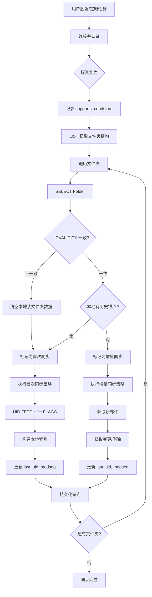

# 邮件同步流程文档 (优化版)
本文档详细记录了邮件同步的完整流程，基于“能力探测”与“状态驱动”架构，实现了对现代邮箱（支持 CONDSTORE）与传统邮箱（如 163）的统一兼容。
---
## 目录
1. [同步架构概述](#同步架构概述)
2. [同步核心状态](#同步核心状态)
3. [完整同步流程](#完整同步流程)
4. [增量同步机制](#增量同步机制)
5. [变更检测策略](#变更检测策略)
6. [文件夹管理](#文件夹管理)
7. [邮件处理](#邮件处理)
8. [调试指南](#调试指南)
---
## 同步架构概述
### 系统组件
*(保持原有架构，重点增强了 ChangeDetector 和 SyncStateManager 的职责)*
- **SyncManager**: 总调度器，负责判断同步类型（首次/增量）。
- **ChangeDetector**: 变更检测核心，根据能力选择 `CondstoreStrategy` 或 `FallbackStrategy`。
- **SyncStateManager**: 管理“同步锚点”(`UIDVALIDITY`, `LastUID`, `ModSeq`)。
- **IMAP Client**: 封装底层指令，提供 `fetch_new_emails`, `fetch_flags_diff` 等高级接口。
---
## 同步核心状态
每个文件夹的同步状态由以下锚点决定：
| 字段 | 类型 | 说明 | 作用 |
| :--- | :--- | :--- | :--- |
| `uidvalidity` | i64 | 邮箱唯一标识 | **一致性守门员**。若服务器值变化，必须重置本地数据。 |
| `last_uid` | i32 | 上次同步的最大UID | **新邮件游标**。用于计算 `last_uid + 1:*` 获取新邮件。 |
| `highest_modseq` | i64 | 最高修改序列号 | **变更游标**。仅 CONDSTORE 模式使用，用于获取变更。 |
| `is_first_sync` | bool | 是否首次同步 | 标记是否需要执行全量索引构建。 |
---
## 完整同步流程
### 流程图

### 函数调用栈 (Rust)
```rust
// 1. 入口
sync_manager.sync_account(account_id)
  -> // 2. 连接与探测
     connect_imap(...)
     check_condstore_support() -> bool (存储为 context.supports_condstore)
     
  -> // 3. 遍历文件夹
     for folder in list_folders():
       // 决策逻辑
       let server_meta = select_folder(folder) // 获取 UIDVALIDITY, HIGHESTMODSEQ
       let local_state = sync_state_manager.get(account_id, folder)
       
       // 灾难检测
       if local_state.uidvalidity != server_meta.uidvalidity {
           reset_local_data(folder);
           sync_mode = FirstSync;
       } else if local_state.is_empty() {
           sync_mode = FirstSync;
       } else {
           sync_mode = DeltaSync;
       }
       match sync_mode {
           FirstSync => execute_first_sync(...),
           DeltaSync => execute_delta_sync(...),
       }
```
---
## 增量同步机制
### 策略模式
```rust
pub enum SyncStrategy {
    Condstore,  // 支持 CONDSTORE (Gmail, Outlook)
    Fallback,   // 不支持 (163, QQ邮箱老服务器)
}
```
### 1. 首次同步
**目标**：以最小流量建立完整的 UID 索引。
*   **步骤 1：获取全量索引**
    *   指令：`UID FETCH 1:* (FLAGS)`
    *   说明：只拉取 UID 和 Flags。对于 10 万封邮件，数据量仅约 5MB，速度快且流量小。
*   **步骤 2：数据入库**
    *   批量插入本地数据库，标记 `is_read`, `is_starred`。
    *   *注意*：此时**不**拉取邮件正文或 Envelope。
*   **步骤 3：按需拉取元数据**
    *   指令：`UID FETCH <最新的N个UID> (ENVELOPE BODYSTRUCTURE)`
    *   说明：仅更新用户可见的最新邮件的详情。
*   **步骤 4：保存锚点**
    *   保存 `UIDVALIDITY`，`last_uid` (当前最大UID)，`highest_modseq` (如果支持)。
### 2. 增量同步
**目标**：只同步差异。
#### 步骤 A：获取新邮件 (通用逻辑)
无论是否支持 CONDSTORE，都使用 UID 连续性特性：
*   **指令**：`UID FETCH <last_uid + 1>:* (FLAGS ENVELOPE BODYSTRUCTURE)`
*   **优势**：精准获取所有新邮件，无遗漏，无需按时间搜索。
#### 步骤 B：变更与删除检测 (分流逻辑)
**策略一：支持 CONDSTORE**
*   **获取变更**：`UID FETCH 1:* (FLAGS) (CHANGEDSINCE <last_modseq>)`
    *   返回所有 Flags 变更的邮件（如未读变已读）。
*   **处理删除**：
    *   若支持 `QRESYNC`：解析 `VANISHED` 响应。
    *   若不支持：比对本地 UID 列表与服务器 UID 列表（或仅比对 EXISTS 数量，若数量减少再扫描）。
**策略二：不支持 CONDSTORE (Fallback)**
*   **获取全量 Flags**：`UID FETCH 1:* (FLAGS)`
    *   虽然范围是 `1:*`，但只请求 Flags，数据量极小。
*   **本地比对算法**：
    *   `server_map`: 服务器返回的 {UID: Flags}
    *   `local_map`: 本地数据库的 {UID: Flags}
    *   **更新**：`server_map` 与 `local_map` 不一致的项目。
    *   **删除**：存在于 `local_map` 但不存在于 `server_map` 的 UID。
---
## 变更检测
### ChangeDetector 接口实现
```rust
impl ChangeDetector {
    pub async fn detect(&self, strategy: SyncStrategy) -> Result<ChangeSet> {
        match strategy {
            SyncStrategy::Condstore => {
                // 使用 CHANGEDSINCE 指令
                let changes = self.imap.fetch_changed_since(self.last_modseq)?;
                // 服务器返回什么就改什么
                Ok(ChangeSet::from_server_response(changes))
            },
            SyncStrategy::Fallback => {
                // 1. 拉取全量 Flags
                let server_flags = self.imap.fetch_all_flags()?;
                // 2. 获取本地所有 UID
                let local_uids = self.db.get_all_uids()?;
                
                let mut changes = ChangeSet::new();
                
                // 计算删除
                for uid in local_uids.difference(&server_flags.keys().collect()) {
                    changes.deleted.push(*uid);
                }
                
                // 计算变更
                for (uid, flags) in server_flags {
                    if self.db.is_flags_different(uid, flags) {
                        changes.modified.push(uid);
                    }
                }
                Ok(changes)
            }
        }
    }
}
```
---
## 文件夹管理
*(架构保持不变，强调 UIDVALIDITY 的处理)*
### 文件夹同步状态更新逻辑
```rust
pub fn update_sync_state(meta: &FolderMetadata, local_state: &mut FolderSyncState) {
    // 1. 核心校验：如果 UIDVALIDITY 变化，视为邮箱重置
    if local_state.uidvalidity != meta.uidvalidity {
        log::warn!("UIDVALIDITY changed! Reset required.");
        local_state.reset(); // 重置 last_uid, modseq 等
        local_state.uidvalidity = meta.uidvalidity;
    }
    
    // 2. 更新最新状态
    local_state.uidnext = meta.uidnext;
    local_state.highest_modseq = meta.highest_modseq; // 可能为 None
}
```
---
## 邮件处理
### 处理逻辑优化
1. **批量写入**：对于首次同步的大量 Flags，使用事务批量插入。
2. **懒加载**：邮件正文 (`body_text`, `body_html`) 严格遵循“用户点击时下载”原则。
3. **删除处理**：
   - 物理删除：从本地数据库移除记录。
   - 逻辑删除：保留记录但标记为 deleted (视客户端 UI 需求而定，通常建议直接移除以保持与服务器一致)。
---
## 常见问题排查
| 问题 | 可能原因 | 解决方案 |
|------|----------|----------|
| 同步速度慢 | 不支持 CONDSTORE 且邮件极多 | 优化 `Fallback` 策略的本地比对算法，使用 Hash 比对而非逐条查询。 |
| 邮件“死而复生” | UIDVALIDITY 处理错误 | 检查 SELECT 响应是否正确更新了本地状态。 |
| 标志不同步 | 163 邮箱未执行 Fallback 流程 | 检查 CAPABILITY 解析是否正确识别为 `Fallback` 模式。 |
| 新邮件延迟 | 仅依赖 IDLE 而未轮询 | 对于不支持 IDLE 的服务器，确保开启后台定时轮询。 |
```
